Up: [Documentation Home](https://jlmelville.github.io/smallvis/).

[ABSNE](http://proceedings.mlr.press/v37/narayan15.html) generalizes t-SNE to
a whole family of divergences, the AB-divergences (Alpha-Beta divergences) of
which the Kullback-Leibler divergence is just one (of many). The
[code](http://rll.berkeley.edu/absne/) was supposed to have been open-sourced,
but it's not been released and at this point I assume it never will be. On the
other hand, according to the paper, ABSNE uses a GPU-powered Barnes Hut routine,
so I am unlikely to have gleaned much information on any quirks of the
implementation anyway.

## AB-Divergence

Cichocki and co-workers came up with the 
[AB-divergence](https://doi.org/10.3390/e13010134) (also see their 
[earlier paper](https://doi.org/10.3390/e12061532)), which generalizes a whole
load of divergences:

$$C =\frac{1}{\alpha \beta} \sum_{ij} -p_{ij}^{\alpha} q_{ij}^{\beta} + \frac{\alpha}{\alpha + \beta}p_{ij}^{\alpha + \beta} + \frac{\beta}{\alpha + \beta}q_{ij}^{\alpha + \beta}$$

$\alpha$ and $\beta$ are free parameters. By twiddling these values, just how 
many divergences does this bad boy generalize? A LOT, including nearly all of 
the f-divergences used in 
[ft-SNE](https://jlmelville.github.io/smallvis/ftsne.html). Here's a sampling.


|  $\alpha$ | $\beta$ | $\lambda$  |  Name                     | 
|-----------|---------|------------|---------------------------|
|  1        | 0       | 1          | Kullback-Leibler          |
|  1        | -1      | 0          | Itakura-Saito             |
|  1        | 1       | 2          | Scaled squared Euclidean  |
|  0.5      | 0.5     | 1          | Hellinger Distance        |
|  0        | 0       | 0          | Log Euclidean             |
|  0        | 1       | 1          | Reverse Kullback-Leibler  |
|  2        | -1      | 1          | Neyman Chi-squared        |
|  -1       | 2       | 1          | Pearson Chi-squared       |

That's a lot of divergences. And I haven't even mentioned that the cost function
works with normalized *and* unnormalized affinities (i.e. $p_{ij}$ and $q_{ij}$
don't have to be probabilities). That's one hard-working equation.

In the third column of the table above, $\lambda = \alpha + \beta$, which is
used by Cichocki and co-workers in a few places, but is truly thrust into the
spotlight by the ABSNE. The main thrust of that paper is that while adjusting
$\alpha$ is useful, it's better to control $\lambda$ rather than $\beta$
directly. The ABSNE authors helpfully provide the following  advice on how to
interpret $\alpha$ and $\lambda$:

* $\alpha$ controls how fine-grained clusters are. Low $\alpha$ leads to more
smaller, fine-grained clusters.
* $\lambda$ controls cluster separation. Low $\lambda$ leads to larger separation,
high $\lambda$ to a smaller separation.

Setting $\alpha = 1, \beta = 1$ (and therefore $\lambda = 1$) gives the
KL-divergence, although you wouldn't know it from looking at the divergence
above. We'll get to that. Anyway, if you use the t-distribution as the
low-dimensional weight function, you get back t-SNE. You can therefore use the
$\alpha = 1, \lambda = 1$ as a reference, and make changes to $\alpha$ and
$\lambda$ relative to the t-SNE settings.

The AB-divergence as given above is pretty general, but has a few singularities
at certain values of $\alpha$ and $\beta$. We can get around this by using 
some alternative (but simpler) expressions, via the L'Hopital formula. These
can also lead to simpler gradient expressions. We'll look at both below.

## Gradient

The ABSNE gradient is:

$$
\frac{\partial C}{\partial \mathbf{y_i}} =  
  \frac{4}{\alpha} \sum_j 
\left[ 
  p_{ij}^{\alpha} q_{ij}^{\beta - 1} - q_{ij}^{\alpha + \beta - 1} - 
  \sum_{kl} p_{kl}^{\alpha} q_{kl}^{\beta} + \sum_{kl} q_{kl}^{\alpha + \beta}
\right]
q_{ij}w_{ij}
\left(
 \mathbf{y_i - y_j}
\right)
$$

This is nearly the gradient expression given in the ABSNE paper, but I end up
with an extra $1 / \alpha$. In a lot of SNE implementations, these constants get
folded into the learning rate, so that's probably the difference. If you set
$\alpha = 1, \beta = 0$, you will eventually get back to the familiar t-SNE
gradient, so the generic gradient is more flexible than the generic cost
function in the sense that you don't need special forms to avoid singularities
in as many cases.

The equation above is the form of the gradient given in the ABSNE paper, but 
computationally speaking you might prefer to write the gradient as:

$$
\frac{\partial C}{\partial \mathbf{y_i}} =  
  \frac{4}{\alpha} \sum_j 
\left[ 
    p_{ij}^{\alpha} q_{ij}^{\beta} - q_{ij}^{\lambda} 
  + q_{ij} \left( 
      \sum_{kl} q_{kl}^{\lambda}
    - \sum_{kl} p_{kl}^{\alpha} q_{kl}^{\beta}
  \right)
\right]
w_{ij}
\left(
 \mathbf{y_i - y_j}
\right)
$$

as you would only need to compute and store $q_{ij}$, $q_{ij}^\beta$ and
$q_{ij}^{\lambda}$ ($w_{ij} = q_{ij} Z$, where $Z = \sum_{kl} w_{ij}$), 
two of which terms are also needed by the cost function. So you can get
the cost function value -- if not for free exactly -- for a lot cheaper than you
otherwise would have to.

### Special Forms

Even though there are fewer situations where you need a special form for the
gradient compared to the cost function, you do still need it for some values of
$\alpha$ and $\beta$, e.g. when $\alpha = 0$. The ABSNE paper doesn't give the
gradients under those conditions, so I'm going to derive them here, along
with the special forms of the cost functions.

ABSNE always uses the t-SNE kernel, so the generic gradient can be written
as:

$$\frac{\partial C}{\partial \mathbf{y_i}} = 
  4
  \sum_j 
    k_{ij}
  \left(
   \mathbf{y_i - y_j}
  \right)
$$

where:

$$k_{ij} = -\left[ \frac{\partial C}{\partial q_{ij}} - \sum_{kl} \frac{\partial C}{\partial q_{kl}} q_{kl} \right] q_{ij}w_{ij}$$

Apart from the costs, I will also give the derivatives for 
$\partial C / \partial q_{ij}$ so it's easier to see how that fits into the
equation above to give the gradient.

#### $\alpha \neq 0, \beta = 0$

$$
C = \frac{1}{\alpha^2} \sum_{ij}
\left(
p_{ij}^{\alpha} \log \frac{p_{ij}^{\alpha}}{q_{ij}^{\alpha}}
- p_{ij}^{\alpha} + q_{ij}^{\alpha}
\right)
$$

This form includes the Kullback-Leibler divergence, where the last two terms
cancel when $P$ and $Q$ are probabilities.

$$
\frac{\partial C}{\partial q_{ij}} =
-\frac{1}{\alpha}
\left(
  \frac{p_{ij}^{\alpha}}{q_{ij}} - \frac{q_{ij}^{\alpha}}{q_{ij}}
\right)
$$

$$
\frac{\partial C}{\partial \mathbf{y_i}} =  
  \frac{4}{\alpha} \sum_j 
\left[ 
    p_{ij}^{\alpha} 
  - q_{ij}^{\alpha} 
  + q_{ij} \left( 
      \sum_{kl} q_{kl}^{\alpha}
    - \sum_{kl} p_{kl}^{\alpha}
  \right)
\right]
w_{ij}
\left(
 \mathbf{y_i - y_j}
\right)
$$
You don't need a special version of the gradient for this expression, it falls
out naturally by setting $\beta = 0$ in the standard gradient, but I have pulled
a $q_{ij}$ into the 4-term expression.

#### $\alpha = -\beta \neq 0$

$$
C = \frac{1}{\alpha^2} \sum_{ij}
\left(
  \log \frac{q_{ij}^{\alpha}}{p_{ij}^{\alpha}}
  + \frac{p_{ij}^{\alpha}}{q_{ij}^{\alpha}}
  - 1
\right)
$$

$$
\frac{\partial C}{\partial q_{ij}} =
-\frac{1}{\alpha}
\left(
  \frac{p_{ij}^{\alpha}}{q_{ij}^{\alpha + 1}} - \frac{1}{q_{ij}}
\right)
$$

$$
\frac{\partial C}{\partial \mathbf{y_i}} =  
  \frac{4}{\alpha} \sum_j 
\left[ 
  \frac{p_{ij}^{\alpha}}{q_{ij}^\alpha} 
  - 1 
  + q_{ij} 
  \left( 
    \sum_{kl} 1
    - \sum_{kl} \frac{p_{kl}^{\alpha}}{q_{kl}^\alpha}
  \right)
\right]
w_{ij}
\left(
 \mathbf{y_i - y_j}
\right)
$$
This can also be derived from the standard gradient. The $\sum_{kl} 1$ term
is interesting. I rather lazily write the sum as being over two indices, but
we really should ignore $q_{ii}$, i.e. the N diagonal "self" probabilities. 
So should that sum be $N^2$ or $N^2 - N$? In my tests, to get finite difference
and analytical gradients to agree, I had to treat the sum in the cost function
to be $N^2$, but the sum in the gradient to be $N^2 - N$. As usual, I will 
leave this mystery unresolved with a vague and unfulfilled promise to return
and update if I ever work this out.

#### $\alpha = 0, \beta \neq 0$

$$
C = \frac{1}{\beta^2} \sum_{ij}
\left(
  q_{ij}^{\beta} \log \frac{q_{ij}^{\beta}}{p_{ij}^{\beta}}
- q_{ij}^{\beta} + p_{ij}^{\beta}
\right)
$$

$$
\frac{\partial C}{\partial q_{ij}} =
-\frac{1}{\beta}
\left(
  q_{ij}^{\beta - 1} \log \frac{p_{ij}^\beta}{q_{ij}^\beta}
\right)
$$

$$
\frac{\partial C}{\partial \mathbf{y_i}} =  
  \frac{4}{\beta} \sum_j 
\left[ 
  q_{ij}^\beta \log p_{ij}^{\beta}
  - q_{ij}^\beta \log q_{ij}^{\beta} 
  + q_{ij}
  \left(
    \sum_{kl} q_{kl}^\beta \log q_{kl}^{\beta}
    - \sum_{kl} q_{kl}^\beta \log p_{kl}^{\beta}
  \right)
\right]
w_{ij}
\left(
 \mathbf{y_i - y_j}
\right)
$$
You could potentially simplify the $\log q_{ij}^{\beta}$ terms by pulling a
factor of $\beta$ out of the sum, which would then also handily cancel with the 
$4 / \beta$ bit. But this doesn't save you any time or storage.

#### $\alpha = 0, \beta = 0$ 

$$
C = \frac{1}{2} \sum_{ij}
\left(
  \log p_{ij} - \log q_{ij}
\right) ^ 2
$$

$$
\frac{\partial C}{\partial q_{ij}} =
-
\left(
  \frac{\log p_{ij}}{q_{ij}} - \frac{\log q_{ij}}{q_{ij}}
\right)
$$

$$
\frac{\partial C}{\partial \mathbf{y_i}} =  
  4 \sum_j 
\left[
  \log p_{ij} - \log q_{ij}
  + q_{ij}
  \left(
      \sum_{kl} \log q_{kl}
    - \sum_{kl} \log p_{kl}
  \right)
\right]
w_{ij}
\left(
 \mathbf{y_i - y_j}
\right)
$$

## Datasets

See the [Datasets](https://jlmelville.github.io/smallvis/datasets.html) page.

## Settings

In the ABSNE paper, $\alpha$ and $\lambda$ are varied independently with two
settings: above and below the t-SNE default. For $\alpha$, this means `alpha =
0.6` and `alpha = 1.4`. For $\lambda$, the settings were `lambda = 0.95` and
`lambda = 1.05`. The `lambda` settings produced rather subtle differences from
t-SNE for datasets of the size we look at here, so to make their effects more
obvious, I also looked at `lambda = 0.6` and `lambda = 1.4`. These required the
learning rate to be reduced and increased, respectively. Apart from that,
standard t-SNE settings seemed adequate.

```R
iris_absne <- smallvis(iris, perplexity = 40, Y_init = "spca", method = list("absne", alpha = 1.4, lambda = 1), eta = 10, exaggeration_factor = 4)
# very high lambda results need higher eta
iris_absne_vhl <- smallvis(iris, perplexity = 40, Y_init = "spca", method = list("absne", alpha = 1, lambda = 1.4), eta = 1000, exaggeration_factor = 4)
# very low lambda results need lower eta
iris_absne_vll <- smallvis(iris, perplexity = 40, Y_init = "spca", method = list("absne", alpha = 1, lambda = 0.6), eta = 10, exaggeration_factor = 4)
```

## Results

The first row of each result shows the effect of setting $\alpha < 1$ on the
left and $\alpha > 1$ on the right. The second row shows the effect of 
$\lambda < 1$ and the third row has two examples of $\lambda > 1$. In both cases
$\lamba$ increased from left to right.

### iris

|                             |                           |
:----------------------------:|:--------------------------:
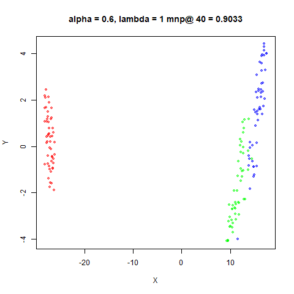|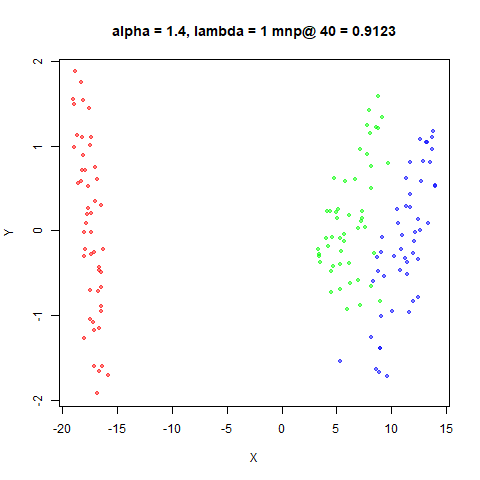
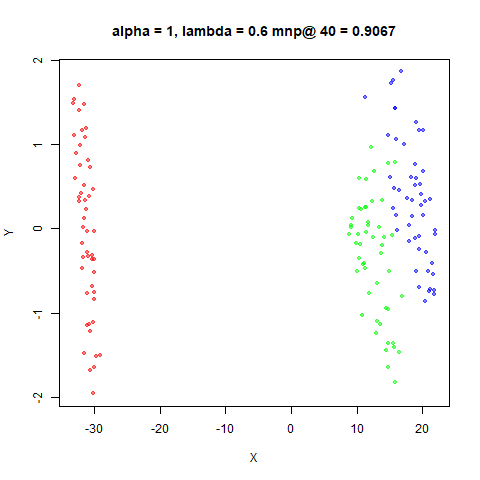|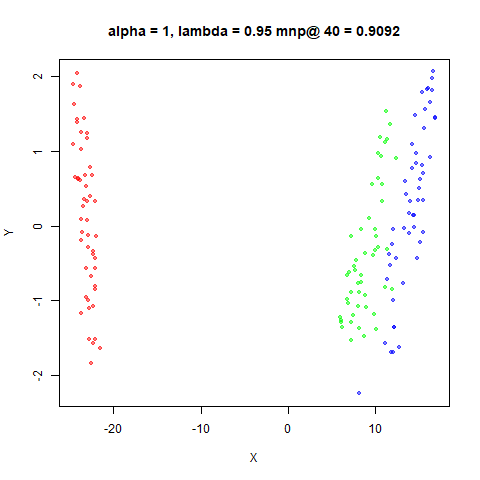
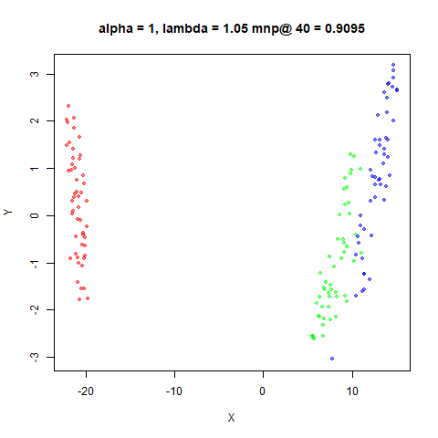|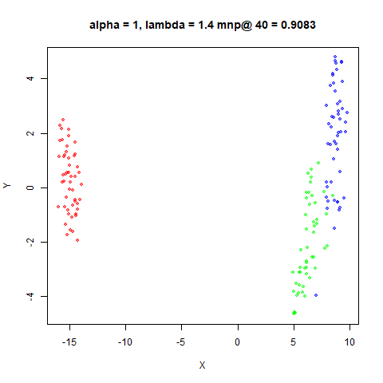

### s1k

|                             |                           |
:----------------------------:|:--------------------------:
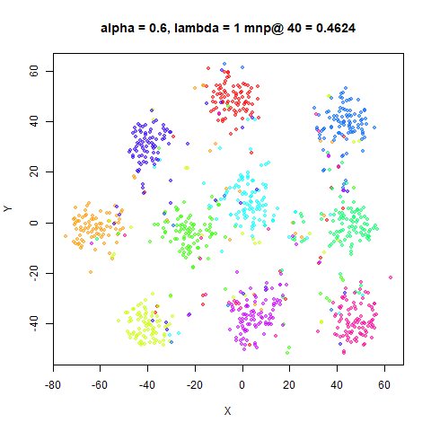|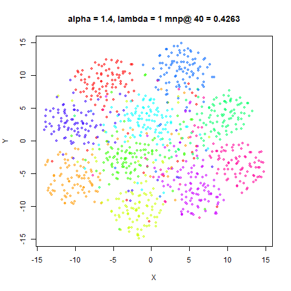
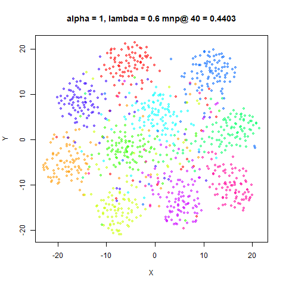|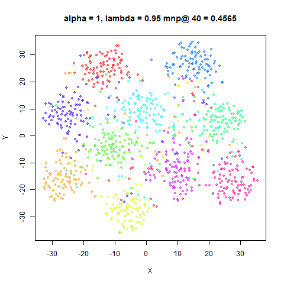
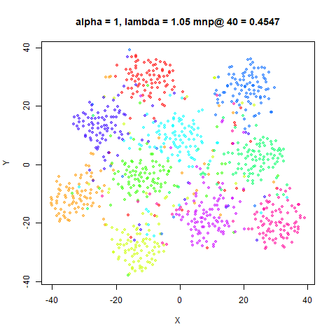|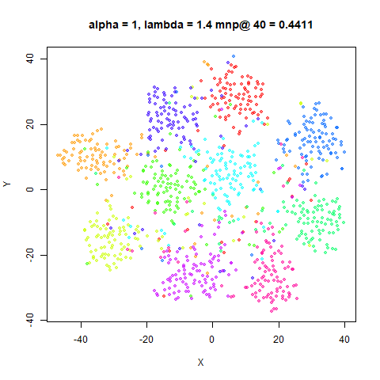

### oli

|                             |                           |
:----------------------------:|:--------------------------:
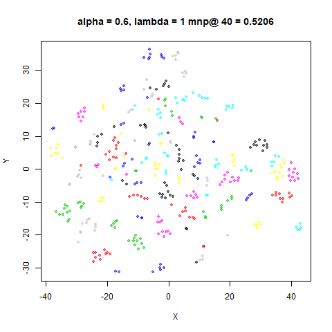|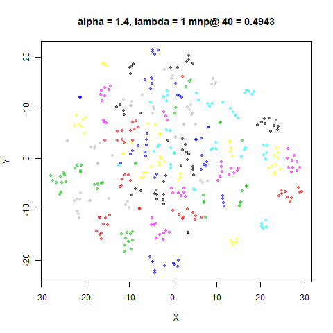
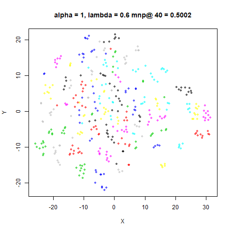|
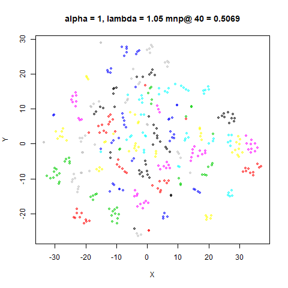|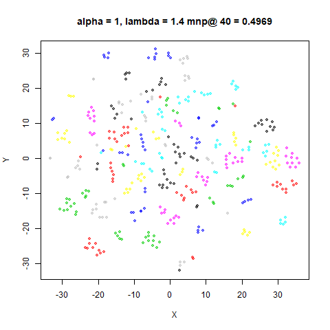

### frey

|                             |                           |
:----------------------------:|:--------------------------:
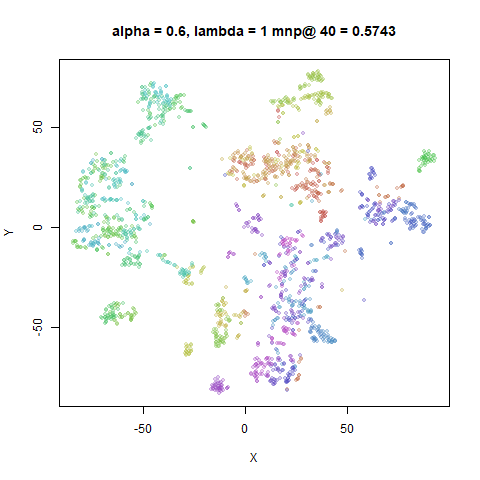|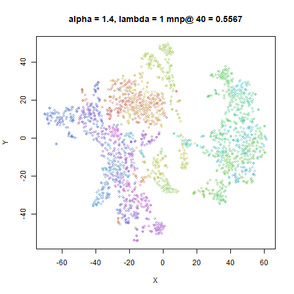
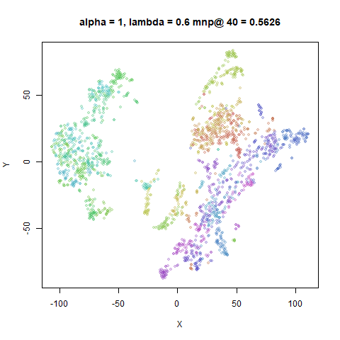|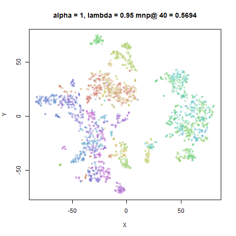
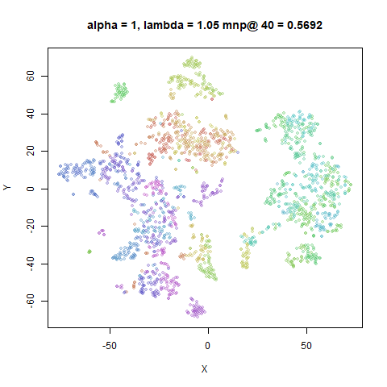|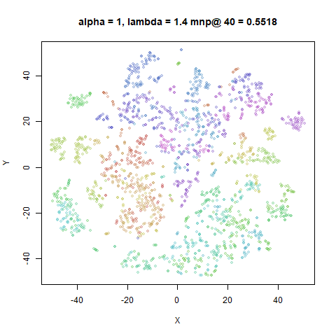

### coil20

|                             |                           |
:----------------------------:|:--------------------------:
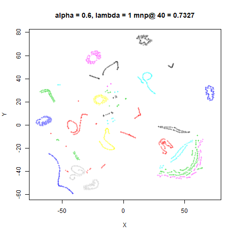|
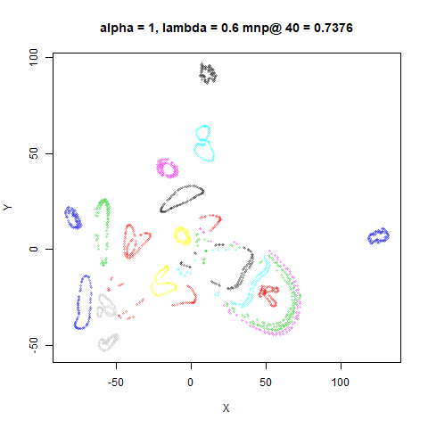|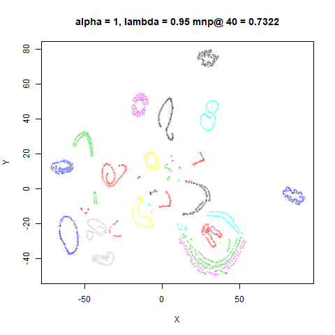
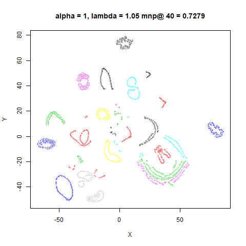|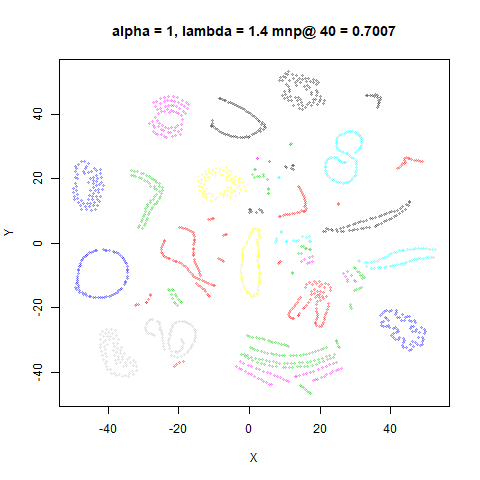

### mnist6k

|                             |                           |
:----------------------------:|:--------------------------:
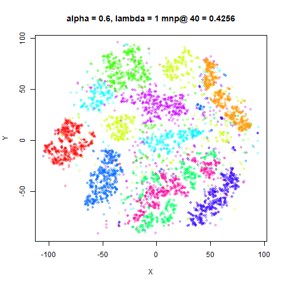|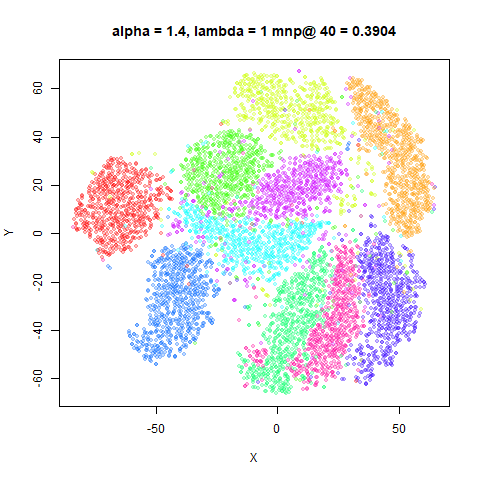
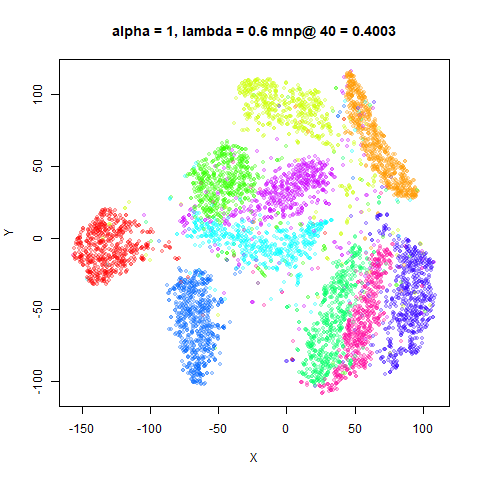|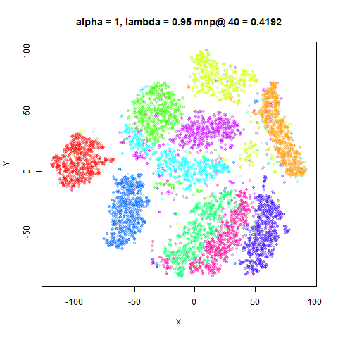
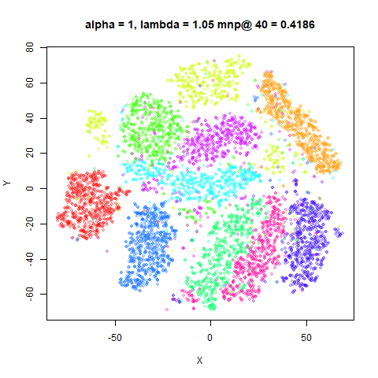|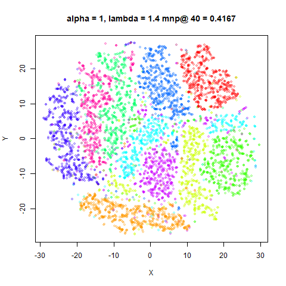

### fashion6k

|                             |                           |
:----------------------------:|:--------------------------:
|
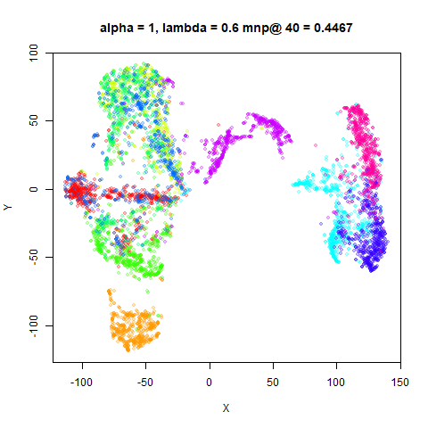|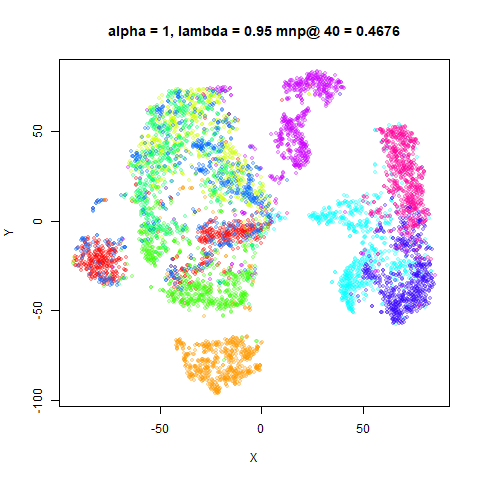
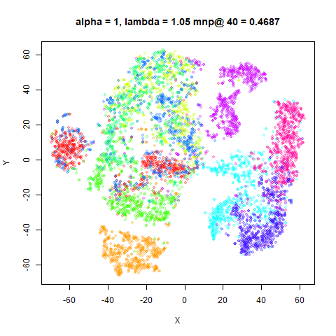|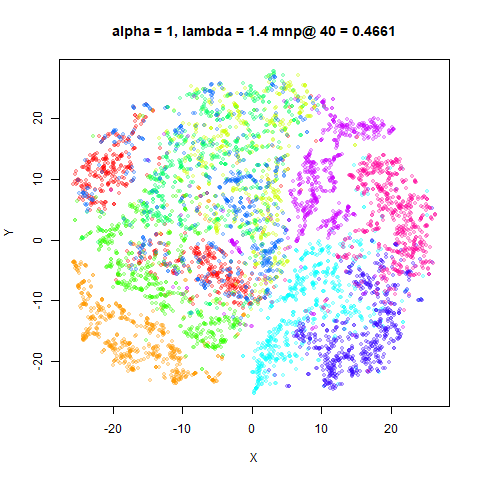

## Conclusions

Using $\alpha$ and $\lambda$ to control cluster size and separation respectively
seems like it works pretty well. You might want to consider $\lambda$ values
outside of the range `(0.95, 1.05)` used in the ABSNE paper for smaller datasets,
though.

There is an obvious comparison of the use of $\alpha$ in the divergence to
control cluster size, and the similar effect seen from adding a heavy-tail
parameter to the output weight function in 
[HSSNE](https://jlmelville.github.io/smallvis/hssne.html) and related methods. 
All other things being equal, it may be that selecting $\alpha$ in the
AB-divergence provides a more useful way to think about heavy-tailedness (i.e.
in terms of divergence families) than the more arbitrary weight functions. For
example, [Regli and Silva](https://arxiv.org/abs/1805.01045) discuss the
AB-divergence for variational inference and assign various properties to the
different divergences it represents, such as robustness to outliers. 

Given the possible connections between heavy-tailed kernels and the effect of
$\alpha$ in the AB-divergence, it would be of interest to see if the
heavy-tailed kernels can also be modified to provide a parameter that controls
cluster separation. It's easy to add a bandwidth parameter to the heavy-tailed
kernel, but in my tests that doesn't seem to do very much. Or if you stick
to the exponential kernel in the output space, i.e. use SSNE as a base rather
than t-SNE, is there a combination of $\alpha$ and $\beta$ in the divergence
that gives t-SNE-like behavior?

The big downside to the use of ABSNE is that it's a lot slower than t-SNE, due
to the gradient containing logs and powers.

Up: [Documentation Home](https://jlmelville.github.io/smallvis/).
