When looking at 
[initialization](https://jlmelville.github.io/smallvis/init.html) in t-SNE, I 
noted that using PCA or Laplacian Eigenmaps gave results that were hard
to distinguish from the usual random initialization used in t-SNE, even allowing
for choosing the result with the lowest error out of ten runs, with the PCA and
LE method therefore having the two advantages of being deterministic and not
requiring as long to run.

The other thing that bothers me about choosing the lowest-error result from ten
runs is how wasteful it is. Is there really no useful information to be 
extracted from the other nine results? An obvious strategy is to aggregate
the results over all the runs somehow. We can't use the output coordinates
directly, because of the random initialization, but we could calculate the
distance matrix for each result, and then aggregate them. Then, we could attempt
to come up with a new set of coordinates that best match the aggregated 
distances via MDS. Finally, if needed, we could run t-SNE again using the 
aggregated coordinates.

Here's an outline of how this could work:

* Run `smallvis_rep` ten times to produce ten t-SNE outputs.
* For each run, calculate the distance matrix of the final coordinates.
* Calculate the average distance for each pair of points to create a new 
distance matrix. I looked at both `mean` and `median` and didn't notice a big
difference in results. As the median is more robust, I went with that for the
results that follow.
* Run Classical MDS on the distance matrix to initialize the coordinates. If you
use a distance matrix as input to `smallvis` and use `Y_init = "pca"`, this is
already exactly what happens.
* Refine these coordinates further with metric MDS, i.e. use `method = "mmds"`.
* A final t-SNE refinement initialized from the MMDS coordinates.

In an ideal world, we could stop at the Classical MDS stage, but in fact a bit
of MMDS refinement followed by a final t-SNE run *was* necessary.

The obvious downside to is that a naive approach to the averaging
would require storing multiple distance matrices, which could take up 3GB of
RAM on the larger datasets (N = 6000) I use. Alternatively, you only ever need
10 distances in memory if you loop through each pair of points across all
output coordinates at once, although this commits the cardinal R sin of 
explicit looping and is not kind to memory locality, so it's quite slow.

Even if we ignore the time taken to process the distance matrices and refine
them via MDS, we still end up doing an extra t-SNE run. So a fair comparison to
the method described above would be to carry out the final t-SNE run using the
coordinates from the best of the ten random-initialized runs.

## Datasets

See the [Datasets](https://jlmelville.github.io/smallvis/datasets.html) page.
We shall also make use of a Swiss Roll dataset here. Because random initialization
tends to result in small local pieces of the manifold being preserved, perhaps
the averaging method will help preserve more of these pieces in one embedding.
But otherwise we shouldn't hope for much. The settings for the Swiss Roll are:

```
sr3k <- snedata::swiss_roll(n = 3000, max_z = 30)
```

## Evaluation

Apart from visualizing the results, the mean neighbor preservation of the
40 closest neighbors is used to provide a rough quantification of the quality
of the result, labelled as `mnp@40` in the plots.

## Settings

For settings, we'll use the ones given in the 
[original t-SNE paper](http://www.jmlr.org/papers/v9/vandermaaten08a.html). 
We'll run 10 embeddings. Note that we set `ret_extra = TRUE` to ensure
we get back the extra info that will let us work out which of the results 
had the lowest error (which we'll need later).

```
# Generate 10 t-SNE embeddings
iris_repn <- smallvis_rep(n = 10, keep_all = TRUE, X = iris, scale = FALSE, perplexity = 40, eta  = 100, exaggeration_factor = 4, stop_lying_iter = 50, ret_extra = TRUE)
```

Here's some code that will combine the results of `smallvis_rep` and return
the median distance matrix:

```
combine_dy <- function(all_res, stat_fun = stats::median) {
  res_dy <- NULL
  nres <- length(all_res)
  resi <- all_res[[1]]
  if (class(resi) == "matrix") {
    Y <- resi
  }
  else {
    Y <- resi$Y
  }
  nr <- nrow(Y)
  dijs <- rep(0, nres)

  res_dy <- matrix(0, nrow = nr, ncol = nr)
  for (i in 1:(nr - 1)) {
    for (j in (i + 1):nr) {
      for (k in 1:nres) {
        if (class(resi) == "matrix") {
          Y <- all_res[[k]]
        }
        else {
          Y <- all_res[[k]]$Y
        }
        dijs[k] <- sqrt(sum((Y[i, ] - Y[j, ]) ^ 2))
      }
      res_dy[i, j] <- stat_fun(dijs)
      res_dy[j, i] <- res_dy[i, j]
    }
  }

  res_dy
}
```

The distance matrix-based refinement process can then be carried out like so:

```
iris_med <- combine_dy(iris_repn, stat_fun = stats::median)
iris_med_mmds <- smallvis(as.dist(iris_med), method = "mmds", scale = FALSE, Y_init = "pca", epoch = 5, eta = 0.0001)
iris_med_refine <- smallvis(iris, scale = FALSE, perplexity = 40, Y_init = iris_med_mmds, eta = 100)
```

The learning rate `eta` for the MMDS step was found by trial and error.

For the alternative approach where we'll just refine the "best" result, first
we'll need to extract the best result from the output of `smallvis_rep`. When
setting `keep_all = TRUE` and `ret_extra = TRUE`, every result has an extra
entry called `best_i`, which indicates which of the results had the lowest
error. You could do this yourself by looping over each result and comparing the 
last entry in the `itercosts` arrays, but it's such an obvious yet fiddly task 
that `smallvis_rep` does it for you. The resulting syntax for extracting the
best result is admittedly ugly:

```
iris_best <- iris_repn[[iris_repn[[1]]$best_i]]
```

With that in hand, we can carry out one more t-SNE run with the best result
as result as the initial coordinates.

```
iris_best_refine <- smallvis(iris, scale = FALSE, perplexity = 40, Y_init = iris_best$Y, eta  = 100, exaggeration_factor = 4, stop_lying_iter = 50)
```

As we did in the original initialization, we'll also consider the even simpler
case of an initialization from Laplacian Eigenmaps (scaled PCA gives very similar
results, so there's no little point using both). These results have been 
regenerated alongside the other results here, but hopefully will be quite similar
to those from the original initialization discussion. Although that discussion
indicated there was no strong reason to apply early exaggeration to these
initializations, I did so anyway just to be consistent with the 
random-initialized results.

```
iris_le <- smallvis(iris, scale = FALSE, perplexity = 40, Y_init = "lap", method = "tsne", eta = 100, exaggeration_factor = 4, stop_lying_iter = 50)
```

## Results

For each dataset, there are four images. On the top row, the left image is
labeled "best", and is the result with the lowest final error from the ten 
random initializations. The right hand image, "best refine" shows the result
of the extra t-SNE run using the best result as the initial coordinates.

On the bottom row, the left hand image "median DY" indicates the result of
embedding the median distance matrix and then using those coordinate to
initialize t-SNE. The right hand image, "LE" shows the result of just carrying
out a single t-SNE run with the Laplacian Eigenmap initialization.

### swiss

|                             |                           |
:----------------------------:|:--------------------------:
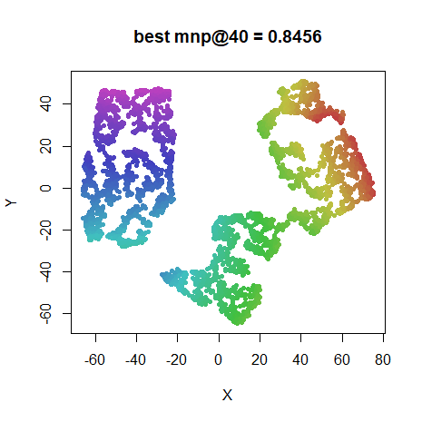|
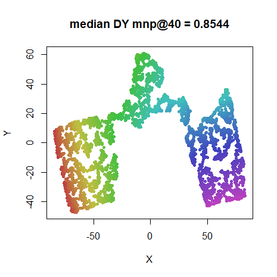|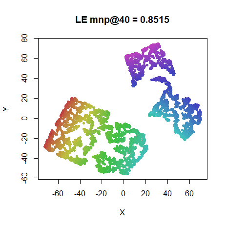

### iris

|                             |                           |
:----------------------------:|:--------------------------:
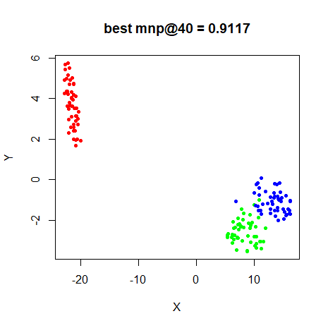|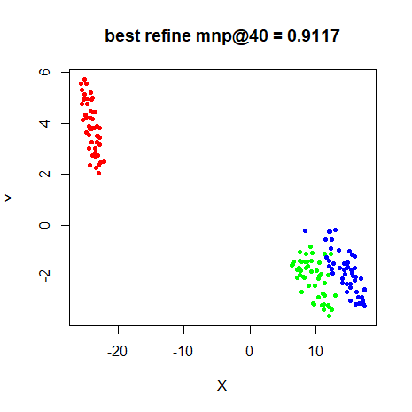
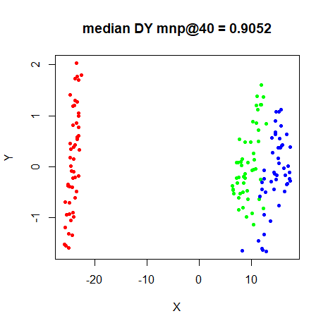|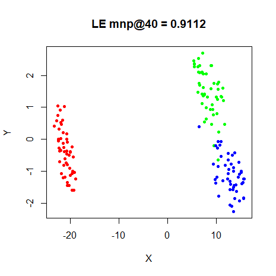


### s1k

|                             |                           |
:----------------------------:|:--------------------------:
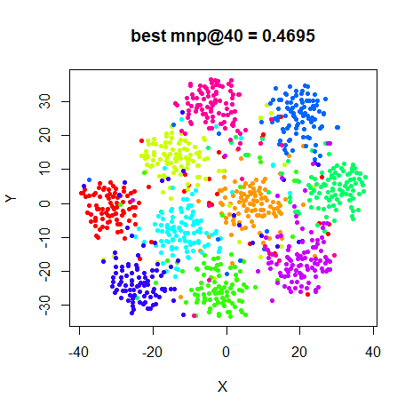|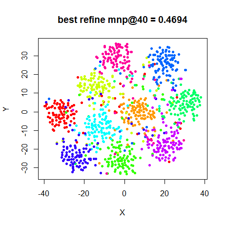
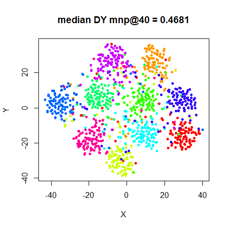|

### oli

|                             |                           |
:----------------------------:|:--------------------------:
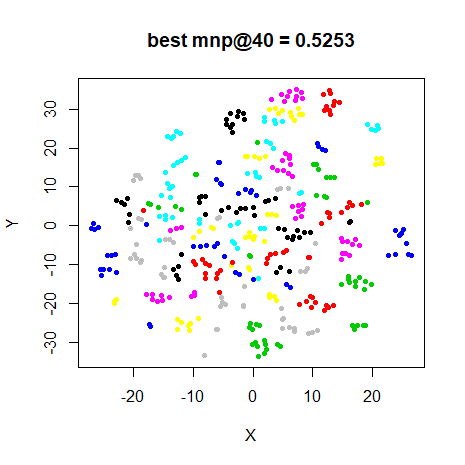|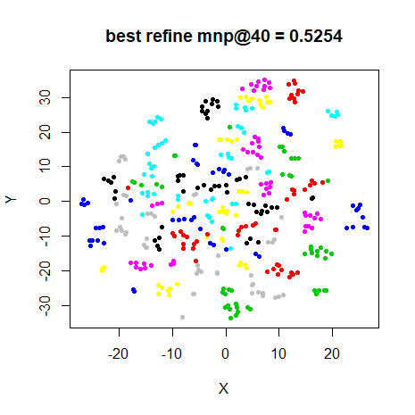
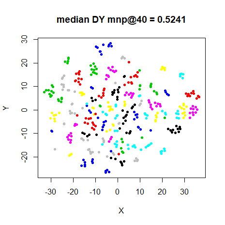|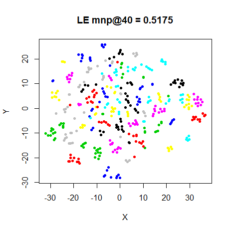

### frey

|                             |                           |
:----------------------------:|:--------------------------:
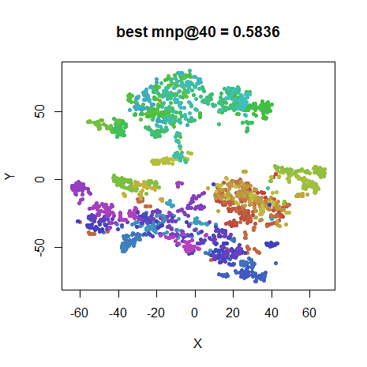|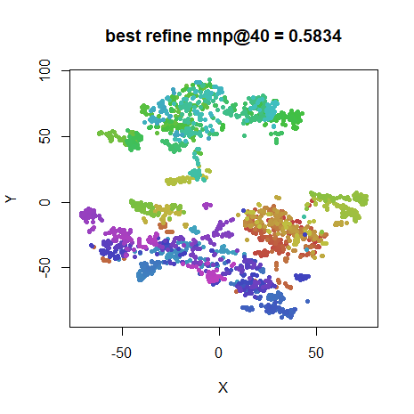
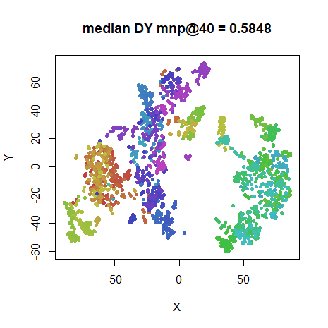|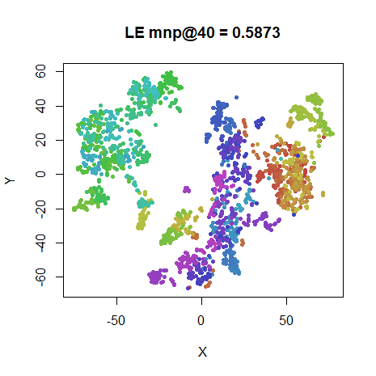

### coil20

|                             |                           |
:----------------------------:|:--------------------------:
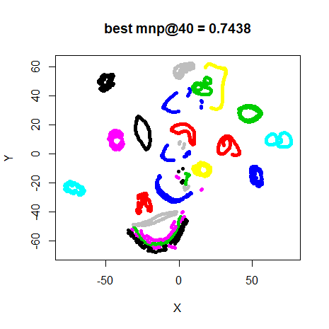|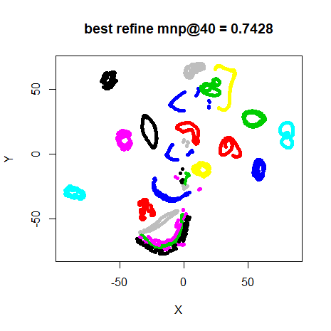
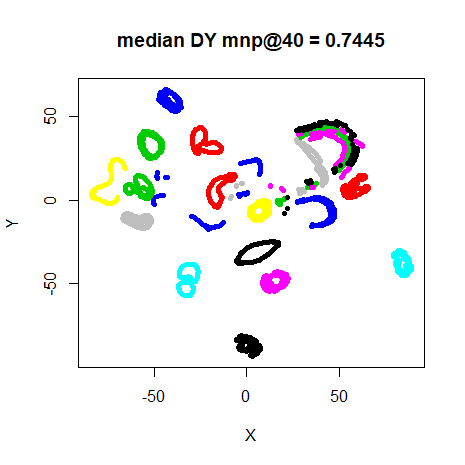|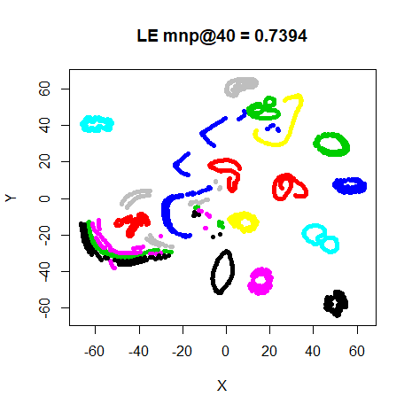

### mnist

|                             |                           |
:----------------------------:|:--------------------------:
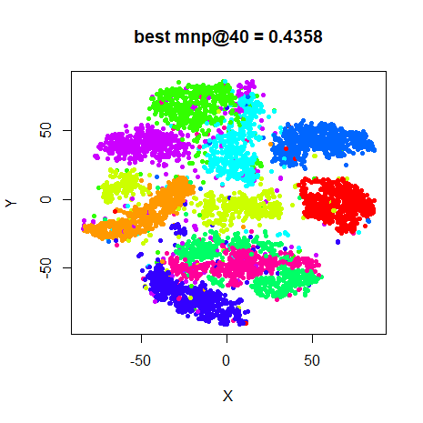|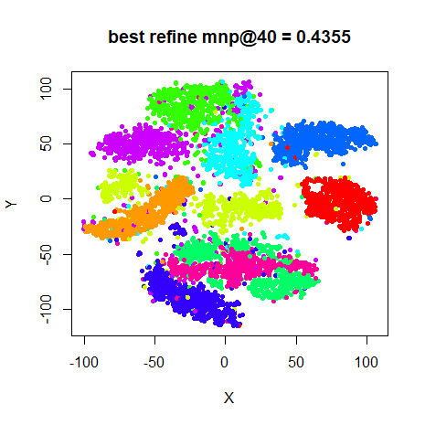
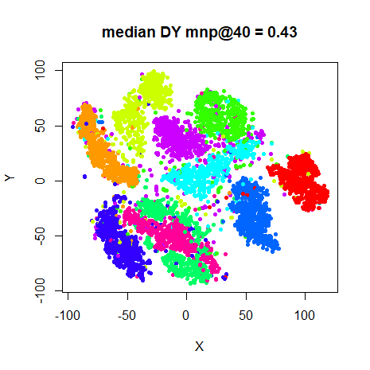|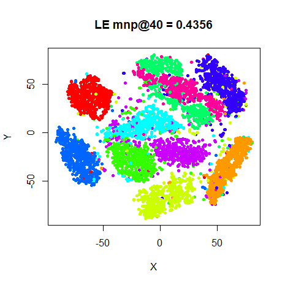

### fashion

|                             |                           |
:----------------------------:|:--------------------------:
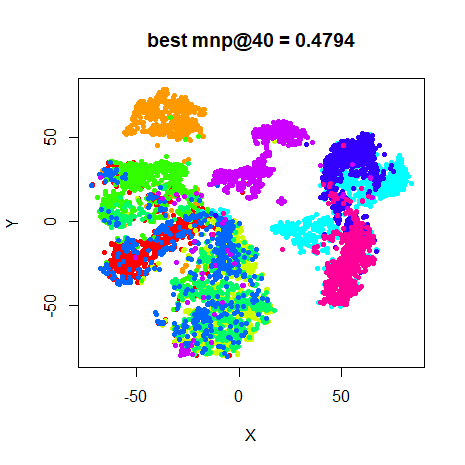|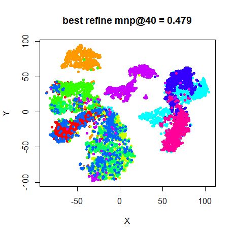
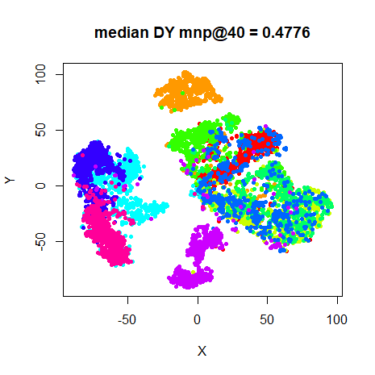|

A brief perusal of the images will show that the median distance matrix approach
doesn't drastically improve the visualizations. And in terms of neighborhood 
preservation, it's normally ever-so-slightly worse, although I wouldn't take the 
differences in the values very seriously. Only the `swiss` results shows a 
potential improvement over the best result, but there's still a large tear and
twist in the result. Given the extra effort this approach entails, we can call 
this one a definitive failure.

The results of refining the best result also seem to have almost no effect. In
fact, in many cases, the mean neighbor preservation is somewhat reduced between
the "best" and "best refine" results, although the error itself is reduced.

Confirming the results from the previous time I compared the Laplacian Eigenmap 
initialization with random initialization, the Eigenmap initialization performs
very creditably.

## Conclusions

The obvious conclusion is that the median distance matrix approach is a bad
idea. If you must spend the extra time, re-initializing from the best result
is less of a waste, but still seems pretty pointless. These results also 
continue to point to using the Laplacian Eigenmap initialization over 
random initialization.

It's easy to think of other, increasingly complex ways to combine the output of
random initializatons that might do better than what I've presented here, but
these results are terribly encouraging. And anything that requires a distance
matrix seems like a sticking point in terms of scaling up the process to larger
datasets.
