Up: [Documentation Home](https://jlmelville.github.io/smallvis/).

Another in my series of investigating the optimization of t-SNE. See also 
results for [L-BFGS](https://jlmelville.github.io/smallvis/opt.html) and
the approximate Hessian 
[Spectral Direction](https://jlmelville.github.io/smallvis/specd.html). The 
[spectral direction paper](https://arxiv.org/abs/1206.4646) also evaluates
a lot of the same methods.

A conjugate gradient method was used with 
[NeRV](http://www.jmlr.org/papers/v11/venna10a.html), without further details 
being provided. 

I didn't hold out high hopes for this, 
because the general advice in the literature is that they are at best 
competitive with quasi-Newton methods under some circumstances with their main
advantage being their simpler implementation and reduced storage requirements.
The price paid being they require stricter line search. 
The spectral direction paper tested a 
[Matlab implementation](http://learning.eng.cam.ac.uk/carl/code/minimize/),
which uses the Polak-Ribière update (without restarting) and it didn't seem
to do very well.

## Datasets

As usual, see the [Datasets](https://jlmelville.github.io/smallvis/datasets.html) page.

## Settings

In the following experiments, we'll test two types of CG update: the
Polak-Ribière update with restarting in the event of conjugacy being lost (often
called "PRP" or "PR+"), and the update created by Hager and Zhang for the
[CG_DESCENT](http://users.clas.ufl.edu/hager/papers/Software/) package. This
also has a restart rule, so I'll call it "HZ+".

For the line search, I followed the recommendation from Nocedal and Wright
(chapter 3) to use a Strong Wolfe line search with a curvature condition 
constant of `0.1`. However, in  
[the paper describing CG_DESCENT](https://doi.org/10.1145/1132973.1132979), 
Hager and Zhang use a value (in their notation, $\sigma$) of `0.9`, a looser
tolerance that Nocedal and Wright suggest is more appropriate for quasi-Newton
methods. So we'll try both.

```
# CG with a strong Wolfe line search and PR+ update
iris_cgprp <- smallvis(iris, scale = FALSE, perplexity = 40, Y_init = "spca", opt = list("cg", cg_update = "PR+", c2 = 0.1, step_tol = 1e-6, max_gr = 1000), ret_extra = c("DX", "DY"))

# CG with a strong Wolfe line search and HZ+ update
iris_cghzp <- smallvis(iris, scale = FALSE, perplexity = 40, Y_init = "spca", opt = list("cg", cg_update = "HZ+", c2 = 0.1, step_tol = 1e-6, max_gr = 1000), ret_extra = c("DX", "DY"))

# CG with a strong (but loose) Wolfe line search and PR+ update
iris_cgprp <- smallvis(iris, scale = FALSE, perplexity = 40, Y_init = "spca", opt = list("cg", cg_update = "PR+", c2 = 0.9, step_tol = 1e-6, max_gr = 1000), ret_extra = c("DX", "DY"))

# CG with a strong (but loose) Wolfe line search and HZ+ update
iris_cghzp <- smallvis(iris, scale = FALSE, perplexity = 40, Y_init = "spca", opt = list("cg", cg_update = "HZ+", c2 = 0.9, step_tol = 1e-6, max_gr = 1000), ret_extra = c("DX", "DY"))
```

## Evaluation

For each initialization, the mean neighbor preservation of the 40 nearest
neighbors, calculated using the
[quadra](https://github.com/jlmelville/quadra) package. The number reported is 
the mean average over all results and is labelled as `mnp@40` in the plots. 40
was chosen for these results to match the `perplexity`.

## Results

For each dataset, size results are shown below. On the first row, the left image
shows results using the PR+ update, and the right image from the HZ+ update. In
the middle row are the same CG settings except with the line search having a
looser tolerance as used in CG_DESCENT. On the bottom row, the left and right
hand images are those from using default `mize` L-BFGS settings with Wolfe line
search, and the default `smallvis` DBD settings respectively. These used the
same initialization, input scaling and perplexity.

### Iris

| |
:-------|:-------------------:|
||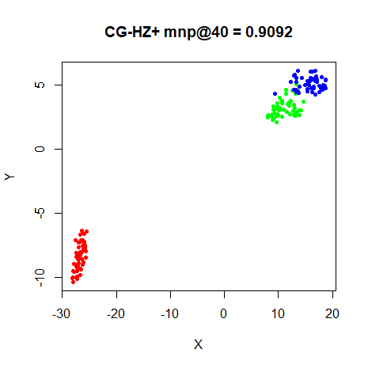
|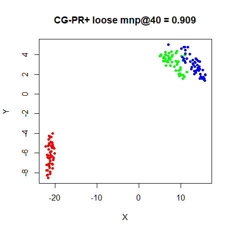|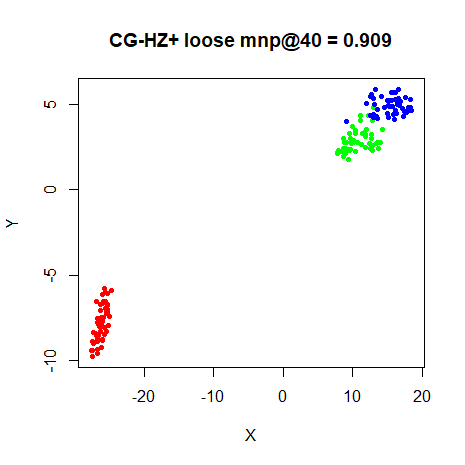
||

### s1k

| |
:-------|:-------------------:|
|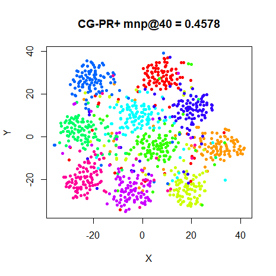|
|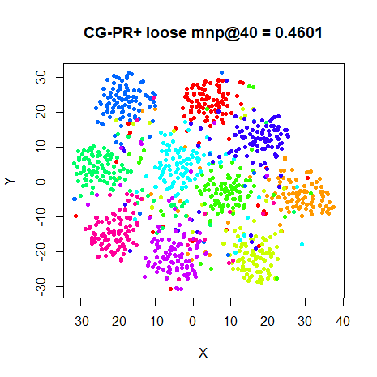|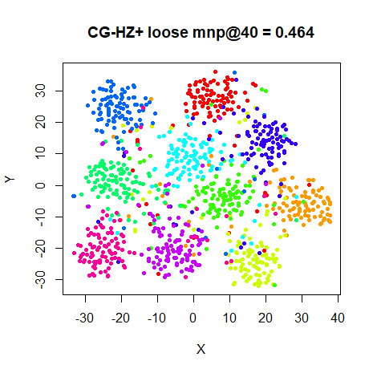
||


### Olivetti Faces

| |
:-------|:-------------------:|
|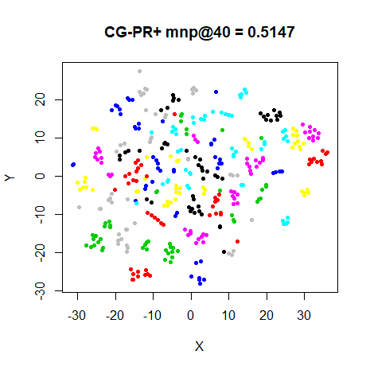|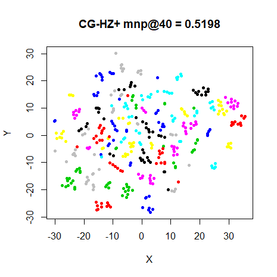
|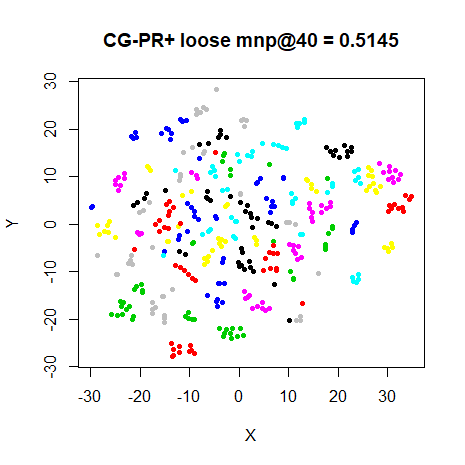|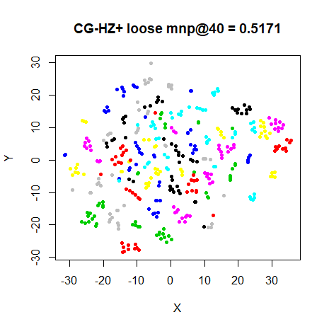
||

### Frey Faces

| |
:-------|:-------------------:|
|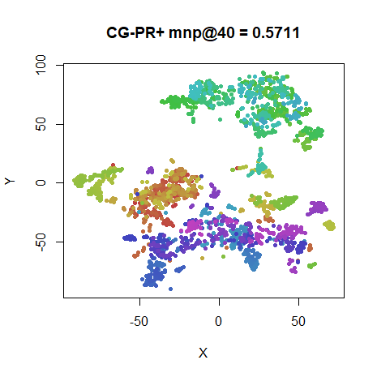|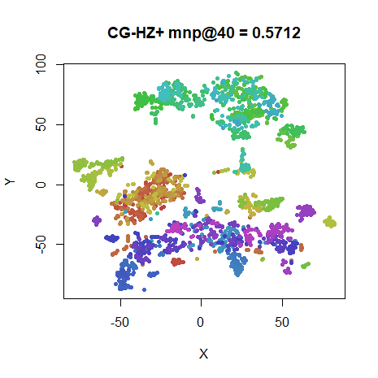
|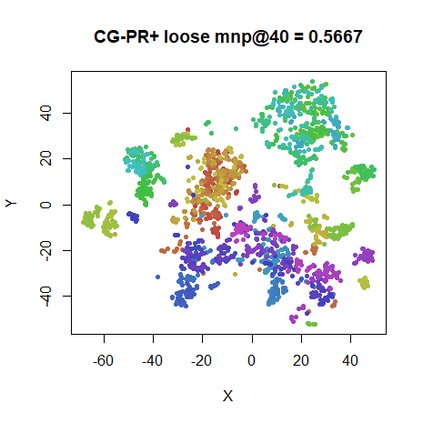|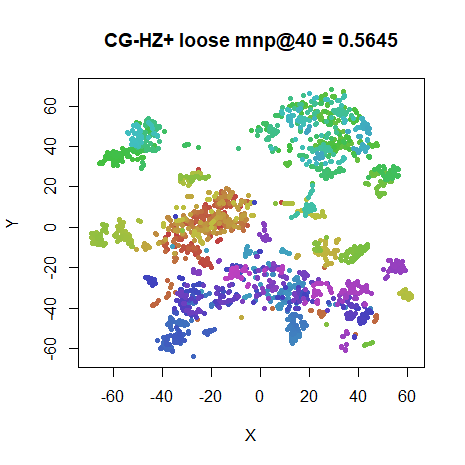
||

### COIL-20

| |
:-------|:-------------------:|
|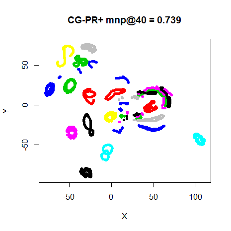|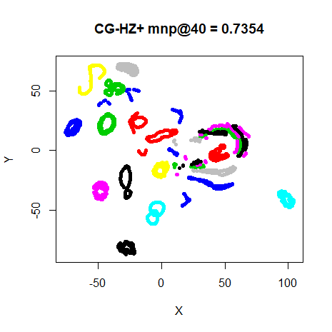
|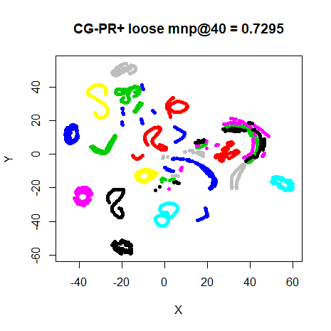|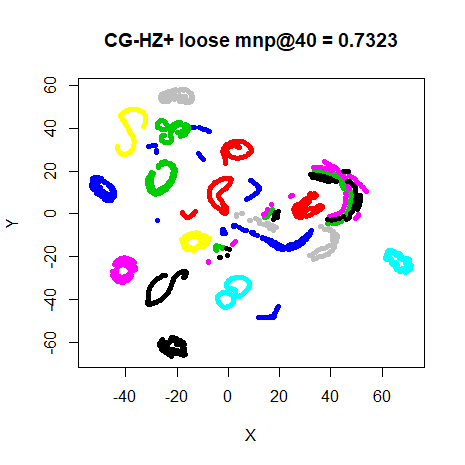
||

### MNIST (6,000)

| |
:-------|:-------------------:|
|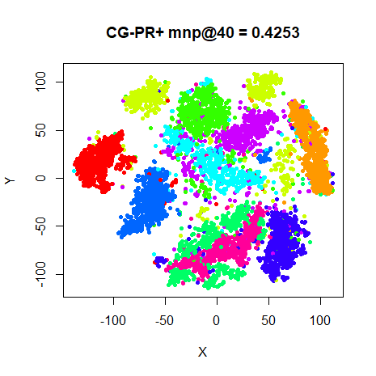|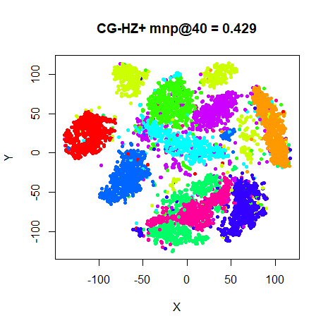
|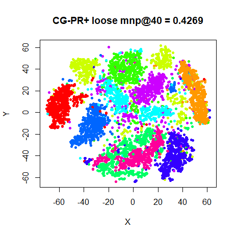|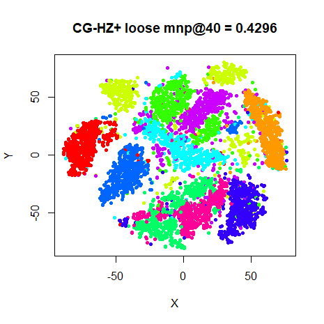
||

### Fashion (6,000)

| |
:-------|:-------------------:|
|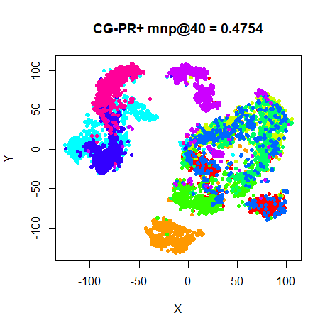|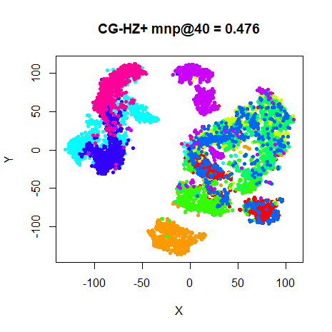
|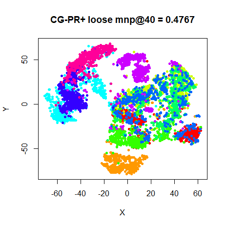|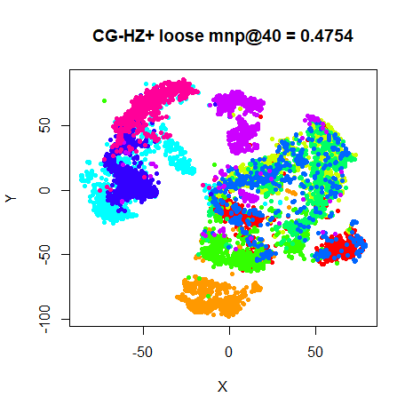
||

This is slightly surprising. On the smaller datasets, as usual, there's little
to choose between any of the methods. For MNIST, the CG results are less ugly
than the L-BFGS result. Not much to choose between the PR+ and HZ+ results,
either. Maybe the HZ+ results have the edge over PR+, but either seems fine. 
Neither is there that much of a difference between the "tight" Wolfe
line search results and the loose results. However, MNIST results do show
more of a cluster break up with the loose results. Also, the fashion MNIST
results do seem to show more outlying points between the (admittedly overlapping)
clusters.

Conjugate gradient seems to be no worse a choice for t-SNE than L-BFGS, although
a tight line search is recommended. But still nothing beats the simplicity of
the DBD defaults for t-SNE.

Up: [Documentation Home](https://jlmelville.github.io/smallvis/).
