Most of the docs illustrating the use of `smallvis` use some relatively small
datasets which have been used elsewhere or are otherwise convenient to chuck
a dimensionality reduction algorithm at. Two plots are shown for each dataset:
the PCA results, using the first two principal components, and the results of
running t-SNE with some standard parameters taken from the 
[t-SNE paper](http://www.jmlr.org/papers/v9/vandermaaten08a.html). This should
demonstrate that, in most cases, PCA does a fairly bad job of visualizing the 
data, and t-SNE does a substantially better job. 

## Iris

The famous `iris` dataset, as given in R's `datasets` package. 150 observations
and 4 features. Observations are colored by species. This a very low dimensional
dataset that certainly doesn't need t-SNE applied to it. Very convenient for
sanity checking, though. It's worth noting that the version of this dataset
from the [UCI repository](https://archive.ics.uci.edu/ml/datasets/iris) contains
a few errors, and these are also (as of February 2018) shared by 
[scikit-learn](https://github.com/scikit-learn/scikit-learn/issues/10550).

```
iris_tsne <- smallvis(iris, scale = FALSE, perplexity = 40, Y_init = "spca", eta = 100, exaggeration_factor = 4)
```

|                             |                           |
:----------------------------:|:--------------------------:
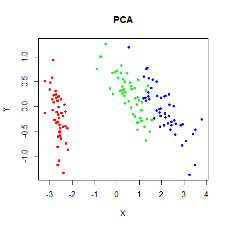|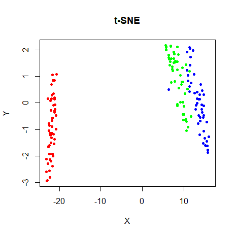

### s1k

A synthetic dataset consisting of a fuzzy 9D simplex made of ten roughly-equally 
spaced isotropic clusters. Created for the 
[sneer](https://github.com/jlmelville/sneer) package and designed to be too
high-dimensional to produce a good result by reproducing distances. 1000
observations and 9 features. Observations are colored by the cluster they belong
to. A good embedding would show ten round but fuzzy clusters.

```
devtools::install_github("jlmelville/sneer")
library(sneer)

s1k_tsne <- smallvis(s1k, scale = FALSE, perplexity = 40, Y_init = "spca", eta = 100, exaggeration_factor = 4)
```

|                             |                           |
:----------------------------:|:--------------------------:
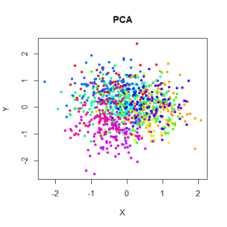|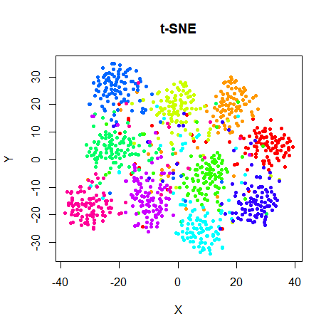

### Olivetti Faces

The 
[ORL Database of Faces](http://www.cl.cam.ac.uk/research/dtg/attarchive/facedatabase.html),
consisting of forty different people's faces, with ten images per person. 
Installed via the [snedata](https://github.com/jlmelville/snedata) package, 
which defers to the 
[RnavGraphImageData](https://cran.r-project.org/package=RnavGraphImageData)
package for the heavy lifting. 400 observations and 4096 features. Observations
are colored according to the face they represent.

```
install.packages("RnavGraphImageData")
library(RnavGraphImageData)
devtools::install_github("jlmelville/snedata")
oli <- snedata::olivetti_faces()

oli_tsne <- smallvis(oli, scale = FALSE, perplexity = 40, Y_init = "spca", eta = 100, exaggeration_factor = 4)
```

|                             |                           |
:----------------------------:|:--------------------------:
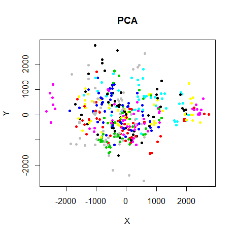|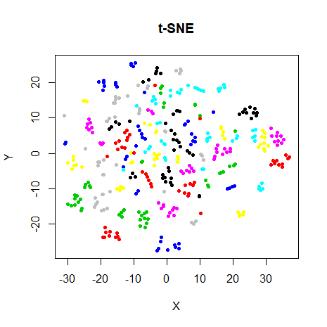

### Frey Faces

2000 consecutive images of Brendan Frey's face, taken from video footage.
Seems to originate from [Saul Roweis' page](https://cs.nyu.edu/~roweis/data.html).
2000 observations and 560 features. This is the one dataset without any categories
for the points. Instead, the color of the point represents its position in the
2000 frames, colored by a rainbow scheme. Early frames are colored red, and then
progress through green to blue and so on.

Like the Olivetti Faces, installed using the 
[snedata](https://github.com/jlmelville/snedata) package, via
[RnavGraphImageData](https://cran.r-project.org/package=RnavGraphImageData)

```
install.packages("RnavGraphImageData")
library(RnavGraphImageData)
devtools::install_github("jlmelville/snedata")
frey <- snedata::frey_faces()


frey_tsne <- smallvis(frey, scale = FALSE, perplexity = 40, Y_init = "spca", eta = 100, exaggeration_factor = 4)
```
|                             |                           |
:----------------------------:|:--------------------------:
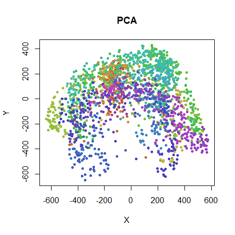|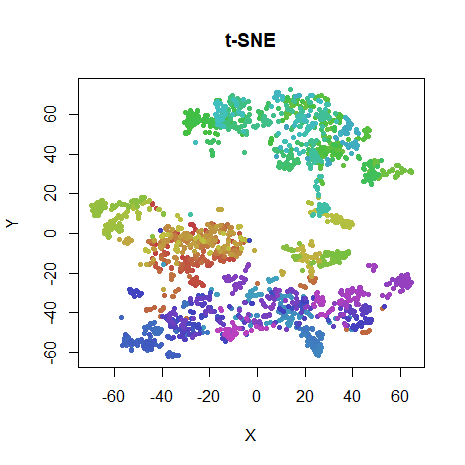

### COIL-20

The 
[Columbia Object Image Library](http://www.cs.columbia.edu/CAVE/software/softlib/coil-20.php): 
images of 20 objects, with 72 poses each. 1440 observations with 16384 features. 
Each observation is colored by the object it is an image of.

Installed using the [coil20](https://github.com/jlmelville/coil20) package.

```
devtools::install_github("jlmelville/coil20")
# For some reason it takes ages to unzip the downloaded file on my machine
# so be patient
coil20 <- coil20::download_coil20(verbose = TRUE)

coil20_tsne <- smallvis(coil20, scale = FALSE, perplexity = 40, Y_init = "spca", eta = 100, exaggeration_factor = 4)
```

|                             |                           |
:----------------------------:|:--------------------------:
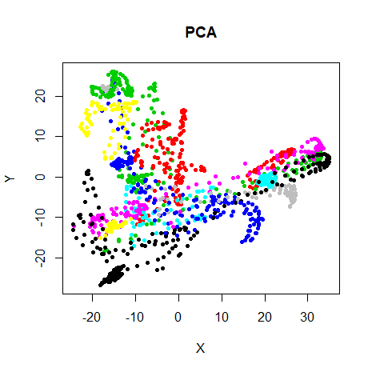|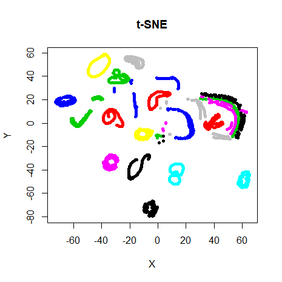

### MNIST (6,000)

A subset of the 
[MNIST database of handwrittens digits](http://yann.lecun.com/exdb/mnist/), 
images of handwritten digits from 0-9. 

Downloaded using the [snedata](https://github.com/jlmelville/snedata) package 
and 6,000 examples were sampled randomly, with 600 examples per digit:

```
devtools::install_github("jlmelville/snedata")
mnist <- snedata::download_mnist()
install.packages(c("dpylr", "magrittr"))
library("dplyr")
library("magrittr")
mnist6k <- sample_n(mnist %>% group_by(Label), 600)

mnist_tsne <- smallvis(mnist6k, scale = FALSE, perplexity = 40, Y_init = "spca", eta = 100, exaggeration_factor = 4)
```
6,000 observations and 784 features. Observations are colored by the digit
they represent.

t-SNE (among other methods) does a pretty good job at separating the digits,
even in 2D. MNIST is considered to be quite an easy dataset to do well at in
various machine learning tasks.

|                             |                           |
:----------------------------:|:--------------------------:
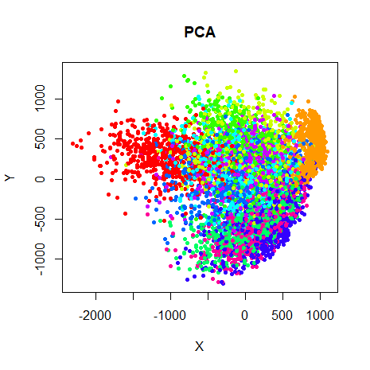|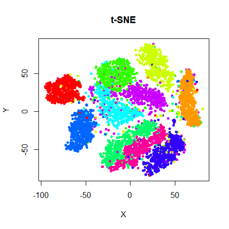

### Fashion (6,000)

A subset of the [Fashion MNIST](https://github.com/zalandoresearch/fashion-mnist)
database, designed to be similar to the MNIST digits database, but using images
of fashion items. Once again downloaded using the 
[snedata](https://github.com/jlmelville/snedata) package the same procedure as 
for the MNIST dataset was used to sample 6,000 images, 600 per object class.

6,000 observations and 784 features. Observations are colored by the fashion 
item they represent (one of T-shirt/top, trousers, pullover, dress, coat, 
sandal, shirt, sneaker, bag or ankle boot).

Note that the Fashion MNIST is designed to be a lot tougher for machine learning
methods to work well on compared to the MNIST digits. And I've not seen any
method do a great job on this dataset (or a subset). The classes may not be
easily separable in two dimensions.

```
fashion <- snedata::download_fashion_mnist()
install.packages(c("dpylr", "magrittr"))
library("dplyr")
library("magrittr")
fashion6k <- sample_n(fashion %>% group_by(Label), 600)

fashion_tsne <- smallvis(fashion6k, scale = FALSE, perplexity = 40, Y_init = "spca", eta = 100, exaggeration_factor = 4)
```

|                             |                           |
:----------------------------:|:--------------------------:
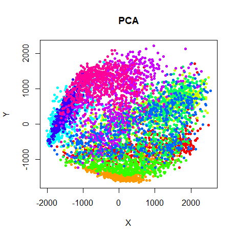|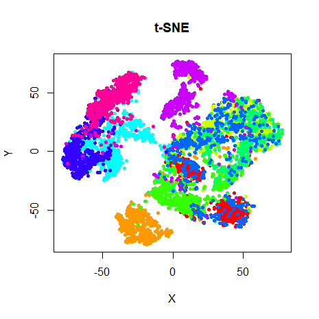

