[Elastic Embedding (PDF)](http://faculty.ucmerced.edu/mcarreira-perpinan/papers/icml10.pdf)
is related to symmetric SNE, but isn't normalized. Apart from the method itself,
the paper is interesting for being the earliest one I'm aware of that makes
the connection between the attractive part of the cost function of SNE with 
[spectral methods](https://jlmelville.github.io/smallvis/spectral.html) 
(e.g. Laplacian eigenmaps). It also manages to produce some good results (on 
an admittedly small number of datasets) without using normalization of the 
affinities. This makes the cost function much more amenable to stochastic
gradient descent techniques that would allow even better scaling to large
datasets than the Barnes-Hut approach used with t-SNE. And indeed, LargeVis
(and UMAP), which uses SGD for its scaling, had a very similar cost function
to EE.

The elastic embedding cost function is:

$$
C = 
\sum_{ij} v_{ij}^{+} d_{ij}^{2} + 
\lambda \sum_{ij} v_{ij}^{-} \exp\left(-d_{ij}^{2}\right)
$$

This differs slightly from t-SNE and its variants in using un-normalized weights
(like LargeVis and UMAP) and introducing separate input weights, $v_{ij}^{+}$ and
$v_{ij}^{-}$ for the attractive and repulsive part of the cost function, respectively.
Additionally, a weighting parameter, $\lambda$, is introduced to weight the 
attractive and repulsive contributions to the cost function. Note that this
is unrelated to the $\lambda$ used in the NeRV cost function.

### Positive Weights

The positive weights are defined as:

$$
v_{ij}^{+} = \exp\left(-\beta_i r_{ij}^{2}\right)
$$
i.e. the usual Gaussian input weights as used in SNE, although note we are using
un-normalized affinities rather than the probabilities $p_{ij}$.

The original EE paper uses a global $\beta$ for all $i$ so the input 
weights are symmetric. The later 
[spectral direction](https://arxiv.org/abs/1206.4646) paper uses
the SNE affinities by perplexity calibration and symmetrizes (but does not
normalize) the resulting affinities. For the implementation in `smallvis` we use
the perplexity calibration approach, so we will proceed with the assumption that
the weights are always symmetric.

### Negative weights

The negative weights are the raw Euclidean input distances:

$$
v_{ij}^{-} = r_{ij}^{2}
$$

In one example using the Swiss Roll dataset, the original EE paper sets a 
uniform negative weight, $v_{ij}^{-} = 1$. This is also used by 
[Yang and co-workers](http://jmlr.org/proceedings/papers/v32/yange14.html) when
analyzing the connection between Elastic Embedding and SSNE.

### Homotopy parameter, $\lambda$

The weighting of attractive to repulsive forces is a free parameter, $\lambda$ 
in EE (a similar parameter is used in LargeVis also). The topological term 
"homotopy" is applied to this parameter. Values of `1`, `10` and 
`100` have been used. The spectral directions paper looked at both the COIL-20
and a 20,000-digit sample of MNIST and used $\lambda = 100$ for both, so we'll
try that here too.

A "homotopy method" is also described which means starting the optimization at a
small (effectively 0) value of $\lambda$, and increasing it to the target value
over the course of the optimization. In the spectral direction paper, the
initial value is `1e-4`, with fifty log-spaced increments. As up to 10,000
iterations were allowed at each value of $\lambda$, this seems like a major
time investment. This approach seems similar in spirit to the approach advocated
in the original [NeRV](http://www.jmlr.org/papers/v11/venna10a.html) paper,
and the [multi-scale JSE](https://dx.doi.org/10.1016/j.neucom.2014.12.095) paper,
which both suggest scaling the input probabilities over the course of the
optimization to get better results.

`smallvis` does not currently support the homotopy method.

### Gradient

If we define output weights as we would in SSNE:

$$
w_{ij} = \exp\left(-d_{ij}^2\right)
$$

then we can rewrite the EE cost function in terms of the weights as:

$$
C = 
-\sum_{ij} v_{ij}^{+} \log w_{ij} + 
\lambda \sum_{ij} v_{ij}^{-} w_{ij}
$$

and the gradient is:

$$
\frac{\partial C_{EE}}{\partial \mathbf{y_i}} = 
4\sum_j^N \left( v_{ij}^{+} - \lambda v_{ij}^{-}{w_{ij}} \right) 
\left(\mathbf{y_i - y_j}\right) 
$$


## Datasets

See the [Datasets](https://jlmelville.github.io/smallvis/datasets.html) page.

The Swiss Roll dataset, last seen giving the 
[distance-based methods](https://jlmelville.github.io/smallvis/mmds.html) a
workout, also makes its return here, having been used in the EE paper. To be
like the EE paper, we'll use 2000 points in the example here:

```
sr2k <- snedata::swiss_roll(n = 2000)
```

## Settings

Typical settings used for the results here are:

```
iris_ee_100 <- smallvis(iris, perplexity = 40, scale = FALSE, Y_init = "spca", method = list("ee", lambda = 100), ret_extra = c("dx", "dy"), eta = 100)
```

For `lambda = 1000`, the learning rate had to be reduced to `eta = 10` for 
`iris` and `oli`. This didn't have much effect on the results for the other
datasets.

If not using negative weights, then the value of `lambda` has to be rescaled
accordingly. Typical settings are:

```
iris_eeu <- smallvis(iris, perplexity = 40, scale = FALSE, Y_init = "spca", method = list("ee", lambda = 1e-4, neg_weights = FALSE), ret_extra = c("dx", "dy"), eta = 10)
```

For the Swiss Roll, it's not possible to get exactly the same results
as with the EE paper, because that uses a k-nearest neighbor Gaussian kernel
with $k = 12$ and a fixed bandwidth $\sigma = 15$. For our experiments, we
calibrate the affinities to give a perplexity of `12`, which necessitates 
varying bandwidths. The use of $k = 12$ with GMMDS unrolls this dataset without
disconnections, so the equivalent perplexity should be in the right ballpark.

```
sr2k_ee_100 <- smallvis(sr2k, perplexity = 12, scale = FALSE, Y_init = "spca", method = list("ee", lambda = 100), ret_extra = c("dx", "dy"), eta = 100)
```

## Results

For each dataset, reading from left to right and top to bottom, `lambda`
increases in powers of 10 from `1` to `1000` as indicated by the value in 
parentheses in the plot title.

### iris

|                             |                           |
:----------------------------:|:--------------------------:
|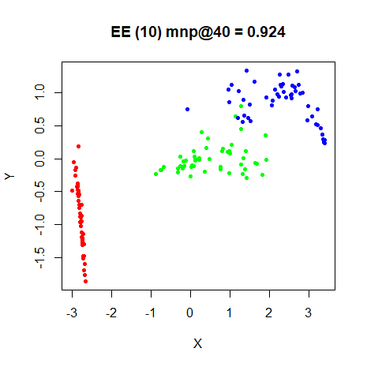
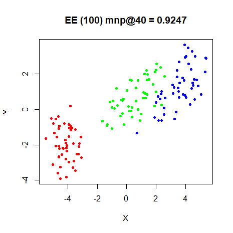|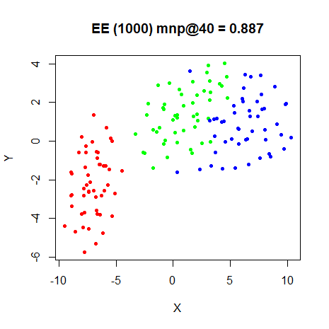


### s1k

|                             |                           |
:----------------------------:|:--------------------------:
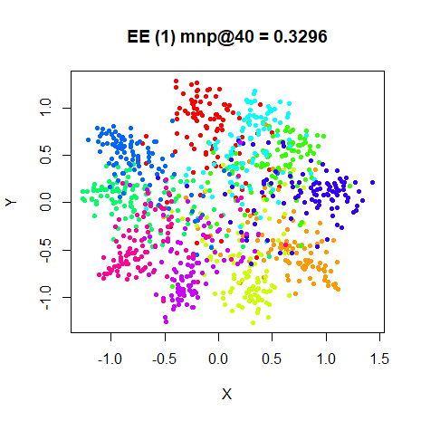|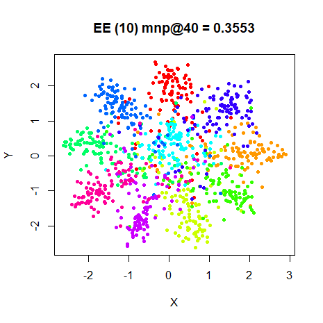
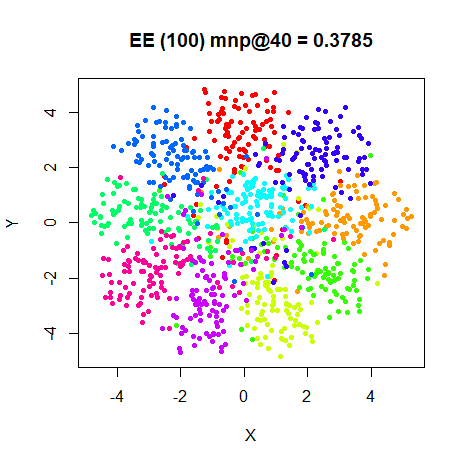|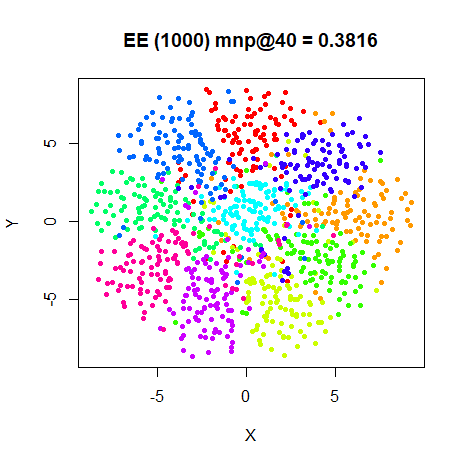

### oli

|                             |                           |
:----------------------------:|:--------------------------:
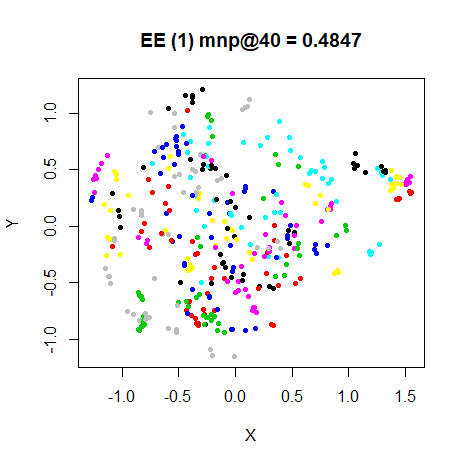|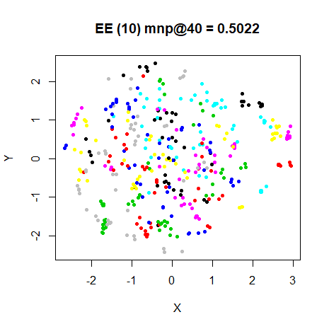
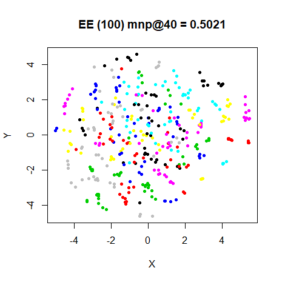|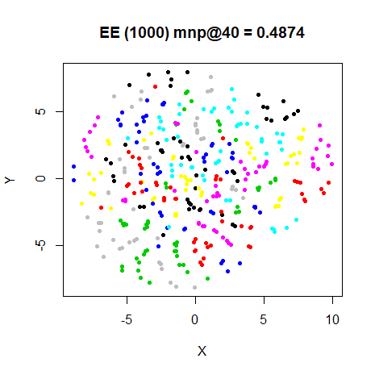

### frey

|                             |                           |
:----------------------------:|:--------------------------:
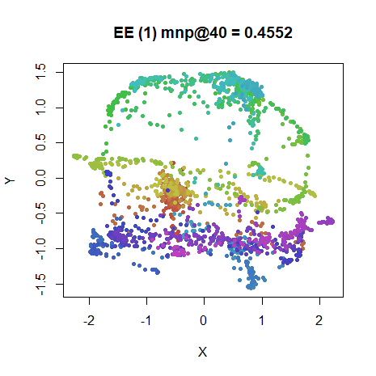|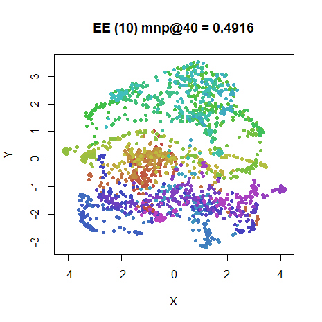
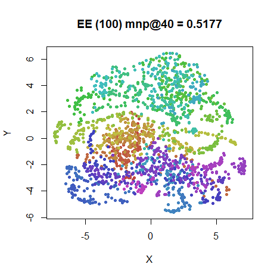|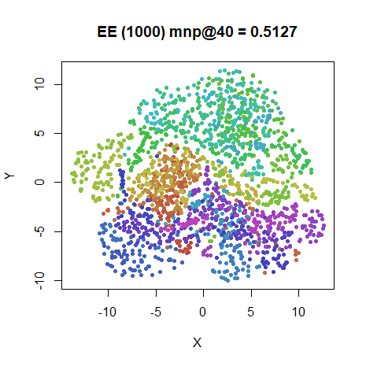

### coil20

|                             |                           |
:----------------------------:|:--------------------------:
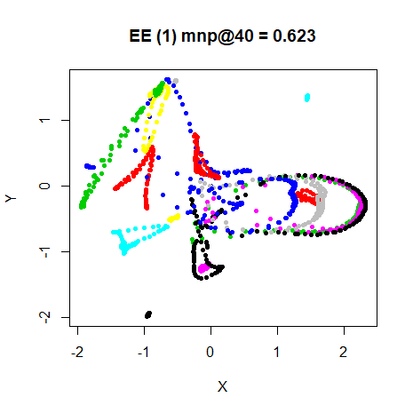|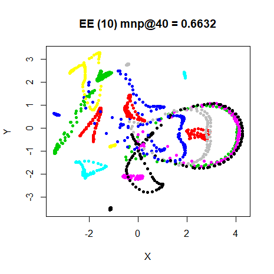
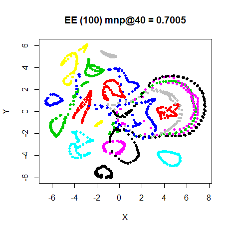|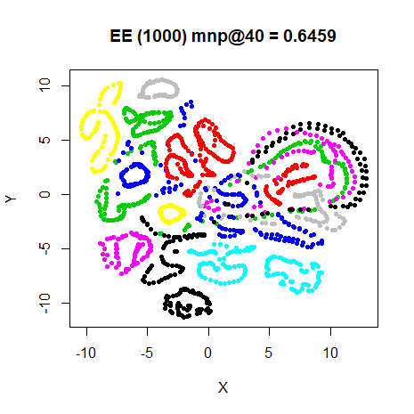

### mnist

|                             |                           |
:----------------------------:|:--------------------------:
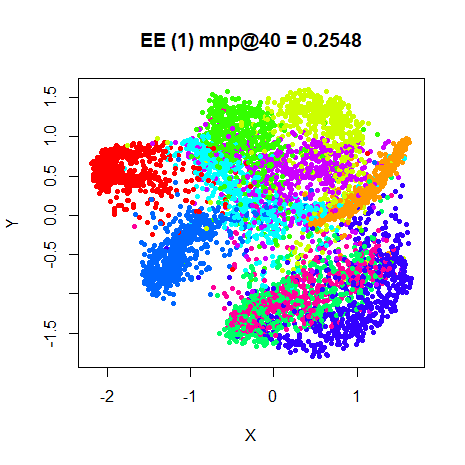|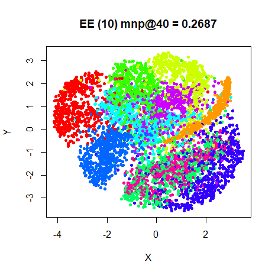
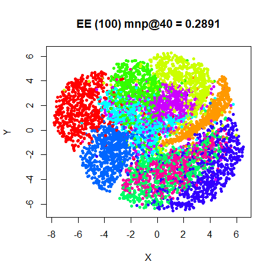|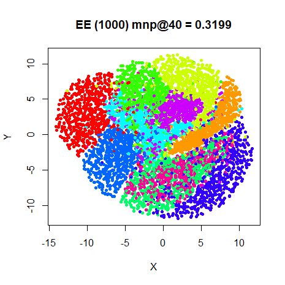

### fashion

|                             |                           |
:----------------------------:|:--------------------------:
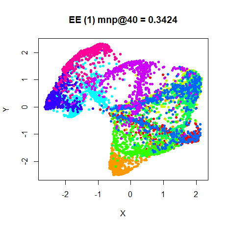|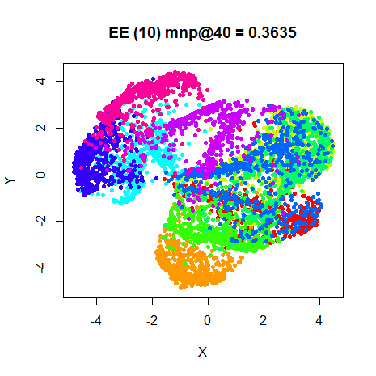
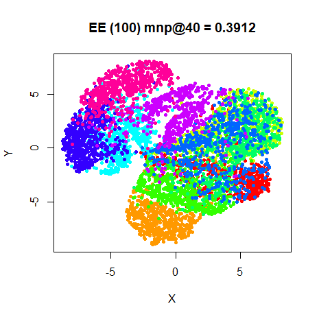|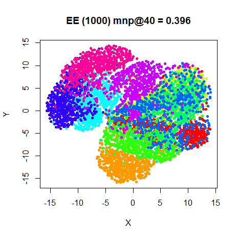

### swiss roll

|                             |                           |
:----------------------------:|:--------------------------:
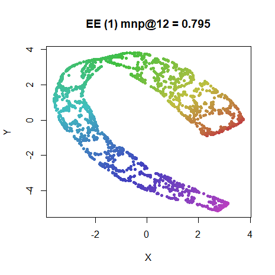|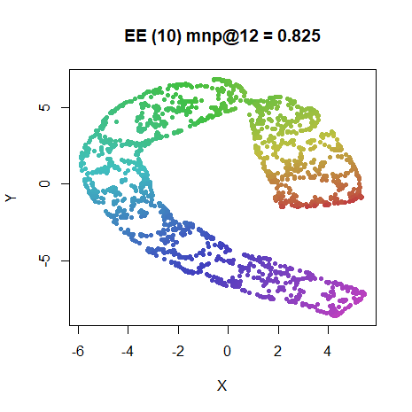
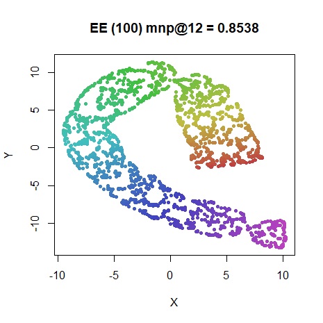|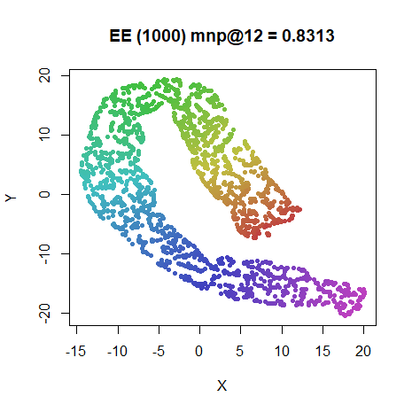

## Conclusions

As noted by the EE paper itself, depending on the choice of `lambda`, EE gives
results that seem to be equivalent to SSNE, without requiring any normalization.
The default `lambda = 100` seems like a good choice. You can also use the 
default delta-bar-delta optimization settings with this setting.

It would be nice to get results as good as t-SNE, but as far as I can tell, 
no-one has reported any results with a t-distributed version of EE. The advent
of methods like LargeVis and UMAP may have filled that niche now.

### Negative Weights

The above experiments were repeated without including negative weights. Apart
from having to rescale `lambda`, there wasn't a large difference in the results.
It did seem a bit harder to find a satisfactory value of `lambda` that worked
for all datasets. With `neg_weights = FALSE`, a suitable range for `lambda` 
seems to be between `1e-3` to `1e-5`.

Given that the Swiss Roll results in the EE paper *do* show full unrolling, The
Swiss Roll results look a bit disappointing, given that the EE paper results
*do* show full unrolling. Allowing for a (much) longer optimization helps unroll
it a bit more but still not completely (see below). SSNE on the Swiss Roll also
shows a similar slow unrolling. I suspect there is an effect due to the
calibrated bandwidths not being used in the output kernel.

The EE results with the Swiss roll don't use SNE calibration, instead using
a fixed bandwidth (presumably chosen by trial and error) for the Gaussian 
kernel. Additionally, the weights were forced to zero outside the 12 nearest
neighbors. This might account for the different behavior, but it would be a 
pity if the results were so dependent on such a specific weight selection.

It seems more likely that the polytope method helps here, because 
using a low value of lambda approximates the Laplacian Eigenmap result which
does unfold the manifold, but doesn't do a good job with the distances 
perpendicular to the main axis of the roll. Below are the two results for the
Swiss Roll: on the left, setting `lambda = 100` and `max_iter = 70000`; and on 
the right, a version approximating the polytope method, where `lambda = 1e-4`
initially with `max_iter = 10000` and then the embedding is repeated with
`lambda` increasing from `1e-3` to `100` in powers of 10, using the result from
the previous embedding as initialization. Overall, both methods are allowed
up to 70000 iterations, but the `tol` settings allow for early stopping so not
all of those 70000 iterations are necessarily used.

|                             |                           |
:----------------------------:|:--------------------------:
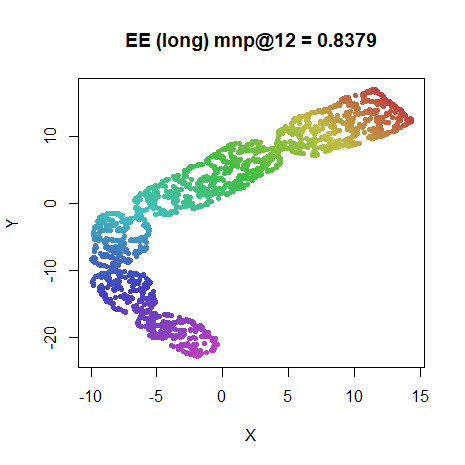|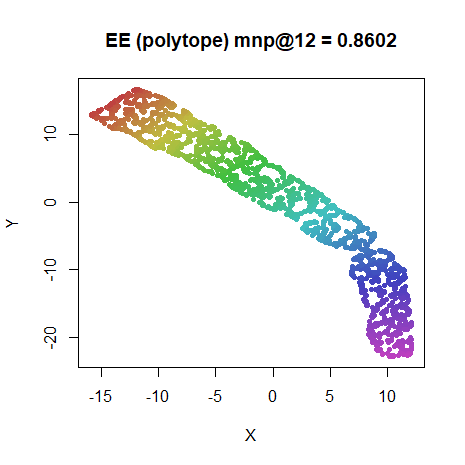

While not perfect, using the polytope method certainly seems to improve the
unrolling. The results shown here took up about 19000 iterations. Starting from
`lambda = 100` directly also does an ok job, but the results above are from
the 70000th iteration. To be fair, it's hard to detect any movement after
30000-40000 iterations, but at the 19000th iteration, the polytope result is
definitely preferred. Note also the "pinched" parts of the roll. This is where
the roll has been twisted due to local optimization of the roll at the expense
of regions around the pinch. This is much less prevalent with the the polytope
method.


This document will be updated if the "polytope method" is implemented.
