Up: [Documentation Home](https://jlmelville.github.io/smallvis/).

The [g-SNE](https://doi.org/10.1101/331611) paper (with 
[matlab code on github](https://github.com/gyrheart/gsne)) suggests a
modification of t-SNE to add a second divergence that is more focused on
matching similarities due to longer distances. The idea is that a weighted
combination of the two will balance global and local structure.

The g-SNE cost function is:

$$C = \sum_{ij} p_{ij} \log \frac{p_{ij}}{q_{ij}} + \lambda \sum_{ij} \hat{p}_{ij} \log \frac{\hat{p_{ij}}}{\hat{q}_{ij}}$$

with $\lambda$ being a weighting factor as in NeRV, the un-hatted part of the
cost function being the same as t-SNE, and the hatted quantities referring to
using the reciprocal of the usual t-SNE kernel:

$$\hat{w}_{ij} = 1 + d_{ij}^2 = \frac{1}{w_{ij}}$$

The gradient is:

$$\frac{\partial C}{\partial \mathbf{y_i}} = 
  4
  \sum_j
  \left[
    \left(p_{ij} - q_{ij}\right) -\lambda \left( \hat{p}_{ij} - \hat{q}_{ij} \right)
  \right]w_{ij}
  \left(
   \mathbf{y_i - y_j}
  \right)
$$

As was also apparent from the cost function, you can see that this reduces back 
to t-SNE when $\lambda = 0$.

## Datasets

See the [Datasets](https://jlmelville.github.io/smallvis/datasets.html) page.

## Settings

To use g-SNE in smallvis, use `method = "gsne"`, which uses a default 
$\lambda = 1$, which is used in most of the datasets in the paper. Different
values of $\lambda$ can be specified by using e.g. 
`method = list("gsne", lambda = 5)`. In the g-SNE paper, values of `lambda` 
between 0 and 10 are considered, so we will look at `1`, `2.5`, `5` and `10`.

Other settings will be kept standard. Early exaggeration isn't mentioned in 
the paper, and in my experiments it made no difference to the results, but
it's on by default in the code on github, so I've also used it to here. The
exaggeration is *not* applied to $\hat{P}$ in either smallvis or the matlab
implementation.

```R
iris_gsne <- smallvis(iris, method = list("gsne", lambda = 5), perplexity = 40, eta = 100, Y_init = "spca", exaggeration_factor = 4)
```

An obvious point of comparison is t-SNE, which is the same as g-SNE with 
$\lambda = 0$. For preserving global distances, we can use metric MDS. We've
looked at [MMDS elsewhere](https://jlmelville.github.io/smallvis/mmds.html), 
but in this case we will use the t-SNE scaling (not that it makes much 
difference).

```R
iris_tsne <- smallvis(iris, perplexity = 40, eta = 100, Y_init = "spca", exaggeration_factor = 4)
iris_mmds <- smallvis(iris, eta = 1e-5, max_iter = 2000, Y_init = "spca", method = "mmds")

```

## Results

For each dataset, from left-to-right and top-to-bottom, `lambda` increased from
`0` (t-SNE) to `1`, `2.5`, `5` and `10`. The bottom right image is MMDS.

### iris

|                             |                           |
:----------------------------:|:--------------------------:
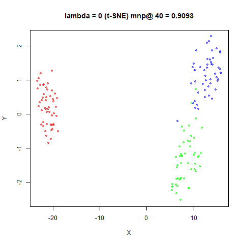|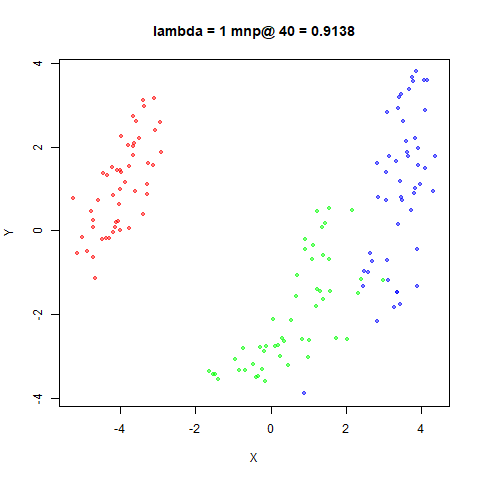
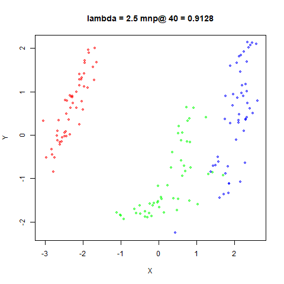|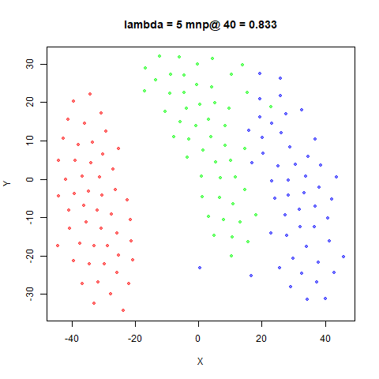
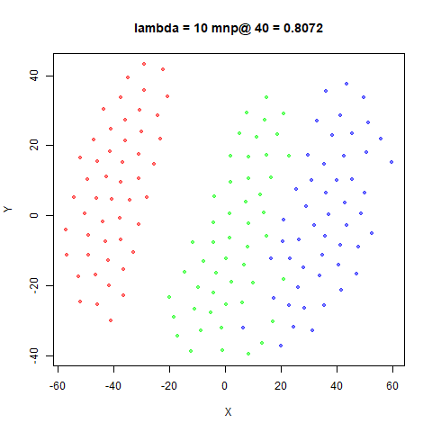|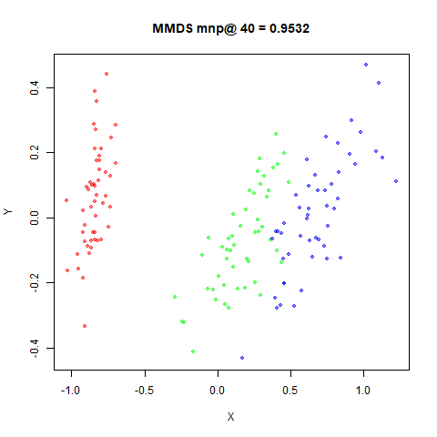

### s1k

|                             |                           |
:----------------------------:|:--------------------------:
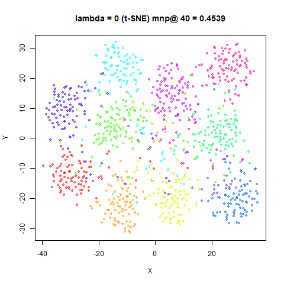|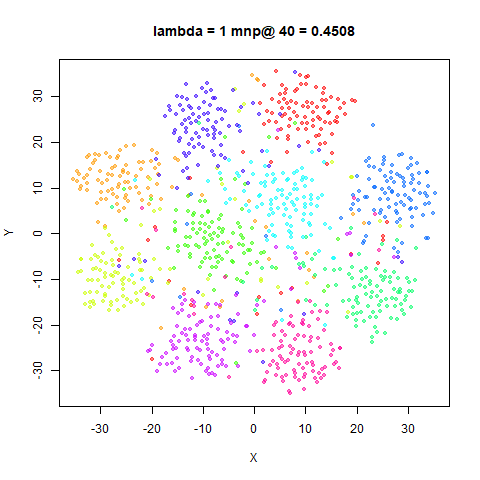
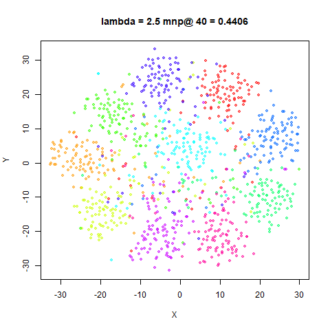|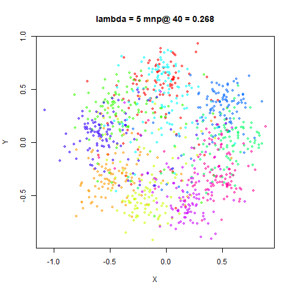
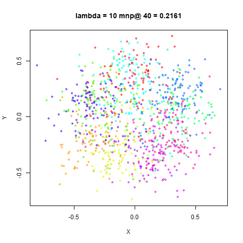|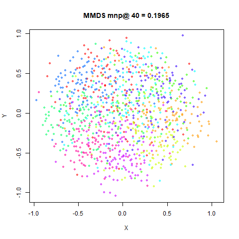

### oli

|                             |                           |
:----------------------------:|:--------------------------:
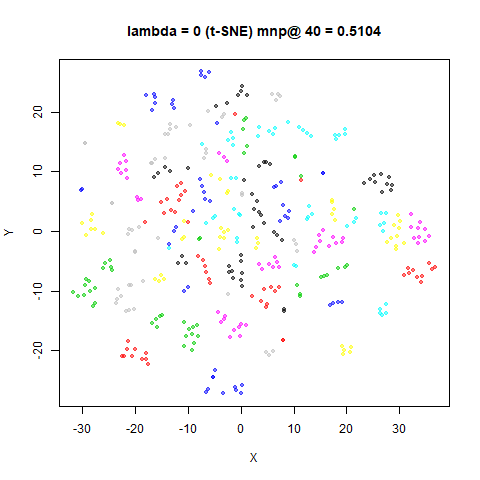|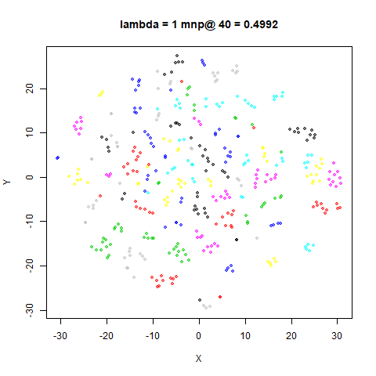
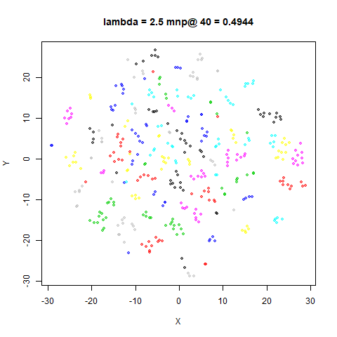|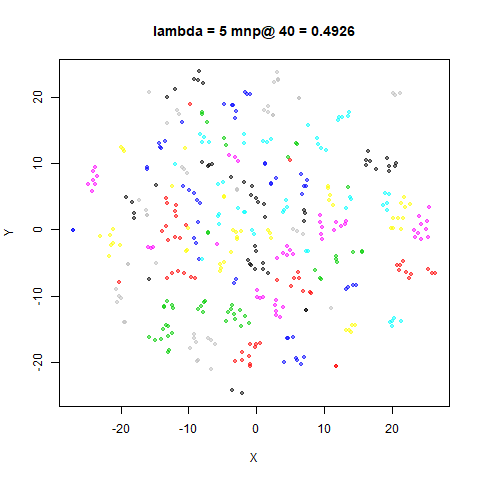
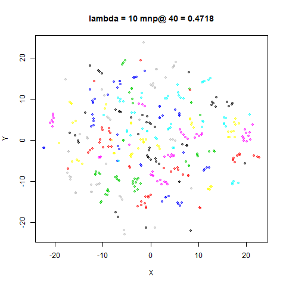|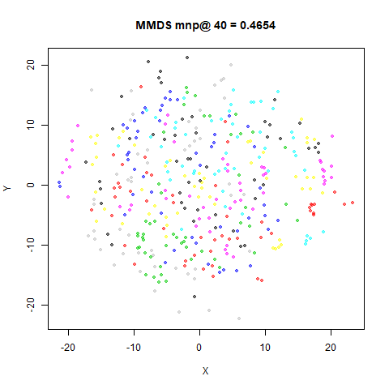

### frey

|                             |                           |
:----------------------------:|:--------------------------:
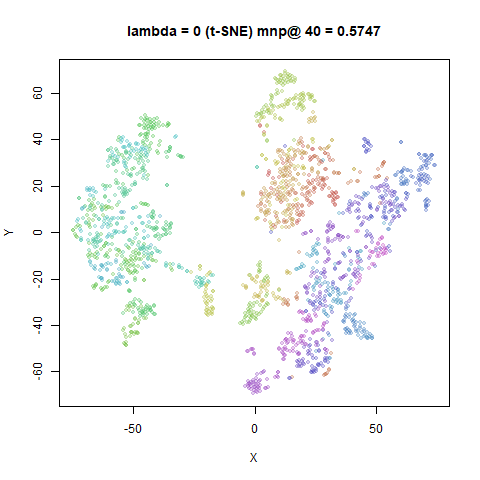|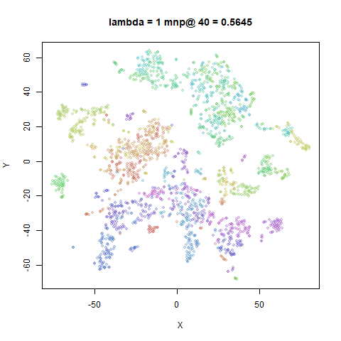
|
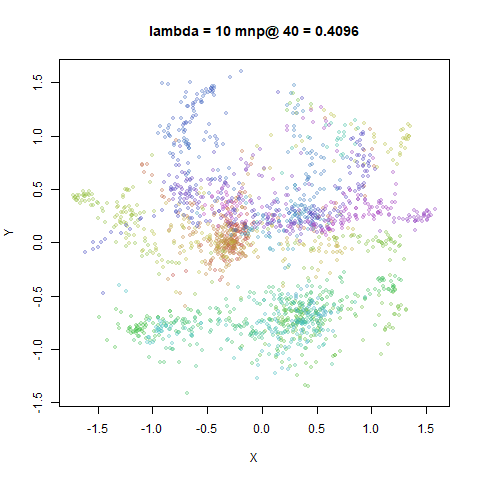|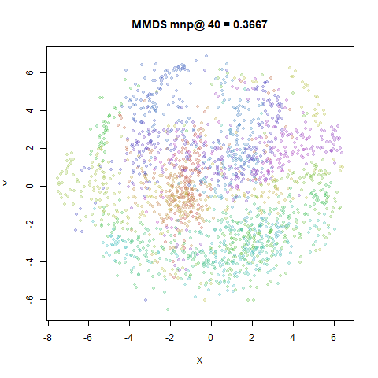

### coil20

|                             |                           |
:----------------------------:|:--------------------------:
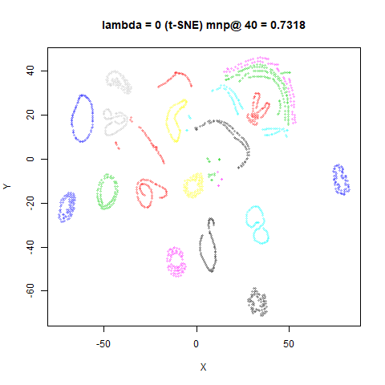|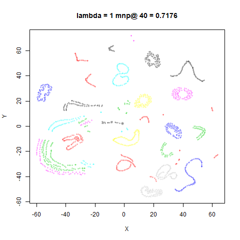
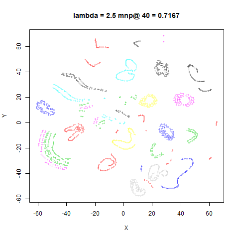|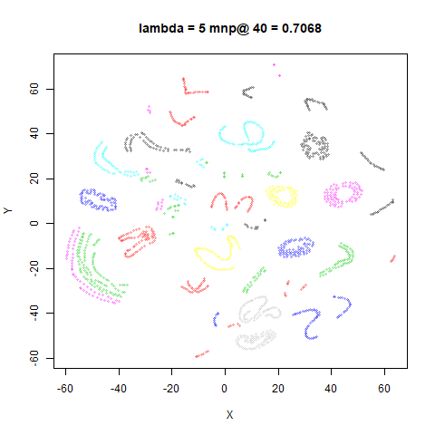
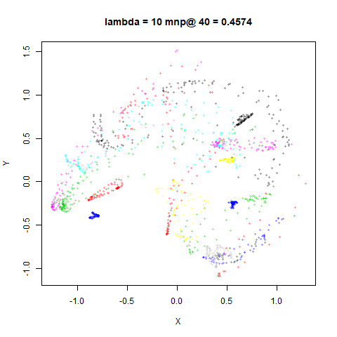|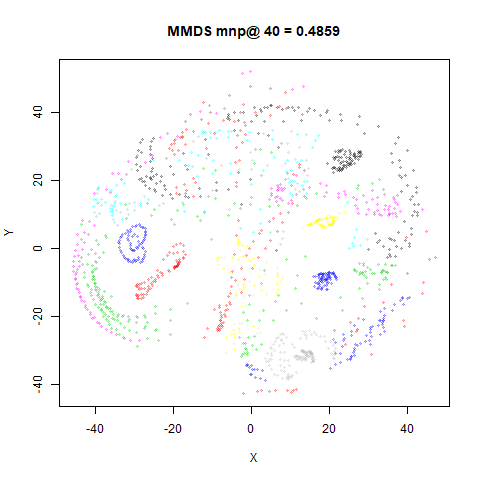

### mnist6k

|                             |                           |
:----------------------------:|:--------------------------:
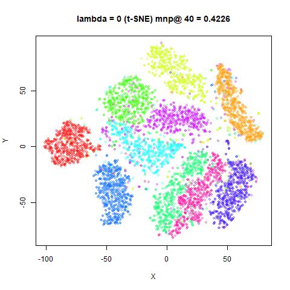|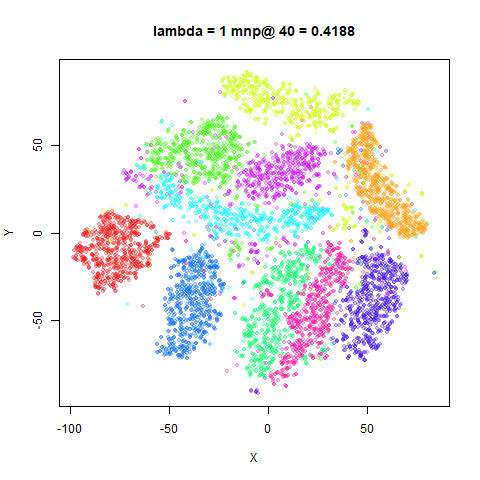
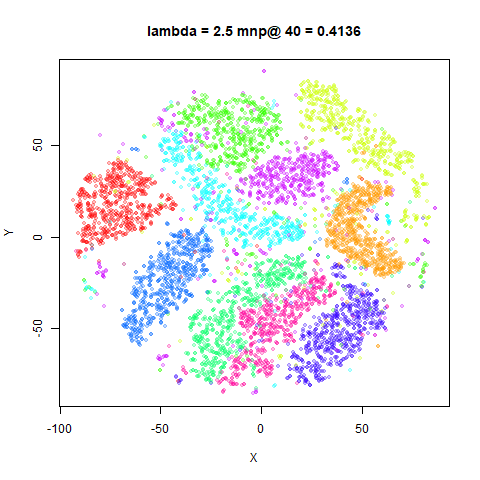|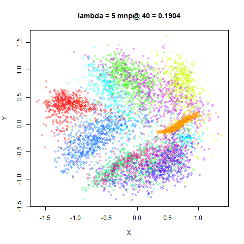
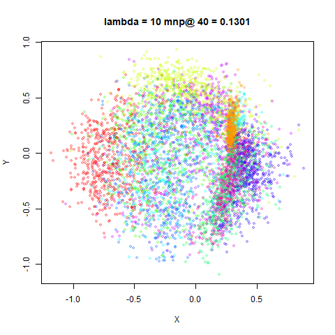|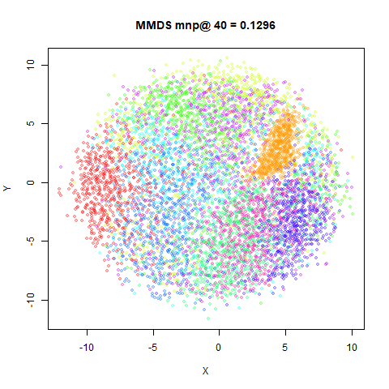

### fashion6k

|                             |                           |
:----------------------------:|:--------------------------:
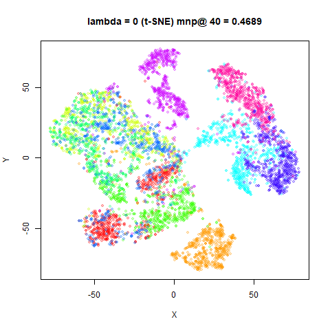|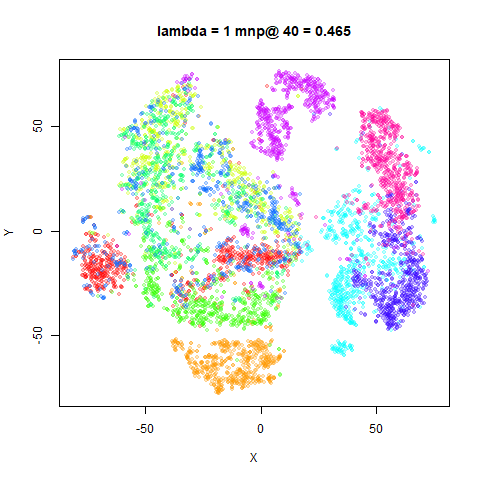
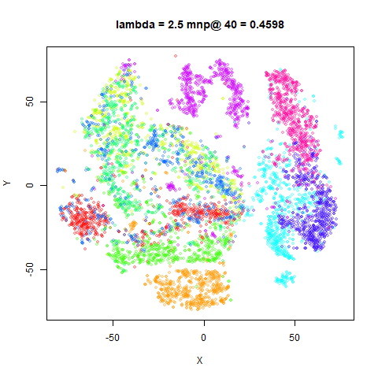|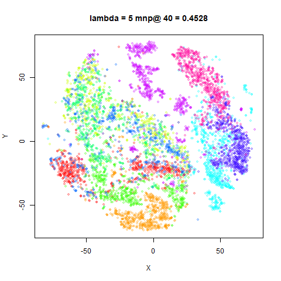
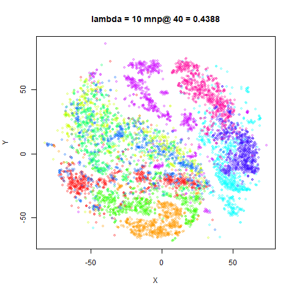|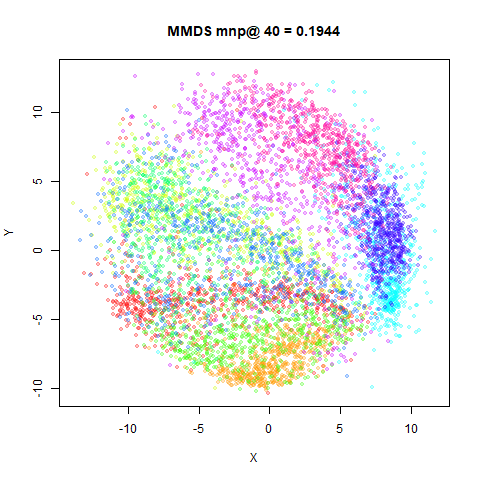

## Conclusions

Except for `iris`, it's clear that, in general, increasing $\lambda$ makes the
g-SNE progressively approach the sort of layout we'd expect with MMDS. I'm 
just not sure that I particularly like any of the intermediate results more
than just sticking with the t-SNE results. I think starting from the scaled PCA
initialization gives you a lot of the global layout you would want. `lambda`
values between 1 and 2.5 seem the best place to start exploring.

On the other hand, the authors use a 
[topological clique analysis involving Betti numbers](https://arxiv.org/abs/1502.06172) 
for some gene expression data and conclude that the g-SNE plot represents the
data better. Unfortunately, the plots are rather small, and for a second example
which required a value `lambda = 5` for optimal results, the plots aren't shown.

Up: [Documentation Home](https://jlmelville.github.io/smallvis/).
