See [part 1](https://jlmelville.github.io/smallvis/idp-theory.html) for some
theory, and [part 2](https://jlmelville.github.io/smallvis/idp.html) 
for the application of a global IDP in t-SNE.

## Introduction

We've see that the Intrinsic Dimensionality Perplexity does a decent job at
picking out a single global perplexity for t-SNE. But in the 
[previous discussion](https://jlmelville.github.io/smallvis/idp-theory.html),
we saw some hints that there might be multiple intrinsic dimensionalities 
lurking in some datasets (most notably, `coil20`) which would imply multiple
perplexities might produce better results in some cases. Locally-varying
perplexities is a suggestion raised in
[How to Use t-SNE Effectively](https://distill.pub/2016/misread-tsne/)
for reproducing global topologies, although this point is not pursued. The only
other approach I am aware of is in 
[multi-scale JSE](https://dx.doi.org/10.1016/j.neucom.2014.12.095) which avoids
the problem by applying multiple perplexities at once and averaging the
resulting probability matrices.

An obvious extension of the correlation dimension approach to generate different
perplexities, is to average the correlation dimension over subsets of the entire 
dataset.

## Global IDP

First, let's recap our current approach. For each point in the dataset, we
calculate the un-normalized input weight matrix, $\mathbf{V}$, which is
associated with a perplexity, $U$. From there the soft correlation dimension for
point $i$ and perplexity $U$, $D_{i, U}$, can be written as:

$$
\delta_{i, U} = \frac{2}{V_i}
\left\{
\sum_{j}^{N} v_{ij} \left[ \log \left( v_{ij} \right) \right] ^ 2
-\frac{1}{V_i} \left[ \sum_{j}^{N} v_{ij} \log \left( v_{ij} \right) \right]^2
\right\}
$$

where $N$ is the number of observations in the dataset, $v_{ij}$ is the element 
at $\mathbf{V}\left[i, j\right]$, and $V_{i}$ is the sum of the $i$th row of 
$\mathbf{V}$.

The correlation dimension associated with the entire dataset for the given 
perplexity is just the mean average of the individual estimates:

$$\hat{\delta}_{U} = \frac{1}{N} \sum_{i}^{N} \delta_{i,U}$$

The estimate of the intrinsic dimensionality, $D$, is the maximum value that the
correlation dimension attains as the perplexity is varied.

$$D = \max_{U} \hat{\delta}_U$$
The IDP is then:

$$
\DeclareMathOperator*{\argmax}{arg\,max}
IDP = \argmax_{U} \hat{\delta}_U
$$

## Class IDP

If we partition each observations of the dataset into classes, then the
correlation dimension for a class, $C$, can be defined as the average over the
observations in $C$:

$$\hat{\delta}_{C, U} = \frac{1}{\left\vert{C}\right\vert} \sum_{i \in C} \delta_{i,U}$$

We can then calculate intrinsic dimensionalities for each class and separate 
IDPs. Note that the definition of $\delta_{i,U}$ hasn't changed. We still
use the entire dataset to produce the desired perplexity, so the other parts
of the dataset still make their presence felt via $\delta_{i,U}$ even if they
aren't involved in the summation.

That's all very straightforward in principle. Practically, we need to:

1. Partition the dataset into classes. This is not necessarily easy, but is
a pretty generic problem. For the purposes of the rest of this discussion I propose that
we cheat. For a majority of the 
[datasets](https://jlmelville.github.io/smallvis/datasets.html) that I usually
study with `smallvis`, they have already been partitioned into classes, that
I use to color the output. For example, the `mnist` dataset has ten different
classes, based on the digit from 0 to 9 that they represent. And conceptually
it seems very appealing to be able to assign one perplexity to the `0`s and
a different perplexity to the `9`s and so on, to reflect the way they cluster
in the input space.
2. Have an implementation of the perplexity calibration routine that allows
for a vector of perplexities, one for each observation. 
[How to Use t-SNE Effectively](http://distill.pub/2016/misread-tsne/) notes
that there "may not be one perplexity value that will capture distances across 
all clusters", but laments that "sadly perplexity is a global parameter". UNTIL
NOW. Surprise! Yes, while I haven't documented this fact (except here), instead
of using a single value, you can provide a vector of perplexities to 
`smallvis`, one per point in the dataset. I added the feature entirely for this
work on intrinsic dimensionality, and it may be entirely useless.

Obviously, it's not desirable that looking at local perplexities defined in
this way can only work if the datasets have been pre-partitioned into 
convenient classes. The `frey` faces dataset for example, doesn't have any
classes associated with it, so we can't be use it. And one of the reasons to
do dimensionality reduction for the purposes of visualization is to uncover
the structure that would let us partition the data into classes in the first
place.

For now, we can acknowledge that we will want a better way of using the input
data itself to determine a suitable perplexity for a given observation, and see 
how well the pre-determined categories work, which may provide a rough guide
to how much improvement we can expect to see by deviating from a global 
perplexity. Dimensionalities and perplexities determined by this method will
be referred to as class dimensionality and class IDP.

We'll look at some class dimensionalities and t-SNE results after a not-so
brief detour.

## Local IDP

A blindingly obvious solution to the problem of how to partition the dataset is
to observe that the ultimate form of partitioning into classes would be to put
each point into its own class of one. Then there's no need to do any averaging:
every point gets its own perplexity associated with the maximum value of
$\delta_{i,U}$. I'll refer to these estimates as the local intrinsic
dimensionality and the local IDP.

Seems simple, but individual estimates of the correlation dimension are very
noisy, and the "soft" nature of the Gaussian means that edge effects are
prevalent.

### Gaussian

Rather than just take my word for it, let's visualize what the variability of
the local correlation dimension is like. Below are two plots for individual
points taken from a 1000-point 2D Gaussian. The left hand one is taken from the
center of the distribution, while the right hand one is taken from the edge:

| | |
|-------|--------|
|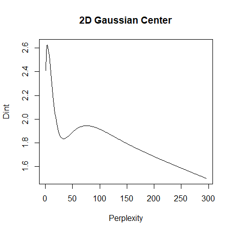|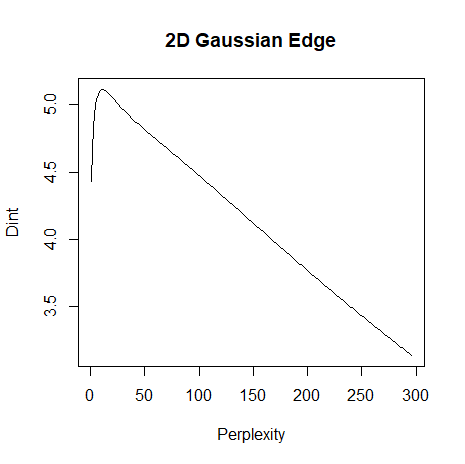|

Most obviously, the center point's plot shows a second maxima, which is just due
to the random distribution of points creating an anomalously dense region. The
maximum values of dimensionality are also clearly quite variable. The center
point reports a maximum intrinsic dimensionality of 2.63, at perplexity 8, while
the edge point reports a maximum intrinsic dimensionality of 5.12 at perplexity
15. This quite different from the result averaged over all the points, which
reports a dimensionality of 2.12 at perplexity 43. Clearly, we should treat
dimensionality curves (and their associated maximum and perplexities) with 
some caution.

To get a feel for how the dimensionality values vary across a dataset, here's a 
plot of the 2D Gaussian, with each point colored by its intrinsic dimensionality
at a perplexity of 43, which is the value that corresponded to the maximum
average dimensionality over all points:

| |
|-------|
|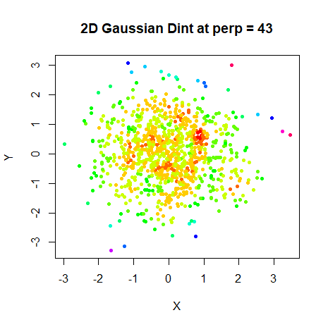|

Dimensionalities of around 1.2 are associated with the red points found in
clumps in the center. These tend to under-estimate the true intrinsic 
dimensionality. The blue and purple points correspond to high dimensionalities 
of 4-5.5. The yellow and green points are at around 2-2.5. So not only do we see
edge effects where the correlation dimension is too high, we can also expect
some areas of increased density in the middle of the plot to under-report the
correlation dimension. That's quite a lot of variance in the correlation 
dimension.

Suitably forewarned, let's go ahead and see what happens if we estimate the
intrinsic dimensionality for each point separately. Here's the same 2D Gaussian.
The plot on the left colors the points by their intrinsic dimensionality
estimate, and the plot on the right colors the points by the perplexity:

| | |
|-------|--------|
|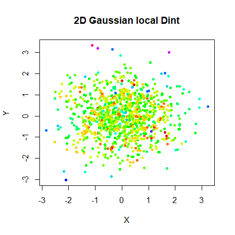|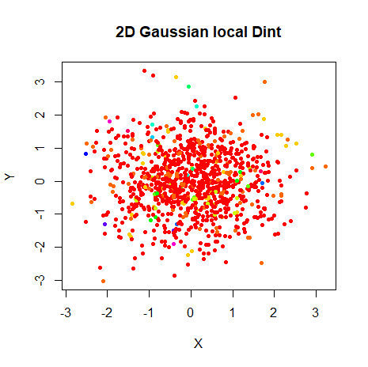|

For the left-hand (dimensionality) plot, the yellow indicates an intrinsic
dimensionality of around 1.5, green is around 2.3 while the blue and purple are
around 5-6, and again these occur at the edges of the distribution.

And what of the pointwise IDP values that result? On the right hand side plot,
we can see the vast majority of points are red, which are are low perplexities
of around 5-10, while the very few blue and purple points are around 100-120.
It's interesting that the very outlying points aren't the highest perplexity
points, but are around 15-30. So the edge effects do lead to an overestimate of
intrinsic dimensionality, but the effect on perplexity isn't quite as obvious.

Here's some plots of the relationship between the maximum intrinsic
dimensionality and the perplexity for the 2D Gaussian (on the left) and a 100D
Gaussian with 500 points (on the right), and then the same data as a histogram
of the distribution of IDPs:

| | |
|-------|--------|
|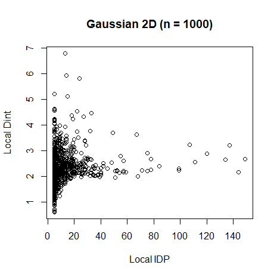|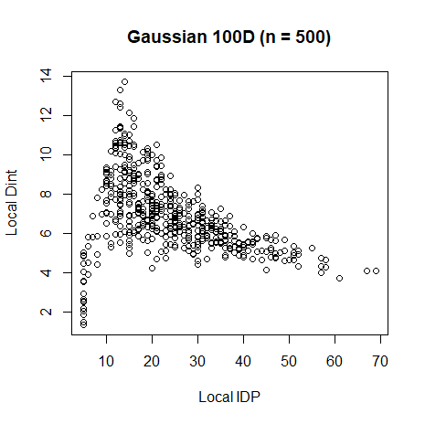|
|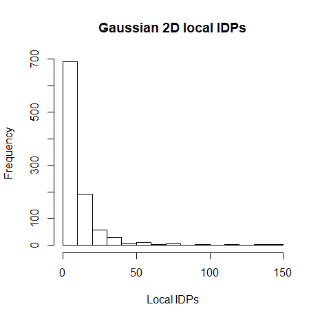|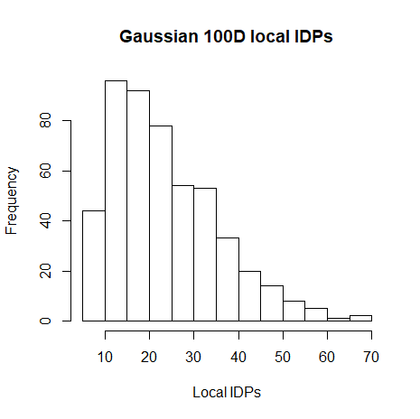|

There would seem to be a general inverse relationship between the intrinsic
dimensionality estimate and the perplexity, but also that low intrinsic 
dimensionalities can result in both high and low perplexities. 

Now let's see the effect of using multiple perplexities on the 100D Gaussian 
t-SNE result. Below on the left is the result that we first saw in the 
[previous discussion](https://jlmelville.github.io/smallvis/idp.html#2d,_5d,_10d_gaussian)
on a global IDP. On the right is result of using the local IDPs. 
Points are colored by perplexity:

| | |
|-------|------|
||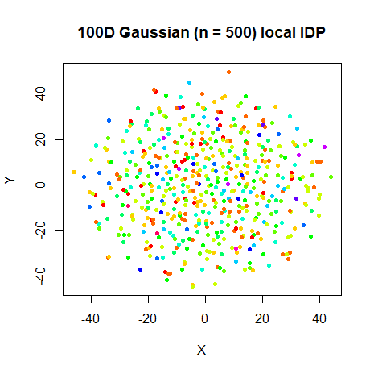|

The points are colored by the perplexity that was chosen for them. Red points
indicate a perplexity of around 5, and the dark blue and purple points show
a perplexity of 45-60. The overall shape isn't changed, but the pattern of
perplexities doesn't show the same structure as for the 2D Gaussian. Hardly
surprising, as we would expect to see this squashing of points that belong on
the edge of a high-dimensional Gaussian ending up elsewhere in 2D where there is
much less space.

In the high-dimensional Gaussian case then, the use of local IDPs hasn't had
much effect. Time for a more visually distinct test case.

### Swiss Roll

The Swiss Roll was well-characterized by the 
[global IDP](https://jlmelville.github.io/smallvis/idp.html#swiss_roll), with the
2D and 3Dish nature of the data being clearly indicated by two maxima on the
dimension plot. 

Let's see what the local dimensionalities and IDPs look like projected onto the unrolled Swiss Roll.
I unrolled this using 
[Geodesic MMDS](https://jlmelville.github.io/smallvis/mmds.html) with `k = 11`,
which is the value of the IDP, and it worked very well. 

| | |
|-------|--------|
|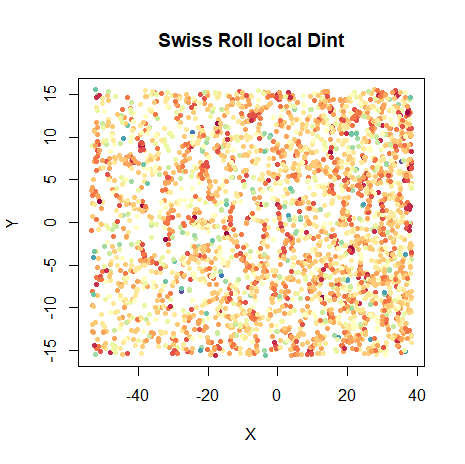|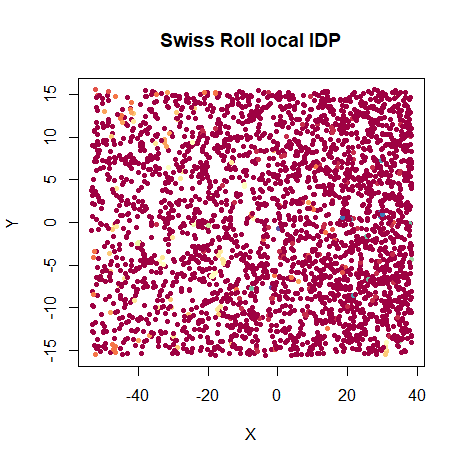|

The color scheme for the left hand plot is the "Spectral" 
[ColorBrewer](http://colorbrewer2.org) palette.

The left-hand side of the plots are the points that used to be on the outside of
the Roll and the right-hand side are the points that were originally in the
center of the roll.

For the intrinsic dimensionality plot, the red points show dimensionalities of
around 1. The orange and yellow points are closer to 1.5-3. There are a few
blue point with a dimensionality of around 4-4.2 (light blue). 

For the right hand plot the IDPs are remarkably uniform. The dark red indicates
perplexities of around 5-15 which is around the global IDP of 11 that did quite
well in unfolding the Swiss Roll. There are a few orange and blue points with anomalously
high perplexities of around 100-130 and 250-300 respectively, but they are
quite hard to pick out. As the histogram of the local IDP values below shows,
the majority of the IDPs are very low (the median IDP is 6):

||
|---|
|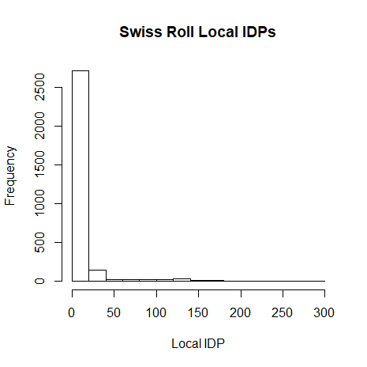|

Why are some of the IDPs anomalously high? Heres a local correlation dimension
plot for a point on the Swiss Roll which has a local IDP of 233:

| | |
|-------|--------|
|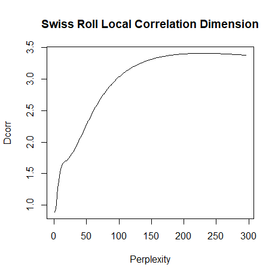|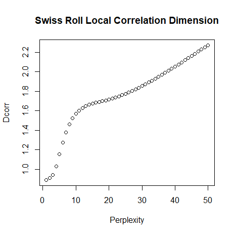|

The left hand plot shows the plot over the full range and we can see that there
is a maximum out at perplexity 233, but there's also some indication of a
lower-perplexity maximum that we would usually associate with the unfolded roll.
The right hand plot shows a zoomed-in view on that region with the actual
calculated values plotted as points. Unfortunately, even though there's a region
where the increase in correlation dimension levels out, there's no strict
maximum there.

There aren't that many of these points with erroneously large perplexities,
though. Perhaps we can just get away with it? Let's see how well ASNE (which is
more suitable than t-SNE for the low-dimensional Swiss Roll) does with these
perplexities. Will we get any unrolling? Apart from the perplexities, we'll use
the same settings that got reasonable results with a global perplexity of 11.

||
|---|
|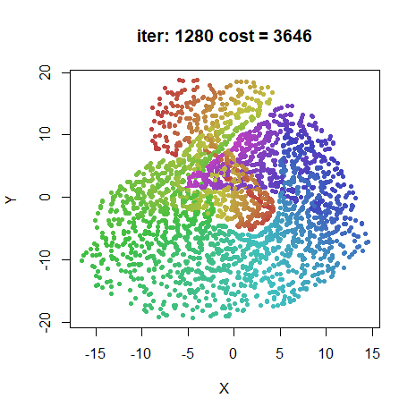|

Oh dear. There's some unfolding apparent, but clearly the larger perplexities
have introduced enough long range structure to see the roll beginning to fold.
That is enough evidence for now that local IDPs that are based on per-point
estimates of intrinsic dimensionality aren't reliable. For now we'll turn our 
attention to per-class correlation dimensions that can take advantage of
averaging to ameliorate edge effects.

## Class IDP: Synthetic Data

Time to look at some datasets where we can calculate the class IDP. Only a
couple of the synthetic data sets can be split into classes that provide
something interesting. We won't look at the linked ring data from the previous
discussion, for example, because although they consist of two separate rings
(and hence two classes), they are identical objects in identical environments,
so the class dimensionality plots are identical to the full dimensionality plot.

In the following dimensionality plots, the specific dimensionality belonging to
a class or cluster will have its line colored according to the color of the
cluster in any PCA or t-SNE plot of the data itself. The original entire-dataset
result is also shown in black and is the same as the one presented in the
dimensionality plots in the
[previous part](https://jlmelville.github.io/smallvis/idp.html) of this 
discussion. I've thickened the colored lines that represent new results to stand
out more.

### Subset Clusters

The subset clusters dataset 
from [How to Use t-SNE Effectively](http://distill.pub/2016/misread-tsne/) 
consists of two super-imposed Gaussian distributions, but one has a much smaller
standard deviation than the other (50 times smaller). t-SNE tends to reduce
the disparity in the spread of the clusters. Below on the left is the PCA of
the dataset, which clearly shows that the blue cluster is the small one and
the yellow cluster is the big one. On the right is the class dimensionality plot.

| | |
|-------|-------|
|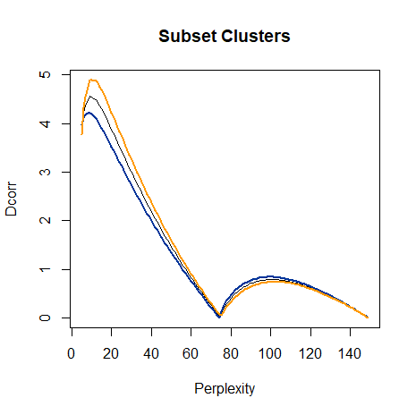|

Despite the different in spread, the individual dimensionalities are very
similar. The larger yellow cluster has a class IDP of 9, while the smaller blue
cluster has a class IDP of 8. The global IDP is 9, so this dataset doesn't seem
to indicate any requirement to use non-global perplexities. Instead, I refer you
to the
[global IDP result](https://jlmelville.github.io/smallvis/idp.html#subset_clusters).

### Two Clusters

Consider two 100D Gaussians of 600 points each, shown here via PCA:

| |
|-------|
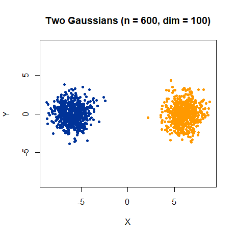|

As shown here, they are separated by 12 distance units. Probably at that
separation, for typical perplexities, the two clusters don't "sense" each 
other's presence. I would expect that the class dimensionality plot and class
IDP would match the result of looking at either Gaussian in isolation.

But as we reduce the inter-cluster separation, and the overlap increases,
we would expect to see some changes to the dimensionality and the resulting IDP.
Below is a plot of the yellow cluster's class dimensionalities as the separation
increases from 1(red curve) to 12 (violet). Intermediate distances are shown
in intermediate rainbow colors.

| |
|-------|
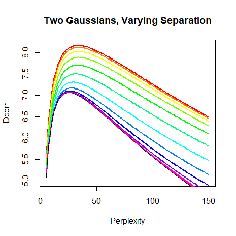|

The dimensionality plot for the yellow Gaussian cluster on its own is shown as a
thin black line. It's hard to see because it is effectively coincident with the
separation 12 (violet) curve. At separation 12, the Gaussians are independent of
each other and the dimensionality plot is not affected by the presence of the
other cluster. But at lower separations, we start to see the dimensionality
curve show an increase in the correlation dimension estimate. The discussion of
the [linked rings](https://jlmelville.github.io/smallvis/idp.html#linked_rings)
data in the previous discussion showed a similar effect.

The class IDP is also affected by the presence of the other cluster. Here's a
plot of how the class IDP is affected by separation, with the filled circles
colored using the same colors as the curves in the dimensionality plot:

| |
|-------|
|

The overall trend is clear: as the separation between clusters decreases, the
class IDP becomes inflated compared to the value that would be obtained if
we carried out the perplexity calculations on the cluster in isolation. The
increase in CIDP for separations 3-4 compared to 1-2 is probably just noise
and can be ignored: the same results (but without the increase in class IDP)
are seen for the blue cluster.

A similar trend is seen if the 100D Gaussians are replaced with 10D Gaussians,
the only difference being that the separation at which the clusters stop 
affecting the CIDP is lower.

The effect isn't massive on this dataset, but the take-away here is that even in
this simple case of two Gaussian clusters, the presence of other data can affect
the class IDP. With real datasets, we should expect overlap involving multiple
clusters, and the class IDP values will therefore likely be larger than is
optimal.

### Three Clusters

As mentioned in the previous discussion on 
[global IDP](https://jlmelville.github.io/smallvis/idp.html) and
[elsewhere](https://jlmelville.github.io/smallvis/three-clusters.html), the 
three clusters example in 
[How to Use t-SNE Effectively](http://distill.pub/2016/misread-tsne/) is an 
interesting dataset because despite its simplicity (three Gaussian clusters in
a line, two close together, one relatively distant), there isn't a choice of
perplexity that reproduces the global topology without distorting the Gaussian
shapes of the individual clusters. The discussion in "How to Use t-SNE 
Effectively" suggests that a solution to the problem might be found in 
non-global perplexities.

I don't know if that's really the problem with the three clusters, but we could
look to see if the class intrinsic dimensionalities are very different from the
global versions.

Below on the left is the PCA of the three clusters as a reminder of the basic
layout of the data (although the Gaussians are 50-dimensional). On the right
are the class dimensionalities. 

| | |
|-------|------|
|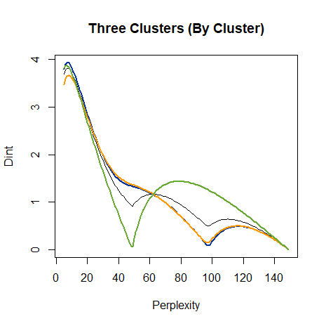|

Not much changes at low perplexity. Even the blue and yellow cluster aren't
close enough to perturb each other very much. The yellow cluster values suggest
that the class IDP for that cluster is 8, while the other two still suggest a
value of 7. So the only change that splitting the global dimensionality into
per-class contributions achieves is that for one-third of the dataset only, the
IDP is one higher than it would be otherwise. 

Here are the t-SNE results using the class IDP, which I display to save you
the effort of having to go and look at the t-SNE results in the previous 
discussion.

| |
|-------|
|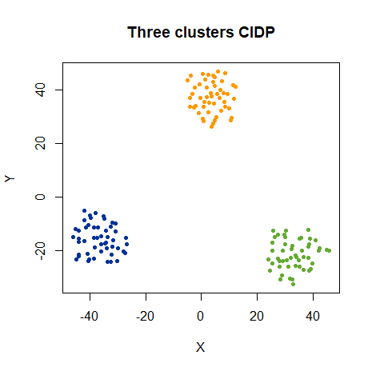|

Unsurprisingly, we get the results that are pretty much indistiniguishable from
if we had used a perplexity of 7 for all of the clusters.

At least if we take a look at the class dimensionality curves over the entire
perplexity range plotted, we can see that the blue and yellow clusters are in a
much more similar environment than the green one. This at least roughly accords
with what we would expect, although no curve shows unambigious evidence of three
clusters. The blue and yellow clusters have a "shoulder" at around perplexity 60
that is the other cluster, with the green cluster providing another maximum at
perplexity 120. The green cluster is sufficiently distant from the blue and
yellow clusters that they appear as a single broad distribution with a maximum
at perplexity of around 80.

Does some combination of these other perplexities, corresponding to other
maxima (or even the minima) yield the magical combination of perplexities that
produces the "correct" layout? Sadly, the answer is no, but in a way that's
a relief. In more realistic datasets, with overlapping clusters of different
sizes, dimensionality and spread, we aren't likely to see useful structure
at higher perplexity anyway.

At this point, I am about ready to throw the towel in on the three clusters and
t-SNE, at least from the point of view of reproducing the global structure. I
don't think the problem is necessarily due to a global perplexity, anyway.

## Class IDP: Real Data

Onto some real datasets. For each dataset there will be four plots, two 
dimensionality plots and two t-SNE plots. The left hand version of each image
s the results from using the global IDP, and are the same
images used in the 
[previous discussion](https://jlmelville.github.io/smallvis/idp.html). They're
here for comparison with the right-hand images, which are all-new and use the
class IDPs determined from the class dimensionality plots. As with the synthetic
datasets, the color of the lines in the dimensionality plots matches the color
of the cluster in the t-SNE plot.

Some of the datasets (`oli` and `coil20` for instance) contain a large number
of different classes, so the class dimensionality plots get pretty busy. I don't
expect them to have much quantitative value, but by peering at different lines
you should be able to get some sense of how much variation there is in the
IDP between different classes.
 
### iris

| | |
|-------|-------|
||

There's an almost uncanny resemblance to the synthetic three clusters data set
dimensionality plot, we discussed above, although both datasets do consist of
three equal sized clusters so maybe I need to recalibrate my sense of the
uncanny. And like the synthetic three clusters, the class IDPs do not differ
very much from the global IDP. Data in the `setosa` (red) and `versicolor` (green) 
clusters still get a perplexity of 5, but a perplexity of 7 is found for 
`virginica` (blue). Unsurprisingly, this has a minimal impact on the t-SNE
results:

| | |
|-------|-------|
|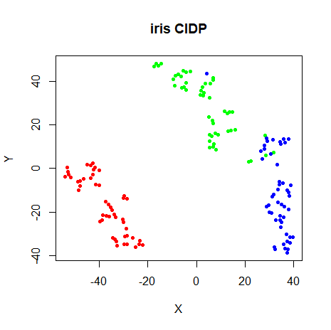|

### s1k

| | |
|-------|-------|
|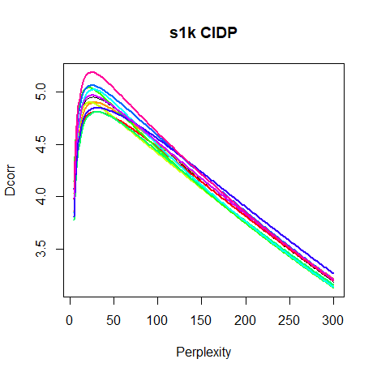|

I didn't expect to see much difference between the 10 clusters in `s1k`: they
are pretty much identical in terms of composition, spread and relative distance.
So it's not to suprising that their dimensionality curves are quite similar. The
recommended global perplexity for this dataset is `26`, while the per-cluster
perplexities range from `22` to `31`.

| | |
|-------|-------|
|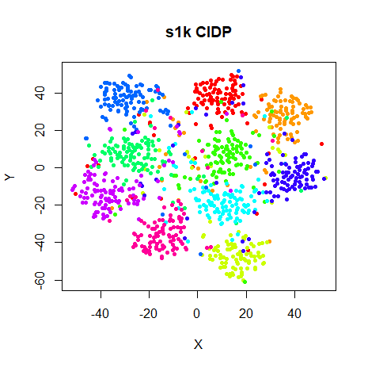|

I would be hard-pressed to describe either of these plots as better than the
other. We can at least say that the CIDP approach doesn't do any major violence to the result.

### oli

The Olivetti faces contain 40 different classes. There's no good way to show
40 different curves, so let's just take a deep breath and get through this
together:

| | |
|-------|-------|
|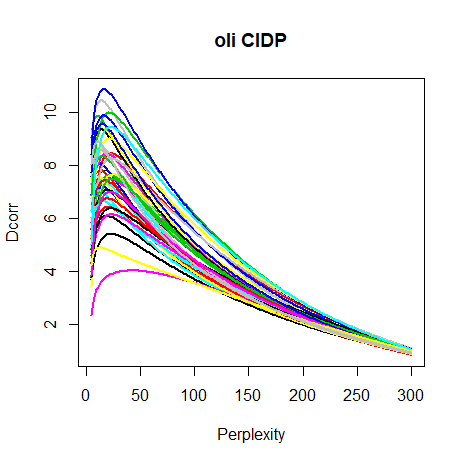|

I won't be getting a Christmas card from the Society for Intelligible Images
for this one. But there is a bit of an indication that the different sets of
faces show different dimensionalities: compare the bottom three curves (in 
purple, yellow and black) with the top blue curve for example. And intriguingly
there is an interesting spread of perplexities: between 11-22, except for face
number 22, where a perplexity of 42 is suggested. The average over the entire
dataset is 17. 

| | |
|-------|-------|
|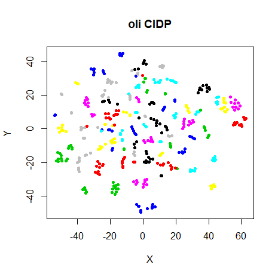|

The perplexity = 17 result gives a perfectly good visualization. And so does
the per-category result, to the extent that it's quite hard to spot any 
meaningful differences between the two.

### coil20

The COIL-20 dataset is my great hope for the utility of class IDP because it 
was the only one from the previous look at global IDP where the dimensionality
plot suggested there was some extra structure that was obscured by averaging
over the entire dataset, as you can see from the plot below on the left. 
The plot on the right shows the class dimensionalities:

| | |
|-------|-------|
|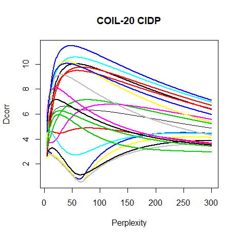|

The class dimensionality curves are not as hard to distinguish as with the `oli`
dataset and do seem to show quite a spread of intrinsic dimensionalities. And
even more so than `oli`, the different classes do seem to have quite a spread of
IDP: from 6 to 77. Surely, this would be one dataset where using different
perplexities would help?

| | |
|-------|-------|
|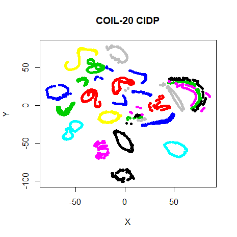|

Results are at least different for CIDP, but I wouldn't call it better. Based
on the discussion of the effect of separation in the "Two Gaussians" section,
this seems like a very likely candidate for a case where the CIDP values have
been inflated by the presence of multiple overlapping clusters. And with the
COIL-20 clusters having an obvious ring-like structure, the distoring effect is
particularly obvious.

### mnist

The global IDP for `mnist6k` was an unusually large value of 115. Are all the 
CIDPs similarly large?

| | |
|-------|-------|
|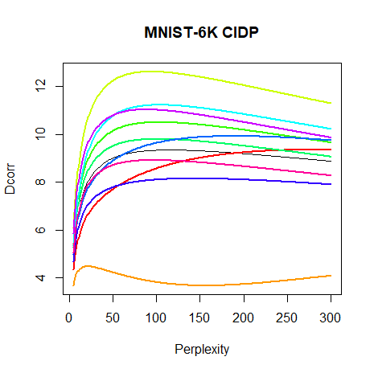|

All except the `1` class (the orange cluster on the right hand side of the t-SNE
plots) have IDPs substantially larger than the usual high end value of 50.
The `1` cluster has an IDP of 21. The next largest is the `8` cluster (purple
cluster top-middle) at a perplexity of 88, a big jump. The largest CIDP is for
the `0` cluster (red cluster on the left of the plot) which has an IDP of 287.
I detect no particular relationship between the CIDP values and the location or
shape of the clusters in the t-SNE plot. Anyway, let's see what happens when
the CIDP values are used in t-SNE:

| | |
|-------|-------|
|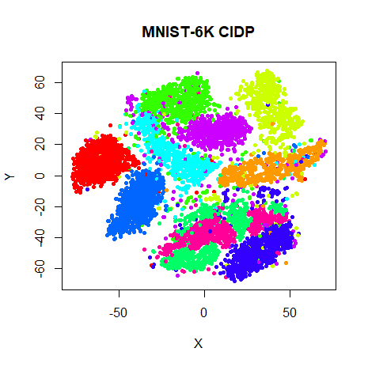|

Again, no huge difference, but I think I prefer the GIDP version.

### fashion

`fashion6k` showed a much smaller GIDP than `mnist6k`. I expect the same trend
for the CIDPs:

| | |
|-------|-------|
|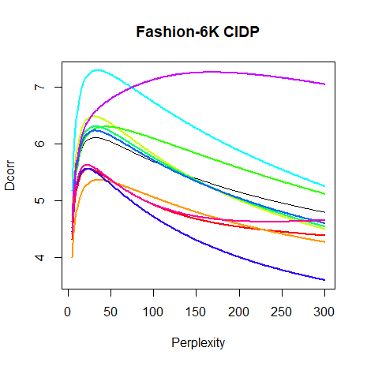|

On a per-category basis, most of the categories also have typical perplexities
suggested, ranging from 22 to 44. Class 8 (the 'bag' class, the top purple
cluster in the plots below) is the one outlier, where the maximum dimensionality
corresponds with a perplexity of 168. It's normally well-separated from the
other classes, although class 1 ('trouser', the orange cluster at the bottom) is
also well separated, but it has a perplexity of 36.

| | |
|-------|-------|
||

## Class IDP: Conclusions

After looking at [global IDP](https://jlmelville.github.io/smallvis/idp.html),
I was vaguely optimistic about its use, but thought that looking at non-global
perplexities would improve matters further. This has turned out not be the case
at all. At least using the method here, which I already considered to be a
best-case scenario and not a practical solution, at best things didn't change
much, and at worst, the t-SNE results got a bit messier. I don't rule out the
possibility that non-global perplexities are useful in t-SNE, it just doesn't
seem that class IDP values are the way to get there.

Probably the presence of the other clusters, "sensed" through the perplexity 
calculation, as noted in the "Two Gaussians" results, has distorted the IDP 
values and made them too large, encouraging overlap of different clusters.

## Subset IDPs

A way to cure the problem of overlapping clusters inflating the IDP is to split
the dataset into classes before carrying out the correlation dimension 
calculation. A normal global IDP calculation can then be carried out per class.
To differentiate between the class IDP and this one, I am arbitrarily dubbing
this method "Subset IDP".

We could write out all the equations again, but really thinking of it as
splitting the datasets into independent subsets, and calculating the global IDP
for each subset is the easiest way to think of it.

Below, we'll compare the class IDP plots with the subset IDP plots, and the
resulting t-SNE plots.

### iris

| | |
|-------|-------|
|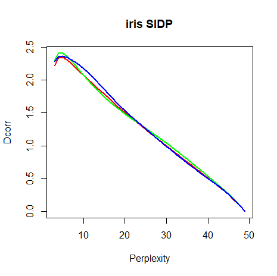|
|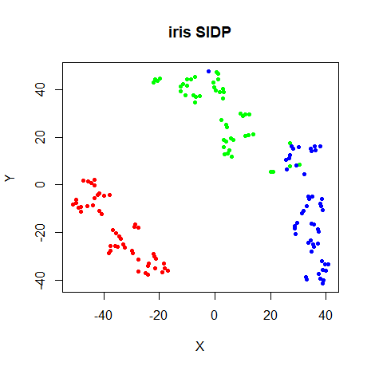|

The `iris` clusters are sufficiently separated that the subset IDP doesn't
have much effect compared to the class IDP. A perplexity of 5 for is suggested
for all species, whereas the class IDP suggested a class IDP of 7 for virginica
(the blue cluster). As a result the t-SNE results are very similar.

### s1k

| | |
|-------|-------|
|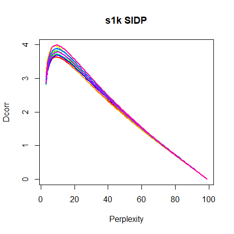|
|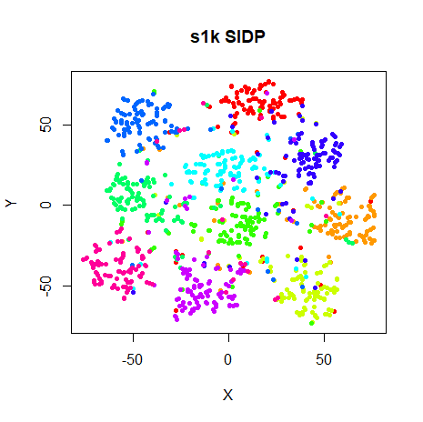|

Subset IDPs for `s1k` are Perplexity of 8-10, much reduced from the 22-31 range
with class IDPs. No huge effect on the t-SNE results, although the SIDP results
show clusters with slightly less uniform distribution, which is to be expected
with lower perplexities.

### oli

| | |
|-------|-------|
|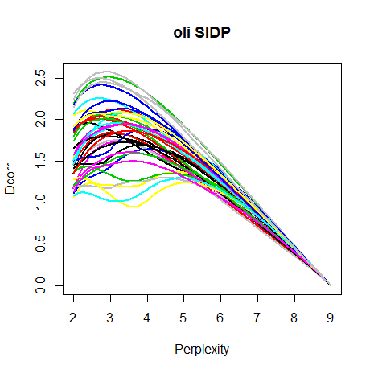|
|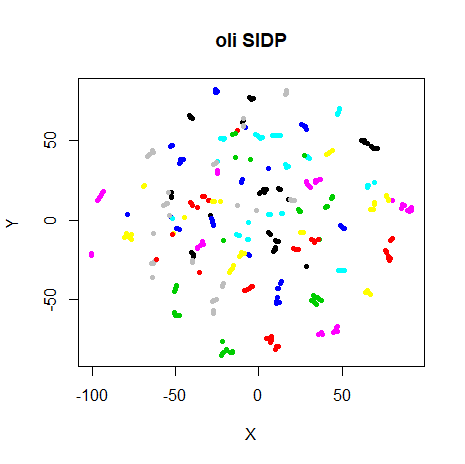|

The structure of `oli` is that there are 40 different faces with 10 images per
face. So there are 40 classes with only 10 members for class. Hence the
perplexity can't higher than 9. Whereas for other datasets it's reasonable to
only look at integral perplexities, for `oli`, I looked at increments of 0.1.
The range of SIDP was 2.2-4.1, a good deal less than the class IDP range of
11-42. The effect on the t-SNE plot is quite interesting. The overall shape is
still the same, but the clusters look a lot more compressed.

### coil20

| | |
|-------|-------|
|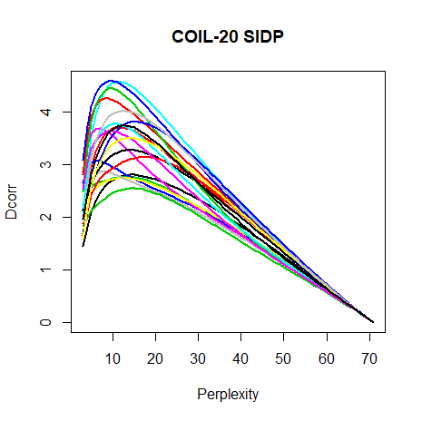|
|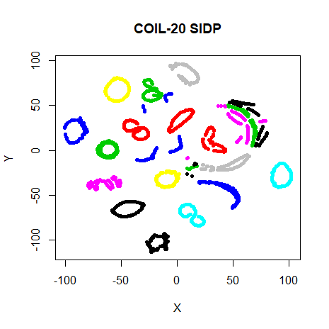|

The subset IDPs range from 6-17, much reduced from the class IDP results, which
ranged from 6-77. The reduced perplexity definitely helps with the t-SNE
results, where more of the clusters retain a circular shape and the overall
layout looks neater.

### mnist

| | |
|-------|-------|
|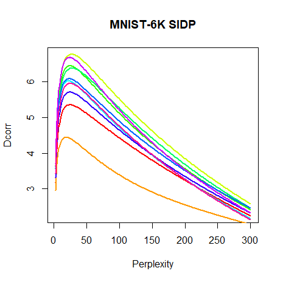|
|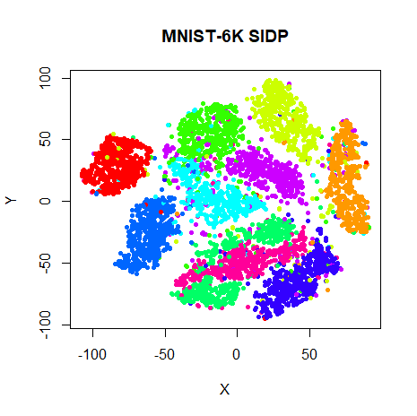|

Subset IDPs tange from 19-28. The `1` class still has the lowest perplexity of
all the digits, but the `0` class, which had a class IDP of over 200, has a much
more reasonable subset IDP of 25. The t-SNE results aren't hugely affected, but
the mixing of the `4` (green) and `9` (purple) clusters at the bottom of the
plot might be slightly preferred with the SIDP result.

### fashion

| | |
|-------|-------|
|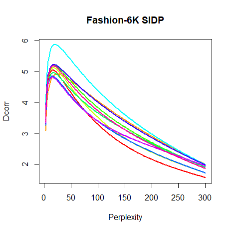|
|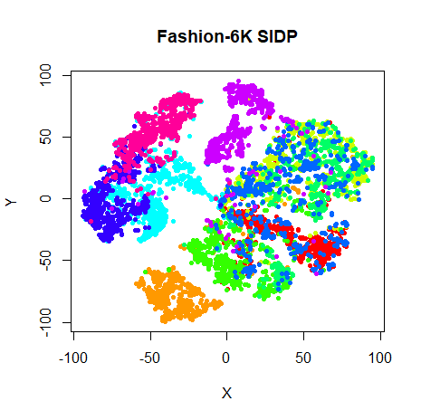|

Subset IDPs range from 15-25. The class IDPs for `fashion6k` were all fairly
reasonable (between 22-44), except for, class `8` (the bag class, purple cluster
top center of t-SNE plot), which had an anomalously high CIDP (compared to the
other classes) of 168. Using SIDP, it's the cluster with the lowest perplexity
of 15. I mildly prefer the SIDP t-SNE plot, mainly because class `0`
(representing T-shirts/tops, the red cluster on the right) is more contiguous.

## Conclusions

In a lot of cases, the subset IDPs improve over class IDPs, although comparison
with the 
[global IDP results](https://jlmelville.github.io/smallvis/idp.html#results:_real_datasets) 
suggests only marginal improvements: the `coil20` and `fashion` results seem
to benefit from the SIDP treatement. For the smaller datasets (particularly,
`iris` and `oli` and perhaps `s1k`), the perplexities are a little low based on
looking at the t-SNE plot. This can be ameliorated by using a different output
weight, as in
[heavy-tailed SSNE](https://jlmelville.github.io/smallvis/hssne.html), at the 
cost of speed.

The requirement to partition the dataset into classes before applying t-SNE is
an annoyance that limits the usefulness of both SIDP and CIDP. It would be much
nicer if the input weight matrices available for each perplexity could be used
for clustering the data, although if the number of clusters had to be specified,
that would just be swapping one manually-chosen parameter for another.

The use of local IDPs would get around all that, but as we've seen, the raw 
values are noisy, even in simple synthetic data like the Swiss Roll. Averaging
using k-nearest neighbors (where k could be related to the perplexity) might
help here, but my initial experiments showed that for the Swiss Roll, k had to
be a significant proportion of the dataset (around 10%) around points that 
where the effect of random clumping produced anomalously large perplexities that
were the root cause of the folding of the roll.

I don't rule out the value of non-global perplexities (although I grow more 
skeptical of them helping with the three clusters dataset), but it would seem
from all of the results we've looked at here, that an approach rooted in
intrinsic dimensionality  will need some modifications to provide a consistent
improvement.
