## Random Initialization

The usual initialization routine for t-SNE is to start from a small random
gaussian distribution, and use "early exaggeration" for the first 100 or so 
iterations where the input probabilities are multiplied by 4 (these settings
are modified slightly for the larger datasets used by Barnes-Hut t-SNE, which
are currently too large for `smallvis` to handle).

The down side of using a random initialization is repeatability: even if you use
a fixed seed, I'm not sure there's a guarantee that you get the same results
across architectures, e.g. Windows and Linux. There's also the issue of
variability: what if the results you get aren't very good due to dumb luck? You
can re-run the routine a fixed number of times via `smallvis_rep`, which will
return the result with the smallest error, but that increases the run time
significantly.

## Other Initialization Options

There are two alternatives available in `smallvis`: the first one is to use
the first two principal components from PCA on the input data, rescaled to have
the same standard deviation as the gaussian distribution from the random 
initialization (`0.0001`). This prevents large initial distances (which can 
happen if the input data isn't scaled) which in turn can lead to small gradients
and premature convergence. Do we need to use early exaggeration with a PCA-based
initialization? Hard to say, so we should try it both ways.

Another possibility is to use a spectral embedding of some kind. `smallvis` uses
the [Laplacian Eigenmap](https://doi.org/10.1162/089976603321780317) technique. 
[Linderman and Steinerberger](https://arxiv.org/abs/1706.02582) have shown that
the early exaggeration method, by up-weighting the attractive part of the t-SNE
gradient, approaches a spectral embedding. This is also the initialization used
in [UMAP](https://github.com/lmcinnes/umap), although a different form of the 
normalized graph Laplacian is used. It probably doesn't matter all that much.
If the theory about the equivalence of spectral embedding and early exaggeration
is correct, we don't need to use early exaggeration with a spectral 
initialization.

## The experiment

Based on the above, we'll consider four different initialization methods below:

* Random initialization, choosing the result with the lowest error from ten runs.
* Laplacian Eigenmap.
* Scaled PCA.
* Scaled PCA with early exaggeration.

## Datasets

See the [Datasets](https://jlmelville.github.io/smallvis/datasets.html) page.

## Settings

Results below were generated using the following commands (exemplified by the
`iris` dataset):

```
# Random (Best of 10)
tsne_iris_rxr <- smallvis_rep(nrep = 10, iris, method = "tsne", perplexity = 40, eta = 100, max_iter = 1000, verbose = TRUE, Y_init = "spca", scale = FALSE, ret_extra = c("dx", "dy"), exaggeration_factor = 4)

# Laplacian Eigenmap
tsne_iris_lap <- smallvis(iris, method = "tsne", perplexity = 40, eta = 100, max_iter = 1000, verbose = TRUE, Y_init = "lap", scale = FALSE, ret_extra = c("dx", "dy"))

# Scaled PCA
tsne_iris_s <- smallvis(iris, method = "tsne", perplexity = 40, eta = 100, max_iter = 1000, verbose = TRUE, Y_init = "spca", scale = FALSE, ret_extra = c("dx", "dy"))

# Scaled PCA with early exaggeration
tsne_iris_sx <- smallvis(iris, method = "tsne", perplexity = 40, eta = 100, max_iter = 1000, verbose = TRUE, Y_init = "spca", scale = FALSE, ret_extra = c("dx", "dy"), exaggeration_factor = 4)
```

Other settings, such as initial learning rate, number of iterations and perplexity,
are those taken from the 
[original t-SNE paper](http://www.jmlr.org/papers/v9/vandermaaten08a.html). Unlike
the results presented there, no scaling of the input data or any initial 
dimensionality reduction via PCA was carried out.

In the images below results marked with `rand` are for the best of 10 random 
initializations, `LE` are the Laplacian Eigenmap results, `SPCA` use scaled PCA,
and `SPCA+X` used scaled PCA with early exaggeration.

## Evaluation

For each initializaion, the mean neighbor preservation of the
40 nearest neighbors, calculated using the 
[quadra](https://github.com/jlmelville/quadra) package: for each point the 40
nearest neighbors are calculated in the input and output space, and the fraction
of neighbors in common is recorded (0 means no neighbors are in common, 1 means
all the neighbors were preserved). The number reported is the mean average over
all results and is labelled as `mnp@40` in the plots. 40 was chosen for these
results to match the `perplexity`.

For example, for the `tsne_iris_rxr` result given above, the `mnp@40` value is
calculated using:

```r
av_pres <- mean(quadra::nbr_pres(tsne_iris_rxr$DX, tsne_iris_rxr$DY, tsne_iris_rxr$perplexity))
```

This calculation requires extra data to be calculated when results are reported:
the input and output distance matrices, `DX` and `DY` respectively. These are
not returned by default; hence the use of `ret_extra = c("dx", "dy")` in the
call to `smallvis`.

Note that with the random initialization, when we talk about the "best" result,
we mean the result that leads to the lowest error (for t-SNE, the 
Kullback-Leibler divergence). This doesn't necessarily correspond to the best
possible mean neighbor preservation result of the ten runs.

The neighbor preservation provides a reasonable quantitative way to assess the 
accuracy of the embeddings. However, visual inspection should probably remain 
the ultimate arbiter. In the following, results are colored by a category that
the data points belong to (except for the Frey faces, see below).

## Results

### iris

|                             |                           |
:----------------------------:|:--------------------------:
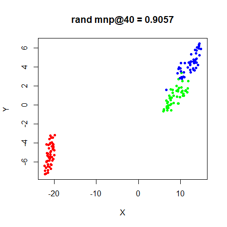|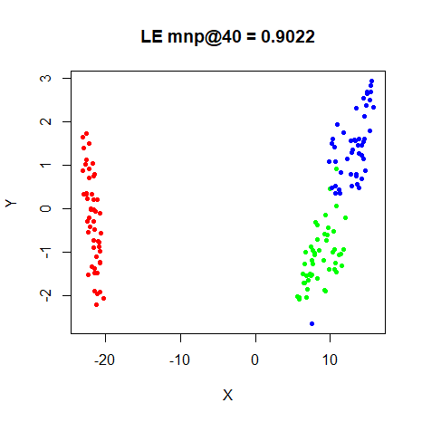
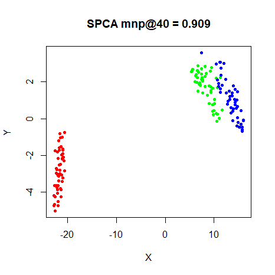|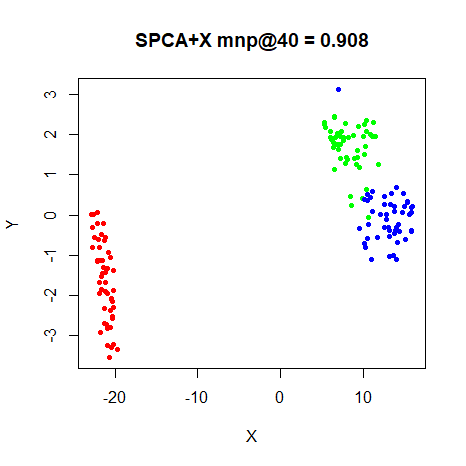

### s1k

|                             |                           |
:----------------------------:|:--------------------------:
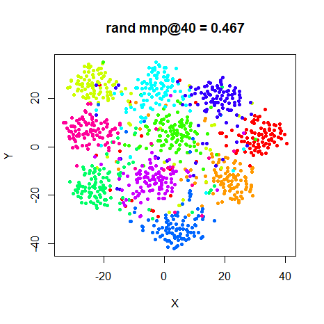|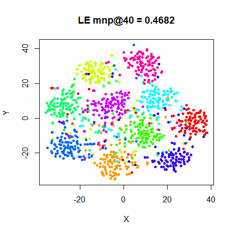
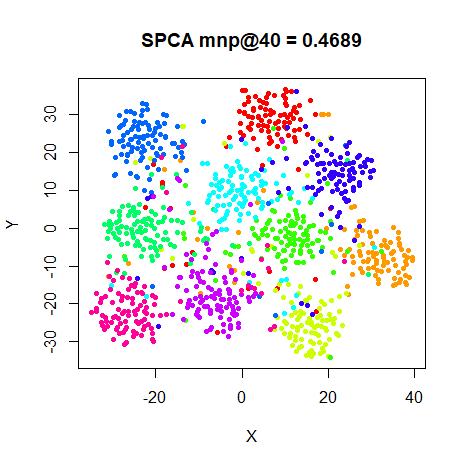|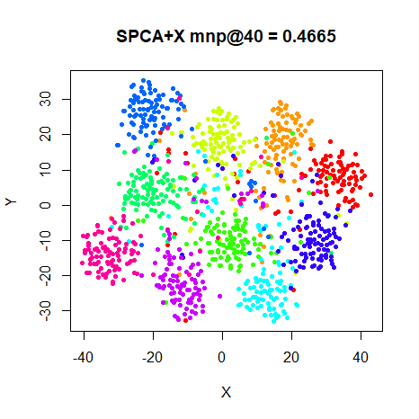

### Olivetti Faces

|                             |                           |
:----------------------------:|:--------------------------:
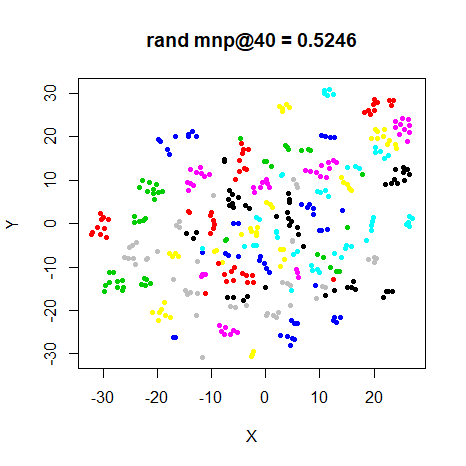|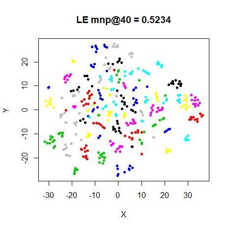
|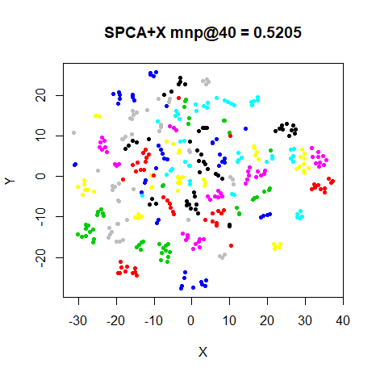

### Frey Faces

|                             |                           |
:----------------------------:|:--------------------------:
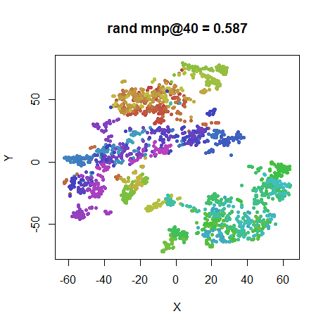|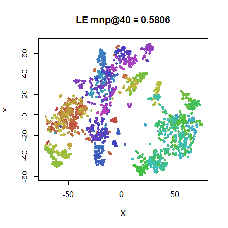
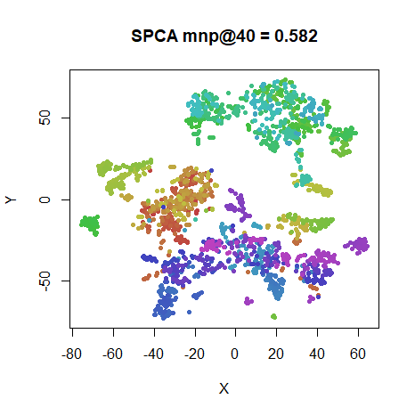|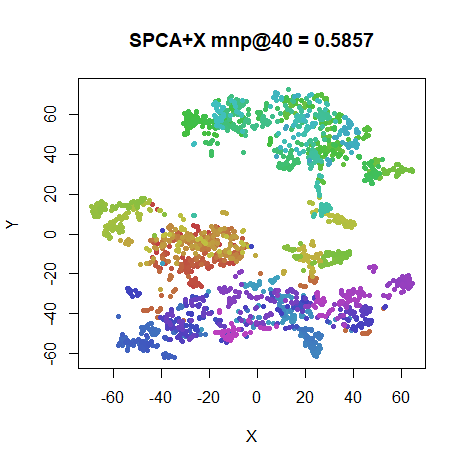

### COIL-20

|                             |                           |
:----------------------------:|:--------------------------:
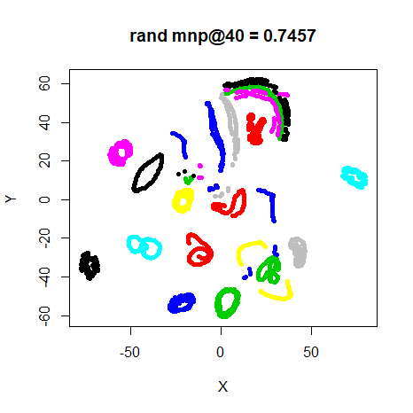|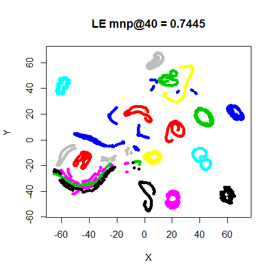
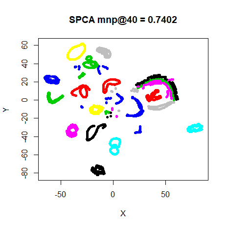|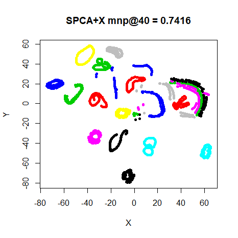

### MNIST (6,000)

|                             |                           |
:----------------------------:|:--------------------------:
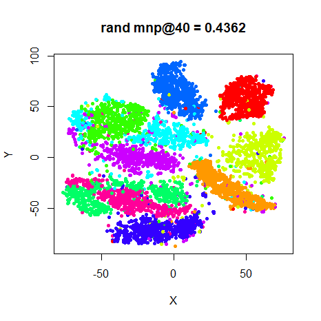|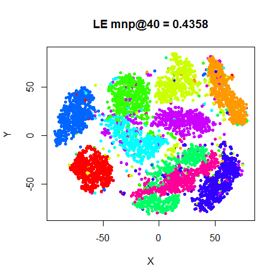
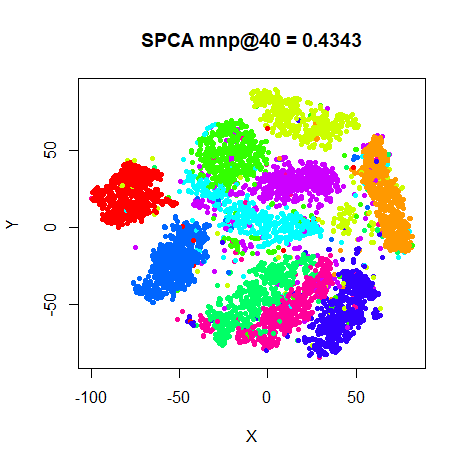|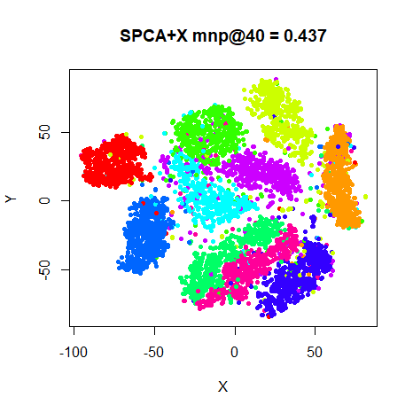

### Fashion (6,000)

|                             |                           |
:----------------------------:|:--------------------------:
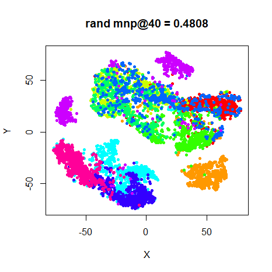|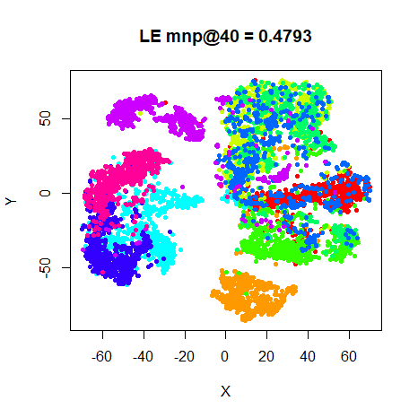
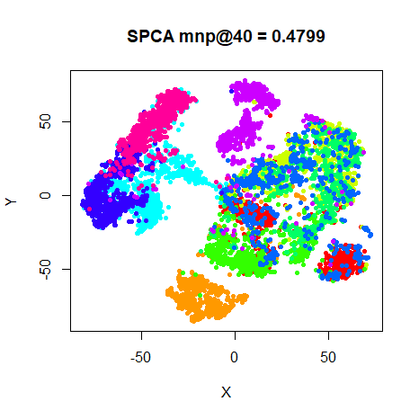|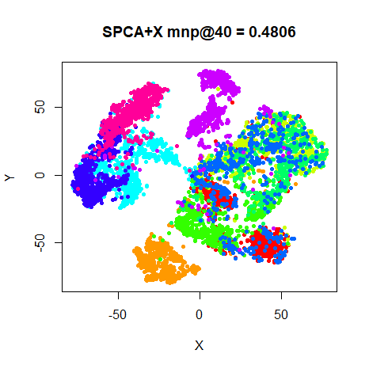

## Milder Optimization?

The optimization parameters used were those given in the t-SNE paper, which
uses the random initialization. Let's just check that they aren't too aggressive
when using a different initialization. In the following I reduce the learning
rate by an order of magnitude and use a much lower initial momentum, initializing
from Laplacian Eigenmaps:

```
tsne_iris_lap <- smallvis(iris, method = "tsne", perplexity = 40, max_iter = 1000, verbose = TRUE, Y_init = "lap", scale = FALSE, ret_extra = c("dx", "dy"), eta = 10, momentum = 0.1)
```

Here are the results, alongside the Laplacian eigenmap results (repeated from
the results above):

|Original Optimization        |Milder Optimization        |
:----------------------------:|:--------------------------:
|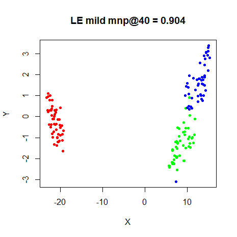
|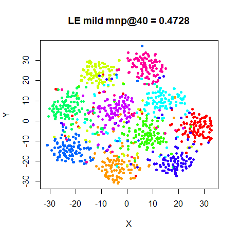
|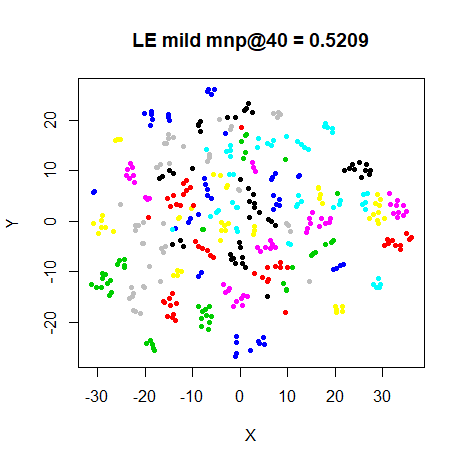
|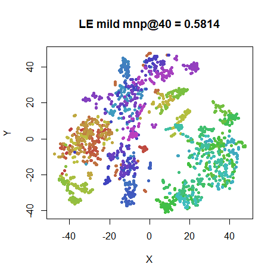
|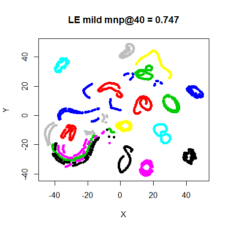
|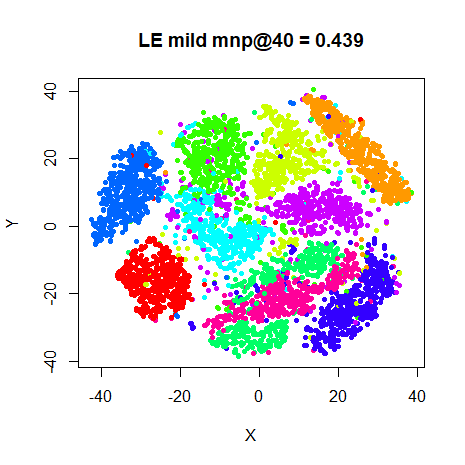
|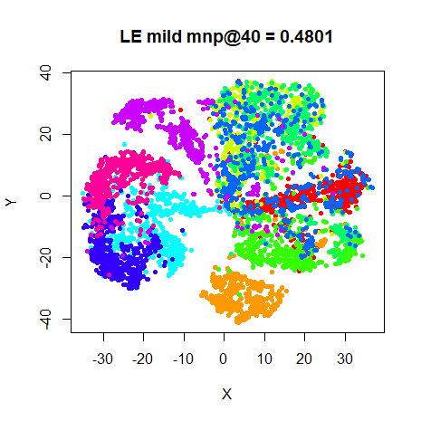

I observe no exciting differences in either the final layout of the preservation
values, although in all cases except `oli`, the milder optimization values 
result in higher preservations. I repeated this for the `spca` initialization
and got the same results, so no need to show those.

## Conclusions

Visually, I'm not sure there's a lot to choose between the different 
initialization methods. The same clusters shows up in the plots, although their
relative locations change. There's definitely not one method that outperforms
the others.

Quantitatively, if you have the time to run the embedding multiple times, the 
preservations from choosing the best of 10 random initializations works the best. 
in terms of neighborhood preservations. But there's not much of a difference
there, either. Admittedly, these are all comparatively small datasets. Early 
exaggeration gives a very slight improvement for the SPCA results most of the 
time, but doesn't seem that critical either.

From these results, it seems that either the `Y_init = "laplacian"` or `Y_init =
"spca"` can be recommended for initialization.

