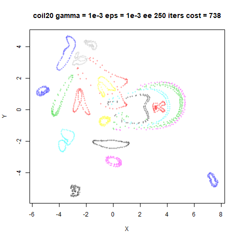
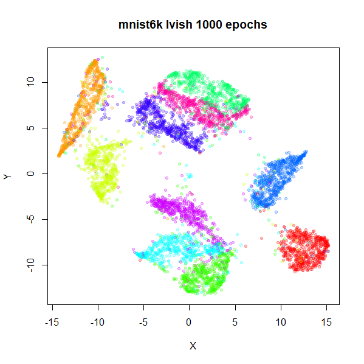
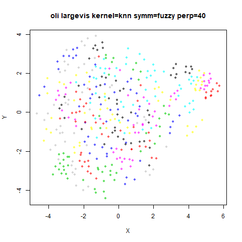
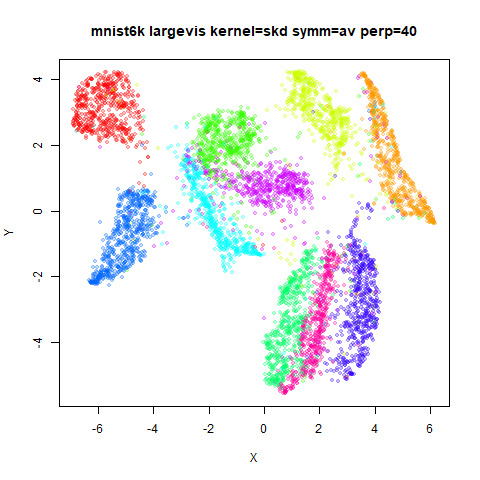
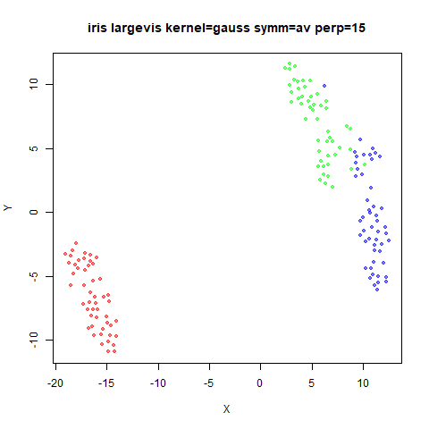
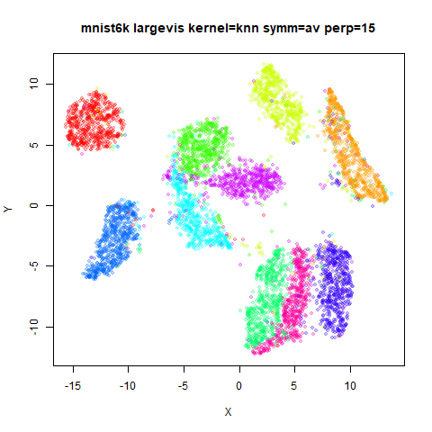
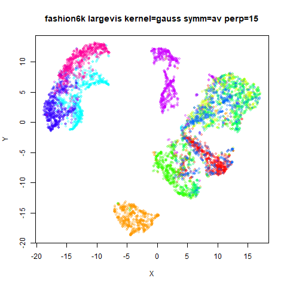

Up: [Documentation Home](https://jlmelville.github.io/smallvis/).

LargeVis ([paper](https://arxiv.org/abs/1602.00370) and 
[github repo](https://github.com/lferry007/LargeVis)) is a clever method that
allows a t-SNE like visualization using stochastic gradient descent, which 
scales much better than the Barnes-Hut approximation to t-SNE. LargeVis does
not minimize the same cost function as t-SNE, but it is similar. There is an 
[R package](https://github.com/elbamos/largeVis) that is sadly no longer on 
CRAN, but can be installed from github easily enough. The `lvish` function that
is part of [uwot](https://cran.r-project.org/package=uwot) is close enough to
the real LargeVis for my purposes. Both of these packages replicate the 
stochastic gradient descent approach to optimization, which is the point of the
method: to be scalable to large datasets. As a result, I'm not aware of other
code that has implemented the LargeVis method in an exact gradient form.

## Theory

The theory of LargeVis is covered in plenty of depth over on the
[theory page](https://jlmelville.github.io/smallvis/theory.html). Here's a
summary. An exact gradient cost function looks like:

$$
C_{LV} = 
-\sum_{ij} p_{ij} \log w_{ij} 
-\gamma \sum_{ij} \log \left( 1 - w_{ij} \right)
$$

where $p_{ij}$ are input probabilities generated in the same way as t-SNE
(perplexity, averaging, normalization) and $w_{ij}$ are output weights, also
defined in the same way as t-SNE. $\gamma$ is weight factor for the repulsive
contributions. This is something that needs to be experimented with. The
default value in the SGD implementation ($\gamma = 7$) is way too large once you
start considering all pairs of points.

The gradient with respect to the output coordinates, $\mathbf{y}$ is:

$$
\frac{\partial C_{LV}}{\partial \mathbf{y_i}} = 
  4\sum_j^N \left[
    \frac{p_{ij}}{ 1 + d_{ij}^2 }
    -\frac{\gamma }{ \left( \epsilon + d_{ij}^2 \right) \left( 1 + d_{ij}^2 \right) } 
   \right]
   \left(\mathbf{y_i - y_j}\right)
$$

where $d_{ij}$ is the Euclidean output distance between coordinates. $\epsilon$
is a small positive value chosen to prevent division by zero. In the LargeVis
source code, it's set to 0.1.

In an email discussion, Dmitry Kobak made the clever observation that if you set 
$\epsilon = 1$ (practically that's not a small value so you probably *shouldn't*
do this, but bear with us), and you can write the gradient as:

$$
\frac{\partial C_{LV}}{\partial \mathbf{y_i}} = 
  \frac{4}{N}\sum_j^N \left(
    v_{ij}
    -
    N\gamma w_{ij} 
   \right)
   w_{ij} \left(\mathbf{y_i - y_j}\right)
$$

I have also used the substitution $p_{ij} = v_{ij} / N$. This expression 
resembles other methods' gradients quite closely:

* [t-distributed Elastic Embedding](https://jlmelville.github.io/smallvis/tee.html),
where the t-EE parameter $\lambda = N\gamma$.
* if you choose $\gamma = 1/Z$ at each iteration (where $Z = \sum w_{ij}$), you 
get the t-SNE gradient.

## Un-normalized LargeVis

Does it make sense to be matching $p_{ij}$ to $w_{ij}$ in the cost function,
rather than $v_{ij}$? As it happens, the LargeVis source code doesn't actually
generate the $p_{ij}$ from the $v_{ij}$. It doesn't need to, because the 
absolute values aren't needed in the stochastic gradient descent method it uses:
the relative values are used to generate the probability of sampling a point,
and that is unaffected by scaling by $N$ or not. In the gradient calculation,
$p_{ij}$ is set to 1, as the magnitude of the attractive force has already been
accounted for by how often it's sampled.

If we replace $p_{ij}$ with $v_{ij}$ to create an un-normalized LargeVis, the
gradient is now:

$$
\frac{\partial C_{ULV}}{\partial \mathbf{y_i}} = 
  4\sum_j^N \left(
    v_{ij}
    -\frac{\gamma }{ \epsilon + d_{ij}^2 } 
   \right)w_{ij}
   \left(\mathbf{y_i - y_j}\right)
$$

and if you set $\gamma = 1$ this now resembles yet another method: the t-UMAP
variant of UMAP, with the following minor differences:

* the $v_{ij}$ are generated in a different way in t-UMAP.
* the repulsive part of the gradient is scaled by $1 - v_{ij}$ in the exact
gradient version of t-UMAP, but outside the k-nearest neighbors of point $i$,
$v_{ij}$ is very close to zero.

Note that the resemblance between un-normalized LargeVis and t-UMAP does not
require setting $\epsilon = 1$. We will look at seeing what the effect of these
changes is in the section 
[Turning LargeVis into UMAP](https://jlmelville.github.io/smallvis/largevis.html#turning_largevis_into_umap).

## How to set $\gamma$

There's no explanation in LargeVis for what $\gamma$ is supposed to represent
theoretically, beyond that it's a weight on the repulsion. One way to view it is
to see it as a way to scale up the contribution from the missing repulsions in
stochastic gradient descent, i.e. as the negative sampling rate increases,
$\gamma$ should decrease, in which case $\gamma = 1$ is the sensible choice for
the full gradient. But in the LargeVis paper the cost function is introduced
before any mention of stochastic gradient descent or sampling so it seems like
it is intended to be an intrinsic part of the cost function. 

Whatever the intention, we can look at how the SGD implementation balances the
weight of the repulsive and attractive parts of the gradient to work out a rough
value for what $\gamma$ should be in the exact gradient case to get a similar
balance.

In the SGD implementation the update for a given point $i$, is based around a
gradient using one other "positive" point $j$, considering the attractive
interaction with an effective $p_{ij} = 1$. There are $n$ negative samples
(default = 5) whose contributions are scaled by $\gamma$ (default = 7). We could
therefore say that for the default SGD LargeVis case that:

$$
\frac{\gamma n}{p} = 35 \implies \gamma = \frac{35p}{n}
$$

where $p$ is the total weight of the positive interaction (in the SGD case 1) 
and $n$ the total number of repulsive (negative) interactions (in the SGD case,
5). 

In the exact gradient we consider all pairs of points to be involved in both
contributions. Assuming we are using the normalized version of LargeVis, then
the sum of the attractive contributions is 1. Meanwhile, all points contribute
to the repulsive contribution with a weight independent of
$p_{ij}$. Therefore for the purposes of the exact gradient, $p = 1$ and $n = N$.

$$
\gamma = \frac{35}{N}
$$

this would suggest an upper range of $\gamma$ between ~0.1-1 for `iris` and
~0.001-0.01 for `mnist6k`. Setting $\gamma$ between 0.001 and 1 might be a
good starting range for the exact gradient.

The practical utility of that calculation is less important than what it says
about the relative weighting of attractions and repulsions in LargeVis. The
choice of $\gamma = 7$ in the SGD optimization *looks* like it's implying that
repulsions should be up-weighted, but if this rough calculation is anywhere
close to reality, this translates to a $\gamma < 1$ in the full gradient
calculation, and therefore also the LargeVis cost function.

Depending on the choice of $\gamma$, this means that repulsions could be being
down-weighted in LargeVis compared to t-SNE, where, for the datasets I use with
`smallvis` and a perplexity of 40, the values of $\gamma$ typically range from
$1/N$ at the start of the optimization to ~0.1 at the end (for more on this see
the [t-EE page](https://jlmelville.github.io/smallvis/tee.htm)). If that's the 
case, this would explain the more compressed clusters seen in LargeVis compared
to t-SNE.

## Datasets

See the [Datasets](https://jlmelville.github.io/smallvis/datasets.html) page.

## Settings

Here's an example invocation for LargeVis with `iris`.

The choice of `gamma` and `eta` is dependent on whether `normalize = FALSE` or 
`TRUE`. I find that you will want to scale both depending on the dataset, using
something in the same order of magnitude as:

* `normalize = TRUE`: `eta = nrow(X) / 10` and `gamma = 10 / (nrow(X) ^ 2)`
* `normalize = FALSE`: `eta = 0.1` and `gamma = 10 / nrow(X)`

Outside of these ranges I find that it's increasingly hard to get a satisfying
optimization: early on the optimization the learning rate needs to be quite low
(e.g. `eta = 0.01` with `normalize = FALSE, gamma = 1`), but it can be too low
for the optimization to proceed efficiently once the initial re-arrangement of
the layout has settled down. You will therefore need to run the optimization for
longer than t-SNE. Even then, in most cases, it's difficult to come up with an
initialization that works well. If you want to use a larger repulsion, it's
better to start with a low value of `gamma` and slowly work up to the target
value, as we shall explore below.

```R
res <- smallvis(iris, method = list("largevis", normalize = TRUE, gamma = 10 / (nrow(iris) ^ 2), gr_eps = 0.1), perplexity = 40, Y_init = "spca", eta = nrow(iris) / 10)
res <- smallvis(iris, method = list("largevis", normalize = FALSE, gamma = 10 / nrow(iris), gr_eps = 0.1), perplexity = 40, Y_init = "spca", eta = 0.1)
res <- smallvis(iris, method = list("largevis", normalize = TRUE, gamma = 1, gr_eps = 0.1), perplexity = 40, Y_init = "spca", eta = 0.01, max_iter = 10000, epoch = 100)
res <- smallvis(iris, method = list("largevis", normalize = FALSE, gamma = 1, gr_eps = 0.1), perplexity = 40, Y_init = "spca", eta = 0.01, max_iter = 10000, epoch = 100)
```

## Raw results

The top row shows the effect of setting `gamma = 1` with normalized (left, 
"norm" in the caption) or un-normalized (right, "un-norm") LargeVis. These were
run for 10000 iterations due to the requirement of a low value of the learning
rate. These results are hopefully reasonably converged to give a reasonable
depiction of how LargeVis ends up with `gamma = 1` using an initialization that
works well for t-SNE. But it should be noted that a previous version of this
page used 5000 iterations and got results that weren't very converged. So
these could end up changing again.

The second row uses a small value for `gamma`, scaled appropriately for whether
we are normalizing or not: $1/N$ or $1/N^2$, respectively. These were able to
be run with the typical 1000 iterations.

### iris

|                             |                           |
:----------------------------:|:--------------------------:
|
|

### s1k

|                             |                           |
:----------------------------:|:--------------------------:
|
|

### oli

|                             |                           |
:----------------------------:|:--------------------------:
|
|

### frey

|                             |                           |
:----------------------------:|:--------------------------:
|
|

### coil20

|                             |                           |
:----------------------------:|:--------------------------:
|
|

### mnist6k

|                             |                           |
:----------------------------:|:--------------------------:
|
|

### fashion6k

|                             |                           |
:----------------------------:|:--------------------------:
|
|

Obviously, `gamma = 1` with normalized LargeVis gives disastrously 
over-repulsed results. Results don't look terrible with un-normalized LargeVis
on the smaller datasets, but things don't look good with `mnist6k` or 
`fashion6k`. `mnist6k` in particular is a real mess.

Is this just a case of a bad choice of initialization. Probably not because I've
used a spectral initialization and random initialization and got the same
results. Nor does changing `gr_eps` affect the results very much, except for
the worse if you make it too small (results not shown).

The second row results with a small `gamma` look better for all the datasets
and get there with one tenth of the number of iterations.

## Annealed-$\gamma$ results

Given the similarity of the LargeVis gradient to t-EE, and given that t-EE
results with a larger repulsion improve notably if you start with a small value
of its $\lambda$ parameter which entirely analogous to $\gamma$ parameter of
LargeVis, we can probably expect to see an improvement by doing the same here.

For these runs, I started with $\gamma$ set to a power of 10 closest to $1/N$
(using arguments I made on the t-EE page to do with what the initial repulsion
in t-SNE is like) for un-normalized LargeVis, and the power of 10 closest to
$1/N$ for normalized LargeVis. Then each run was repeated with `gamma` increased
by a power of 10 and initializing with the final coordinates from the previous
run. This was repeated up to and including `gamma = 1`. For un-normalized 
LargeVis, this involved 3-5 round of optimization, and 4-8 for normalized
LargeVis.

The total number of iterations allowed was 10000, the same as for the results
with `gamma = 1` in the previous section. The 10000 iterations were equally
divided among each `gamma`. If a run finished early, the unused iterations were
shared amongst the remaining runs equally. Because runs with higher values of
`gamma` tend to take longer to optimize, this allowed these "spare" iterations
to be put to good use.

Choosing a good learning rate that works for all values of `gamma` is tricky. 
For un-normalized LargeVis, `eta = 0.1` worked well. For normalized LargeVis,
the best value I found was $10/N$.

For the results below, I forgot to indicate on the image title whether they
were for normalized or un-normalized. Sorry. The normalized LargeVis results are
on the left and the un-normalized on the right (but I will repeat this in the
section titles)

### iris (left: normalized, right: un-normalized)

|                             |                           |
:----------------------------:|:--------------------------:
|

### s1k (left: normalized, right: un-normalized)

|                             |                           |
:----------------------------:|:--------------------------:
|

### oli (left: normalized, right: un-normalized)

|                             |                           |
:----------------------------:|:--------------------------:
|

### frey (left: normalized, right: un-normalized)

|                             |                           |
:----------------------------:|:--------------------------:
|

### coil20 (left: normalized, right: un-normalized)

|                             |                           |
:----------------------------:|:--------------------------:
|

### mnist6k (left: normalized, right: un-normalized)

|                             |                           |
:----------------------------:|:--------------------------:
|

### fashion6k (left: normalized, right: un-normalized)

|                             |                           |
:----------------------------:|:--------------------------:
|

The un-normalized LargeVis results are obviously massive improvements. The
normalized LargeVis results are less impressive, but better than what came
before.

The un-normalized LargeVis results generally converged at all stages, so I am
fairly confident those are representative. The normalized LargeVis results
are *still* not fully converged even with 10,000 iterations. 

That issue is exacerbated for normalized LargeVis because it starts at a lower
value of `gamma` compared to the un-normalized results, but still ends at
`gamma = 1`, stepping through single powers of ten. Restarting the optimization
loses any useful information about the curvature that might have built up which
wastes some of the iterations, and also a large chunk of the optimization at
each `gamma` seems to involve the initial expansion of the clusters until they
form what look a lot like Voronoi polyhedra, before the clusters shrink and
begin to move away. Because it takes a few more values of `gamma` to get to the
target with normalized LargeVis, there are fewer iterations left over for the
larger values of `gamma` to use.

I repeated the `coil20` results with the same annealed `gamma` approach, but
allowing up to 100,000 iterations. Results are indeed improved:


There is still less white space between the clusters compared to the
un-normalized results. While it's obvious the normalized results need further
optimizing, I can't bring myself to spend any more time on that at the moment,
so this can stand as evidence of the extra difficult of working with normalized
LargeVis (at least with larger values of `gamma`). Most of the results below 
will therefore use the un-normalized version.

## Early Exaggeration

The annealed-$\gamma$ results tell us that we can probably use whatever value
of $\gamma$ we want if we are prepared to get there by starting at a small value
and increasing every few iterations. Starting with a reduced repulsion is 
equivalent to a increased attraction, which is what early exaggeration does.
As this is already part of the `smallvis` interface, maybe this is worth trying.

Below are some experiments using `gamma = 1e-3, gr_eps = 1e-3`. The top left
image is what you get without any early exaggeration. Top right is with 
`exaggeration_factor = 10, stop_lying_iter = 100`, turning off exaggeration
fairly early, and then bottom left is with `stop_lying_iter = 250`, the more
typical exaggeration time used in BH t-SNE. The `exaggeration_factor = 10`, 
is the equivalent of starting with `gamma` set to an order of magnitude
lower than we end with. This is more aggressive than the typical t-SNE 
exaggeration factor of 4. The bottom right image sees if there is an advantage
from an even stronger `exaggeration_factor = 100`.

A typical setting is:

```R
iris_lvee <- smallvis(iris, method=list("largevis", gamma = 1e-3, gr_eps = 1e-3, normalize = FALSE), Y_init = "spca", eta = 0.15, perplexity = 40, g2tol = 1e-7, min_cost = -Inf, exaggeration_factor = 10, stop_lying_iter = 100)
```

### iris

|                             |                           |
:----------------------------:|:--------------------------:
|
|


### s1k

|                             |                           |
:----------------------------:|:--------------------------:
|
|


### oli

|                             |                           |
:----------------------------:|:--------------------------:
|
|


### frey

|                             |                           |
:----------------------------:|:--------------------------:
|
|


### coil20

|                             |                           |
:----------------------------:|:--------------------------:
|
|


### mnist6k

|                             |                           |
:----------------------------:|:--------------------------:
|
|


### fashion6k

|                             |                           |
:----------------------------:|:--------------------------:
|
|

For most datasets, early exaggeration doesn't have much effect, which is perhaps
not too surprising as small datasets have more space to arrange themselves. For
`mnist6k` and `fashion6k` there is a more obvious improvement to the final cost,
and in `mnist6k`, the visual output looks a bit better. Increasing the 
`exaggeration_factor = 100` doesn't seem to help. This means that the range
of effective `gamma` you can use even with early exaggeration is still quite 
small. For example, you won't get good results with `gamma = 1` this way 
(results are identical to not using early exaggeration). Increasing the 
`exaggeration_factor` further will lead to issues with the learning rate being
too large in the initial exaggeration phase, as discussed in
[Clustering with t-SNE, provably](https://doi.org/10.1137/18M1216134).

## Normalized Results vs t-SNE

I've used un-normalized LargeVis for most of the results above, but to
demonstrate that the normalized version of LargeVis, here are some results with
the following settings:

```R
iris_lv <- smallvis(iris, method = list("largevis", normalize = TRUE, gamma = 10 / nrow(iris) ^ 2, gr_eps = 0.1), eta = nrow(iris) / 100, perplexity = 40, g2tol = 1e-7, min_cost = -Inf, exaggeration_factor = 10, Y_init = "spca")
```

This uses a data-dependent $\gamma = 10 / N^2$ and learning rate of 
$\eta = N / 100$. With the `exaggeration_factor = 10`,
this means that the repulsion weight in the gradient will be $1 / N$ (remember
that the repulsion weight is $\gamma N$ in the normalized version of LargeVis)
during early exaggeration, which is approximately the initial t-SNE repulsion
weight. After early exaggeration the repulsion is reduced by a factor of 10, but
remains well below the repulsion weight of around 0.05-0.3 that t-SNE achieves
with these datasets and settings. So I anticipate that the LargeVis results will
be comparable to, but more compressed than, the t-SNE results.

### iris

|                             |                           |
:----------------------------:|:--------------------------:
|


### s1k

|                             |                           |
:----------------------------:|:--------------------------:
|


### oli

|                             |                           |
:----------------------------:|:--------------------------:
|


### frey

|                             |                           |
:----------------------------:|:--------------------------:
|


### coil20

|                             |                           |
:----------------------------:|:--------------------------:
|


### mnist6k

|                             |                           |
:----------------------------:|:--------------------------:
|


### fashion6k

|                             |                           |
:----------------------------:|:--------------------------:
|

This is more or less what I expected. Looking at the range of the axes, the
t-SNE results are more expanded but the relative location of the clusters are
quite comparable visually (with the exception of `iris` where the opposite seems
true). You can see that for `mnist6k` and `fashion6k`, the clusters are more
compressed, so it's probable that the degree of repulsions is size-dependent.

## Comparison with SGD results

Finally, let's compare the results in `smallvis` to the `lvish` function in
[uwot](https://cran.r-project.org/package=uwot), which should give results
fairly close to the "true" LargeVis results. I'm not aiming to reproduce the
`lvish` results in `smallvis`

In order to make things more similar, for both `smallvis` and `lvish` we will
use a knn kernel, where for a given perplexity $PP$, the nearest $PP$ neighbors
of point $i$ get an input affinity of $1/PP$ and 0 everywhere else. The
resulting matrix is symmetrized as usual to get the final $v_{ij}$ values.

For `smallvis`, the only difference between the previous set of results is 
adding `inp_kernel = "knn"` to the `method` list. For `lvish`, the settings
were:

```R
iris_lvish <- lvish(iris, n_epochs = 1000, kernel = "knn", nn_method = "FNN", perplexity = 40, init = "spca")
```

The choice of `n_epochs = 1000` was fairly arbitrary, except it's double what
the default UMAP choice is for small datasets, so hopefully the coordinates
are reasonably well converged. Note that `lvish` is a stochastic method, so
exact results are dependent on the random number seed.

The left-hand result is the `smallvis` result, the right-hand result is due to
`lvish`.

### iris

|                             |                           |
:----------------------------:|:--------------------------:
|


### s1k

|                             |                           |
:----------------------------:|:--------------------------:
|


### oli

|                             |                           |
:----------------------------:|:--------------------------:
|


### frey

|                             |                           |
:----------------------------:|:--------------------------:
|


### coil20

|                             |                           |
:----------------------------:|:--------------------------:
|


### mnist6k

|                             |                           |
:----------------------------:|:--------------------------:
|


### fashion6k

|                             |                           |
:----------------------------:|:--------------------------:
|

Results are most certainly not identical, but they're not completely different
from each other. The chosen value of `gamma` could perhaps be tweaked to make
some visualizations line up better, for example `oli` seems to be over-expanded
in `smallvis`.

Some differences may be irreconcilable: e.g. for `frey`, the separation between
the green cluster and the rest of the data is always much more pronounced with
`lvish` across multiple random seeds, different choices of `n_epochs` and
`learning_rate`. For that dataset, even when using `smallvis` to optimize the
output of `lvish`, I was unable to find a value of `gamma` which didn't result
in a large amount of re-arrangement of the coordinates. For `coil20` there seems
to be more expansion with the SGD results and the three clusters (black, cyan
and blue) on the right hand side of the plots are pushed further, similarly to
the situation with `frey`.

`mnist6k` and `fashion6k` alsoshow a slightly different relative arrangement of
clusters. This may be a limitation of the SGD implementation in terms of
representing the LargeVis cost function as implemented in `smallvis`, but this
is a mystery I will leave for another time. If it turns out to be due to a bug
in `uwot`, I will regenerate these results.

However, we see similar overall ranges of coordinates (based on looking at the
axis labels), so this is good enough evidence for me to confirm that the 
LargeVis repulsion is substantially down-weighted compared to t-SNE.

## Conclusions

LargeVis is not designed to be a practical visualization method outside of its
stochastic gradient descent implementation, so the fact that it's not as easy
to use in `smallvis` compared to t-SNE isn't very surprising.

Some general observations are:

* Despite sharing a lot of concepts, an un-normalized method like LargeVis is 
hard to optimize using the techniques that work with t-SNE.
* The problem is both with the optimization method (hyper-parameters including
learning rate) and initialization.
* For initialization, I've tried increasing the standard deviation of the
initial coordiantes (whether using PCA, spectral methods or random) to 
increase the initial inter-point distance and avoid large gradients, but I was
unable to find a useful setting.
* The balance of repulsions versus attractions in the t-SNE family of methods
is critical.
* Methods which don't start the optimization with attractions hugely up-weighted
will have a hard time producing useful results.
* t-SNE automatically increases the repulsion as the optimization proceeds, 
which is why it can produce output with more expanded clusters successfully.
* Early exaggeration helps t-SNE with this. It's less useful for methods like
UMAP or LargeVis because the repulsions don't get dynamically re-weighted.
* As presented in the LargeVis paper, it's easy to be misled by the $\gamma$ 
value in the cost function. Its value > 1 in the stochastic gradient descent
optimization, suggests it is up-weighting repulsions relative to the 
attractive forces. 
* Once you recast the SGD settings in terms of the exact gradient, it's actually
**strongly down-weighting the repulsions**.
* This is still true even when the SGD $\gamma = 1$, which is effectively what
UMAP does.
* This implies that with UMAP's default settings, its cost function actually
contains an implicit $\gamma \ll 1$.
* In t-SNE, exaggeration is the same as decreasing the repulsive interactions,
which is equivalent to introducing $\gamma < 1$ into the repulsive part of the
t-SNE gradient (ignoring a constant scaling of the gradient which can be
absorbed into the learning rate). This is why t-SNE with late exaggeration looks
like UMAP and LargeVis.
* Therefore t-SNE with exaggeration permanently turned on should give you a
close equivalent to (the stochastic gradient descent implementations of)
LargeVis or even UMAP visualizations, subject to which implementation provides
you with the scalability and features you need.

## Turning LargeVis into UMAP

*April 26 2020*: Dmitry Kobak compared the results above to what I reported
about [UMAP](https://jlmelville.github.io/smallvis/umap.html), and given how
close LargeVis should be to UMAP (especially in the t-UMAP form), thought that
there were some more things that needed explaining, especially around the
results when $\gamma = 1$. It turns out that he was correct. This new section
goes into a bit more detail on the specifics of what separates UMAP from
LargeVis.

The results above make clear that having an adjustable $\gamma$ value is
important to get good visualizations, and that you probably want $\gamma < 1$.
This seems to conflict with UMAP, which has no $\gamma$ in its cost function. It
*does* appear in the Python implementation (as the `repulsion_strength`
parameter), but its purpose is entirely to account for the missing repulsions
due to limited sampling of repulsions in stochastic gradient descent (this was
confirmed to me in an email from UMAP creator Leland McInnes). So in its
exact-gradient form, there should be no $\gamma$. That means t-UMAP ought to 
behave similarly to LargeVis with $\gamma = 1$, which we know to be difficult to
get good results with. In the
[UMAP](https://jlmelville.github.io/smallvis/umap.html) pages I do note that 
UMAP and t-UMAP were quite hard to optimize: that would be in line with my
findings here that large values of $\gamma$ make optimizing LargeVis difficult.
But we can see from the annealed-$\gamma$ results that with $\gamma = 1$, we get
very expanded clusters, which are not like the t-UMAP results on the UMAP page,
which are much more compact. Can we account for this?

The big difference between LargeVis and UMAP is in the affinity calculation:
LargeVis does the things the t-SNE way (Gaussian perplexity calibration and
symmetrization by averaging) and UMAP uses smooth knn distances and fuzzy 
set union for symmetrization. Using
[UMAP input affinities in t-SNE](https://jlmelville.github.io/smallvis/umaptsne.html)
doesn't make a big difference, but the final matrix normalization may play a
role there: before that step, apart from some minor perturbation due to
symmetrization, the t-SNE input affinities are normalized to sum to 1, while in
UMAP they sum to $\log_2 k$, with `k` being the number of neighbors, so
analogous to the `perplexity` setting in t-SNE. The theory of UMAP does not call
for any normalization of input affinities to probabilities, so unlike LargeVis
there is no confusion over whether you normalize or not: you do not.

Although the individual values of $v_{ij}$ are between 0 and 1 in both methods,
the difference in normalization means that there is a lot more total affinity
in the smooth knn distances methods, which suggests that the attractive
interactions are up-weighted relative to the perplexity-based calibration in
t-SNE. This would mean that compared to LargeVis, there is an effective 
$\gamma < 1$ in UMAP, which would make the optimization a little easier. But is
the reduction in repulsion enough to make a noticeable difference? We can test 
this in un-normalized LargeVis with different input kernels: 
`inp_kernel = "gauss"` for the usual t-SNE perplexity calibration, and 
`inp_kernel = "skd"` for the smooth knn distances. For completeness, we'll also
look at `inp_kernel = "knn"`, where each of the `perplexity` nearest neighbors 
get an affinity of `1 / perplexity`, which was instructive when compared to skd
in t-SNE. We'll also look at averaging (`symm = "av"`) versus fuzzy set union 
(`symm = "fuzzy")`. This made little difference with t-SNE, but perhaps the lack
of normalization will reveal larger changes.

The results below will be done at two perplexities: `perplexity = 40`, which
is a typical value used in t-SNE, and `perplexity = 15`, which is closer to the
sort of value used in UMAP. For the `input_kernel = "skd"`, the `perplexity`
parameter is interpreted as the number of nearest neighbors.

Rather than go straight to a fully UMAP-like setting with `gamma = 1`, we'll use
values of `gamma` that gave reasonable visualizations based on the previous
results: $\gamma = 10 / N$ with an initial exaggeration factor of 10 for 100
iterations. An example for `iris` with `perplexity = 15`:

```R
iris_ga15 <- smallvis(iris, method = list("largevis", gamma = 10 / nrow(iris), gr_eps = 0.1, normalize = FALSE, inp_kernel = "gauss", symmetrize = "average"), eta = 0.01, Y_init = "spca", perplexity = 15, g2tol = 1e-7, min_cost = -Inf, exaggeration_factor = 10)
```

In the results below, the first row uses t-SNE-like perplexity calibration
(the LargeVis default). The second row uses smooth knn distances (the UMAP
default). The third row uses the k-nearest-neighbors perplexity calibration.

The left hand column uses the averaging symmetrization (LargeVis default),
the right hand column uses fuzzy set union (UMAP default).

Results for `perplexity = 40` are shown first, then `perplexity = 15` in a
second section

## Kernel + Symmetrization Results: Perplexity 40

### iris

|                             |                           |
:----------------------------:|:--------------------------:
|
|
|

### s1k

|                             |                           |
:----------------------------:|:--------------------------:
|
|
|

### oli

|                             |                           |
:----------------------------:|:--------------------------:
|
|
|

### frey

|                             |                           |
:----------------------------:|:--------------------------:
|
|
|

### coil20

|                             |                           |
:----------------------------:|:--------------------------:
|
|
|

### mnist6k

|                             |                           |
:----------------------------:|:--------------------------:
|
|
|

### fashion6k

|                             |                           |
:----------------------------:|:--------------------------:
|
|
|

## Kernel + Symmetrization Results: Perplexity 15

### iris

|                             |                           |
:----------------------------:|:--------------------------:
|
|
|

### s1k

|                             |                           |
:----------------------------:|:--------------------------:
|
|
|

### oli

|                             |                           |
:----------------------------:|:--------------------------:
|
|
|

### frey

|                             |                           |
:----------------------------:|:--------------------------:
|
|
|

### coil20

|                             |                           |
:----------------------------:|:--------------------------:
|
|
|

### mnist6k

|                             |                           |
:----------------------------:|:--------------------------:
|
|
|

### fashion6k

|                             |                           |
:----------------------------:|:--------------------------:
|
|
|

For the most part, the effect of symmetrization is almost impossible to detect
without peering closely at minor changes. If you look at the `knn` results
for `frey` with `perplexity = 15`, you'll see that there's a small green/orange
cluster of points in the middle of the plot, which is off to the left in all
the others. You know things are bad when you're reduced to noticing that kind
of thing. A larger change can be seen with `mnist6k` with `perplexity = 40`,
where the cerise (thank you 
[name that color](http://chir.ag/projects/name-that-color/)) and green cluster
in the lower left get entangled with each other when using the fuzzy set union
symmetrization. Apart from that, symmetrization does not seem like a big deal
with un-normalized affinities.

Also, it doesn't seem like new behavior in either symmetrization of the input
kernel emerges when changing from `perplexity = 40` to `perplexity = 15`, so
I will mainly concentrate on the effect of input kernel with perplexity 40, as
that lines up with the other LargeVis results on this page.

When looking at input affinities in t-SNE, the smooth knn distances results
were somewhere between the Gaussian kernel and the knn kernel. Without matrix
normalization, that no longer seems to be the case. There is now a noticeable
difference in the amount of repulsion for skd versus gauss (and knn) affinities,
with the skd results showing noticeably tighter clusters for `iris` and `oli`
(also in `s1k` where the clusters show a more "peaked" or slightly triangular
shape), although for `coil20` the knn and skd results are quite similar. However
what is noticeable for nearly all the plots if you look at the ranges on the
axes of the plots is that the skd results take up a much smaller extent. This
would seem indicative of a smaller relative repulsion compared to the other
kernels.

## Initializing t-UMAP and LargeVis from Largevis

So far we've seen that the smoothed knn distances input affinities lead to more
compressed results than the typical LargeVis Gaussian kernel for a given value
of $\gamma$. However we were using quite low values of $\gamma$ suitable for
creating decent visualization with the Gaussian kernel. Do these results hold
up when $\gamma = 1$, which is the effective $\gamma$ used in UMAP?

To test this we are going to focus on just `mnist6k` and `fashion6k`, which
are the largest datasets and the ones which are most obviously badly affected
by using $\gamma = 1$ without very careful initialization. Also, I am going to
switch to using `perplexity = 15` now, because I'm now interested in reproducing
more UMAP-like behavior with LargeVis.

For a given input kernel, we will run an un-normalized LargeVis optimization 
with `gamma = 1`. This is going to be difficult to get good results, so we will
also use an `exaggeration_factor = 10`. Also, we're going to set the learning
rate fairly low, to `eta = 0.001`, because I've noticed that early on in the
optimization, there are quite large gradients that can lead to initial
distortions (e.g. one or two outlier points that have been displaced a long
distance relative to the rest of the data). The visualizations *do* recover, but
as the local minimum they will end up could be quite far from the initial
trajectory, which might complicate looking at the final results. To compensate
for the lowered the learning rate, we'll use `max_iter = 10000`, i.e. ten times
long as usual.

We will carry out two runs for each dataset, with `input_kernel = "skd"` and 
`input_kernel = "gauss"` (we won't look at `input_kernel = "knn"` so we have
less results to sift through, but also because this current set of experiments
take so long to complete). My expectations are:

1. Neither results will look that great.
1. The `input_kernel = "gauss"` results will look worse than the
`input_kernel = "skd"` results.

Then we will use the final coordinates from the LargeVis run to initialize
two new optimizations. The two methods are:

* t-UMAP. With the `skd` kernel initialization, t-UMAP and LargeVis should be
very, very similar. So as long as the LargeVis optimization was far enough long
to provide a good initialization, I expect the t-UMAP results to not differ
very much from the starting point. On the other hand, the `gauss` initialization
should be a worse initialization for t-UMAP and I would expect to see 
a larger change.
* LargeVis again with whatever input kernel parameter was used. Apart from 
restarting the adaptive optimization parameters this is like running a 20,000
iteration optimization. This is more of a control run to ensure that 10,000
iterations was sufficient to get a good initialization for t-UMAP and to track
any further changes to the layout that would have occurred anyway. Mainly this
is to account for the scenario where LargeVis with the Gaussian kernel gives a
bad output, and running t-UMAP on it substantially improves it. Do I expect
this to happen? No. But if it did, it would leave the question open as to 
whether LargeVis just needed longer to optimize those coordinates and would
have got there as well as t-UMAP did.

These will also be run for 10,000 iterations and the same learning rate.

To summarize, there will be two sets of three visualizations each:

1. An initial LargeVis run with `inp_kernel = "gauss"`.
2. A LargeVis run with `inp_kernel = "skd"` initialized from LargeVis in step 1.
3. A t-UMAP run initialized from LargeVis in step 1.

Then we will repeat all that but with `inp_kernel = "skd"` in steps 1 and 2.
Got it? No? Eh, I did my best.

Here's an example of the settings we'll use for the three steps using `mnist6k`
and `inp_kernel = "gauss"`

```R
mnist6k_lv1 <- smallvis(mnist6k, eta = 0.001, method=list("largevis", gr_eps = 0.1, normalize = FALSE, inp_kernel = "gauss", symmetrize = "fuzzy", gamma = 1), Y_init = "spca", perplexity = 15, g2tol = 1e-7, min_cost = -Inf, exaggeration_factor = 10, max_iter = 10000, epoch = 100, tol_wait = 2000)

mnist6k_lv2 <- smallvis(mnist6k, eta = 0.001, method=list("largevis", gr_eps = 0.1, normalize = FALSE, inp_kernel = "gauss", symmetrize = "fuzzy", gamma = 1), perplexity = 15, verbose = TRUE, max_iter = 10000, epoch = 100, Y_init = mnist6k_tu2, tol_wait = 2000)

mnist6k_tu3 <- smallvis(mnist6k, eta = 0.001, method=list("tumap", gr_eps = 0.1), perplexity = 15, verbose = TRUE, max_iter = 10000, epoch = 100, Y_init = mnist6k_lv1, tol_wait = 2000)
```

I use the `tol_weight = 2000` parameter here, which prevents stopping the
optimization before iteration 2000 (after which the final momentum has kicked in
for a few hundred iterations). This is to stop the optimizations in steps 2 and
3 from prematurely converging if the adaptive learning rates were taking a while
to make progress. Also `gr_eps = 0.1` for all methods. I did some preliminary
checking to see if this was interfering with accurate gradient values and
preventing convergence but it didn't seem to be an issue.

Below the results on the left show the Gaussian kernel and results on the right
show the smooth knn distances kernel. Row 1 is the initial LargeVis result,
row 2 is the LargeVis result initialized from the first LargeVis result, and
row 3 is the t-UMAP result initialized from the first LargeVis result.

### mnist6k

|                             |                           |
:----------------------------:|:--------------------------:
|
|
|

### fashion6k

|                             |                           |
:----------------------------:|:--------------------------:
|
|
|

`mnist6k` results are the most instructive to look at, as the Gaussian kernel
gives the worst results initially (top left), so any improvement is easier to
see. First, note that switching to the smooth knn distances with LargeVis (top
right) does help quite a bit, so that behavior seems to hold up even at higher
$\gamma$ values. Results are still far from perfect however, with several
clusters split.

The middle row is from running LargeVis for another 10,000 iterations, to check
if the top results are converged. And there are not major changes. There is 
certainly some improvement to the `inp_kernel = "gauss"` results (middle left),
but still a long way from what we would like to see. The `inp_kernel = "skd"`
results also improve with some clusters being unsplit. This is important for
evaluating the t-UMAP results as that means we can't attribute these
improvements to t-UMAP specifically.

The t-UMAP results are on the bottom row. First, the effect of the smooth knn
distances kernel on the gaussian kernel input (bottom left) is very noticeable:
results are much cleaner looking than was achieved by just running LargeVis
for longer, although the overall arrangement of the visualization is unchanged.
As expected, the clusters are smaller, tighter and more well-separated.

On the bottom right we see very little difference from the t-UMAP results
compared to the LargeVis results (center right). If you look very closely you'll
see that the fine structure within each cluster seems more pronounced: i.e. the
holes inside each cluster are slightly larger. This can be explained by the
extra $1 - v_{ij}$ weighting factor that exists in the repulsions for UMAP
compared to LargeVis: The affinity matrix with smooth knn distances is sparse by
design so for most pairs of points the repulsion is identical between LargeVis
and UMAP. However, for close neighbors in the input space, there is a non-zero
$v_{ij}$ so there is an extra down-weighting of repulsions. This pulls the
neighbor points closer together, leading to the slightly lower homogeneity
inside the clusters. The final cost values in the caption on the bottom row
confirm that initializing t-UMAP from `input_kernel = "skd"` LargeVis results
not only leads to more pleasant-looking initializations, but a lower cost.

The `fashion6k` results confirm the observations above, albeit in less emphatic
fashion.

### mnist6k perplexity 40

To end this section, here are the `mnist6k` results with `perplexity = 40`:

|                             |                           |
:----------------------------:|:--------------------------:
|
|
|

These are pretty similar to the `perplexity = 15` results in terms of the size
and spacing between the clusters, so there doesn't seem to be a large effect
of perplexity on the overall shape of the embedding. The green, cyan and magenta
clusters in the middle of the plot are entangled in a different way to the
`perplexity = 15` results. I looked to see if initializing an extra t-UMAP
optimization with `perplexity = 15` could un-entangle them, but that is not the
case.

## Conclusions (Again)

When I was looking at using 
[UMAP input affinities in t-SNE](https://jlmelville.github.io/smallvis/umaptsne.html),
I concluded that those findings (that nothing made a huge difference)
wouldn't necessarily transfer to un-normalized methods, especially with regard
to smooth knn distances. It turns out that this is the case.

1. The use of smooth knn distances in the input affinity means that UMAP
has a larger effective repulsion than LargeVis with its Gaussian input kernel
and `gamma = 1`. I haven't tried to quantify what the effective gamma is in
terms of LargeVis.
1. t-UMAP results will therefore not resemble LargeVis with `gamma = 1` and 
won't be quite so hard to optimize.
1. It's still quite hard to optimize though.
1. There are lots of things that make optimizing UMAP and LargeVis difficult in
their exact gradient form: setting the correct `gr_eps` value to avoid division
by zero, balancing repulsive and attractive interactions, using a good 
initialization, learning rate. Lots of these considerations are problems for any
method, including t-SNE, but they are particularly thorny for un-normalized
methods.
1. UMAP is actually at a disadvantage over LargeVis when it comes to the exact
gradient optimization: we don't have a gamma value to modify. An alternative is
to use t-SNE-style early exaggeration and multiply the input affinities by
a constant factor, but because the UMAP cost function has a 
$\log[(1 - v_{ij}) / (1 - w_{ij})]$ in it so you have to be careful how that
is carried out, e.g. update for the purpose of gradient calculation, but not
for the cost function calculation and be careful with any early stopping
criteria that use the cost function.
1. However you do it, as we have seen, there are limits to how effective a
one-off boost to the repulsion is with un-normalized methods once $\gamma$
becomes large: either the boost is too small to give the desired effect, or the
learning rate has to be made very small to accomodate the very different scales
of the gradient before and after the exaggeration. A different adaptive learning
rate method to the t-SNE Delta-Bar-Delta method (or changes to the parameters)
may be needed, which is a lot of work.

## Acknowledgement

Dmitry Kobak has been asking me to look at how the `smallvis` version LargeVis
behaves for ages, as well as asking "don't you think it's odd that t-SNE with
exaggerations looks so much like UMAP?", so I have him to thank for prodding
me into looking at this in a ~~bit~~ lot more detail.

Up: [Documentation Home](https://jlmelville.github.io/smallvis/).
