Up: [Documentation Home](https://jlmelville.github.io/smallvis/).

The [FIt-SNE](https://arxiv.org/abs/1712.09005) paper recommends the technique
of "late exaggeration". This is exactly the same as early exaggeration 
(multiply the input probabilities by a fixed constant), but doing it at the end
of the optimization, rather than the beginning. This seems to have the effect
of forcing any clusters to be tighter and further apart, which makes for better
visualizations. The effect seems reminiscent of the output of LargeVis and
UMAP, in fact.

In the paper, the authors set the exaggeration factor to 12 for the last 250
iterations of an embedding of the entire MNIST digits dataset, which mirrors the
recommended setting for early exaggeration with large datasets. 

## Datasets

See the [Datasets](https://jlmelville.github.io/smallvis/datasets.html) page.

## Settings

Settings will be the same as the 
[original t-SNE paper](http://www.jmlr.org/papers/v9/vandermaaten08a.html),
except with scaled PCA initialization rather than random initialization. Given
that the example in the FIt-SNE paper used late exaggeration settings that
matched the default early exaggeration settings, we shall do the same here,
except that the length and extent of the early exaggeration is lessened for the
sort of datasets that can be handled by `smallvis`: the `exaggeration_factor`
will be `4`, and will run for the last 100 iterations:

```
iris_late_ex <- smallvis(iris, perplexity = 40, Y_init = "spca", eta = 100,
                            exaggeration_factor = 4, stop_lying_iter = 100,
                            late_exaggeration_factor = 4, start_late_lying_iter = 900)
```

Initial results suggested that the exaggeration factor of 4 was a too high for
late exaggeration, so we will also look at reduced `late_exaggeration_factor` 
values of `2` and `1.5`. The early exaggeration factor is unchanged at 4 in
these cases. I looked at also reducing the early exaggeration factor when the
late exaggeration factor was reduced, but it doesn't have much of an effect, so
we needn't worry about that.

We'll also compare results with the standard t-SNE with early exaggeration only:

```
iris_tsne <- smallvis(iris, perplexity = 40, Y_init = "spca", eta = 100, 
                      exaggeration_factor = 4, stop_lying_iter = 100)
```

## Evaluation

Apart from visualizing the results, the mean neighbor preservation of the 40
closest neighbors (in line with the `perplexity`) is used to provide a rough 
quantification of the quality of the result. On the plots, this is labelled as 
`mnp@40`.

## Results

For each dataset, the top left image is the result of using late exaggeration
with an exaggeration factor of 4, the top right is with an exaggeration factor
of 2, and the bottom left is with an exaggeration factor of 1.5. The bottom
right is standard t-SNE with no late exaggeration. All results used early
exaggeration with an exaggeration factor of 4.

### iris

|                             |                           |
:----------------------------:|:--------------------------:
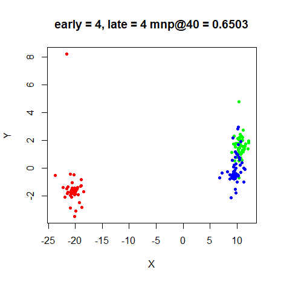|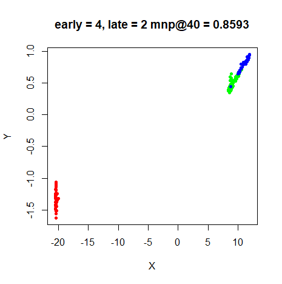
|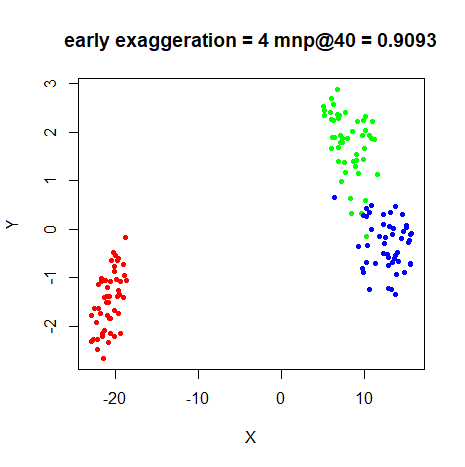

### s1k

|                             |                           |
:----------------------------:|:--------------------------:
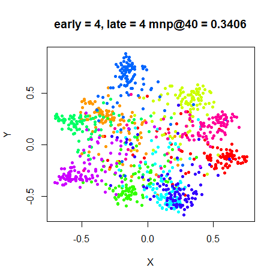|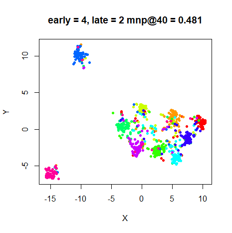
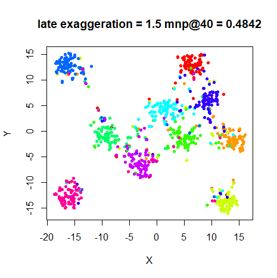|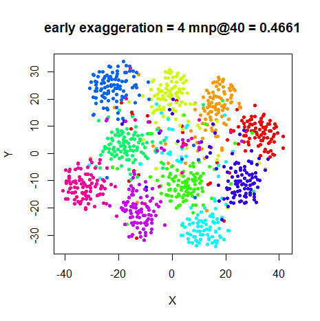

### oli

|                             |                           |
:----------------------------:|:--------------------------:
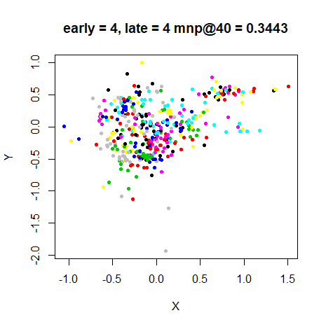|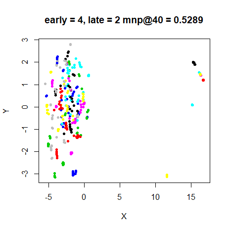
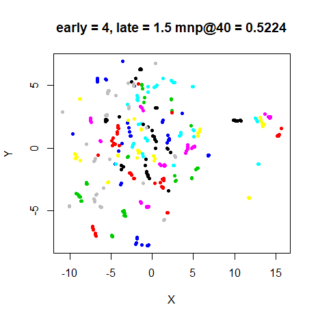|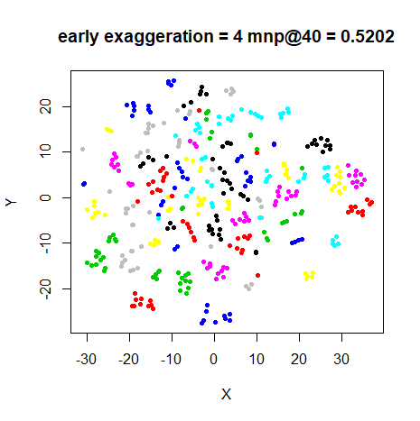

### frey

|                             |                           |
:----------------------------:|:--------------------------:
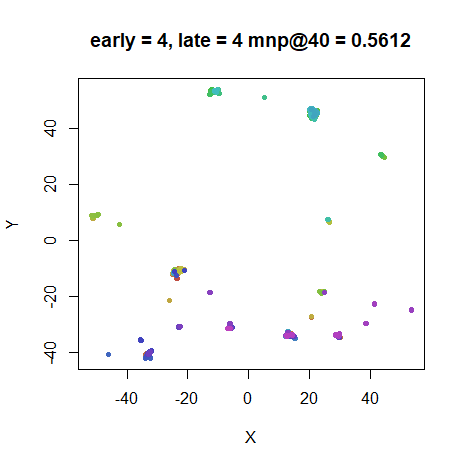|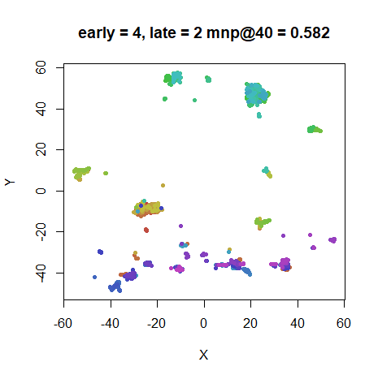
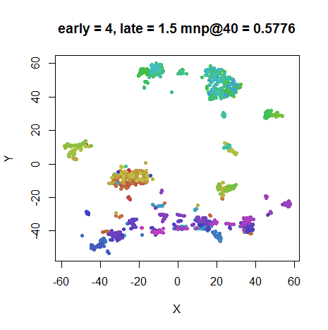|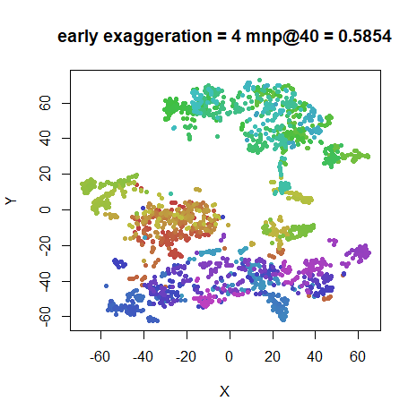


### coil20

|                             |                           |
:----------------------------:|:--------------------------:
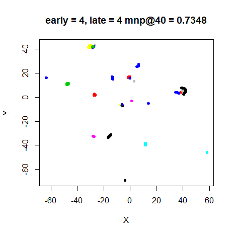|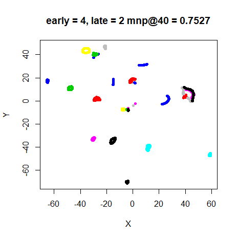
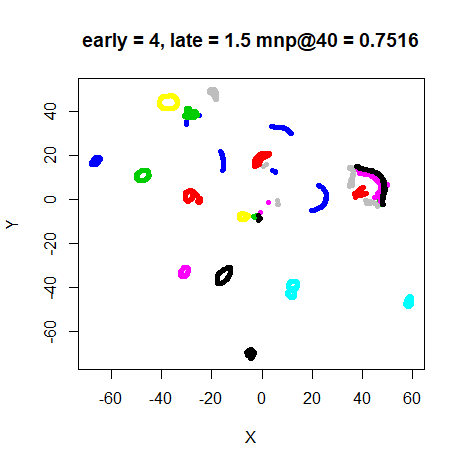|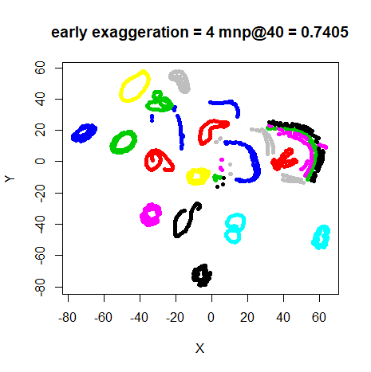

### mnist

|                             |                           |
:----------------------------:|:--------------------------:
|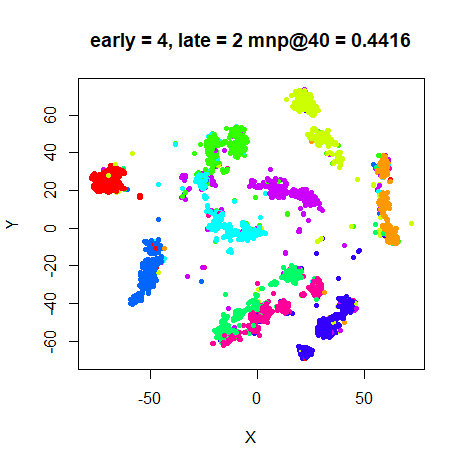
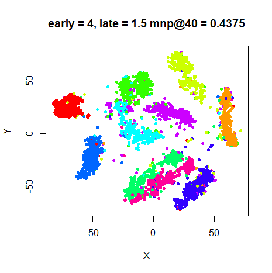|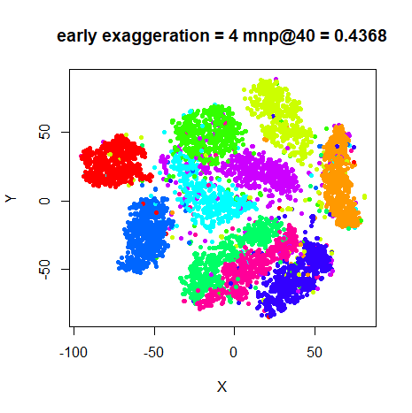

### fashion

|                             |                           |
:----------------------------:|:--------------------------:
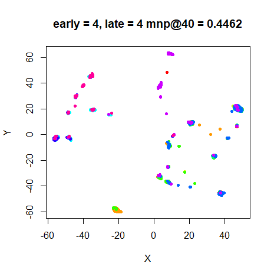|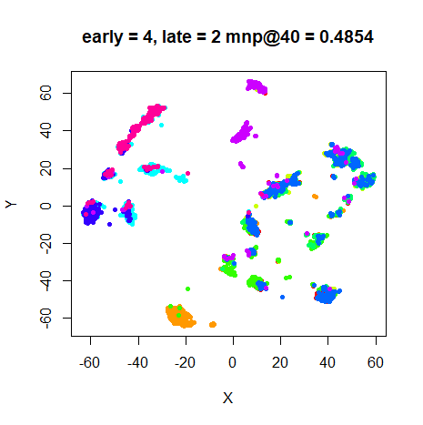
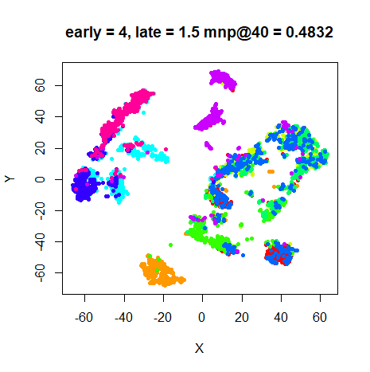|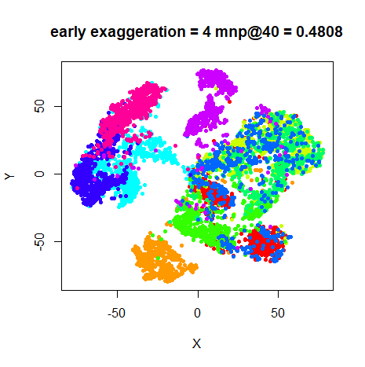


## Conclusions

A late exaggeration of 4 is clearly way too large for the datasets looked at
here. Either 1.5 or 2 seems much more appropriate. For these settings, we see
the expected result of much smaller, better-separated clusters with little
effect on the neighbor preservation values. The most suitable value seems
dataset-dependent (as usual): to my eyes, `iris` and `oli` don't benefit much
from any late exaggeration, although maybe an exaggeration even more mild than
1.5 would help.

For the other datasets, these results are very reminiscent of the
[UMAP](https://jlmelville.github.io/smallvis/umap.html) and 
[u-SNE](https://jlmelville.github.io/smallvis/umaptsne.html) results, but have
the advantage of being faster and easier to optimize.

Finally, if late exaggeration and early exaggeration are useful, why not always
be exaggerating?  Below are results from applying a constant exaggeration
with `exaggeration_factor = 1.5` by setting `stop_lying_iter = 1000`:

|                             |                           |
:----------------------------:|:--------------------------:
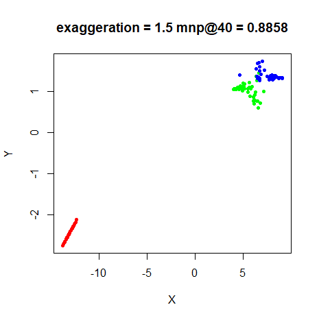|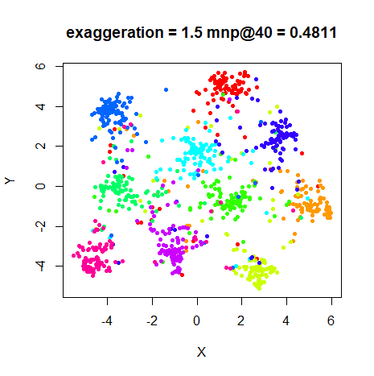
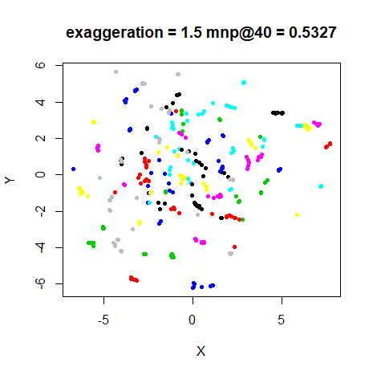|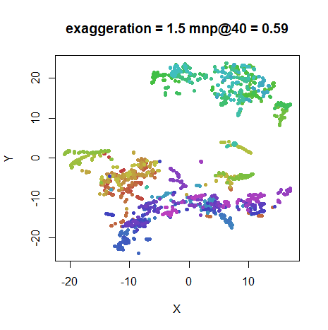
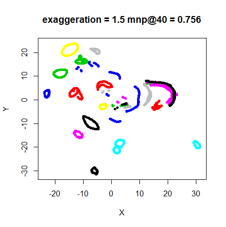|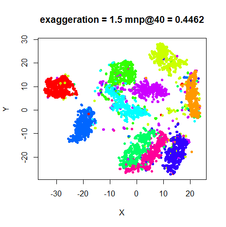
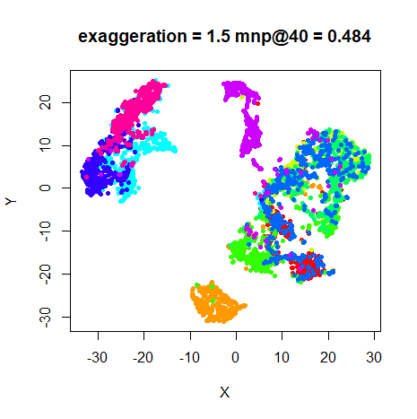|

It seems that allowing a non-exaggerated phase of the optimization allows the 
clusters to re-arrange and spread out a bit, because the late-exaggeration
results are more spread out (particularly noticeable if you look at the range
on the axes), but these constant-exaggeration results look pretty good and 
still resemble a more-compressed version of the t-SNE results, although probably
starting from the usually good scaled PCA initialization may have something to 
do with that.

If you find that t-SNE results are not separating clusters in your data in a
good way, then it does seem that late exaggeration helps, but for the datasets
that `smallvis` can deal with, I recommend an `exaggeration_factor` of around
1.5, much lower than the value of 12 mentioned in the FIt-SNE paper, and even 4
is much too large based on the results shown here. 

## Momentum and exaggeration length

*February 24 2019* Here's a little addendum to flesh out the discussion on
late exaggeration:

Even with the reduced exaggeration, for all examples I looked at, the cost does
increase over the last 100 iterations, suggesting that the learning rate or
momentum values are too high for the late exaggeration phase.

Normally, `mom_switch_iter` is set to happen after early exaggeration finishes,
so perhaps we should switch back to the lower momentum during late exaggeration?

Below are some examples where I modified the code to use the original `momentum`
value during late exaggeration. I've also looked at using 250 iterations of
early and late exaggeration, to see if our conclusions are affected by more
exaggeration time. In the latter case, `max_iter = 1300`, so
that the same amount of non-exaggeration optimization was carried out and also
`mom_switch_iter = 350`, so that there was always 100 iterations of 
non-exaggerated optimization before the momentum switch occurred.

A sample command for the longer exaggeration settings is:

```R
iris_tsne <- smallvis(iris, perplexity = 40, Y_init = "spca", eta = 100, 
                      exaggeration_factor = 4, stop_lying_iter = 250, 
                      mom_switch_iter = 350, late_exaggeration_factor = 1.5, 
                      start_late_lying_iter = 1050, max_iter = 1300, 
                      epoch = 100)
```

Below are the results. The plots on the left hand side are those using the
original (low) `momentum`, and those on the right are from using the
`final_momentum`. The top row uses 100 iterations each for early and late
exaggeration, and the bottom row uses 250 iterations each.

### iris

|                             |                           |
:----------------------------:|:--------------------------:
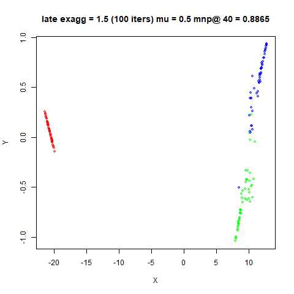|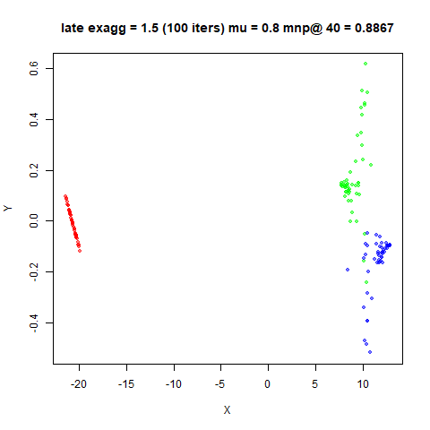
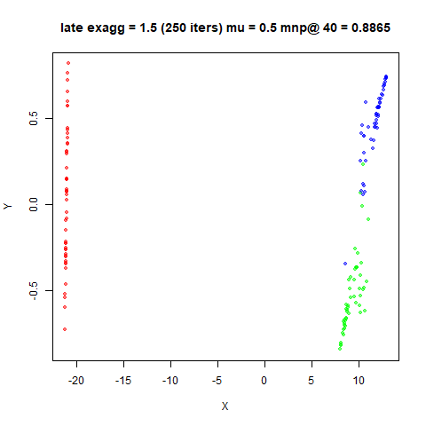|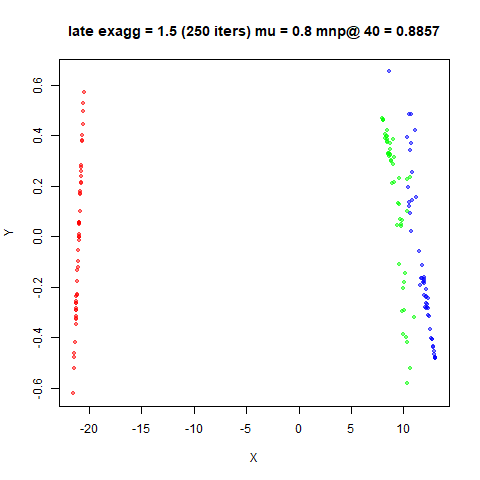

### s1k

|                             |                           |
:----------------------------:|:--------------------------:
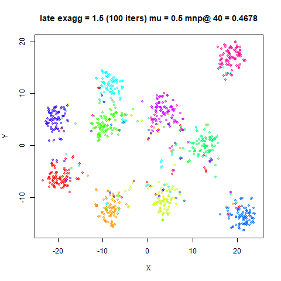|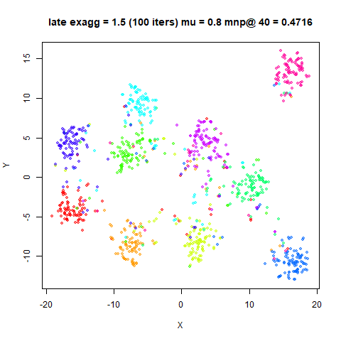
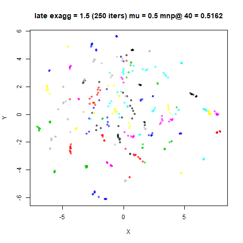|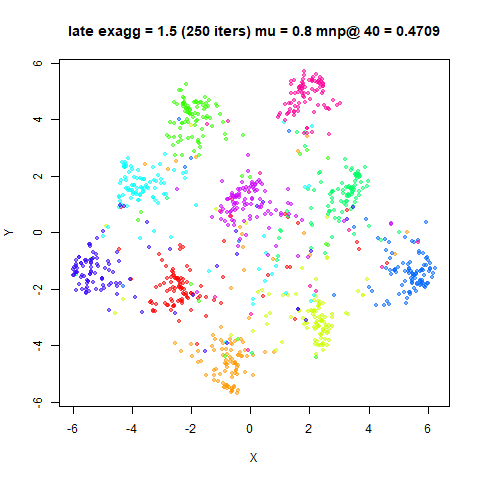

### oli

|                             |                           |
:----------------------------:|:--------------------------:
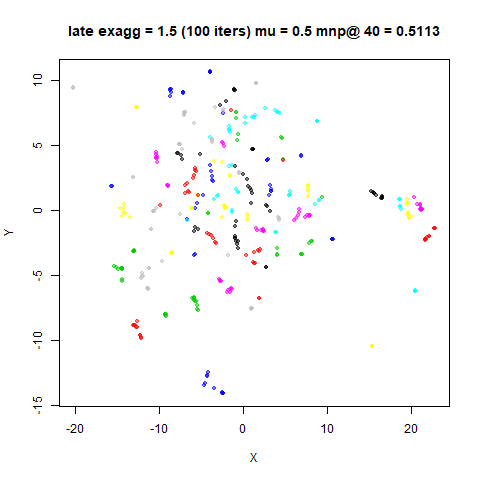|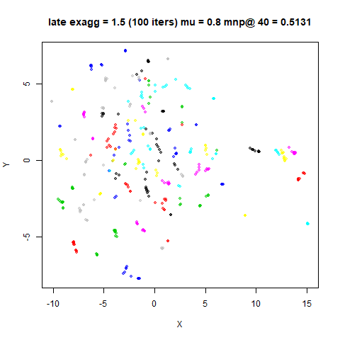
|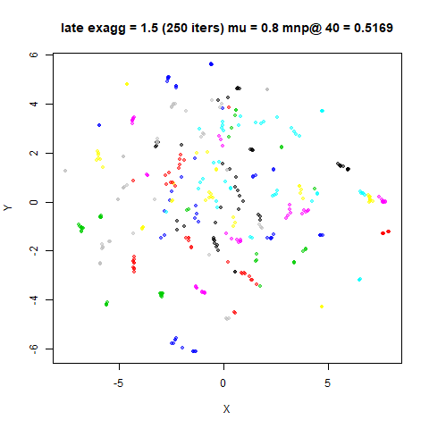

### frey

|                             |                           |
:----------------------------:|:--------------------------:
|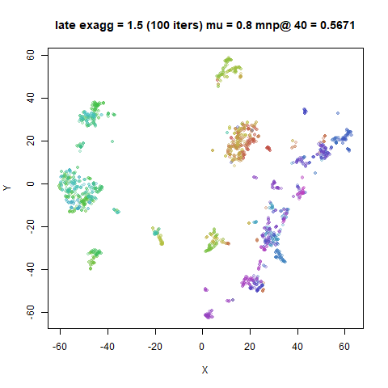
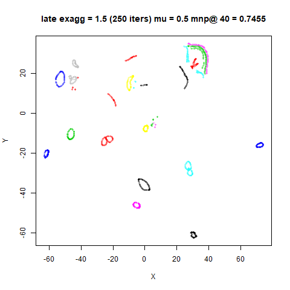|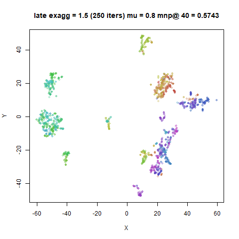

### coil20

|                             |                           |
:----------------------------:|:--------------------------:
|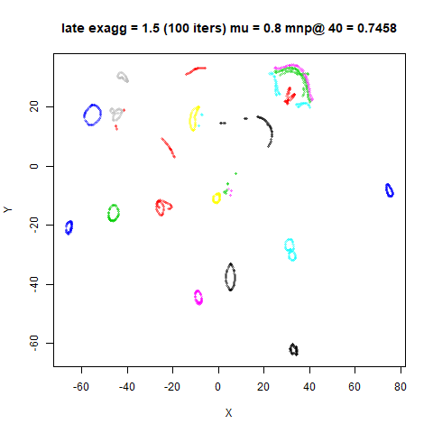
|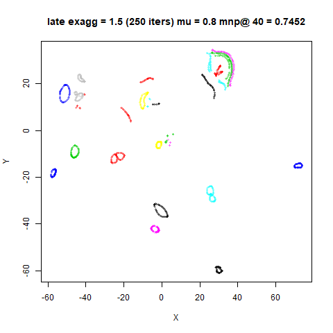

### mnist6k

|                             |                           |
:----------------------------:|:--------------------------:
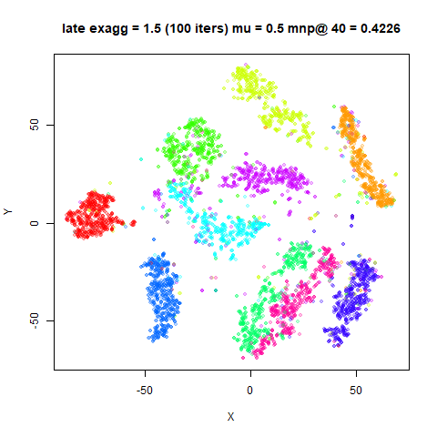|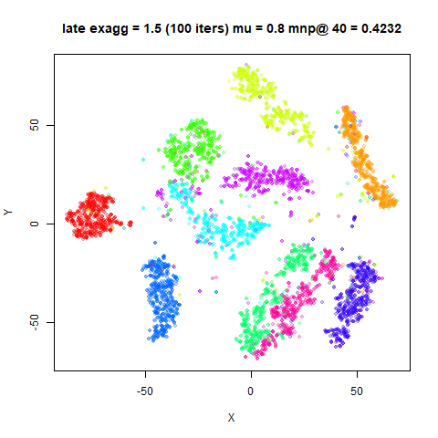
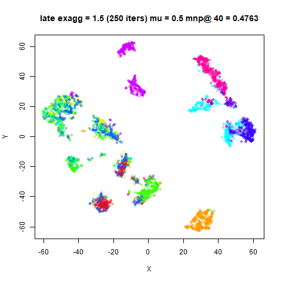|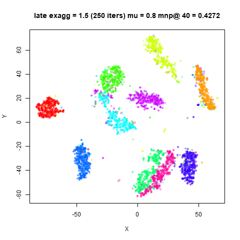

### fashion6k

|                             |                           |
:----------------------------:|:--------------------------:
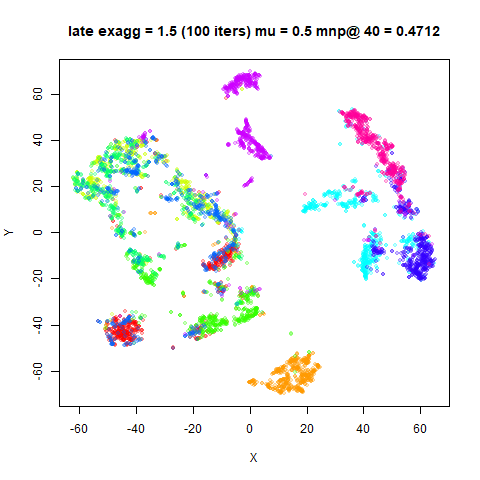|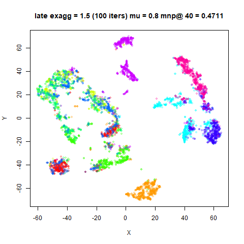
|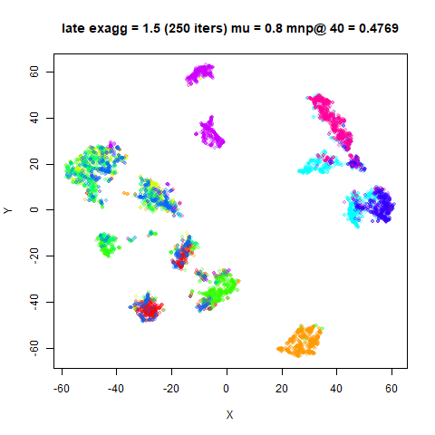

For the larger datasets, the extra time in late exaggeration results in more
compression of the clusters, but the change in momentum doesn't seem to do very
much. And neighbor preservations aren't affected. That's good because reducing
the momentum this would introduce coupling between the optimizer and the
exaggeration code, which is not something I relish.

If you want to try late exaggeration, my recommendations remain the same:
set `late_exaggeration_factor = 1.5`, and you probably don't need more than 100 
iterations.

*May 6 2020*: Dmitry Kobak notes that the late exaggeration protocol described
in the [FIt-SNE preprint](https://arxiv.org/abs/1712.09005) and replicated here 
does not appear in its final published form in 
[Nature Methods](https://doi.org/10.1038/s41592-018-0308-4). A modified protocol
(called just "exaggeration") was published by Dmitry and Philipp Berens in
[The art of using t-SNE for single-cell transcriptomics](https://dx.doi.org/10.1038%2Fs41467-019-13056-x)
and recommends immediately beginning late exaggeration as soon as early
exaggeration finishes, so you might want to consider that.

## Acknowledgement

Thank you to Dmitry Kobak, who drew my attention to the similarity between
UMAP/LargeVis results and the output of late exaggeration, prompting me to
implement it in `smallvis`.

Up: [Documentation Home](https://jlmelville.github.io/smallvis/).

