Distance-preserving methods are one of the most straightforward way to think 
about embedding a dataset: just try and reproduce all the distances in 2D. The
downside to this is that the distribution of distances in the input space is 
likely not a very good fit for two dimensions. Lee & Verleysen 
provide plenty of details in their paper on 
[distance concentration](https://doi.org/10.1016/j.procs.2011.04.056).

So let's not get our hopes up too much. But it's always worth trying one or more
of these on a dataset, just to get a baseline if nothing else. They are also
included in `smallvis` as a way to ensure that the code base was at least 
flexible enough to include methods that weren't straight variations on t-SNE.

At the very least, they are much easier to optimize than SNE. L-BFGS does very 
well. I've not ever noticed any of the
[problems](https://jlmelville.github.io/smallvis/opt.html) that occurred with
L-BFGS when used with t-SNE in terms of hitting ugly looking higher-lying minima
with larger datasets. Although that's probably because nothing looks all that
great with these methods once we try larger datasets. But I find that the
delta-bar-delta method, that seems to do such a good job with SNE and related
methods, requires some tedious adjustment of the learning rate on a per-dataset
basis to get it working. So L-BFGS comes recommended by me for these methods.

## Methods

### Metric Multidimensional Scaling

This method attempts to reduce the disparity between the input and output 
distances using a square loss. It's pretty much the simplest differentiable 
loss function you could come up with. Not to be confused with other forms of
MDS which allow other modifications of the distances (like scaling). There are
a whole zoo of MDS methods out there, and I have found that the nomenclature
is not always consistent.

### Sammon Mapping

[Sammon Mapping](https://dx.doi.org/10.1109/T-C.1969.222678) is perhaps the most
commonly-mentioned of the distance-preserving embedding methods. It differs from
metric MDS in that it applies a greater weight to shorter distances compared to
longer distances. This is good because if we want some distances to be more
preserved than others, it's the short distances and hence neighborhoods. 
Unfortunately, the amount of weighting it applies turns out not to have a huge
affect when it comes to distinguishing short from long distances in higher
dimensions. 
[Christopher Olah's explanation](http://colah.github.io/posts/2014-10-Visualizing-MNIST/)
is highly recommended.

### Geodesic MMDS

The third method I want to look at is what I call geodesic MMDS, or GMMDS. I'm 
sure this exists in the literature under a better name, I just don't know what 
it's called. This method is like taking Metric MDS but applying it to the ideas
of [Isomap](https://dx.doi.org/10.1126/science.290.5500.2319): instead of
reproducing the Euclidean distances of the input space, use the geodesic
distances. The geodesic distances are estimated by Floyd's algorithm on the
k-nearest neighbor distances, where $k$ must be chosen by the user, making it a
user-adjustable parameter like the perplexity in SNE. Too low a value of $k$
leads to a disconnected graph, in which case we use the Euclidean distance.
`smallvis` will log to the console when this happens. In the examples below, to
avoid any ambiguities about how many Euclidean distances are being used and
whether that's affecting the results, the value of $k$ was chosen to be 
sufficiently large to ensure that the geodesic distances were always defined.
There's no clever way to do this (at least, not in `smallvis`): I just 
incremented the value of $k$ by 5 until I stopped seeing the message.

If a dataset consists of a low dimensional manifold, GMMDS should be able 
to "unfold" it, and in some sense better reproduce the underlying topology, 
although if the lower-dimensional manifold has more than two dimensions, we 
still can't reproduce it fully as a 2D plot. There is a pre-canned synthetic
dataset that is often used with these sorts of methods, which we will meet 
below.

## Datasets

See the [Datasets](https://jlmelville.github.io/smallvis/datasets.html) page.

### Bonus Dataset: Swiss Roll

The Swiss Roll dataset (introduced, I think in the Isomap paper) is a 3D dataset
where the points consist of a 2D sheet that's been rolled up so it looks like...
yes, a Swiss Roll. Look at the PCA plot in the results below and you'll see the
XY cross-section. Then imagine it extending in and out of the plane of the
screen. The parameters of the swiss roll can be changed to give a more or less
curled up result, so when looking at the results in various publications, you 
need to check how it was generated. I use the default parameters in the
implementation in the [snedata](https://github.com/jlmelville/snedata) package,
which in turn come from a paper describing 
[Stochastic Proximity Embedding](http://dx.doi.org/10.1073/pnas.242424399), 
where I first encountered the dataset. For the record, SPE, despite what its 
name sounds like, is a stochastic gradient descent-based approximation to metric 
MDS or GMMDS, rather than SNE.

You can generate your own 1,000-point swiss roll with:

```
swiss <- snedata::swiss_roll()
```

## Evaluation

A comparative visual inspection with the t-SNE results is instructive: see the
results on the [initialization](https://jlmelville.github.io/smallvis/init.html)
page for instance. Also, it's worth looking at the ASNE and SSNE results, which
can be found on the [SNE](https://jlmelville.github.io/smallvis/sne.html) page,
which should sit between these results and t-SNE in terms of successful 
embedding.

Apart from visualizing the results, the mean neighbor preservation of the 40
closest neighbors is given on each plot labelled as `mnp@40` in the plots. But
this is more out of habit than because it's particularly useful in this
case. Unlike SNE results, there's no perplexity parameter in these methods, so
no particular reason that they should be attempting to reproduce the 40 nearest
neighbors, so treat this as a very rough proxy for well the data is embedded.

## Settings

Here's an example of generating the results using the `iris` dataset. For
MMDS and GMMDS, values of `eta` were chosen that showed decent behavior on the
`iris` dataset: convergence within 1000 iterations without a hint of divergence,
e.g. the error increasing during an "epoch". These settings were applied to
the other datasets without any further fiddling, so to be on the safe side,
I allowed for double the number of iterations (`max_iter = 2000`) than for
t-SNE. As you will note below, the value of `eta` chosen is several orders of
magnitude smaller than for t-SNE (where any value between 1-100 works well).
There's no reason that the magnitude of these gradients should resemble that of
t-SNE, so that's not surprising. It is possible that the other settings in
the delta-bar-delta method (the step size decrease/increase, the momentum
switch settings) should also be changed.

In fact, these settings *did* need changing for Sammon mapping. Rather than
fiddle yet more, I took my own advice and swapped to using L-BFGS for
the Sammon map results. Comparing the DBD results with L-BFGS for some MMDS
results suggested they produced very similar results.

For the gmmds results, the number of neighbors for each point ($k$ in the
discussion of GMMDS above) is supplied as the `perplexity` parameter and was set
to `10` except for `iris` and `coil20`, which were set to `25` and `55`,
respectively, the smallest multiple of 5 which didn't lead to disconnections in
the geodesic estimate.

```
iris_mmds <- smallvis(iris, scale = FALSE, Y_init = "spca", method = "mmds", ret_extra = c("dx", "dy"), eta = 1e-5, max_iter = 2000, tol = 1e-8)
iris_sammon <- smallvis(iris, scale = FALSE, Y_init = "spca", method = "sammon", ret_extra = c("dx", "dy"), opt = list("l-bfgs"), max_iter = 2000, tol = 1e-8, epoch = 100)
iris_gmmds <- smallvis(iris, scale = FALSE, perplexity = 10, Y_init = "spca", method = "gmmds", ret_extra = c("dx", "dy"), eta = 1e-5, max_iter = 2000, tol = 1e-8)
```

### Ball-MMDS and knn-MMDS

A limiting factor for the use of Isomap-like algorithms like GMMDS is that they
require the geodesic distances to be calculated, which normally involves
Floyd's algorithm, which is O(N^3) in time complexity. Inspired by 
[Stochastic Proximity Embedding](http://dx.doi.org/10.1073/pnas.242424399),
we could try another strategy to deal with long distances: ignore them unless
they are too short. In terms of geodesics versus Euclidean distances, the
Euclidean distance is always equal to or less than the geodesic distance, so 
it can be treated like a lower bound. In isometric SPE, distances outside the
neighborhood of each point are only corrected if they become smaller than the
input distance. From the perspective of MMDS, this is like only having pairs
of points contribute to the cost function or the force constant matrix if they
are neighborhood points or the output distance is smaller than the input 
distance.

Isometric SPE uses a fixed distance cutoff to define the neighborhood for each
point: the 10% smallest distance of a random sample of distances from the entire
dataset, i.e. a "ball" of fixed radius is assumed for each point. I refer to 
this method of defining the neighborhoods as Ball-MMDS. The obvious alternative
is to use a symmetrized k-nearest-neighbor graph, which I refer to as knn-MMDS.

The advantage of either knn-MMDS or Ball-MMDS is that you don't need as 
expensive an algorithm to prepare the input distances, but we do throw away 
long-distance information most of the time. This is not necessarily a bad thing,
but relying on local data only to unfold a manifold may be harder work than
using a full set of geodesic distances.

knn-MMDS and Ball-MMDS are intended as an approximation to GMMDS, so we won't
bother testing them out on anything other than the Swiss Roll (spoiler alert:
it's just not worth the effort given the performance of GMMDS).

I don't have any particular literature references for knn-MMDS or Ball-MMDS, 
they are simply obvious (to me) implementations of SPE with the stochastic
gradient descent optimization replaced by a typical batch optimization. No
doubt there are literature precedents with better naming for both.

## Results

For each dataset, PCA results are on the top left, GMMDS results are
on the top right. On the bottom row are MMDS (left) and Sammon map (right).
They're arranged this way so that it's easy to look directly down from the PCA
results to the MMDS result to see the effect of that, and to demonstrate that
the Sammon map and MMDS are very similar. For the Swiss Roll we'll also look
at Ball-MMDS and knn-MMDS, which will hopefully look like the GMMDS result.
For Ball-MMDS, the fraction of all pair-wise distances (after sorting in
increasing order) used to calculate the distance cutoff for each neighborhood is
given as "f = 0.1", i.e. using the 10% shortest distances. Setting "f = 1" would
use all distances, and hence reproduce MMDS.

### swiss

|                             |                           |
:----------------------------:|:--------------------------:
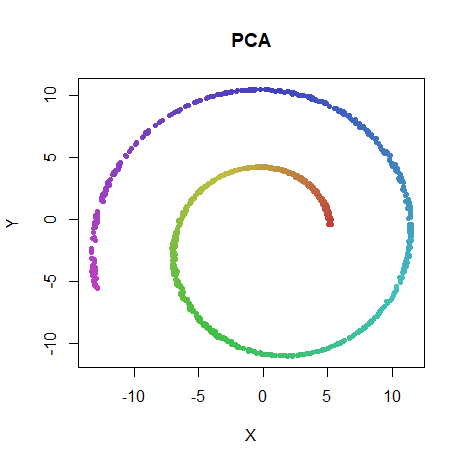|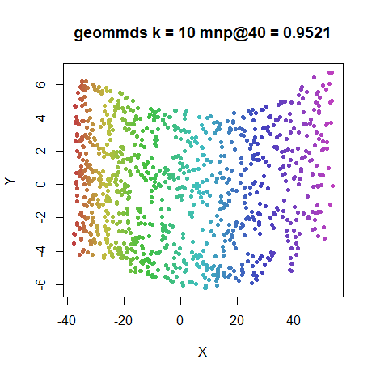
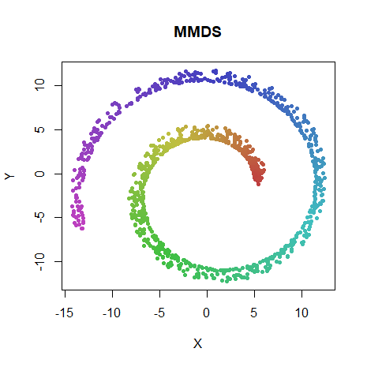|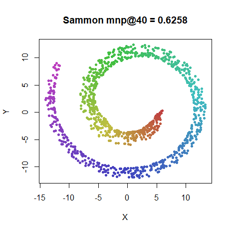
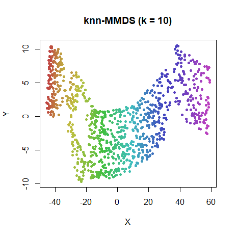|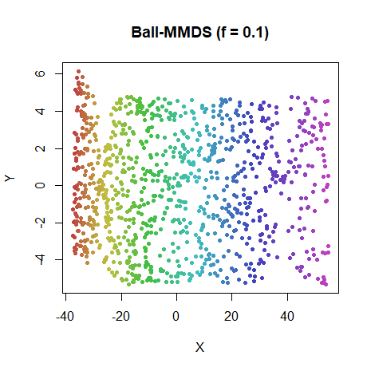

Ball-MMDS does a pretty good job of reproducing the GMMDS results. The knn-MMDS
results are no-where near as good. The issue may be that choosing a fixed value
of $k$ but then symmetrizing the graph means that some points get more neighbors
and hence more contribution in the gradient than others, which could cause these
distortions. Other methods are discussed in the Conclusions.

### iris

|                             |                           |
:----------------------------:|:--------------------------:
|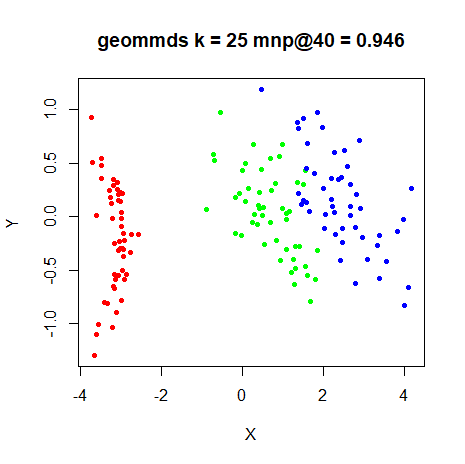
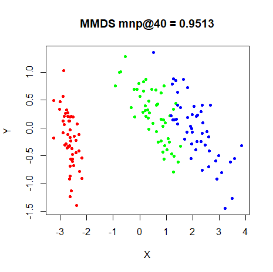|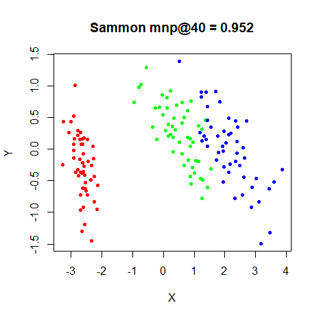

### s1k

|                             |                           |
:----------------------------:|:--------------------------:
|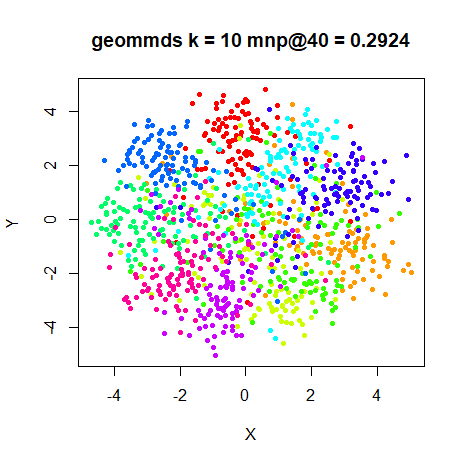
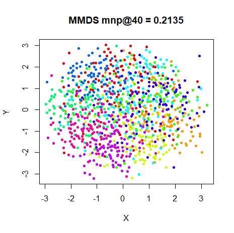|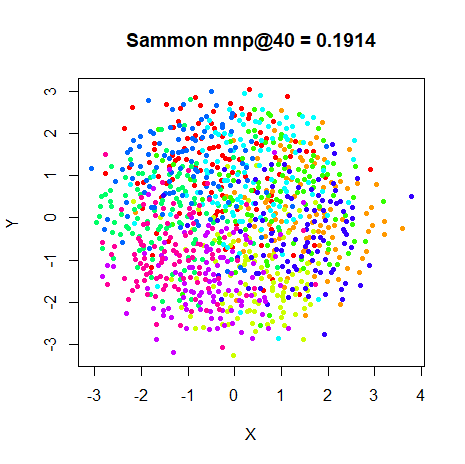

### oli

|                             |                           |
:----------------------------:|:--------------------------:
|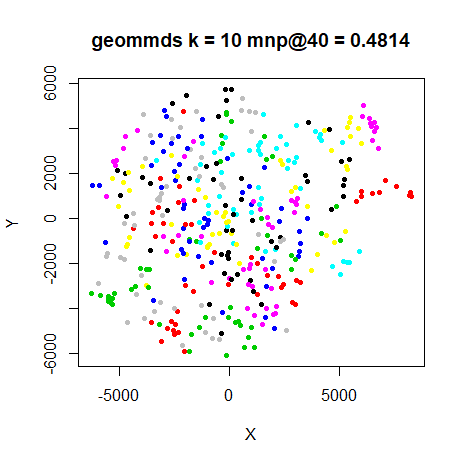
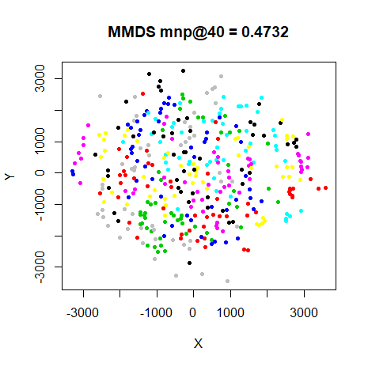|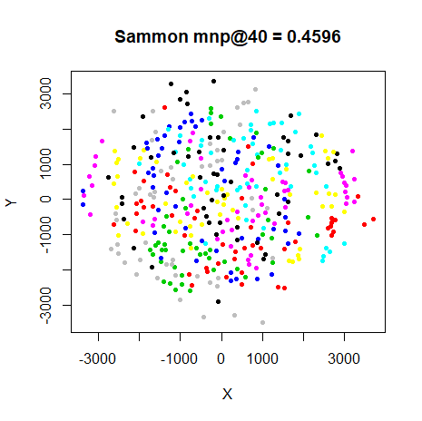

### frey

|                             |                           |
:----------------------------:|:--------------------------:
|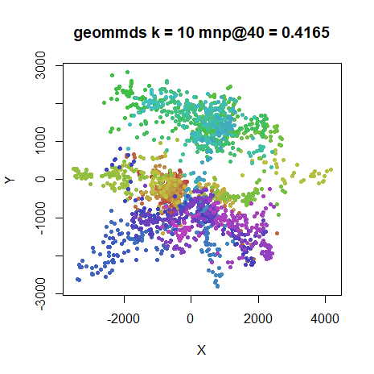
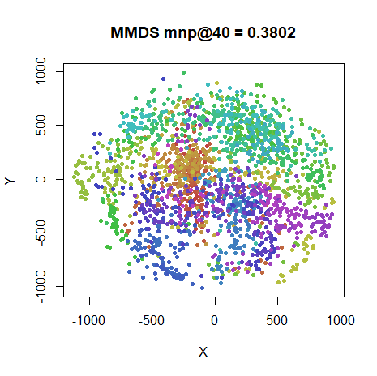|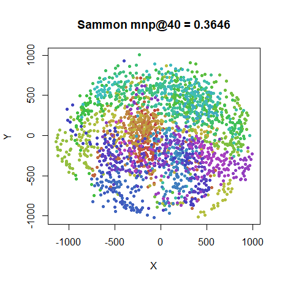

### coil20

|                             |                           |
:----------------------------:|:--------------------------:
|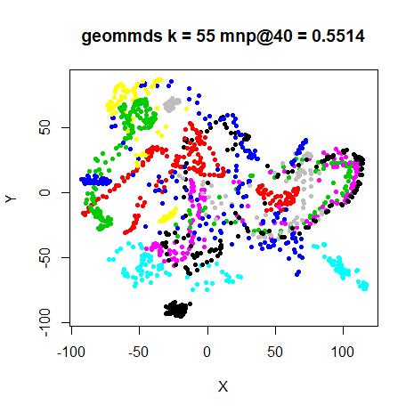
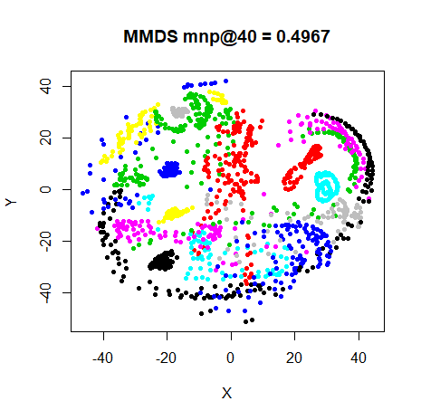|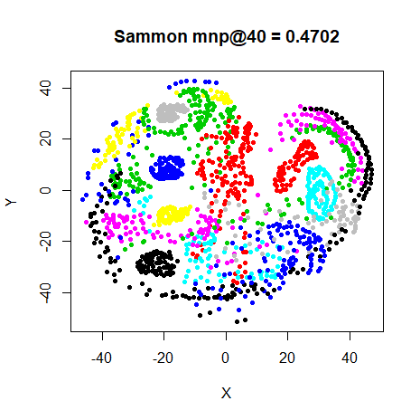

### mnist

|                             |                           |
:----------------------------:|:--------------------------:
|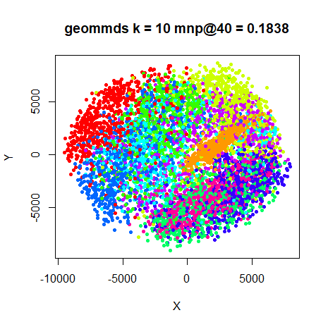
|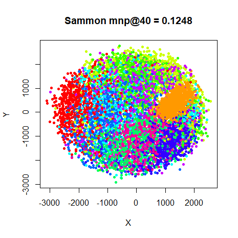

### fashion

|                             |                           |
:----------------------------:|:--------------------------:
|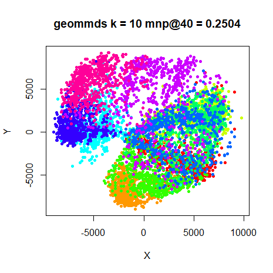
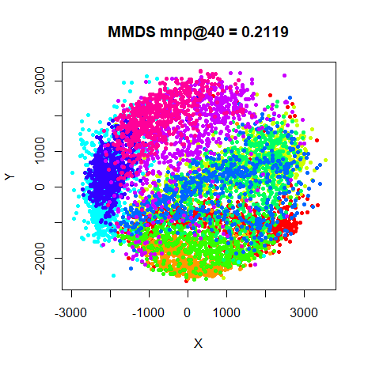|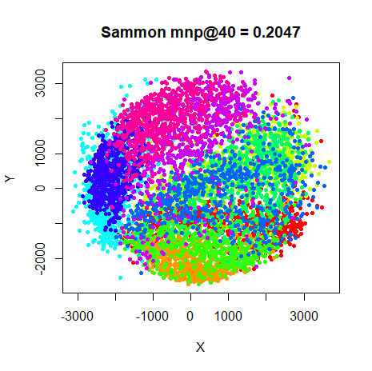

## Conclusions

At least you can say that running these methods does *something*, compared to 
PCA. The datasets all show similar behavior, but `iris` and `swiss` are 
outliers. `iris` is well separated by PCA, and applying MMDS improves matters
further. This is a low-dimensional dataset that doesn't need your
fancy-dan neighbor embedding methods. `swiss` is also notable for being 
correctly unfolded by GMMDS, as we'd expect. We don't really see such a drastic
difference for the other datasets, which suggests that, if there are low 
dimensional manifolds lurking inside them, they aren't so low-dimensional that
trying to reproduce the geodesic distances is worthwhile.

In terms of the approximations to GMMDS I tried with `swiss`, Ball-MMDS is much
more successful than knn-MMDS. As GMMDS isn't that useful in general, I haven't
bothered looking into exactly why knn-MMDS doesn't do as well. The 10%
cutoff used in Ball-MMDS was also used successfully in the Stochastic Proximity
Embedding paper (which also successfully unrolls the Swiss Roll), which is why
I also used it here. But no motivation for that choice is given in the SPE
paper, and there doesn't seem to be any good advice out there for principled
choice of a cut-off. At least the knn version, could appeal to something like 
perplexity as used in SNE. Unfortunately, it doesn't do as well with a choice
of $k$ that works perfectly well for GMMDS. Fortunately, as we shall discuss
more below, GMMDS doesn't work so great that spending more time thinking about
and trouble-shooting cheaper ways to approximate GMMDS is worth doing.

`s1k` does show some indication that GMMDS was having some effect. There's a 
hint of the ten overlapping clusters in the MMDS and Sammon map plots, but it's
more obvious in the GMMDS result, which renders them as less overlapping wedge
shapes. It might instructive to compare this plot with the ASNE and t-SNE plots
which show a progressive globularization of the clusters. If the distances
could be somehow stretched further, GMMDS might be a contender.

The `oli`vetti faces dataset is about as well represented by these
methods as ASNE and SSNE manage. This may indicate that `oli` should be 
considered one of the easier datasets to get meaningful results from.

For the `frey` faces dataset. The GMMDS results seem to show a better separation
of the 3 rough clusters than the others or even the ASNE or SSNE results.
Conversely, for `coil20`, there's more discernable clustering with MMDS than
with GMMDS.

Finally, for the larger datasets `mnist6k` and `fashion6k`, all results are 
pretty hopeless. Barely any more detail than PCA, just with the data expanded
into a ball. GMMDS achieves nothing over MMDS. Compare with the ASNE and SSNE
results, which do a better (although not brilliant) result.

MMDS and Sammon behave very very similarly across all datasets, especially when
it comes to MNIST and Sammon map. No surprises there, see for example, 
[Christopher Olah's explanation](http://colah.github.io/posts/2014-10-Visualizing-MNIST/).
Nice to have it reconfirmed with some extra datasets here, though.

From this performance, distance-based embedding methods don't seem all that 
useful for even moderate-sized datasets. In particular, the fascination that
the Swiss Roll dataset exerts over researchers seems like a red herring: rather
than a nice smooth low-dimensional manifold, most datasets seem more like MNIST:
blobby and clustery, although MNIST admittedly seems to be unusually blobby
and clustery. But I wouldn't be surprised if geodesics *are* useful, even if not
directly as in GMMDS. For example, see its use in this paper on 
[intrinsic dimensionality](dx.doi.org/10.1038/srep31377) calculations.
