Up: [Documentation Home](https://jlmelville.github.io/smallvis/).

There have been a series of papers on multiscale approaches to avoid having to
choose a fixed perplexity value. First there was 
[multiscale SNE](https://www.elen.ucl.ac.be/Proceedings/esann/esannpdf/es2014-64.pdf),
then [multiscale JSE](https://dx.doi.org/10.1016/j.neucom.2014.12.095), and
most recently [multiscale t-SNE](http://hdl.handle.net/2078.1/200844).

The first two papers describe a fairly complex approach to using multiple 
perplexities: in the high-dimension space, multiple probabilities, $P$, are
calculated with different perplexity values and the average is used. But not all
probabilities are used initially: just the probability with the largest
perplexity. As the initialization proceeds, $P$ matrices associated with smaller
perplexities are introduced into the average. In the low-dimension space,
averages of multiple probability matrices are also used, relying on the output
kernel having a precision parameter which can be adjusted with reasoning 
analogously to the perplexity.

In the third paper, however, there are two simplifications: for the high-dimension
space, all the probabilities are used in the average immediately, and in the
low-dimension space, the standard t-SNE Student-t kernel is used, which doesn't
have an adjustable parameter 
(although it can be 
[finessed into having one](https://jlmelville.github.io/smallvis/hssne.html)),
so there are no multiple probabilities or averaging to deal with.

This simplification of implementation has motivated me to implemented it into
`smallvis`, and it can be accessed by using `perplexity = "multiscale"`. Like
using the 
[intrinsic dimensionality perplexity](https://jlmelville.github.io/smallvis/idp.html) 
approach, the default is to use perplexities in increasing powers of 2 from 8 to
128 (which covers most practical uses), but you can provide you own list of
perplexities by passing a list, with `"multiscale"` as the first element,
and a vector perplexities as the second element, e.g. 
`perplexity = list("multiscale", c(5, 50, 500))`.

My main concern with this approach is that using an average probability like
this isn't much different from using a single probability that's close to the
average of the perplexities used, although the authors of the multiscale t-SNE
paper note that the tails are a little fatter than a single Gaussian.

## Datasets

See the [Datasets](https://jlmelville.github.io/smallvis/datasets.html) page.


## Settings

We shall use unexceptional settings for t-SNE with small datasets, except 
initializing with my usual favored method of scaled PCA. An example setting is:

```R
iris_ms <- smallvis(iris, perplexity = "multiscale", Y_init = "spca", eta = 100, exaggeration_factor = 4, stop_lying_iter = 100)
```

For comparison, we shall use the same settings but with a single perplexity of
30:

```R
iris_p30 <- smallvis(iris, perplexity = 30, Y_init = "spca", eta = 100, exaggeration_factor = 4, stop_lying_iter = 100)
```

Why did I choose a perplexity of 30 to compare with? First, using standard
single-perplexity t-SNE I looked at whether you can reliably get back to an
"effective perplexity" for the input probabilities after they have been
normalized and symmetrized, by row-normalizing the input matrix and then
calculating the median perplexity across each probability distribution. For
a variety of datasets and perplexity values, the answer is you pretty much
can. In general the reported median perplexity is inflated by a few units, but
I can live with that. For the multiscale probabilities I then carried out the
same row-normalization and looked at the median perplexity for the datasets
considered here (`smallvis` will report this an "effective perplexity" if
you set `verbose = TRUE`). I tabulate the effective perplexities in the
"Results" section and as we will see below, a perplexity of 30 is a reasonable
guess for a comparison.

## Evaluation

Apart from visualizing the results, the mean neighbor preservation of the 30
closest neighbors, in line with the `perplexity` used in the comparison plots is
used to provide a rough quantification of the quality of the result. On the
plots, this is labelled as `mnp@30`. This is not fair on the multiscale
t-SNE results because there's no reason to believe they are focussed on preserving
exactly 30 neighbors, so don't take it too seriously. A metric like the RNX AUC
curve used in the multiscale t-SNE paper would probably be better.

## Results

The multiscale t-SNE plots are on the left, the standard t-SNE on the right.

### iris

|                             |                           |
:----------------------------:|:--------------------------:
|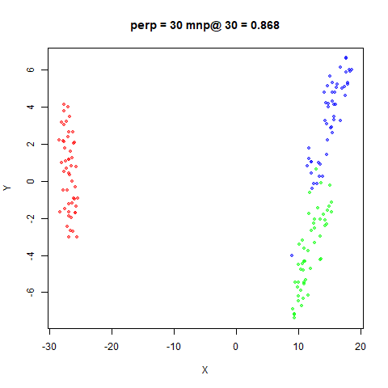

### s1k

|                             |                           |
:----------------------------:|:--------------------------:
|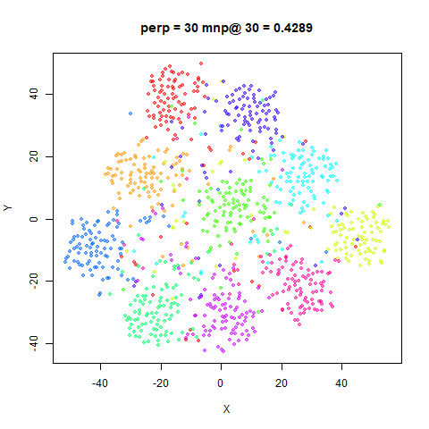

### oli

|                             |                           |
:----------------------------:|:--------------------------:
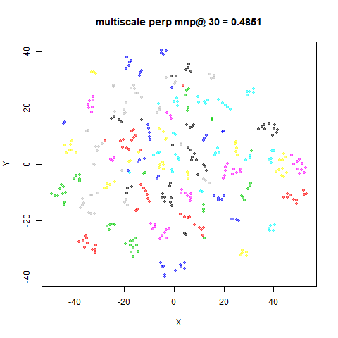|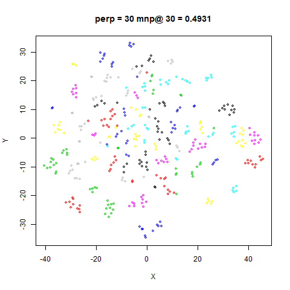

### frey

|                             |                           |
:----------------------------:|:--------------------------:
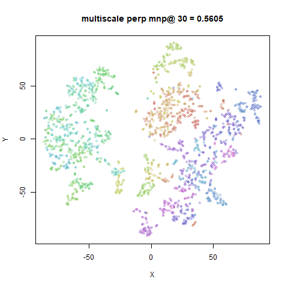|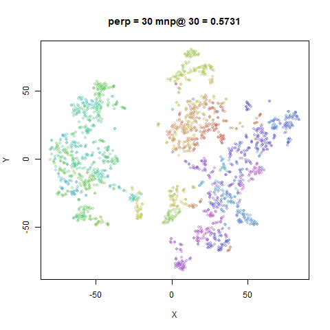

### coil20

|                             |                           |
:----------------------------:|:--------------------------:
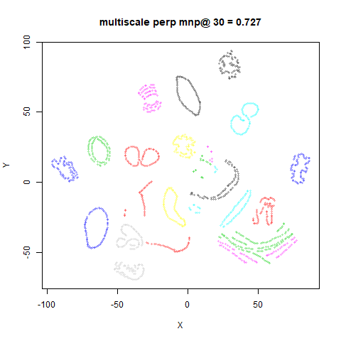|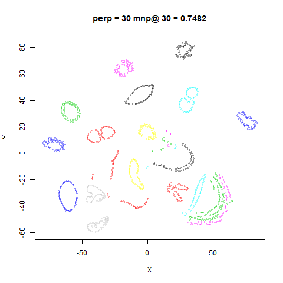

### mnist6k

|                             |                           |
:----------------------------:|:--------------------------:
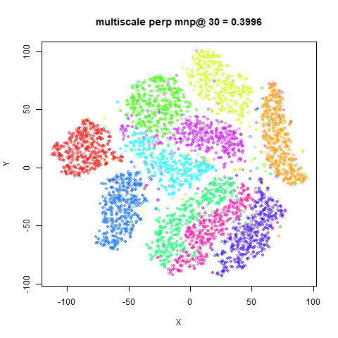|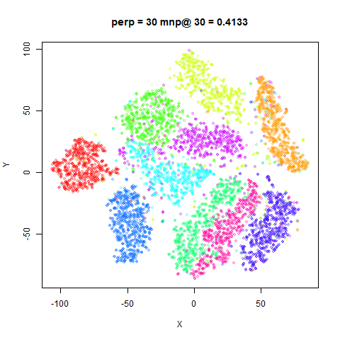

### fashion6k

|                             |                           |
:----------------------------:|:--------------------------:
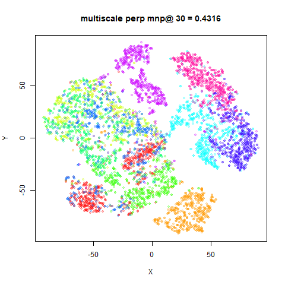|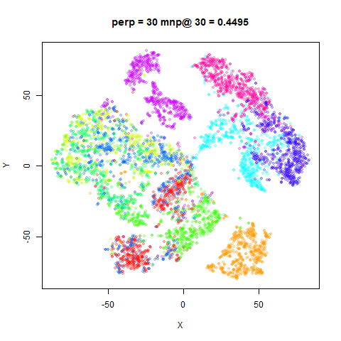


As expected, the mean neighbor preservation values are slightly lower for
multiscale t-SNE, but that's not very important. Visually, the two sets of
images are very similar. This doesn't surprise me that much given 
[how little an effect perplexity seems to have](https://jlmelville.github.io/smallvis/perplexity.html) 
when you use a scaled PCA initialization.

Here is the table of effective perplexities for both methods over the datasets
examined:

| Dataset   | multiscale t-SNE | t-SNE perp = 30 |
|-----------|:----------------:|:---------------:|
| iris      | 24.98	           | 32.45           |
| s1k       | 32.01	           | 32.44           |
| oli       | 28.47	           | 31.08           |
| frey      | 31.57	           | 33.67           |
| coil20    | 28.27	           | 30.96           |
| mnist6k   | 33.17	           | 36.53           |
| fashion6k | 35.84	           | 36.89           |

As you can see, while there is a bit of deviation across the dataset, a 
perplexity of 30 seems in the right ballpark.

## Conclusions

For the datasets studied here, I don't see a big need for multiscale t-SNE, 
although it doesn't seem to produce bad results. At least with the default
settings in `smallvis`, it doesn't produce results wildly different from
setting the perplexity to 30, but requires a longer probability calibration
time.

Up: [Documentation Home](https://jlmelville.github.io/smallvis/).
