Up: [Documentation Home](https://jlmelville.github.io/smallvis/).

[NeRV](http://www.jmlr.org/papers/v11/venna10a.html) and 
[JSE](https://dx.doi.org/10.1016/j.neucom.2012.12.036) are methods to related
to SNE that both use a weighted sum of two different Kullback-Leibler 
divergences.

NeRV is the simplest, with the cost function being:

$$
C_{NeRV} = \lambda D_{KL}(P||Q) + \left(1 - \lambda \right) D_{KL}(Q||P) = \\
\lambda \sum_{ij} p_{ij} \log \left( \frac{p_{ij}}{q_{ij}} \right)
+
\left(1 - \lambda \right) \sum_{ij} q_{ij} \log \left( \frac{q_{ij}}{p_{ij}} \right)
$$

The JSE cost function is related to the Jensen-Shannon divergence:

$$
C_{JSE} = D_{JS}(P||Q) =  \frac{1}{1 - \kappa}D_{KL}(P||Z) + \frac{1}{\kappa} D_{KL}(Q||Z)
$$

where $Z$ is a mixture of $P$ and $Q$:
$$
Z = \kappa P + \left(1- \kappa \right)Q
$$

Both methods use the same normalization and output kernel as ASNE, and by 
setting the weighting parameter in the cost function appropriately, ASNE results
can be generated. For NeRV this means setting $\lambda = 1$ and for JSE, it's
when $\kappa = 0$. This does unfortunately mean you have to remember that the
two Greek symbols, while doing basically the same job in NeRV and JSE, have the
opposite effect on each other when changing the weighting parameter from 0 to 1 
in the cost functions.

The NeRV paper presents an information retrieval interpretation of the cost
function, where $\lambda$ controls the relative weight of false positive to
false negative penalization. This makes sense when you consider that the normal
Kullback-Leibler divergence penalizes small output probabilities that have 
large input probabilities, i.e. pairs of points that should have close distances
but are too far apart. These can be considered false negatives in the 
information retrieval interpretation. Conversely, large output probabilities
with small input probabilities suffer a much smaller penalty. This corresponds
to points that ought to be placed far away but end up close together. These
are false positives. So the standard KL divergence used in SNE can be considered
to do its best to preserve local neighborhoods, at the cost of allowing points
that aren't neighbors to end up close together. By using a KL divergence where
the role of $P$ and $Q$ is reversed, we get a cost function that places a larger
importance on penalizing false positives, i.e. a layout where neighborhoods
aren't fully reproduced, but if two points *are* close together, we can be
reasonably confident they really should be. 

By blending the two divergences, we may get a cost function that can balance
these opposing forces, and provide an extra "push" to some points that could
work equivalently to replacing the Gaussian output kernel in ASNE and SSNE with
the t-distributed kernel in t-SNE.

## Gradients

The JSE and NeRV gradients can be written as:

$$
\frac{\partial C}{\partial \mathbf{y_i}} = 
  2 \sum_{j} \left(
  k_{ij}
  +
  k_{ji}
  \right)
\left(\mathbf{y_i} - \mathbf{y_j}\right)
$$

where $\mathbf{y_i}$ is the output coordinate of point $i$, and $k_{ij}$ is the
force constant between points $i$ and $j$, with different methods producing
different force constants. Because of the point-wise nature of the normalization
used in both methods, the force constant matrix $K$ is not symmetric, so 
$k_{ij} \neq k_{ji}$.

For NeRV, the force constant is:

$$
k_{ij} =
\lambda
\left(
  {p_{ij}} - {q_{ij}}
\right)
+
\left(1 - \lambda\right) q_{ij}
\left[
\log
\left( \frac{p_{ij}}{q_{ij}} \right)
+
D_{KL}(Q||P)
\right]
$$

where $D_{KL}(Q||P)$ is the "reverse" Kullback-Leibler divergence.

For JSE, the force constant is:

$$
k_{ij} = 
\frac{q_{ij}}{\kappa}
\left[
\log
\left( \frac{z_{ij}}{q_{ij}} \right)
+
D_{KL}(Q||Z)
\right]
$$

## Datasets

See the [Datasets](https://jlmelville.github.io/smallvis/datasets.html) page.

## Evaluation

Apart from visualizing the results, the mean neighbor preservation of the
40 closest neighbors is used to provide a rough quantification of the quality
of the result, labelled as `mnp@40` in the plots.

## Settings

Example commands for using NeRV and JSE are given below for the `iris` dataset.

```
# default NeRV lambda = 0.9
iris_nerv <- smallvis(iris, scale = FALSE, perplexity = 40, Y_init = "spca", method = "nerv", ret_extra = c("dx", "dy"), eta = 0.1, max_iter = 2000, tol = 1e-8)

# non-default NeRV lambda = 0.1
iris_nerv0_1 <- smallvis(iris, scale = FALSE, perplexity = 40, Y_init = "spca", method = list("nerv", lambda = 0.1), 
ret_extra = c("dx", "dy"), eta = 0.1, max_iter = 2000, tol = 1e-8)

# default JSE kappa = 0.5
iris_jse <- smallvis(iris, scale = FALSE, perplexity = 40, Y_init = "spca", method = "jse", ret_extra = c("dx", "dy"), eta = 0.1, max_iter = 2000, epoch = 100, final_momentum = 0.25, tol = 1e-8)
```

The default `lambda` is based on some applications of NeRV by
[Yang, Peltonen and Kaski](http://proceedings.mlr.press/v38/yang15a.html). 
JSE's default `kappa` was set to 0.5 in accord with the settings
used for JSE in the 
[multiscale JSE paper](https://dx.doi.org/10.1016/j.neucom.2014.12.095).

On the `fashion6k` dataset, JSE with `kappa = 0.9` optimizes stably and seems to
be converging before suddenly blowing up. The onset of this seems to be a single
point being moved a large distance. It appears to be related to the
`final_momentum` parameter, rather than minimum step size (controlled by
`min_gain`).

Apart from this slight wrinkle, the DBD method does seem to do an ok job at
optimizing. Futher improvements to the final error can be realized by starting a
new optimization with the final DBD coordinates using L-BFGS, but there's no
large change to the output coordinates.

In the cases where divergence occurred, the optimization was carried out by 500
steps of DBD (with `final_momentum = 0.5`) followed by L-BFGS optimization
allowing another 500 function or gradient evaluations.

An example of this two-stage optimization (along with specifying a non-default
value of `kappa`) is given by:

``` 
fashion_jse0_9_short <- smallvis(fashion6k, scale = FALSE, perplexity = 40, Y_init = "spca", method = list("jse", kappa = 0.9), ret_extra = c("dx", "dy"), eta = 0.1, max_iter = 500, tol = 1e-8, final_momentum = 0.25)

fashion_jse0_9_shortl <- smallvis(fashion6k, scale = FALSE, perplexity = 40, Y_init = fashion_jse0_9_short$Y, method = list("jse", kappa = 0.9), ret_extra = c("dx", "dy"), max_iter = 500, tol = 1e-8, epoch = 10, opt = list("l-bfgs", max_fg = 500))
```

## Results: NeRV

Results are show in the order where the top left image is the setting closest to
the pure "reverse" KL divergence and the bottom right image is the ASNE result,
which represents the pure "forward" KL divergence. Going from left to right and
then top to bottom, more of the forward KL divergence is added to the cost
function, which is indicated by the value of `lambda` increasing.

### iris

|                             |                           |
:----------------------------:|:--------------------------:
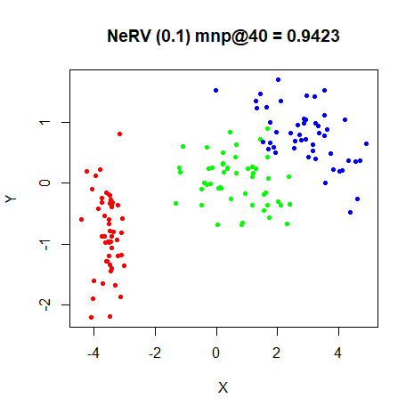|
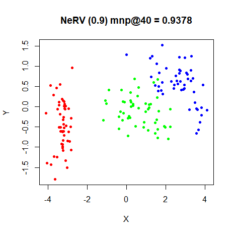|

### s1k

|                             |                           |
:----------------------------:|:--------------------------:
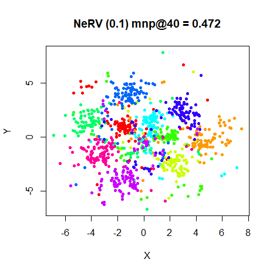|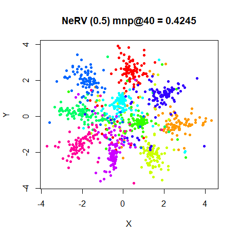
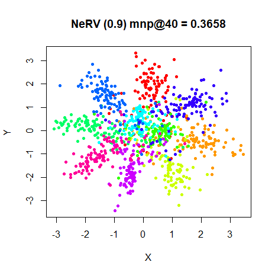|

### oli

|                             |                           |
:----------------------------:|:--------------------------:
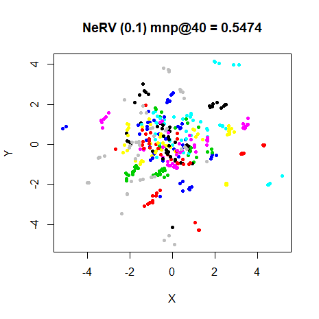|
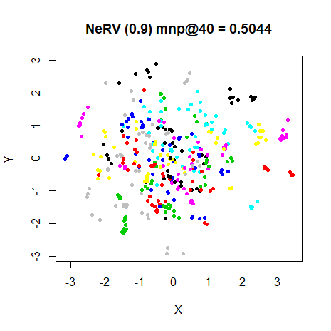|


### frey

|                             |                           |
:----------------------------:|:--------------------------:
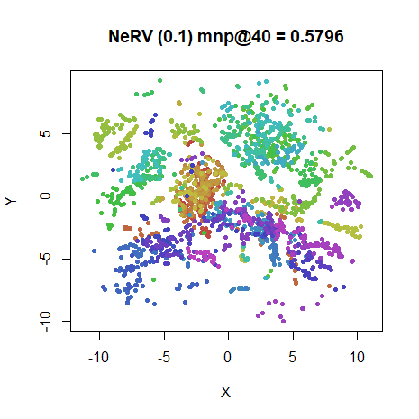|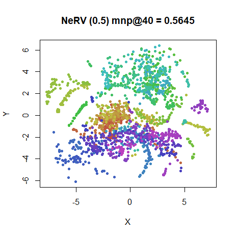
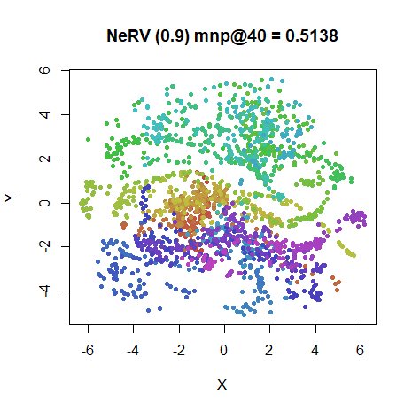|


### coil20

|                             |                           |
:----------------------------:|:--------------------------:
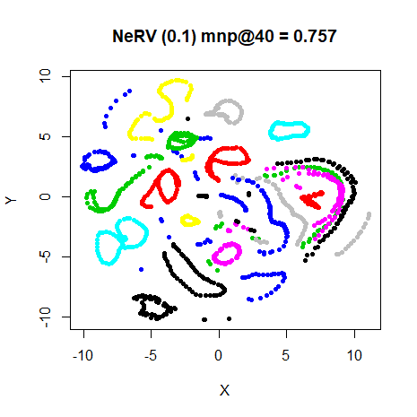|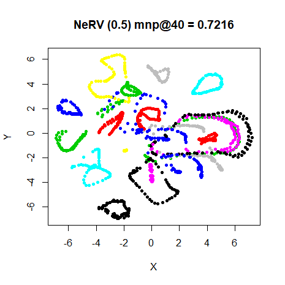
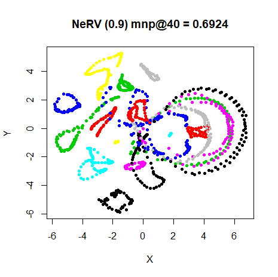|


### mnist

|                             |                           |
:----------------------------:|:--------------------------:
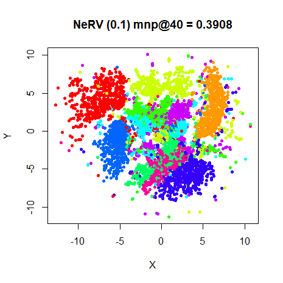|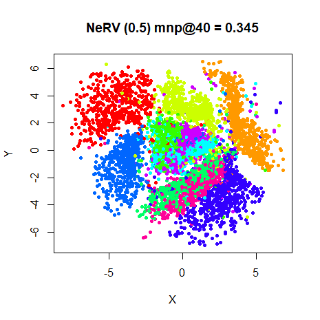
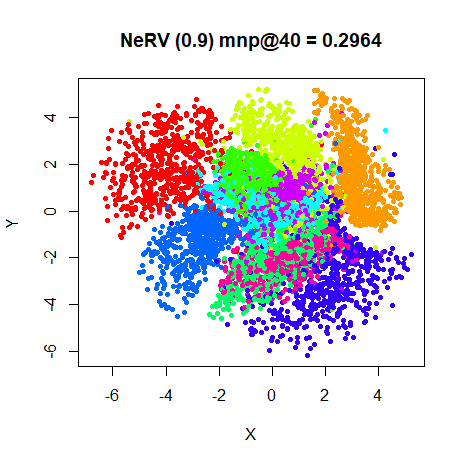|


### fashion

|                             |                           |
:----------------------------:|:--------------------------:
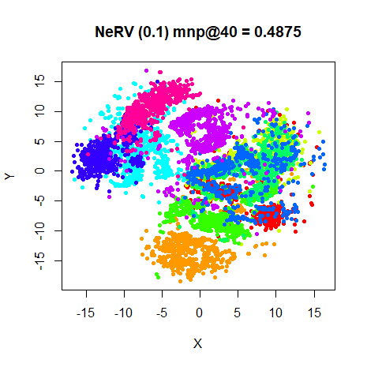|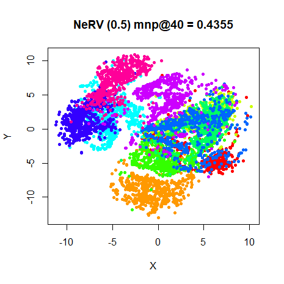
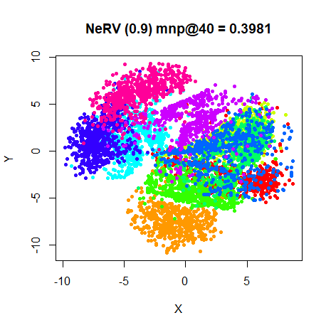|


NeRV results with `lambda = 0.9` are very similar to ASNE for the smaller 
datasets. But there is a mild improvement in separation of clusters for `coil20`,
`fashion6k` and `mnist`.

## Results: JSE

We're using the same ordering of results as for NeRV: top left image is the the
setting closest to the pure "reverse" KL divergence and the bottom right image
is the ASNE result.  Going from left to right and then top to bottom, more of
the forward KL divergence is added to the cost function, which for JSE is
indicated by the value of `kappa` decreasing.


### iris

|                             |                           |
:----------------------------:|:--------------------------:
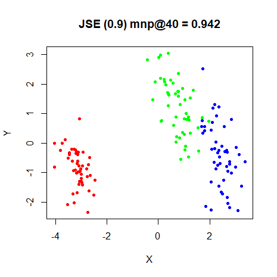|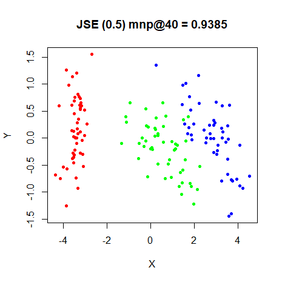
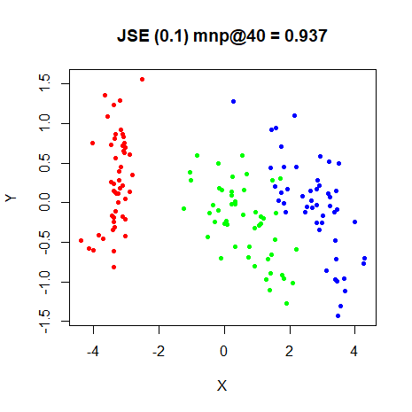|

### s1k

|                             |                           |
:----------------------------:|:--------------------------:
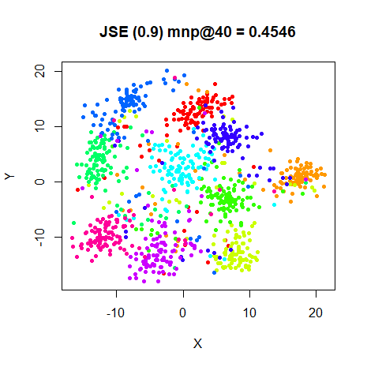|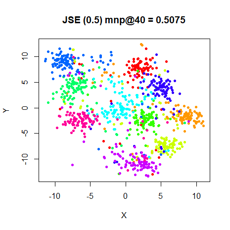
|

### oli

|                             |                           |
:----------------------------:|:--------------------------:
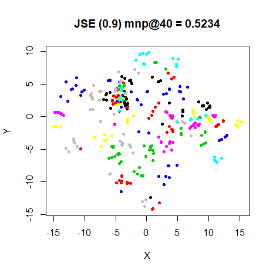|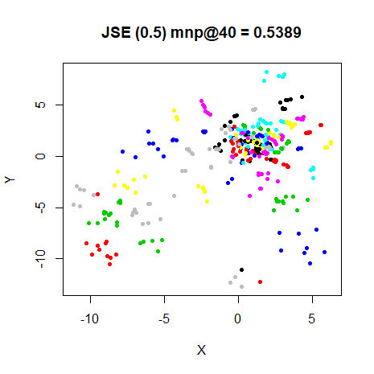
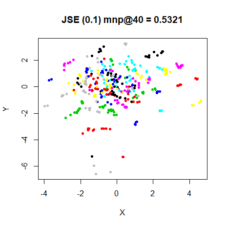|

### frey

|                             |                           |
:----------------------------:|:--------------------------:
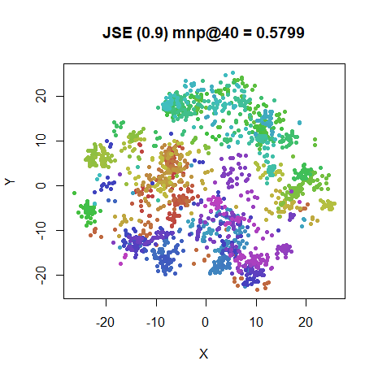|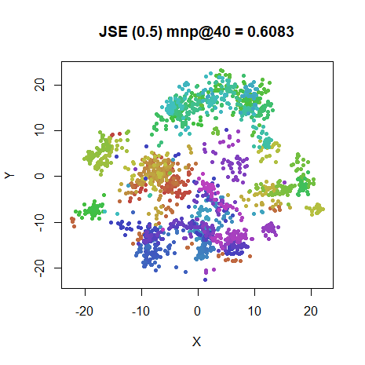
|

### coil20

|                             |                           |
:----------------------------:|:--------------------------:
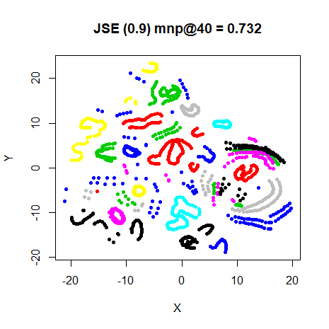|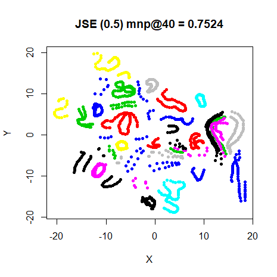
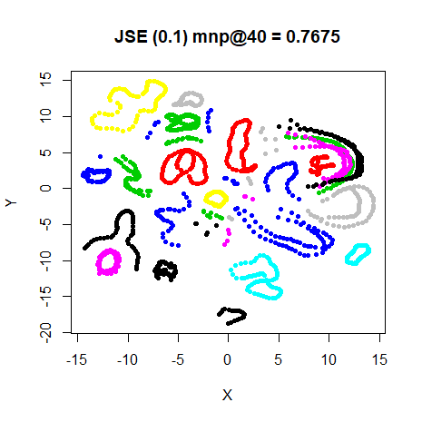|

### mnist

|                             |                           |
:----------------------------:|:--------------------------:
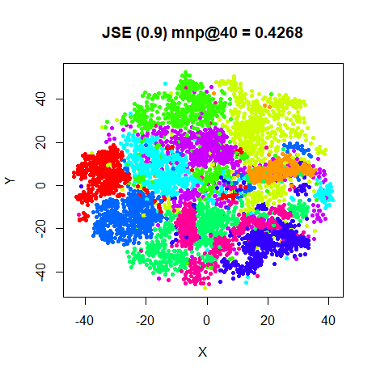|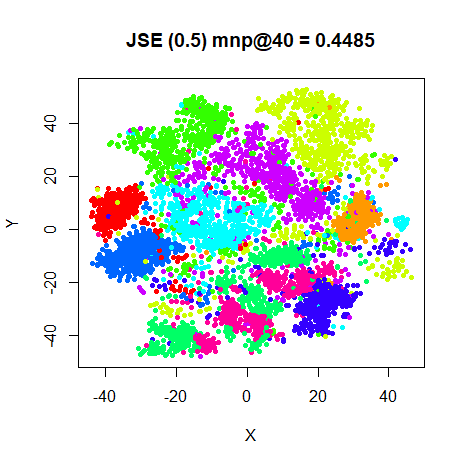
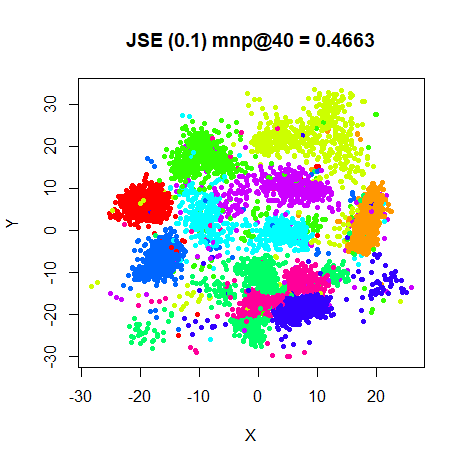|

### fashion

|                             |                           |
:----------------------------:|:--------------------------:
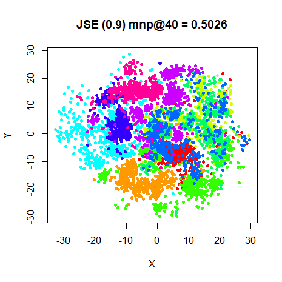|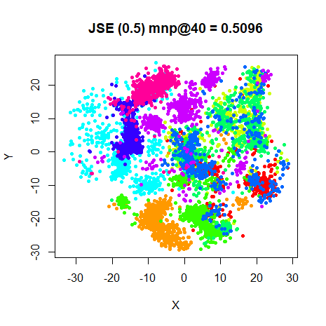
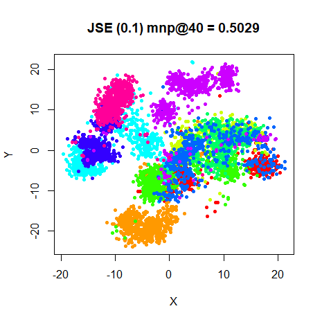|

## L-BFGS Optimization

The requirement for the `fashion6k` dataset to avoid divergence by using L-BFGS
after a certain number of DBD steps raises the question of whether L-BFGS 
can just be used for the entire optimization. I repeated some of the above 
runs where there was a heavier emphasis on the "reverse" KL divergence (NeRV
with `lambda = 0.1` and JSE with `kappa = 0.9`) using L-BFGS and allowing up
to 2,000 gradient evaluations (`max_gr = 2000`). 

Unfortunately, like the results for 
[t-SNE with L-BFGS](https://jlmelville.github.io/smallvis/opt.html), results
are decidedly mixed: the minima found by L-BFGS are higher than found by DBD,
except for `oli`, where slightly lower-error minima were found 
(for both NeRV and JSE). For everything else, results are higher in error, lower
in neighborhood retrieval, but more importantly, don't look as good. A
particular blight is the presence of outliers, which JSE suffers from with 
`s1k`, `mnist` and `fashion6k` and NeRV produces with `s1k`. The results for
`s1k` are shown below. 

|                             |                           |
:----------------------------:|:--------------------------:
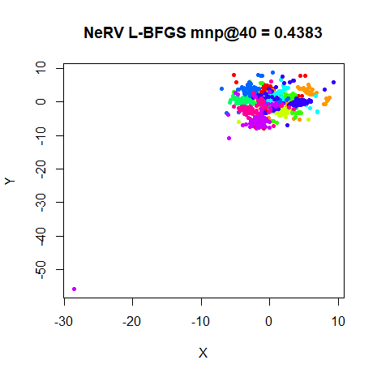|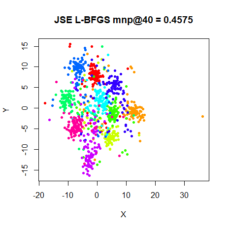

Is this a problem specific to either the implementation
of L-BFGS optimization or the definition of JSE and NeRV used in `smallvis`? 
Possibly. But if you
look at the t-SNE embedding or the '20NEWS' dataset using L-BFGS in the 
[Majorization Minimization](http://proceedings.mlr.press/v38/yang15a.html) paper
by Yang, Peltonen and Kaski, Figure 2, top central panel, also shows a similar
outlier problem.

## Conclusions

In terms of neighborhood retrieval, NeRV or JSE can outperform t-SNE: JSE is
able to do so on every dataset, and NeRV only fails with `mnist6k` and
`fashion6k`. Admittedly, those two are the larger, more difficult cases where we
would like to see results. But what is also apparent (and what is also noted in
the JSE paper) is that JSE provides results which are noticeably different from
ASNE over a larger range of its weighting parameter `kappa` than is achieved
with NeRV's `lambda` parameter. When NeRV does outperform t-SNE, it's always
with `lambda = 0.1`. So there may be values much smaller than `lambda = 0.1`
(the smallest value checked here) where NeRV can outperform t-SNE for the
`mnist6k` and `fashion6k` datasets. For JSE, the optimal value of `kappa` 
was either `0.1` or `0.5`, except for `iris`, where the optimal value was `0.9`.

However, I'm not sure I visually like the JSE or NeRV results better than t-SNE.
They are definitely better than ASNE, but looking at, for example, the `mnist6k`
results for JSE with `kappa = 0.1`, while quantitatively, it is superior to the
t-SNE results, visually, it's not as appealing in terms of separating the
clusters. Similar arguments can be applied to the `oli` and `s1k` results. But
on yet another hand, I think the `fashion6k` results for JSE with `kappa = 0.1`
might be a little bit better than the t-SNE results. The JSE paper also notes
the less well-clustered nature of the results for the MNIST digits, but claims
that this more accurately represents the presence of outlier (badly distored) 
digits. I'll admit that I haven't double-checked this, but I have no reason to
disbelieve the authors.

Finally, both NeRV and JSE have a more complicated gradient than t-SNE that
results in a slower optimization. Plus, as noted above, they both seem harder
to optimize than t-SNE. My current recommendation is to use DBD where possible,
but the default learning rate needs to be modified and the more the "reverse" KL
divergence is favored (i.e. `kappa` approaching 1 `lambda` approaching 0) the
more gentle an optimization is needed, so turn down the `momentum` and 
`final_momentum` parameters. L-BFGS doesn't seem like a good alternative, except
as a way to refine (if necessary) a short DBD run i.e. 200-500 iterations of 
DBD, then initialize the L-BFGS optimization with the DBD coordinates.

## Addendum: Normalization Comparison

Update (January 23 2018): Results based on fiddling with different 
[normalization](https://jlmelville.github.io/smallvis/norm.html) options in SNE
suggested that there might be some value in symmetrizing and then re-applying
the row-normalization used in ASNE. As JSE and NeRV use the same normalization,
it's worth seeing if this has much effect.

What would be great would be if the optimization problems we see when emphasising
the reverse KL divergence in the cost function was ameliorated with this 
normalization. Alas, this isn't the case: that `fashion` result still results 
in divergence. So below are some results under more mild conditions, using
`kappa = 0.5` for JSE and `lambda = 0.5` for NeRV. The left-hand images are
repeated from the results above. The right-hand images use the new normalization
technique (marked as "RSR" in the title of each plot):

### iris

|                             |                           |
:----------------------------:|:--------------------------:
|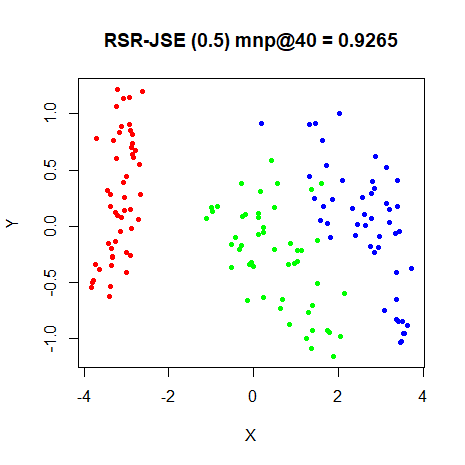
|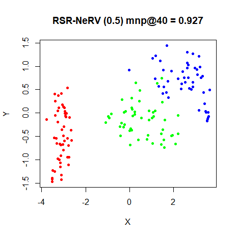

### s1k

|                             |                           |
:----------------------------:|:--------------------------:
|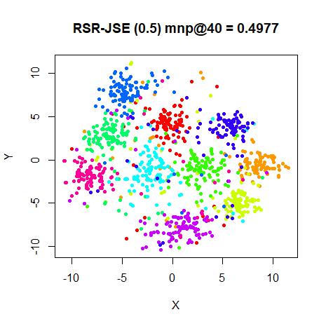
|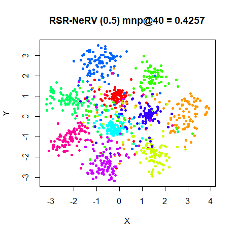

### oli

|                             |                           |
:----------------------------:|:--------------------------:
|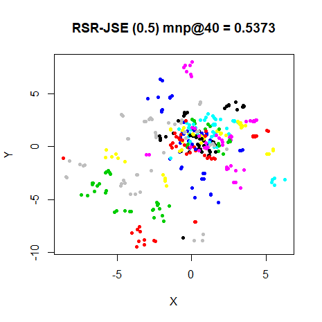
|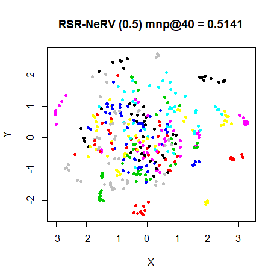

### frey

|                             |                           |
:----------------------------:|:--------------------------:
|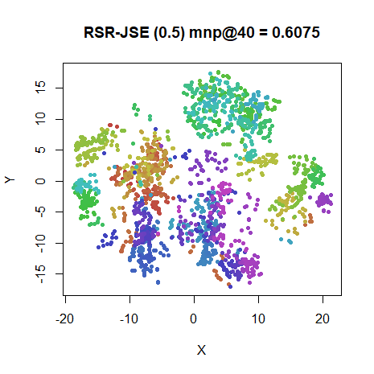
|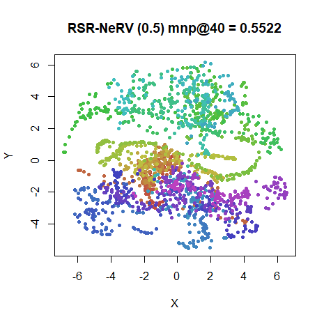


### coil20

|                             |                           |
:----------------------------:|:--------------------------:
|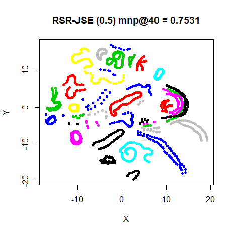
|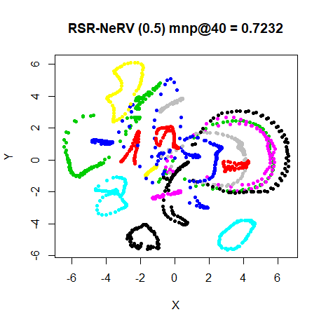


### mnist

|                             |                           |
:----------------------------:|:--------------------------:
|
|

### fashion

|                             |                           |
:----------------------------:|:--------------------------:
|
|

I'd say that these results aren't that different visually, and don't offer a
significant difference in terms of neighborhood retrieval either. It was worth
a shot.


### Addendum 2: JSE revisited

*March 19 2019*. I recently revisited the issues with optimizing JSE. In some
cases, the problem with one point becoming an outlier seemed to be due to an
elementary mistake I made in implementing the weight calculation: $\exp^(-x)$
becomes zero for not-all-that-large $x$. `abs(exp(-36) - .Machine$double.eps)`
is around `1e-17` and as far as R on my machine is concerned, `exp(-746) == 0`.
And bearing in mind that the exponent is the squared distance that means any
pair of points more than 27 units of distance apart will have a similarity of
zero. Because JSE is asymmetric, we only row normalize, and therefore under
those circumstances, it's possible for some of the rows of the $Q$ matrix to be
close to uniform, which leads to small force constants in the gradient. That
leads to the displacement of the two points to dominate the gradient, and we
already said that it's under these conditions that the distances are relatively
large. So it only takes a bit of an imbalance of how the points are distributed
and the differences can add up to a gradient that is relatively large.

The solution is to use the log-sum-exp trick. There are several places that 
discuss this: 

* https://statmodeling.stat.columbia.edu/2016/06/11/log-sum-of-exponentials/
* https://www.xarg.org/2016/06/the-log-sum-exp-trick-in-machine-learning/
* http://wittawat.com/posts/log-sum_exp_underflow.html

The upshot is that we can replace the raw exponential calculation with
with using shifted exponentials, where we substract the maximum value of 
$-d_{ij}^2$ from each distance before calculating the similarity. After 
normalization, the resulting probabilities are the same as in the unshifted
case, but with a much lower risk of numeric underflow.

I don't think I've seen this extended to the input similiarities calculated
during the perplexity calibration, although you could. I've not seen any
discussion of this being an issue anywhere, except in the 
[intrinsic t-SNE](https://link.springer.com/chapter/10.1007%2F978-3-319-68474-1_13)
where they note it can be an issue with un-normalized data, along with a
quote from van der Maaten, suggesting that the distances all be divided by a
suitably large number under these circumstances (most t-SNE implementations
already do something like this).

Additionally, I also was much more careful with making sure that we weren't
allowing zeros to creep into any matrix that needed to calculate a logarithm.
And I also reduced the epsilon used in these cases from `.Machine$double.eps`
to `.Machine$double.xmin`, which also cured some potential convergence issues
due where replacing zeros in the probability matrix (even using as small a value
as `.Machine$double.eps`) caused an accumulation of errors that made it look
like the cost function was increasing.

These changes made the JSE gradient calculation even slower than it was before.
But it did make it a bit easier to optimize. As discussed above, I was unable
to use standard DBD settings with `kappa = 0.9`. Now, the optimizations all
proceeded, even with `final_momentum = 0.8`. This is definitely progress. 
Unfortunately, I then noticed an outlier for `s1k` with `kappa = 0.5`. In this
case, it just seemed like the arrangement of the points meant that the best
bet for the outlier was to put as much of the probability mass on its nearest
two neighbors, which it could achieve by increasing the distance between all
other points.

At this point I was tempted to conclude that I either was incapable of coding
the JSE gradient correctly or this was a fundamental issue with JSE. It also
reminded me that the original ASNE paper laments the difficulty of optimizing
the ASNE cost function and later papers note that SSNE is much easier to work
with. Perhaps this is the sort of thing they had trouble with, except the more
complex JSE gradient, with its logs and divisions of numbers close to zero
was exacerbating the issues. Also, the JSE paper uses a perplexity annealing
approach to optimize JSE to avoid "poor local minima", so it may be that 
something like this has been seen by others.

Rather than pursue perplexity annealing (or something similar like starting at
a low value of `kappa` and slowly increasing it to the desired level), perhaps
symmetrizing JSE would also help, like it did with SNE. Changes to the gradient
for JSE are straightforward and entirely analogous to the difference between
the ASNE gradient and the SSNE gradient. 

I repeated the tests for JSE and symmetric JSE (SJSE) using the settings below:

```R
iris_sjse0.9 <- benchmark(perplexity = 40, Y_init = "spca", method = list("sjse", kappa = 0.9), eta = 10, max_iter = 2000, epoch = 50, mom_switch_iter = 250, tol_wait = 100)
iris_jse0.9 <- benchmark(perplexity = 40, Y_init = "spca", method = list("jse", kappa = 0.9), eta = 1e-3, max_iter = 2000, epoch = 50, mom_switch_iter = 250, tol_wait = 100)

iris_asne <- benchmark(perplexity = 40, Y_init = "spca", method = "asne", eta = 0.01, max_iter = 2000, epoch = 50, mom_switch_iter = 250, tol_wait = 100)
iris_ssne <- benchmark(perplexity = 40, Y_init = "spca", method = "ssne", eta = 10, max_iter = 2000, epoch = 50, mom_switch_iter = 250, tol_wait = 100)
```

We now use standard settings for JSE and SJSE, except that for JSE, I found that
the low value of `eta` means that there's a risk of early convergence unless
you tell `smallvis` to wait until after the first 100 iterations 
(`tol_wait = 100`). To compensate for the lower learning rate I increased the
number of iterations to 2000. This is probably unnecessary for practical uses
of JSE and SJSE.

The results below show the new JSE results on the left, with `kappa` slowly
decreasing. The equivalent SJSE results are on the right. In the last row for
each dataset are ASNE and SSNE results, which are analogous to setting `kappa =
0` for JSE and SJSE respectively.

### iris

|                             |                           |
:----------------------------:|:--------------------------:
|
|
|
|

### s1k

|                             |                           |
:----------------------------:|:--------------------------:
|
|
|
|

Note the outlier for JSE with `kappa = 0.5`. Bah!

### oli

|                             |                           |
:----------------------------:|:--------------------------:
|
|
|
|

### frey

|                             |                           |
:----------------------------:|:--------------------------:
|
|
|
|

### coil20

|                             |                           |
:----------------------------:|:--------------------------:
|
|
|
|

### mnist6k

|                             |                           |
:----------------------------:|:--------------------------:
|
|
|
|

### fashion6k

|                             |                           |
:----------------------------:|:--------------------------:
|
|
|
|

The degree of difference seems qualitatively larger between SJSE and JSE than 
that between ASNE and SSNE. This seems to be more pronounced for `kappa = 0.9`,
but the JSE and SJSE results are still quite similar. For example, there's a 
"mottling" sort of pattern for the clusters that form in both `fashion6k` and 
`mnist6k` with `kappa = 0.9`. It's definitely more pronounced with the JSE
results, but still apparent in SJSE. Also, SJSE results seem to produce 
better-spaced clusters with fewer outliers.

They may not represent an absolutely 100% authentic JSE experience, but 
I definitely prefer the SJSE results overall. They also optimize more easily
from the scaled PCA initialization with less risk of outliers. I have also 
implemented a symmetric NeRV (`method = "snerv"`), but haven't done any
proper benchmarking on it yet.

Finally, it's possible SJSE initialization could be a useful alternative to
perplexity annealing for producing stable embeddings with JSE.

Up: [Documentation Home](https://jlmelville.github.io/smallvis/).
