Warning: this may be the most obscure and confusing document I have written yet
and requires a fair degree of comfort with the exact workings of SNE to glean
even the remotest of interest from it.

Normalization in t-SNE can seem oddly specific, but makes sense when considered
as part of the lineage of 
[Asymmetric SNE](https://papers.nips.cc/paper/2276-stochastic-neighbor-embedding) and 
[Symmetric SNE (PDF)](https://www.cs.toronto.edu/~amnih/papers/sne_am.pdf). Here's the 
perplexity-based procedure:

For each point $i$, calculate a bandwidth for the Gaussian kernel associated 
with the input Euclidean distances. Choose it so that perplexity of the 
resulting probability distribution, is a user-specified value. The probabilities
are defined by normalizing all weights involving $i$. Normally, I refer to this
as point-wise normalization, but I'm going to call this row-normalization in
this document, because, at least in the `smallvis` implementation, it leads to 
$N$ probability distributions in the resulting $P$ matrix where every row sums 
to $1$. In ASNE, this is all that needs doing.

For SSNE and t-SNE, a further step is carried out where these row-wise
probabilities are symmetrized by averaging $p_{ij}$ and $p_{ji}$ and then a
single probability distribution is created by normalizing over the sum of the
symmetrized probabilities. Elsewhere I refer to this as pair-wise normalization,
but just I'll call this matrix-wise normalization here. By sticking with
"pair-wise" and "point-wise" normalization, we would have to distinguish between
the two schemes with two words that both begin with 'P', and things are
confusing enough already.

The [t-SNE paper](http://www.jmlr.org/papers/v9/vandermaaten08a.html) notes that
SSNE seems to produce results that are as good or better than ASNE. 
[Results using smallvis](https://jlmelville.github.io/smallvis/sne.html)
bear that out, but the fact is that neither ASNE nor SSNE work anywhere near as
well as t-SNE, so it's a little hard to tell if there are meaningful differences
between the different normalization methods.

A more interesting comparison would be between t-SNE and a t-distributed version
of ASNE, which we can call t-ASNE. If there is a difference between these
results, it would then be interesting to know the relative importance of the
symmetrization versus the matrix normalization.

Additionally, how important is the exact steps used in the t-SNE input
probability calibration? After all, we go to a lot of trouble to generate
row-normalized probabilities that reflect a specific perplexity, and then we
immediately destroy that structure by symmetrizing, and then creating an
entirely new probability distribution based on pairs. I've never seen anyone
worried about what the perplexity of the final matrix-normalized probability
distribution is, for example, or what significance it has for the resulting
topology. How important is the fact the row-normalized probabilities are used,
given that they are only indirectly used in the final optimization? Maybe the
row-normalized probabilities are most useful for determining a useful value for
the bandwidths, in which case could we use the un-normalized weights directly,
symmetrizing them and then doing the matrix normalization without converting
them to the intermediate row-normalized probabilities.

Finally, if matrix normalization *is* superior, is there a way to modify the
row-normalized probabilities so they behave more like the matrix normalization?
If not, and matrix normalization is clearly superior, this might have some
implications for methods like NeRV and JSE, which use the ASNE-style
row-normalization.

## Normalization Nomenclature

The exact order and type of symmetrization and normalization can be a bit
confusing. For the purposes of this document, the names of the embedding
methods, all based on t-SNE, will be renamed to t-*norm*-SNE, where *norm* is
a series of letters describing the type and order of operations
carried out during the normalization.

* R -- row normalization: $p_{ij} = v_{ij} / \sum_{k}^N v_{ik}$
* M -- matrix normalization: $p_{ij} = v_{ij} / \sum_{k,l}^N v_{kl}$
* S -- symmetrization: $p_{ij} = \left(v_{ij} + v_{ji} \right)/ 2$

I've used $p_{ij}$ as the result of the operations, and $v_{ij}$ as the
quantities that get operated on, but there's no implication that the results of
the operations are always normalized or that the quanities being operated on are
un-normalized.

With the nomenclature above we can express the normalization schemes as a series
of letters, which, when read left-to-right, gives the order in which they
should be carried out:

### t-ASNE is t-R-SNE

The original ASNE method only row-normalized the input weights. We can imagine
a t-distributed version, that under normal circumstances we would just call
t-ASNE. However, within the normalization scheme given above, we would call it
t-R-SNE.

### t-SNE is t-RSM-SNE

t-SNE carries out row normalization (R), followed by symmetrization (S) and
matrix normalization (M). So in our naming scheme, t-SNE can be called
t-RSM-SNE. 

## Non-standard Normalization

With the ASNE and SSNE normalization schemes defined, we can now define some
other normalization schemes that might help us determine the relative importance
of the steps within the scheme. To stay within the basic realm of SNE, we always want to end up
with a normalized $P$ matrix (i.e. no un-normalized methods will be considered
here), but we are free to mix and match various combinations of R, M and S. Some
combinations are redundany however.

### Ordering and Redundancy

The order of the symmetrization and matrix normalization steps don't matter, as
long as there's no row-normalization step in between, so you could although we
relabeled t-SNE as t-RSM-SNE above, we can also call it t-RMS-SNE. We therefore
know we don't ever need to consider a scheme which contains "SM" if we've
already looked at the same scheme, but with "MS" in it.

Also, there's no point carrying out a matrix normalization followed directly
by row-normalization. So, for example, a normalization scheme like "RMR" is 
a waste of time as it's the same as doing "RR", which is clearly the same as
just "R".

With that out of the way, here are the different normalization schemes we'll
consider:

### t-SR-SNE

If symmetrization is helpful in the matrix-normalized t-SNE, could it be helpful
in a row-normalized version? In this scheme, we symmetrize the un-normalized
weights before row-normalizing them to probabilities.

### t-RSR-SNE

t-SR-SNE symmetrizes before row-normalizing, which is unlike t-SNE 
normalization, where the symmetrization happens *after* the initial 
row-normalization. So in this scheme, we will row-normalize and symmetrize
in the order that t-SNE does it, and then instead of matrix-normalize, 
row-normalize again. 

As an implementation notem if you were to do the matrix-normalization before the 
final row-normalization, i.e. carry out t-RSMR-SNE, the input probability matrix 
is the same as for t-RSR-SNE. The "RSM" procedure is what t-SNE does, so in
terms of implementation you could leave any existing t-SNE normalization code
unchanged, and then do the row-normalization at the end and get to this point.

### t-RM-SNE

Here normalization is done over the entire matrix, but no symmetrization is 
carried out. This gives a probability matrix that should be very close to that
used in t-SNE, except it's not symmetric. The symmetrization is carried out to
avoid any probabilities becoming too small during calibration, which usually
results in the gradient associated with that point always being small, so that
it's easy for it to become an outlier. This method should therefore show us
how bad the risk is for our test datasets, given the initialization and 
target perplexity values.

### t-M-SNE

This method doesn't use the row-normalized probabilities at all. It takes the
un-normalized weights, and then normalizes over the entire without doing any
row-normalization or symmetrization. 

This gives a probabilitiy matrix with similar properties to the t-SNE
probability matrix: symmetric, positive and summing to one. This decouples
the method by which you generate the input weights from the conversion into
probabilties. If it turns out there's a better way to generate the input
weights than the perplexity method, then we might not generate row probabilities
any more. For example, sometimes a nearest neighbor adjacency matrix is used
to enforce sparseness of the input matrix. If the edge of the graph are binary
(i.e. 1 or 0 meaning neighbor or not, respectively), to insist on the row 
normalization before the symmetrization and final matrix normalization would 
feel a bit cargo-cultish.

But if there's something about the row-normalization step that is vital for the 
performance of t-SNE, that would be good to know.

## Datasets

See the [Datasets](https://jlmelville.github.io/smallvis/datasets.html) page.

## Evaluation

Apart from visualizing the results, the mean neighbor preservation of the
40 closest neighbors is used to provide a rough quantification of the quality
of the result, labelled as `mnp@40` in the plots.

## Settings

Here's how to create these results (or something close to them), except for
t-SR-SNE, which required me to add special code to the initialization method.
Spoiler alert: given the results, I wasn't inclined to add this complexity to
the code base.

As usual, I use the `iris` dataset as an example.

```
# t-ASNE
iris_tasne <- smallvis(iris, scale = FALSE, perplexity = 40, Y_init = "spca", method = "tasne", ret_extra = c("dx", "dy"), eta = 0.1, max_iter = 2000, epoch = 100)

# t-SNE
iris_tsne <- smallvis(iris, scale = FALSE, perplexity = 40, Y_init = "spca", method = "tsne", ret_extra = c("dx", "dy"), eta = 10, max_iter = 2000, epoch = 100)

# t-RSR-SNE
iris_t_rsr_sne <- smallvis(iris, scale = FALSE, perplexity = 40, Y_init = "spca", method = "trsrsne", ret_extra = c("dx", "dy"), eta = 0.1, max_iter = 2000, epoch = 100, tol = 1e-8)

# t-M-SNE
iris_t_m_sne <- smallvis(iris, scale = FALSE, perplexity = 40, Y_init = "spca", method = "tmsne", ret_extra = c("dx", "dy"), eta = 10, max_iter = 2000, epoch = 100, tol = 1e-8)

# t-RM-SNE
iris_t_rm_sne <- smallvis(iris, scale = FALSE, perplexity = 40, Y_init = "spca", method = "trmsne", ret_extra = c("dx", "dy"), eta = 10, max_iter = 2000, epoch = 100, tol = 1e-8)
```

For methods where the $P$ matrix ended up row-normalized, optimization is
noticeably harder than for ASNE or t-SNE. I was unable to use a value of `eta`
larger than `0.1`, and results were seemed less converged after 1000 iterations.
To compensate, the number of iterations was increased to `maxiter = 2000`. For
matrix-normalized methods, `eta = 10` worked well. The t-SNE results here use
`eta = 10, max_iter = 20000` for consistency.

## Results

The title of each normalization method is on the plot, using the R/S/M labelling,
except for t-ASNE and t-SNE, where I have used their more expected names.

### iris

|                             |                           |
:----------------------------:|:--------------------------:
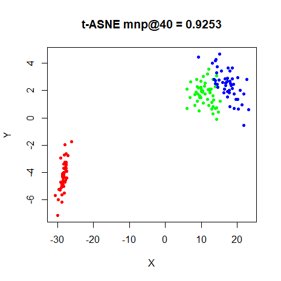|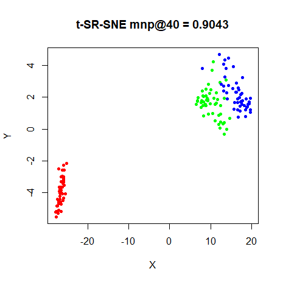
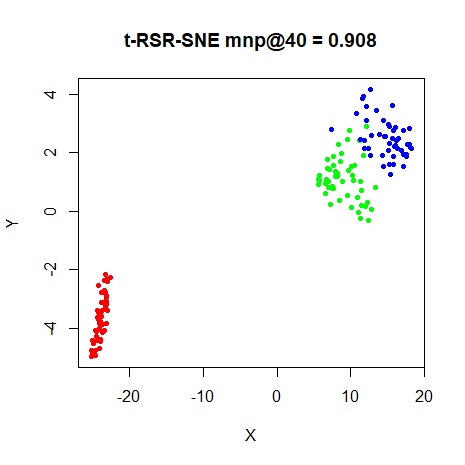|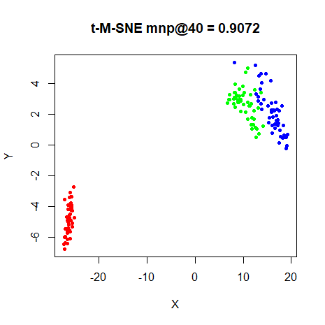
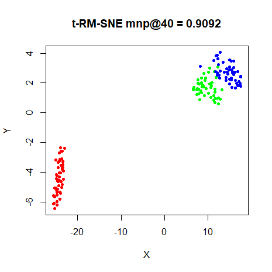|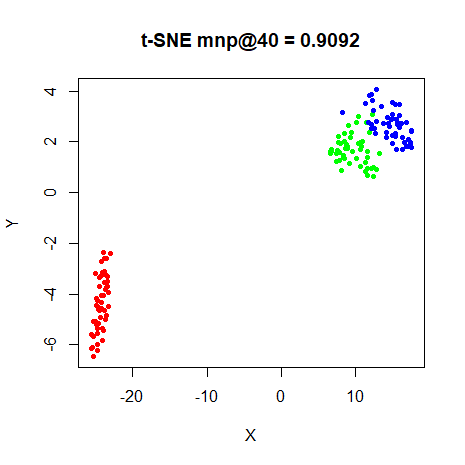

### s1k

|                             |                           |
:----------------------------:|:--------------------------:
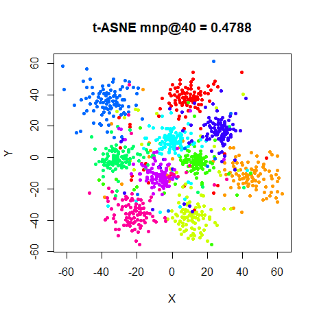|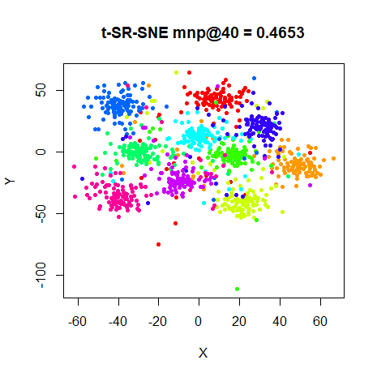
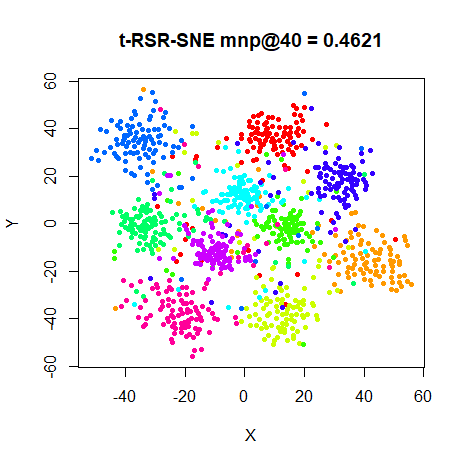|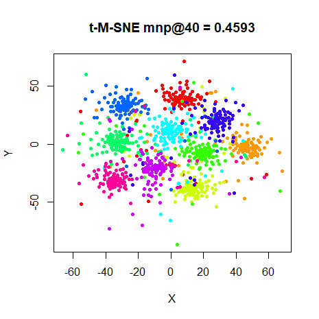
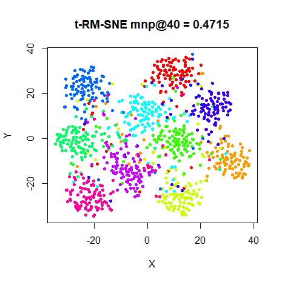|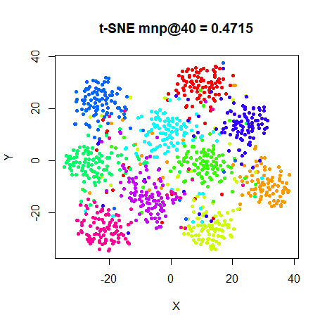

### oli

|                             |                           |
:----------------------------:|:--------------------------:
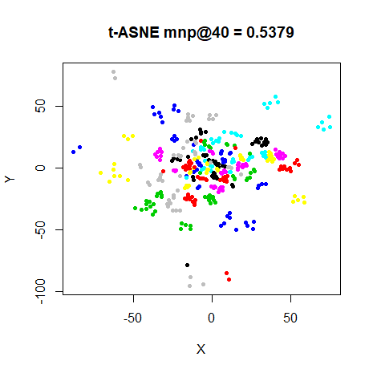|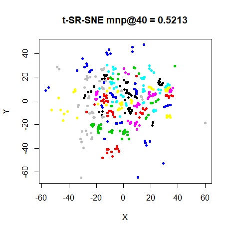
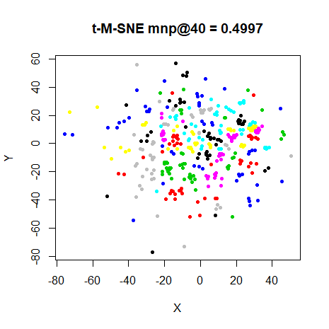|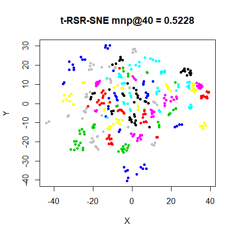
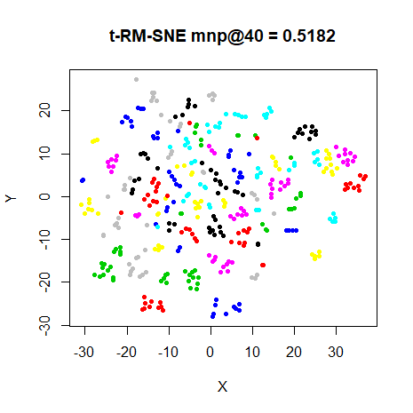|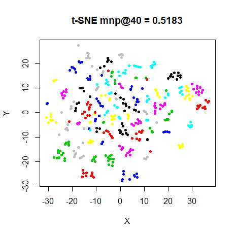

### frey

|                             |                           |
:----------------------------:|:--------------------------:
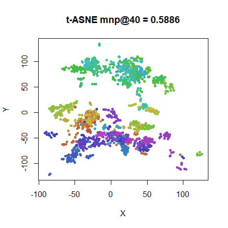|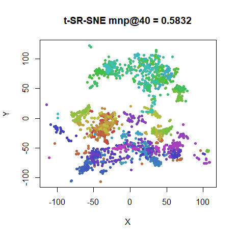
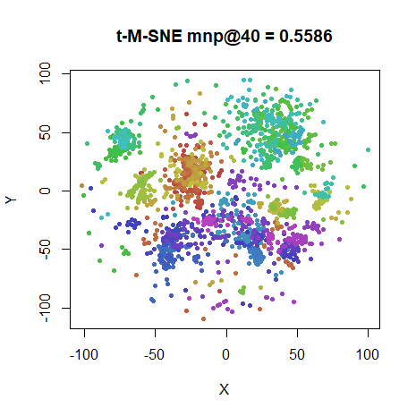|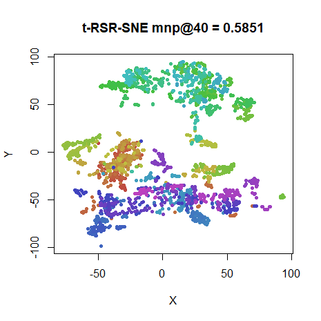
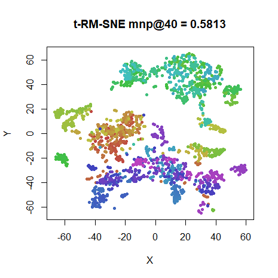|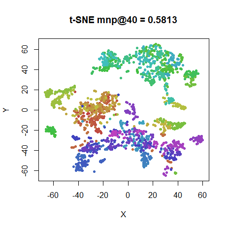

### coil20

|                             |                           |
:----------------------------:|:--------------------------:
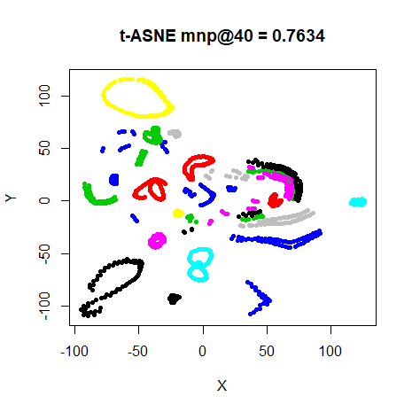|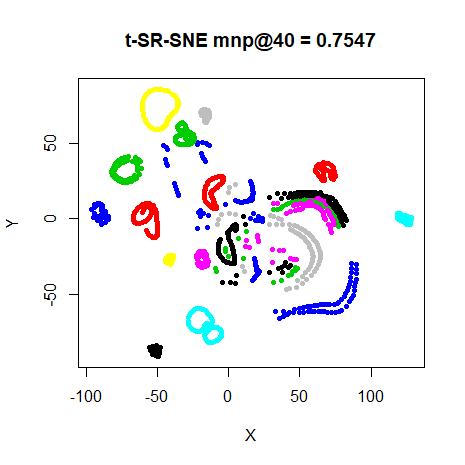
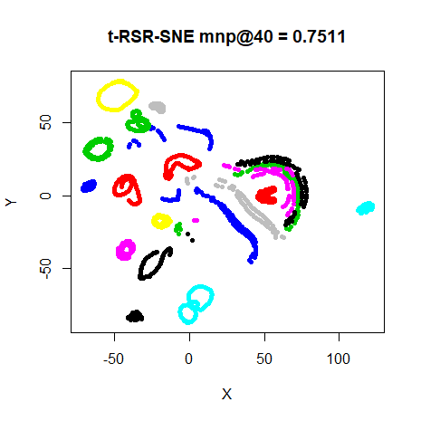|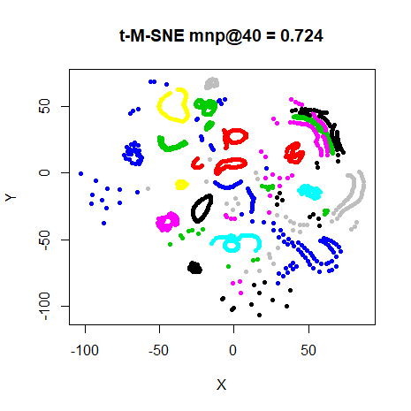
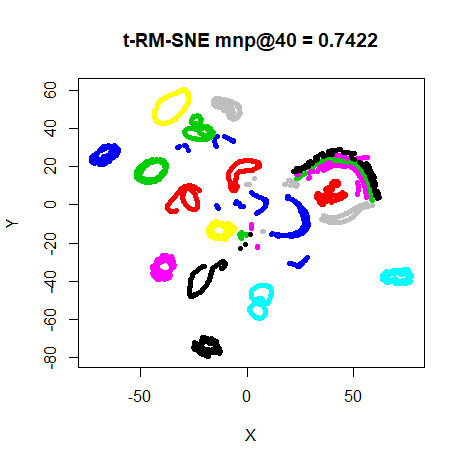|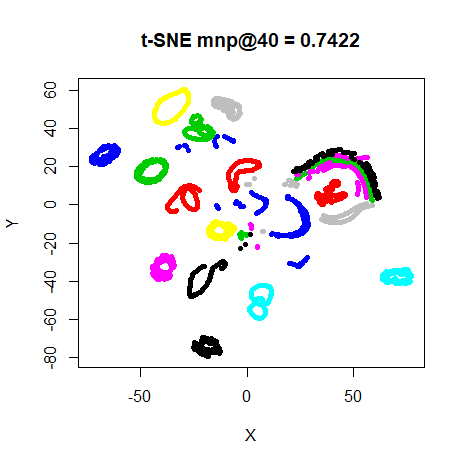

### mnist

|                             |                           |
:----------------------------:|:--------------------------:
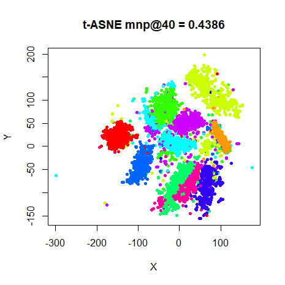|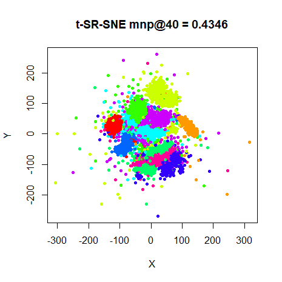
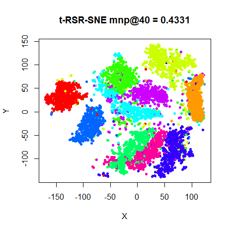|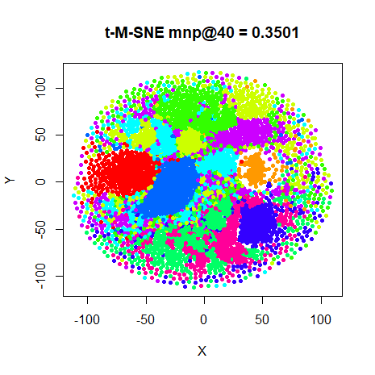
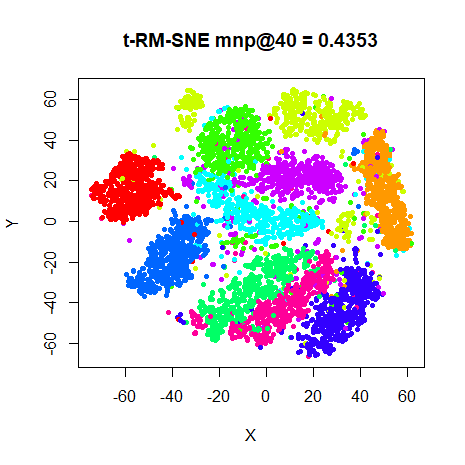|

### fashion

|                             |                           |
:----------------------------:|:--------------------------:
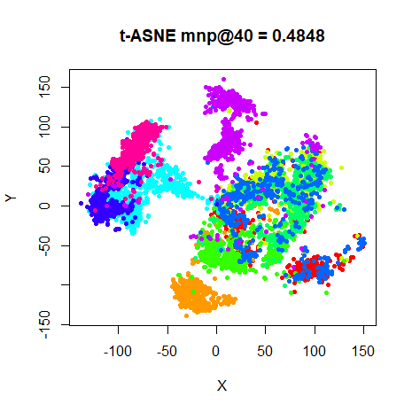|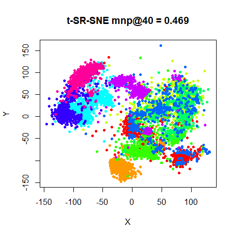
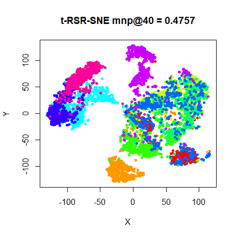|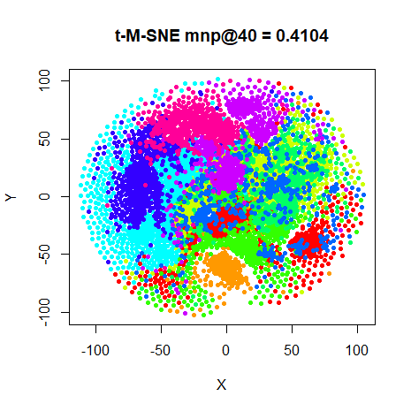
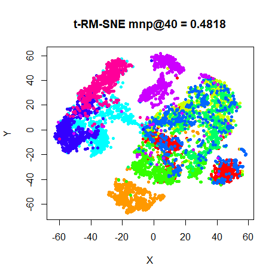|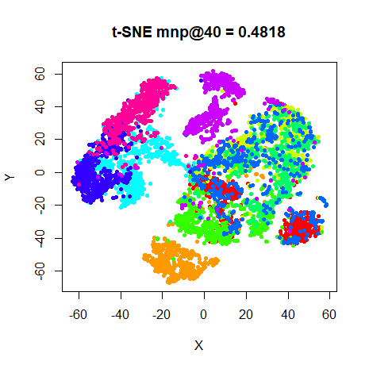


Based on preserving the neighborhoods defined by the `perplexity`, t-ASNE does a
(slightly) better job than t-SNE on every dataset. But that just goes to show
that visual inspection is still better than relying on a number, or at any rate
the mean neighbor preservation I chose to use. Visually, t-ASNE underperforms
t-SNE on some of these datasets. All the datasets seems to show a slight
crushing of the data towards the centre of the plot. It's nowhere near the
problem that SSNE and ASNE have, but there is a noticeably larger spread of
clusters towards the edge of the plot. This is most noticeable in `s1k` and
`oli`. The `mnist` plots suffers from some outliers. There is a possibility that
these points are genuine outliers that t-SNE's normalization ameliorates.

The results of the RM-normalization answers the question of the importance of
the symmetrization definitively, at least for these datasets and this form of
initialization: it doesn't matter at all. Visually the results are
indistinguishable from t-SNE. This was sufficiently surprising to me that I
double-checked that the input probabilities are correctly generated and aren't
symmetric. The output coordinates are in fact slightly different from the t-SNE
results, but not enough to see a visual difference in the plots. The
symmetrization is therefore not important: it's the type of normalization that
makes the difference between t-SNE and t-ASNE.

The t-SR-SNE results tend to create outliers, the effect being particularly 
irksome for `mnist`, but also noticeable with `s1k` and `fashion`. Conclusion:
don't symmetrize before the row-normalization.

The t-M-SNE results also give unfortunate results. Apart from also showing a
tendency to produce outliers or over-expanded clusters at the periphery of the
plot (see `s1k` and `frey`), the larger datasets `mnist` and `fashion` look
*really* odd. Including symmetrization (that would be t-SM-SNE) gives identical
results (not shown), so that's not the answer. That at least is consistent with
the results for t-RM-SNE versus t-SNE: if matrix normalization is carried out,
symmetrization neither helps nor hinders.

t-RSR-SNE results are quite good: unlike t-ASNE, none of the results suffer
from outliers (compare `s1k`) or crushing in the center (compare `oli`), while
still resembling the t-ASNE results more than, say, t-SNE (again look at the
`s1k` results). At last, here's a result where the symmetrization actually 
makes a difference and actually seems to help, at least in terms of producing
a nicer visualization.

## Conclusions

First, the difference between t-ASNE and t-SNE is much clearer than for ASNE
versus SSNE. While neighborhood preservation values are a little bit higher for
t-ASNE, if your goal with these methods is simply visualization of any natural
clustering in your data, t-SNE provides better results, with less outliers *and*
it's much easier to optimize. While no-one actually uses t-ASNE in the
literature, there are methods that are very close to it. Specifically, 
[inhomogeneous t-SNE](http://dx.doi.org/10.1007/978-3-319-46675-0_14), 
[NeRV](http://www.jmlr.org/papers/v11/venna10a.html) and
[JSE](https://dx.doi.org/10.1016/j.neucom.2012.12.036) use the row-normalization 
method also and can be seen as generalizations of
ASNE (or t-ASNE in the case of the inhomogeneous t-SNE). Although the JSE paper
says that the two different forms of normalization has "no significant effect",
it might be worth double checking that given the results here.

Second, I am surprised at how important the row-normalization step is for the
performance of t-SNE. Avoiding row-normalization turns out to be a bad idea no
matter what else you do. Perhaps this is simply a side effect of the choice of
bandwidths implicitly relying on the row-normalization when using perplexity.
Unfortunately, I'm not aware of any alternative suggestions about sensibly
choosing bandwidths for the input data.

Third, symmetrization does seem to help when row-normalizing. For
matrix-normalized results, it doesn't seem required for any of the datasets used
here: both the good t-SNE and bad t-M-SNE results are unaffected by the presence
or absence of the symmetrization step. But having a symmetric non-negative
probabilty matrix has some nice theoretical properties (see for instance the
[Spectral Directions](https://arxiv.org/abs/1206.4646) paper), so you may as
well do it in the matrix-normalized case too.

Fourth, none of the variations on normalization improved on the existing
methods, except that the RSR normalization might have potential.

I also implemented a version of the RSR normalization for ASNE and
compared to the [ASNE and SSNE](https://jlmelville.github.io/smallvis/sne.html) 
results on the same datasets. Results are not shown because there was no
interesting differences from the ASNE and SSNE results. Like the the results
here with the t-distributed kernel, the RSR-ASNE results are similar to the
ASNE results. As there wasn't much of a difference between ASNE and SSNE, and
no outlier issues, there's no particularly pressing reason to adopt such
a normalization in that case.

Finally, some questions I should get around to answering. These may end up being
added to this document or being written about elsewhere. For now, let us ponder
them together:

1. Is it really the row-normalization that's important, or is it just that it 
rescales the input weights usefully?

1. What exactly does symmetrization do to that helps when row-normalizing, that
doesn't matter when matrix-normalizing?

1. Although ASNE doesn't seem to benefit from RSR normalization, given that JSE
and NeRV carry out row-normalization, and they can be both trickier to optimize
than t-SNE and produce less pleasing visualizations, would the RSR normalization
help them in the way t-ASNE was improved?

1. For un-normalized methods (Elastic Embedding, LargeVis, UMAP), how
important is symmetrization?

1. What about alternative symmetrization methods to arithmetic averaging?
