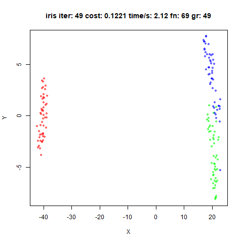

Up: [Documentation Home](https://jlmelville.github.io/smallvis/).

## Optimization

Many and varied are the approaches to SNE optimization. The 
[original SNE](https://papers.nips.cc/paper/2276-stochastic-neighbor-embedding) 
paper spends a fair amount of time discussing the difficulties of optimization,
as does the 
[SSNE paper (PDF)](https://www.cs.toronto.edu/~amnih/papers/sne_am.pdf), where
the favored approach seems to be adding noise and using plain steepest descent.
This inspired a paper suggesting a 
[trust region](https://doi.org/10.1109/IJCNN.2004.1379883) approach, an 
alternative to the line search used in typical unconstrained optimization.

The t-SNE came along, which off-handedly mentions using
[delta-bar-delta](https://dx.doi.org/10.1016/0893-6080%2888%2990003-2), and the 
difficulty of optimization is never mentioned again. Conceptually it's pretty
straightforward, and I doubt most people had heard of this method outside of
specialists in the neural network community.

Other methods have been used to optimize t-SNE or very similar cost functions: 
the 
[NeRV](http://www.jmlr.org/papers/v11/venna10a.html) paper used conjugate 
gradient, 
the
[Fast Multipole Method (FMM)](http://proceedings.mlr.press/v33/vladymyrov14.html)
used L-BFGS to optimize
[elastic embedding (EE) (PDF)](http://faculty.ucmerced.edu/mcarreira-perpinan/papers/icml10.pdf),
the [JSE paper](https://dx.doi.org/10.1016/j.neucom.2012.12.036) 
optimizes JSE, NeRV, SNE and t-SNE using gradient descent with a diagonal 
approximation to the Hessian (similar to the method used in Sammon mapping) and 
the 
[multi-scale SNE (PDF)](https://www.elen.ucl.ac.be/Proceedings/esann/esannpdf/es2014-64.pdf) 
and 
[multi-scale JSE](https://dx.doi.org/10.1016/j.neucom.2014.12.095) methods use 
L-BFGS (the latter again employing the diagonal Hessian approximation).

The [Spectral Directions](https://arxiv.org/abs/1206.4646) paper (with the same
authors as the FMM-EE paper) introduced a quasi-Newton method using the Hessian
based on a sparse approximation to just the attractive part of the t-SNE cost
function. On a large dataset, it out-performed L-BFGS and conjugate gradient for
optimizing t-SNE and EE although it didn't compare the delta-bar-delta method
for t-SNE, and only a back-tracking line search was used with L-BFGS. Nor is any
early exaggeration used.

The JSE and multi-scale JSE papers use a series of optimizations with a 
decreasing perplexity (similar techniques are used in the SNE and NeRV 
papers), so it's possible that other optimization methods do better when the
input probabilities are modified during the initial iterations, although an
increased perplexity would seem to have an opposite effect to early exaggeration
in terms of relative emphasis on short and long distances.

It should be noted that in the Spectral Directions paper, the differences
between L-BFGS, CG and spectral direction became pronounced only when looking at
a 20,000-member subset of the MNIST digits dataset. The JSE papers, for
instance, don't look at datasets larger than 6,000 items (although also sampled
from the MNIST digits). The FMM-EE paper used 60,000 digits from MNIST
(presumably the training set) but only compared L-BFGS with plain gradient 
descent.

Yang and co-workers looked at
[Majorization-Minimization](https://proceedings.mlr.press/v38/yang15a.html)
for optimizing t-SNE and compared it to L-BFGS, spectral directions and
momentum-based methods for t-SNE with quite a variety of datasets of different
sizes (up to N = 130 000). For some datasets they observe sub-optimal embeddings
(L-BFGS) or outright divergence (spectral directions), but usually spectral 
directions outperforms L-BFGS in terms of the cost at a given amount of CPU
time. However, their momentum method *also* out-performs L-BFGS, but it's not
clear how close this is to the DBD method: they describe it as being the
addition of a momentum term to their gradient descent method, which in turn
is described as using a line search. Also, they describe the momentum method
as failing on the COIL-20 dataset due to a learning rate selection problem, but
the original t-SNE paper has perfectly good results for COIL-20.

Häkkinen and co-workers described
[qSNE](https://doi.org/10.1093/bioinformatics/btaa637) which uses L-BFGS
for its optimization, and get good results with an order of magnitude fewer
iterations than standard t-SNE, so that even though they use exact t-SNE (i.e.
not even Barnes-Hut), they were able to apply qSNE to a dataset with N = 
170 000 with only a couple of hours runtime. They also show that their results
are pretty insensitive to their choice of Hessian approximation.

`smallvis` can't handle large datasets, so we will also restrict ourselves to
nothing larger than a 6,000 subset of the MNIST digits. But it certainly would
be nice if we could just point L-BFGS (or delta-bar-delta) at pretty much any 
cost function and not have to worry about initialization and perplexity 
annealing or early exaggeration.

## Datasets

See the [Datasets](https://jlmelville.github.io/smallvis/datasets.html) page.

## Details

If you want to know more about the provenance of the datasets, they are 
described in reasonable detail on the 
[initialization](https://jlmelville.github.io/smallvis/init.html) experiment
page.

The L-BFGS implementation is from the 
[mize](https://cran.r-project.org/package=mize) package. The memory size
is 5, and a loose Wolfe line search was used with the More-Thuente method. 
These are pretty standard settings.

## Settings

Results below were generated using the following commands (exemplified by the
`iris` dataset):

```
# Delta-Bar-Delta
tsne_iris_dbd <- smallvis(iris, method = "tsne", perplexity = 40, eta = 100, max_iter = 1000, verbose = TRUE, Y_init = "spca", scale = FALSE, ret_extra = c("dx", "dy"))

# L-BFGS
tsne_iris_lbfgs <- smallvis(iris, method = "tsne", perplexity = 40, eta = 100, max_iter = 1000, verbose = TRUE, Y_init = "spca", scale = FALSE, ret_extra = c("dx", "dy"), opt = list("l-bfgs", c1 = 1e-4, c2 = 0.9))
```

SPCA without early exaggeration was chosen for simplicity. The 
[initialization](https://jlmelville.github.io/smallvis/init.html) experiments
suggested there was no particular reason to believe this was a bad choice.
The DBD results given here aren't exactly the same as those in the 
initialization experiment, due to various minor code changes since then. 

## Evaluation

For each initialization, the mean neighbor preservation of the 40 nearest
neighbors, calculated using the
[quadra](https://github.com/jlmelville/quadra) package. The number reported is 
the mean average over all results and is labelled as `mnp@40` in the plots. 40
was chosen for these results to match the `perplexity`.

For example, for the `tsne_iris_dbd` result given above, the `mnp@40` value is
calculated using:

```r
av_pres <- mean(quadra::nbr_pres(tsne_iris_dbd$DX, tsne_iris_dbd$DY, tsne_iris_dbd$perplexity))
```

Again, more details in the 
[initialization](https://jlmelville.github.io/smallvis/init.html) experiment
page.


## Results

### iris

|                             |                           |
:----------------------------:|:--------------------------:
|
|


### s1k

|                             |                           |
:----------------------------:|:--------------------------:
|
|


### Olivetti Faces

|                             |                           |
:----------------------------:|:--------------------------:
|
|

### Frey Faces

|                             |                           |
:----------------------------:|:--------------------------:
|
|


### COIL-20

|                             |                           |
:----------------------------:|:--------------------------:
|
|


### MNIST (6,000)

|                             |                           |
:----------------------------:|:--------------------------:
|
|

### Fashion (6,000)

|                             |                           |
:----------------------------:|:--------------------------:
|
|


Using L-BFGS seems fine for the most part, until you get to the MNIST digits.
Those are some ugly looking plots, but they are minima. Looking at the size
of the steps that DBD takes versus L-BFGS during the optimization, L-BFGS will
take much larger steps than DBD. Given the highly non-linear nature of the
t-SNE cost function, the usual line search settings used in L-BFGS may be 
inappropriate.

## Perplexity Scaling

What about the tactic of starting at a high perplexity and repeatedly optimizing
at lower perplexities? Below is the L-BFGS result from starting at a perplexity
of 2048 (the closest power of 2 to half the dataset size) and then halving the
perplexity until a perplexity of 64 is reached, followed by a final optimization
at 40. I should say I made no effort to restrict the number of iterations
or function or gradient evaluations (although at larger perplexities, it 
converges quite quickly), so this is a very slow method and hence not really
practical. But this provides a sense of how good results can get:


That's much better. Can this be turned into a practical optimization method, 
i.e. one which can be used with the same number of iterations as starting from
the target perplexity? We shall have to decide how to split the number of
iterations between the higher perplexity values. The strategy outlined in the
NeRV paper is to carry out ten steps of conjugate gradient at (what is 
effectively) a higher perplexity, followed by twenty steps of conjugate gradient
at the target perplexity. So that's a 1:2 ratio. Alternatively, the multiscale
JSE paper simply suggests allowing up to 200 steps of L-BFGS per perplexity 
value, and when comparing with t-SNE with the DBD, allowing t-SNE the same
number of evaluations. If we draw a comparison between early exaggeration and
perplexity scaling (which both have the goal of avoiding shallow minima), the
large-scale Barnes-Hut implementations tend to allow for a longer period of
early exaggeration, stopping at iteration 250, rather than iteration 100, which
coincides with the point at which the momentum is increased. So that suggests
the first 250 iterations out of the standard 1000 can be equated with the 
perplexity scaling period. Arbitrarily, we'll choose that: for the first 250
iterations we'll do perplexity scaling, leaving 750 for the target perplexity.
As a result, for the delta-bar-delta method, we should switch the momentum
earlier, too. If the lower momentum is due to the influence of early 
exaggeration requiring milder optimization conditions, we could start the
optimization with the momentum at its high value, but to be on the safe side,
in the example below, we'll just spend fewer iterations at the lower momentum.

It's also of interest to see if the delta-bar-delta method also benefits from
stepping down from larger perplexities. Results were generated using (with 
`iris` as an example):

```
iris_dbd_pstep <- smallvis_perpstep(step_iter = 250, X = iris, scale = FALSE, verbose = TRUE, Y_init = "spca", ret_extra = c("DX", "DY"), perplexity = 40, eta = 100, mom_switch_iter = 185, max_iter = 1000)
iris_lbfgs_pstep <- smallvis_perpstep(step_iter = 250, X = iris, scale = FALSE, verbose = TRUE, Y_init = "spca", ret_extra = c("DX", "DY"), perplexity = 40, max_iter = 1000, opt = list("l-bfgs"))
```

Results are shown with the equivalent non-stepped version from the previous
results above on the left, and the perplexity stepped version on the right.


|dataset|perplexity = 40      | step perplexity           |
:-------|:-------------------:|:--------------------------:
|iris DBD||
|iris L-BFGS||
|s1k DBD||
|s1k LBFGS||
|oli DBD||
|oli LBFGS||
|frey DBD||
|frey LBFGS||
|COIL-20 DBD||
|COIL-20 LBFGS||
|MNIST DBD||
|MNIST LBFGS||
|Fashion DBD||
|Fashion LBFGS||

For L-BFGS, the perplexity stepping always improves the neighborhood 
preservation (although the difference is always small), but more importantly, 
the MNIST result looks a lot better. Maybe not quite as good as the result
which allowed more than 1000 iterations, but it didn't take as long.

The DBD results show a similar pattern, although the preservations don't always
improve. But the final results do look more similar to those from from the 
L-BFGS optimization when doing perplexity stepping, suggesting that these
methods find minima which are closer to each other than without scaling.

There are two downsides of this method. The obvious one is that you have to 
carry out the perplexity calibration multiple times. At least as datasets grow 
larger this becomes a proportionally smaller part of the runtime, so it's not
like carrying out 5 perplexity calibrations requires 5 times the CPU time. A
more minor issue is that the optimization starts from scratch for each 
perplexity. If, as the spectral direction paper suggests, L-BFGS has 
difficulties making progress at early iterations because of a lack of 
information with which to approximate the Hessian, we waste proportionally more
of the iterations we have available by effectively resetting the memory of the
optimizer multiple times.

Things can still go wrong. Here are two plots of the MNIST subset, both
initialized from the Laplacian Eigenmap. The left hand image retains a memory 
of `5` vectors, the right hand version uses `50`:

|memory = 5     |memory = 50           |
|:-------------------:|:--------------------------:
||

The left hand side plot shows there are a few outlying points. This is something
I see quite a lot with the L-BFGS minimizations: a small number of points get
pushed a long way out, and then due to the small gradient associated with long
distances, take a large number of iterations to rejoin the main embedding, or as
we see in this case, don't get back at all. The right hand plot shows that 
upping the memory used by the minimization helps in this case, but I don't have
any reason to believe that more memory is guaranteed to work.

## Conclusions

If you want to use L-BFGS to optimize the t-SNE cost function, you should
probably use the perplexity stepping method to maximize your chances of getting
a good result. Of course, you can just use the standard delta-bar-delta method
when it comes to t-SNE. But hopefully these findings also apply to other cost
functions where DBD doesn't work as well.

## August 16 2020: What about qSNE?

The [qSNE source is available](https://bitbucket.org/anthakki/qsne/src/master/).
Based on my understanding of that, it does the following by default:

* no scaling of the input.
* a perplexity of 30 is used.
* initialization via PCA, then rescaling to standard deviation of 1. You can
provide your own input via (`-i`).
* no early exaggeration.
* L-BFGS uses the ten previous iterates/gradients for its memory. This can be 
modified with the `-m` option.
* the line search is a simple Armijo backtracking search, with the constant in
the Armijo condition test being `c1 = 0.5`, starting at $\alpha = 1$ at each
iteration, and halving $\alpha$ during backtracking. The value of `c1` can be
adjusted via the `-L` option.
* a check on the relative error of the cost is applied at every iteration, with
a tolerance of 1e-4 (adjustable via the `-t` option). Because the backtracking
search requires evaluating the cost, there's no extra computational expense to
doing a tolerance check every iteration. To avoid premature convergence, the
tolerance check is not applied for the first 15 iterations.
* if you set "compatibility mode" (`-C`), you get the usual delta-bar-delta
optimization used in Rtsne, along with early exaggeration and the input is
scaled. However, the initialization doesn't change.

With mize installed, you can get something close to the qSNE defaults using:

```R
iris_qsne <- smallvis(iris, Y_init = "pca", Y_init_sdev = 1, 
           opt = list("l-bfgs", line_search = "backtracking", c1 = 0.5, 
                    memory = memory, try_newton_step = TRUE,
                    step_next_init = 1, step_down = 0.5), 
           epoch = 1, tol = 1e-4, tol_wait = 15, scale = FALSE,
           perplexity = 30)
```

qSNE optimization is much faster than smallvis for the datasets considered here
because although it does not use any approximations, its implementation is
multi-threaded. However, the PCA-based initialization is not very efficient for
high-dimensional datasets: on my machine, `oli` with 4 096 features, took nearly
two minutes to complete, and `coil20` with 16 384 features, took nearly two
hours. To avoid spending time generating the PCA initializations multiple times, 
for all the results below, I generated the PCA input for both `qsne` and
`smallvis` using a separate run of `smallvis` with 0 iterations (`Y_init =
"pca", Y_init_sdev = 1, max_iter = 0`) and exporting the `smallvis` results to a
TSV file which can be used as input to `qsne` with the `-i` option. To make sure
there was no major differences between how `smallvis` generated PCA-based
initialization and the internal `qsne` initialization, I checked the output of
`qsne` with `mnist6k` and `fashion6k` using both methods. Coordinates were
identical in both cases.

In the results below, the images for each dataset are as follows:

* top left: `qsne` with default settings.
* top right: `qsne` with `-t0` to force 1000 iterations. This is to account for
the possibility that the default tolerance is too lenient for these datasets,
and we might see better visualizations with a longer optimization.
* bottom left: `qsne` with `-C` to use the traditional delta-bar-delta 
optimization, called `GDM` in the title which is how the `qsne` source code
refers to it.
* bottom right: `smallvis` attempting to provide an optimization as close to
that of default `qsne` as possible.

The number of iterations and the cost are given for all images. For the
`smallvis` results only, the time taken, and counts of the function (`fn`) and
gradient (`gr`) evaluations are also provided.

### iris

|                             |                           |
:----------------------------:|:--------------------------:
|
|

### s1k

|                             |                           |
:----------------------------:|:--------------------------:
|
|

### oli

|                             |                           |
:----------------------------:|:--------------------------:
|
|

### frey

|                             |                           |
:----------------------------:|:--------------------------:
|
|

### coil20

|                             |                           |
:----------------------------:|:--------------------------:
|
|

### mnist6k

|                             |                           |
:----------------------------:|:--------------------------:
|
|

### fashion6k

|                             |                           |
:----------------------------:|:--------------------------:
|
|


Results are very similar between `smallvis` (bottom right) and `qsne` (top
left): they converge at a similar iteration, the cost values at convergence are
similar, and visually the results look similar. Unfortunately, the results don't
look that great: they have all the problems mentioned above, particularly for
`mnist6k` and `fashion6k`.

The `fashion6k` result in particular has an outlier point. Could it just be that
the tolerance is too loose for these datasets? Not really. `fashion6k` does
clean up if it's allowed to run for longer, but the other datasets don't do
much, i.e. they are pretty well optimized for visualization purposes. For
`mnist6k` making it optimize for longer has little effect on the result visually, 
but the distances between points has now increased hugely. Running the
L-BFGS results for longer number of iterations removes most of its appeal 
for t-SNE anyway.

Could it be that the initial coordinates aren't great? Probably not. The
compatibility results (bottom left) use slightly different scaling of the input
data and early exaggeration, and find results which look pretty much the same,
except a *much* better result for `mnist6k` is also obtained.

For `iris` and `mnist6k`, I looked at using the more typical standard deviation
for the initialized coordinates, i.e. `1e-4` instead of `1`, again by exporting
PCA results from `smallvis`. In both cases, `qsne` was unable to make any
progress at all, and the optimization terminates after 15 iterations with the
cost function unchanged. With the compatibility options set, optimization 
proceeded almost identically as when the coordinates were initialized with
a standard devation of 1.

Finally, does the use of the Armijo line search cause issues for L-BFGS, when
a full Wolfe line search is usually recommended? I experimented with modifying
the `qsne`-like settings in `smallvis` to use a Wolfe line search. For every 
dataset, on the first iteration, a very large value of $\alpha$ is chosen
(greater than ten), but subsequent iterations are always 1 or smaller.
Restricting the maximum value of $\alpha$ to 1-10 doesn't have much effect on
the results and they aren't noticeably different (or better) than those that
use the Armijo line search. However, whe using a Wolfe line search, the
coordinates were able to be initialized from the smaller standard deviation
coordinates, and you can use early exaggeration, although in that case you need
to allow the maximum $\alpha$ to be as large as it wants, as otherwise the
optimization seems unable to adapt when the exaggeration is turned off.

The `qsne` results independently confirm my own findings with L-BFGS: you
*might* be able to get a result more quickly than using delta-bar-delta, but
it's not necessarily a huge time saving and based on my experience with
`mnist6k` in particular, the results can be mediocre, to put it mildly.

If for some reason Barnes-Hut t-SNE or FIt-SNE doesn't work for your needs and
you are looking for fast non-approximate t-SNE results, then `qsne` seems to be
a good choice. However, based on these results, I wouldn't use the L-BFGS
optimizer and would recommend sticking with the "compatibility" mode, i.e. use
the `-C` option. I would also be wary of using the qSNE default initialization,
especially if you have high-dimensional data.

Up: [Documentation Home](https://jlmelville.github.io/smallvis/).
