Up: [Documentation Home](https://jlmelville.github.io/smallvis/).

For large datasets, particularly those using biological data, 
[Belkina and co-workers](https://doi.org/10.1101/451690) came up with a series
of guidelines about how to better separate clusters, which is part of their
[opt-SNE](https://github.com/omiq-ai/Multicore-opt-SNE) code. There are three 
main suggestions:

* The learning rate (`eta` in `smallvis`) should be data dependent, and can
be much larger than the usual defaults of 100-250 for large datasets. They
recommend a value of $N / \alpha$ where $N$ is the number of objects in the
dataset, and $\alpha$ is the early exaggeration factor (usually 12 for larger
datasets).

* Early exaggeration may need to be run for substantially longer than usual.
Rather than stop early exaggeration after a fixed number of iterations, they
suggest monitoring the relative rate of change of the KL divergence, 
$(KL_{i-1} - KL_{i}) / KL_{i-1}$, and terminate early exaggeration after it
reaches a maximum. Normal optimization then proceeds for the rest of the
iterations available. In the paper, an example is given where optimal results
were obtained after 750 iterations of early exaggeration, followed by another
750 iterations of standard optimization.

* Because early exaggeration can last a longer than usual, it might be tempting
to keep the ratio of early exaggeration iterations to standard optimization
iterations, e.g. 75%-90% of the total number of iterations should be 
non-exaggerated. But because the early exaggeration is extended, this would in
turn lead to a very long run time for the standard optimization. Instead, the
authors suggest monitoring the relative tolerance of the KL divergence, and
terminate the run when $KL_{i-1} - KL_{i} < KL_{i} / 10000$. 

There is no suggestion that these changes are necessary or optimal for smaller
datasets, but it would be nice if they were or at least they did no harm.

The first and last of these are easy to implement. In fact, `smallvis` has
had early stopping for ages, so we can follow the author's guidelines for
early stopping with `tol = 1e-4, epoch = 1`.

Looking for a maximum of the relative rate of change during early exaggeration 
is a bit more work, but achievable.

We'll consider each change in turn, before combining them at the end.

## Datasets

See the [Datasets](https://jlmelville.github.io/smallvis/datasets.html) page.

## Learning Rate

### Settings

To use the opt-SNE learning rate settings, use `eta = "optsne"` rather than passing
a fixed value. This will adapt based on `exaggeration_factor` and the size
of the dataset. If `verbose = TRUE`, the value used is logged to screen.

Every other setting will be pretty standard. For comparison, we'll repeat
these results with a fixed `eta = 100`, which matches that used in the 
[original t-SNE paper](http://www.jmlr.org/papers/v9/vandermaaten08a.html).

```R
iris_opteta <- smallvis(iris, perplexity = 40, Y_init = "spca", eta = "optsne", exaggeration_factor = 4, stop_lying_iter = 100)
iris_tsne <- smallvis(iris, perplexity = 40, Y_init = "spca", eta = 100, exaggeration_factor = 4, stop_lying_iter = 100)
```

### Results

Left hand plots are those which use `eta = "optsne"`. The resulting value of the
learning rate is shown in the plot title. The right hand plots are for a fixed
`eta = 100`.

#### iris

|                             |                           |
:----------------------------:|:--------------------------:
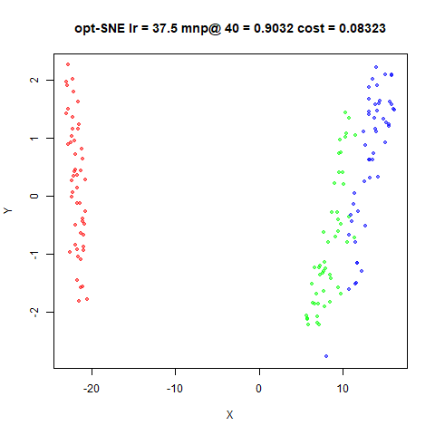|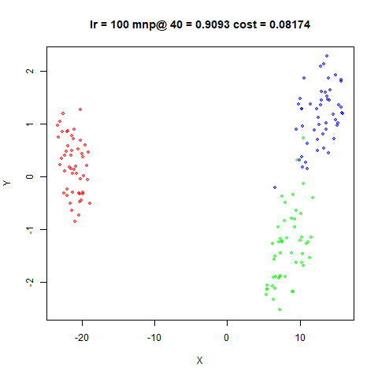

#### s1k

|                             |                           |
:----------------------------:|:--------------------------:
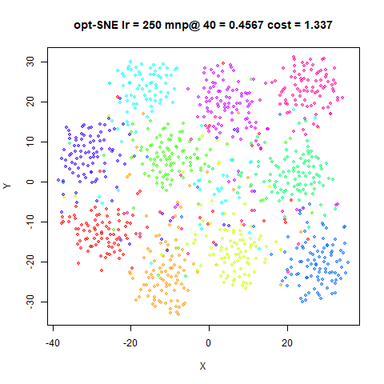|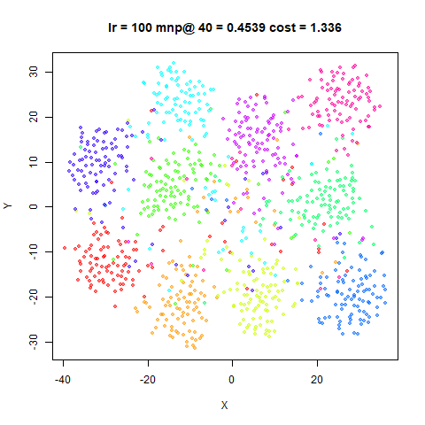

#### oli

|                             |                           |
:----------------------------:|:--------------------------:
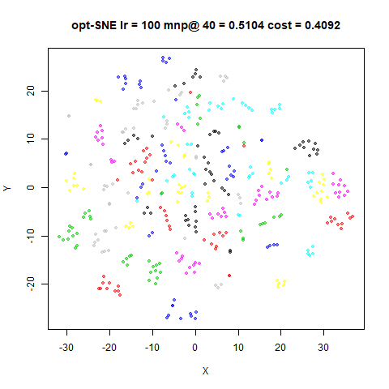|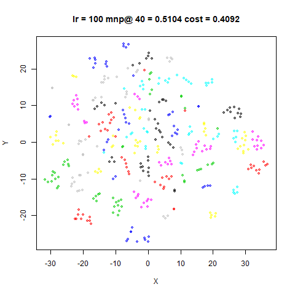

#### frey

|                             |                           |
:----------------------------:|:--------------------------:
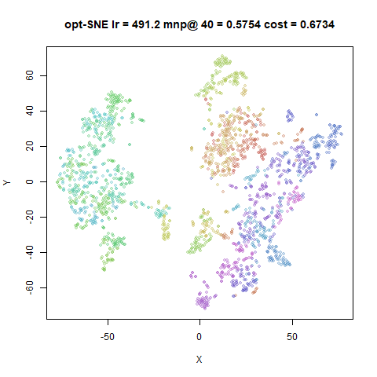|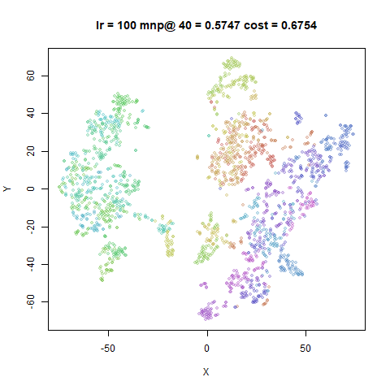

#### coil20

|                             |                           |
:----------------------------:|:--------------------------:
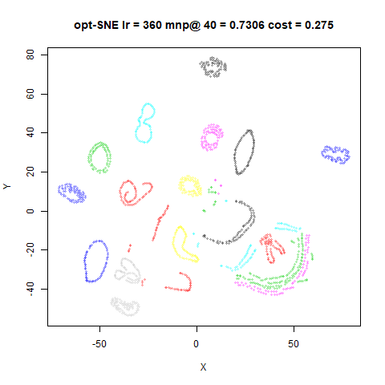|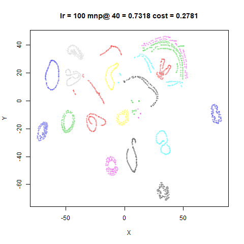

#### mnist6k

|                             |                           |
:----------------------------:|:--------------------------:
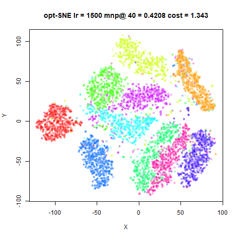|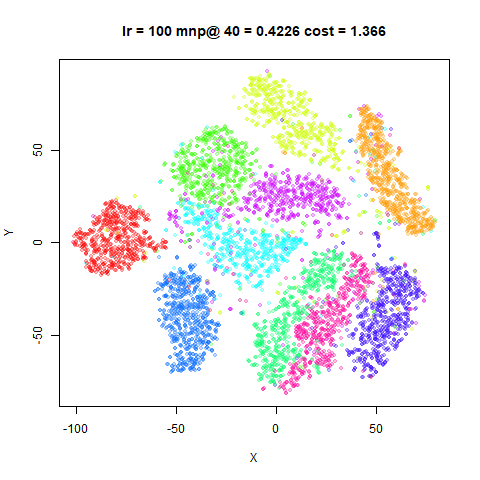

#### fashion6k

|                             |                           |
:----------------------------:|:--------------------------:
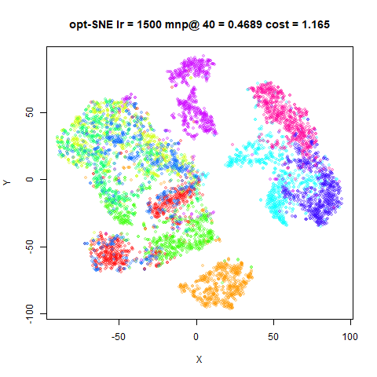|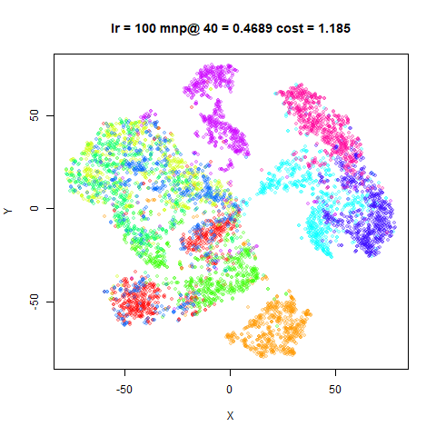


Results are not very sensitive to the initial learning rate. `oli` shows no
difference, because the opt-SNE settings choose `eta = 100`. `iris` and `s1k`
divergences are slightly higher with `eta = "optsne"`. For the other datasets,
the divergences are all slightly lower, with the largest effect for the larger
datasets, but even though the learning rate is an order of magnitude higher
than the default for these datasets, the cost is less than 2% lower after
1000 iterations. The neighbor preservation values don't show much difference
either.

For the rest of the comparisons, we'll use the `eta = "optsne"` results.

## Early Exaggeration

As a reminder, Belkina and co-workers suggest examining the relative rate of
change of the KL divergence during early exaggeration and terminating the
exaggeration phase after the relative rate of change reaches a maximum. 

One objection to this is that it requires calculating the KL divergence at each
iteration, which isn't necessary during usual optimization. But there is an
additional slight problem in that some datasets show quite noisy behavior during
early exaggeration. Below is a plot of the relative KL change during early
exaggeration for two datasets. On the left is `mnist6k`, which is quite
well-behaved, and on the right, `iris`, which is not:

|                             |                           |
:----------------------------:|:--------------------------:
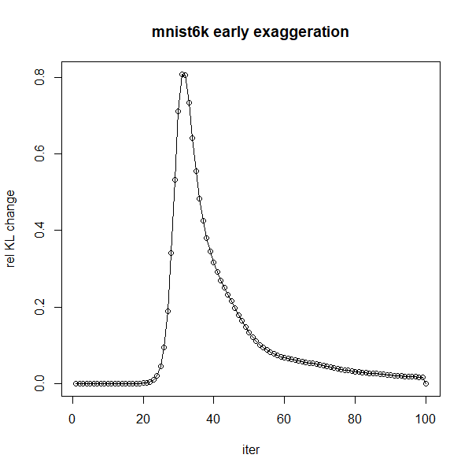|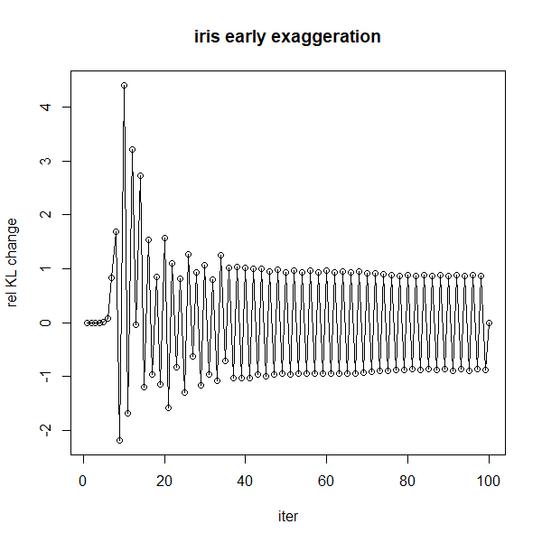

The `mnist6k` example uses a low learning rate of `eta = 100` (much lower than 
then opt-SNE settings), and `iris` is using the `eta = "optsne"` setting which
results in a fairly low learning rate of `37.5`, but using `eta = 100` doesn't 
make a difference either and nor does reducing the `momentum`. The effect *is* 
substantially reduced by reducing the `exaggeration_factor`. Here are the
results for `exaggeration_factor = 2` and `exaggeration_factor = 1.5`:

|                             |                           |
:----------------------------:|:--------------------------:
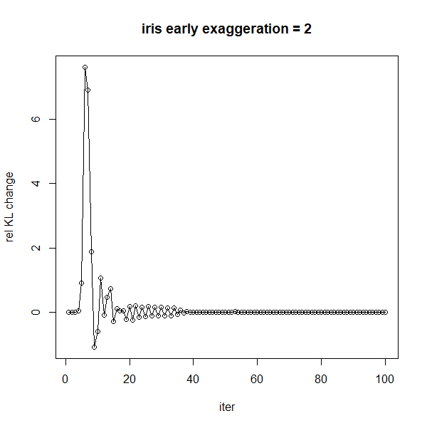|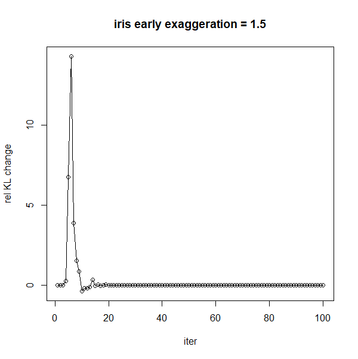

I see a similar pattern with the typical standard t-SNE random layout. But at
least for `iris`, the effect of early exaggeration doesn't seem to do much to
the final cost or layout. The noisy change in relative KL difference seems
to be a fact of life for some datasets, and I saw similar patterns with `oli`.

At any rate it seems like these issues or something like them are also known to 
the authors, as the
[current (as of February 2019) implementation of opt-SNE](https://github.com/omiq-ai/Multicore-opt-SNE/blob/ccd25265c91d3ba7ec637e3ffe040e3b7b6c5516/multicore_tsne/tsne.cpp)
is slightly more conservative in terminating the early exaggeration, as the
procedure has been modified to:

* wait 15 iterations before monitoring the relative rate of change of KL.
* calculate the relative rate of change every three iterations, rather than
every iteration.
* only terminate early exaggeration after the relative rate of change of KL
has been observed to decrease three times.

### Settings

The above is implemented in smallvis by specifying the `ee_mon_epoch` parameter.
If specified, this value replaces that of `epoch` during early exaggeration,
e.g. if `ee_mon_epoch = 3` then the epoch code is run every 3 iterations,
including running any callbacks and logging to console. The relative tolerance
criterion is turned off, however, instead using the detection of the maximum of
the rate of change. Additionally, the `ee_mon_wait` parameter controls how long
to wait before checking the rate of change, and `ee_mon_buffer` specifies the
number of times the rate of change check is passed but assumed to be a false
positive due to noise. Setting `ee_mon_buffer = 2` gives the default opt-SNE
value, where early exaggeration is terminated only on the third occurrence.

```R
iris_ee_tol <- smallvis(iris, perplexity = 40, eta = "optsne", Y_init = "spca", exaggeration_factor = 4, ee_mon_epoch = 3, ee_mon_wait = 15, ee_mon_buffer = 2)
```

### Results

Left hand images are the results with the early exaggeration being monitored.
The iteration at which the early exaggeration was stopped is given in the title
of the image. The right hand images are the results from the previous section
with `eta = "optsne"`.

#### iris

|                             |                           |
:----------------------------:|:--------------------------:
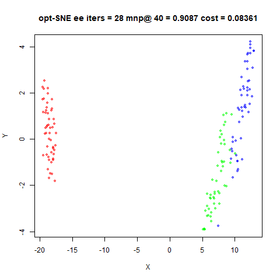|

#### s1k

|                             |                           |
:----------------------------:|:--------------------------:
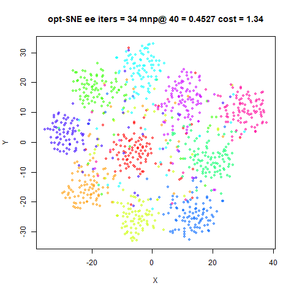|

#### oli

|                             |                           |
:----------------------------:|:--------------------------:
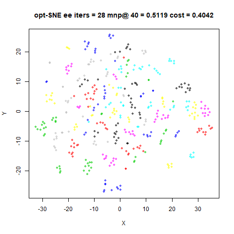|

#### frey

|                             |                           |
:----------------------------:|:--------------------------:
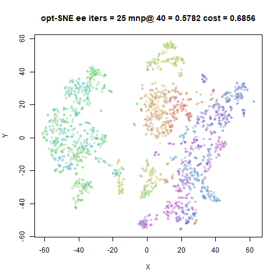|

#### coil20

|                             |                           |
:----------------------------:|:--------------------------:
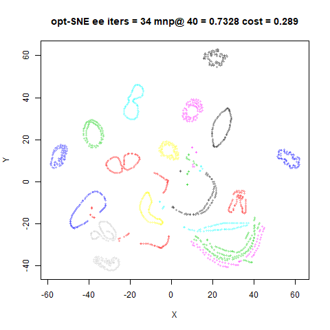|

#### mnist6k

|                             |                           |
:----------------------------:|:--------------------------:
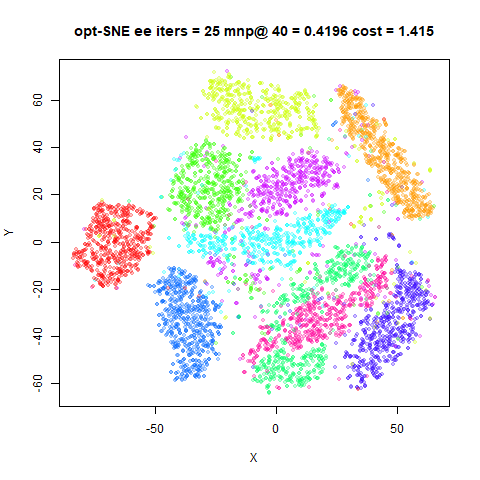|

#### fashion6k

|                             |                           |
:----------------------------:|:--------------------------:
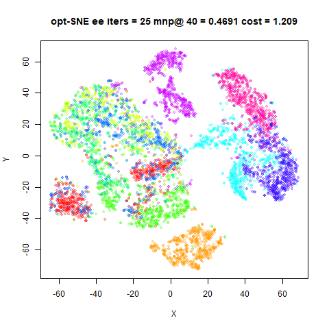|


Rather than extending the exaggeration time, for all the datasets studied, the
effect of the exaggeration monitoring is to terminate it much earlier than the
full 100 iterations. No dataset uses exaggeration for more than 33 iterations.

Nonetheless, the results aren't hugely affected. The final divergences are in
general a little bit elevated, but there's not a huge effect on either the
neighbor preservation or the visual quality of the embedding. The `mnist6k`
results are slightly different: the result with the '4' cluster (in green at the
bottom) is split by the '9' cluster (magenta). This embedding turns up now and
again with various t-SNE settings and seems to be nearly as stable as the
un-split version in terms of KL divergence, but is obviously less appealing.

As early exaggeration is only 10% of the run time of the optimization, stopping
after 30 iterations doesn't save a huge amount of time, and doesn't seem to help
the embedding quality, at least if you initialize with scaled PCA.

## Early stopping

Early stopping applies to the standard, un-exaggerated part of the optimization.
Like with early exaggeration, the current implementation of opt-SNE slightly
modifies the strategy given in the paper:

* waits 15 iterations before attempting to stop.
* checks every 5 iterations, rather than every iteration.
* the tolerance check is $|KL_{i-1} - KL_{i}| / 5 < KL_{i} / 5000$, i.e. the
relative tolerance check has been loosened from `1e-4` to `2e-4` 
(i.e. `1 / 5000`). This can be changed by the user, but `5000` is the default.

This has been present in `smallvis` for a while, but by default the tolerance
is set sufficiently low (`1e-7`) that you are unlikely to stop early with most
datasets.

### Settings

We'll compare the tolerance used by the current version of opt-SNE, rather than
the version given in the paper, but the difference won't be too large. We'll
go back to 100 iterations of early exaggeration with no early stopping possible
during that period of the optimization.

`tol_wait = 15` sets the number of iterations to wait during standard
optimization before allowing early stopping. In practice I don't think I've seen
any possibility of convergence occurring so early after turning off early 
exaggeration, but it's included for completeness.

```R
iris_early <- smallvis(iris, perplexity = 40, eta = "optsne", Y_init = "spca", exaggeration_factor = 4, epoch = 5, tol = 2e-4, tol_wait = 15)
```

### Results

Early stopping results are on the left. The number of iterations used is given
in the title. This includes the 100 iterations used in early embedding. The
results on the right use all 1000 iterations.

#### iris

|                             |                           |
:----------------------------:|:--------------------------:
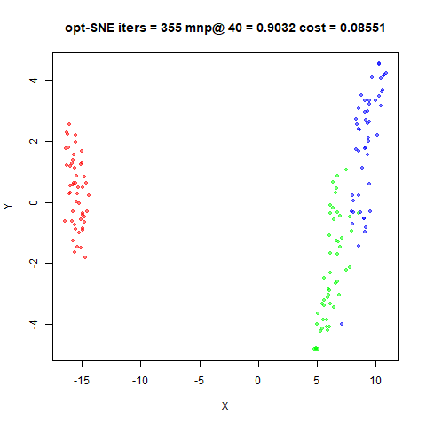|

#### s1k

|                             |                           |
:----------------------------:|:--------------------------:
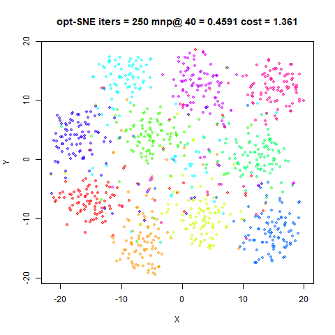|

#### oli

|                             |                           |
:----------------------------:|:--------------------------:
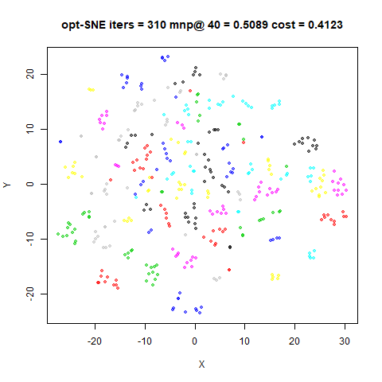|

#### frey

|                             |                           |
:----------------------------:|:--------------------------:
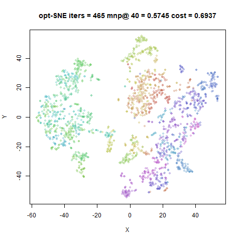|

#### coil20

|                             |                           |
:----------------------------:|:--------------------------:
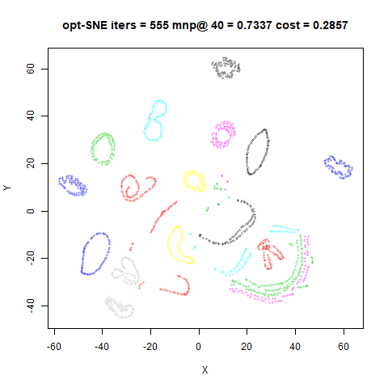|

#### mnist6k

|                             |                           |
:----------------------------:|:--------------------------:
|

#### fashion6k

|                             |                           |
:----------------------------:|:--------------------------:
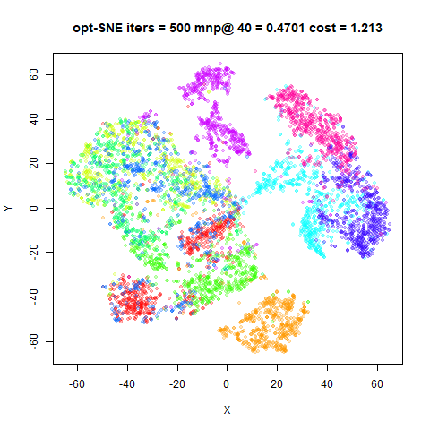|


Early stopping definitely saves on iterations: no embedding runs for more than
555 iterations. And there's no real difference to the neighbor preservation or
the visual quality of the layouts. Possibly there are some local fine detail 
that's different that isn't readily visible from the images as shown. If you
don't care about that, then it seems like early stopping is a good idea.

## Full opt-SNE 

Finally, let's put it all together: combining the dataset-dependent learning
rate, early exaggeration monitoring and early stopping.

### Settings

```R
iris_optsne <- smallvis(iris, perplexity = 40, eta = "optsne", Y_init = "spca", exaggeration_factor = 4, ee_mon_epoch = 3, ee_mon_wait = 15, ee_mon_buffer = 2, epoch = 5, tol = 2e-4, tol_wait = 15)
```

### Results

The full opt-SNE results are on the left. Again the total number of iterations
is given in the title of the plot. The comparison on the right is from the 
previous section: full 100 iterations of early exaggeration and then early
stopping.

#### iris

|                             |                           |
:----------------------------:|:--------------------------:
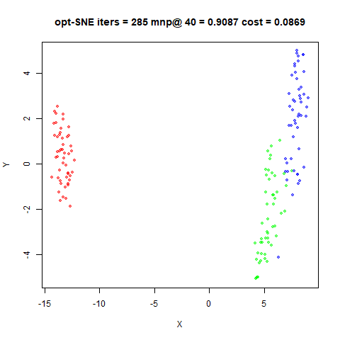|

#### s1k

|                             |                           |
:----------------------------:|:--------------------------:
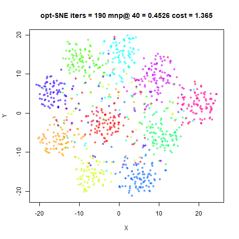|

#### oli

|                             |                           |
:----------------------------:|:--------------------------:
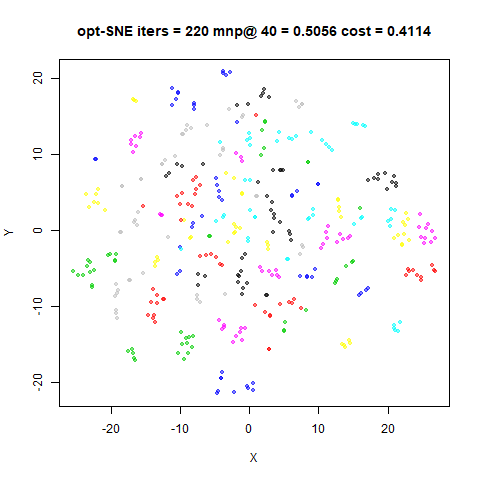|

#### frey

|                             |                           |
:----------------------------:|:--------------------------:
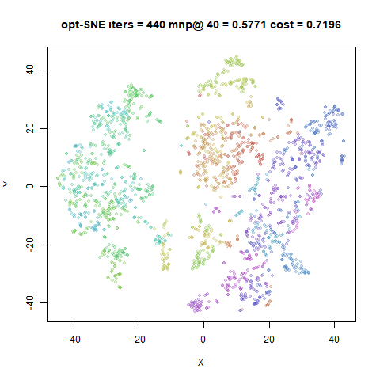|

#### coil20

|                             |                           |
:----------------------------:|:--------------------------:
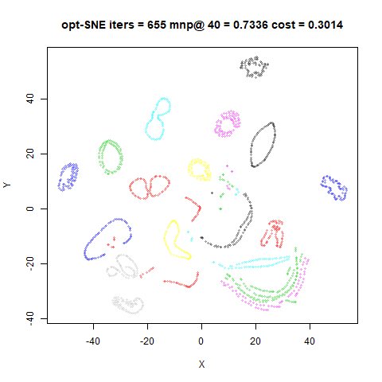|

#### mnist6k

|                             |                           |
:----------------------------:|:--------------------------:
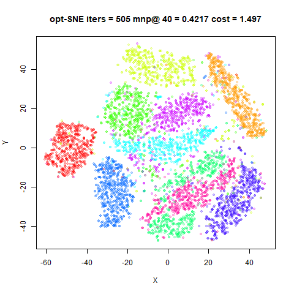|

#### fashion6k

|                             |                           |
:----------------------------:|:--------------------------:
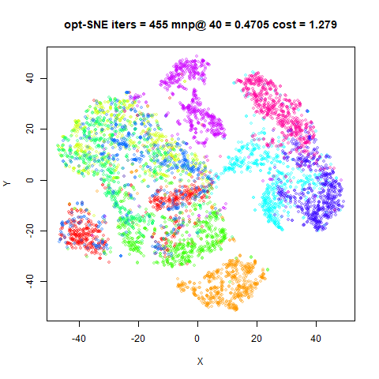|

Combining the early exaggeration monitoring and the early stopping leads to
even fewer iterations than just early stopping alone in all datasets except
`coil20`, which takes an extra 100 iterations to stop.

Otherwise, these results are quite similar to the results from using only
early stopping. The `mnist6k` results show the '4' cluster split by the '9'
cluster, just as with the early exaggeration monitoring-only run.


## Longer Epochs

Using the opt-SNE settings involves epochs of 3 and 5 iterations, which is much
shorter than the smallvis default of 100, and even BH t-SNE normally only logs
data every 50 iterations. If we use `epoch = 50`, can we get most of the speed
up benefit of the opt-SNE settings? The main effect will be to prevent early
stopping of the early exaggeration, but that doesn't seem like a big problem,
because the innovation of opt-SNE is to allow early exaggeration to go on for a
lot longer than usual if needed, but for all the datasets looked at here, the
only effect is to stop early exaggeration a lot *earlier* and it's already a
small fraction of the proportion of the number of iterations.

### Settings

```R
iris_epoch50 <- smallvis(iris, perplexity = 40, eta = "optsne", Y_init = "spca", exaggeration_factor = 4, epoch = 50, tol = 2e-4)
```

### Results

Results with using an epoch of 50 and no early exaggeration monitoring are
shown on the left. The images on the right are of those from the early stopping
results. The only difference between the two is that the images on the right
used an `epoch = 5`, and therefore calculate the KL divergence and tolerance
checks ten times more often.

#### iris

|                             |                           |
:----------------------------:|:--------------------------:
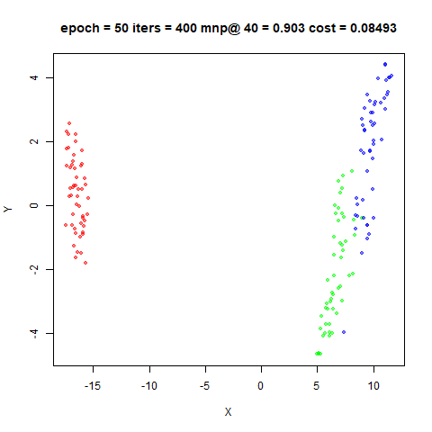|

#### s1k

|                             |                           |
:----------------------------:|:--------------------------:
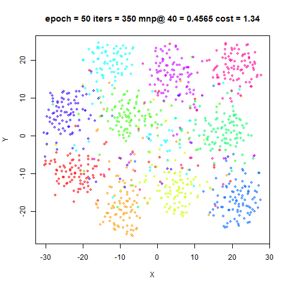|

#### oli

|                             |                           |
:----------------------------:|:--------------------------:
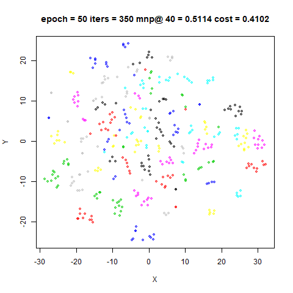|

#### frey

|                             |                           |
:----------------------------:|:--------------------------:
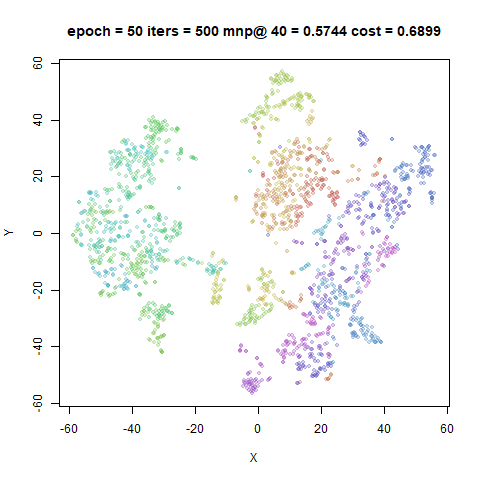|

#### coil20

|                             |                           |
:----------------------------:|:--------------------------:
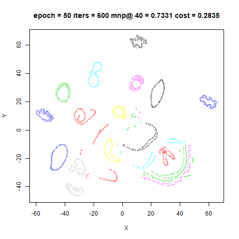|

#### mnist6k

|                             |                           |
:----------------------------:|:--------------------------:
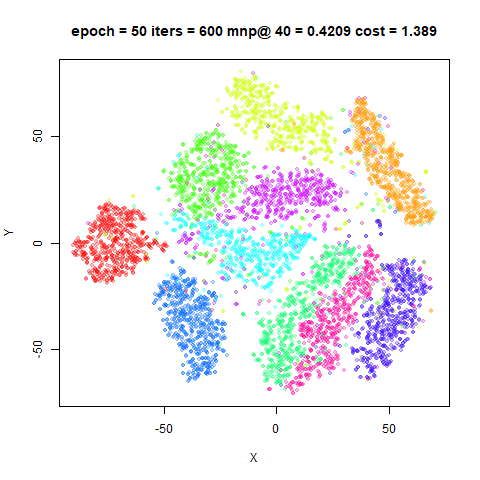|

#### fashion6k

|                             |                           |
:----------------------------:|:--------------------------:
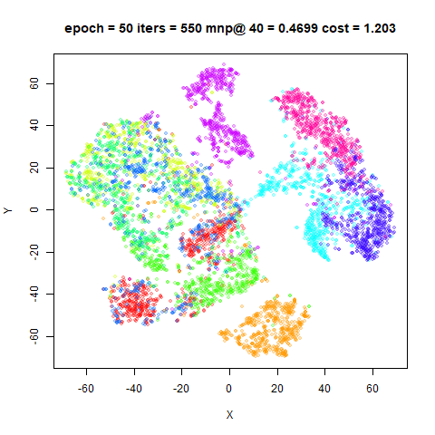|

These results are very similar to each. By checking the tolerance less often
we end up running for an extra 35-55 iterations, except for `s1k` which takes
100 more iterations.

It should be noted that there is a non-negligible cost to calculating the KL 
divergence more often. For `mnist6k` and `fashion6k`, setting
`epoch = 5` did increase the effective time per iteration by around 15%, even
when the visualization callback was turned off. Obviously, the point at
which this extra cost is worth it due to the optimization stopping earlier
will depend on the speed of your hardware and the dataset size.

## Conclusions

The opt-SNE settings are designed for very large datasets, so it's perhaps not
surprising that some of the recommendations don't have a big effect for the
small datasets that `smallvis` can handle.

Setting `eta = "optsne"` seems mildly helpful for larger datasets. It may give
a learning rate that's too low for small datasets, however. 

The early exaggeration monitoring wasn't that helpful for the datasets studied
here: it reduced the time spent in early exaggeration, but it wasn't that long
to begin with. None of the datasets tested here indicated that more time in
early exaggeration than 100 iterations was needed, so you may as well leave it
at that default.

Early stopping via the `tol` setting is definitely helpful. With the opt-SNE
setting of `tol = 2e-4`, all of the tested datasets had converged by iteration
600 at the latest, rather than terminating at the default of 1000. Using the
opt-SNE epoch settings of 3 (for early exaggeration) and 5 does seem excessive,
though. Probably a setting of between 25-50 is a better trade off between
early stopping opportunity and KL divergence calculation time.

Up: [Documentation Home](https://jlmelville.github.io/smallvis/).