A continuation of [Notes on PaCMAP](https://jlmelville.github.io/smallvis/pacmap.html) 
I exceeded the file size for github with all these images. See 
[PaCMAP Compared to UMAP](https://jlmelville.github.io/smallvis/pacmap-umap.html)
if for some reason you want more of this.

## Way Too Many Images of PaCMAP Embeddings

Brace yourselves. What follows are some snapshots of quite a large number of
datasets as PaCMAP embeds them (there are lots of these in the PaCMAP paper
too). I have then gone and manipulated the Python source code to attempt to
satisfy my curiosity about which things are most important.

### Intermediate Coordinates

Let's start nice and easy. Here's four images of MNIST at the following
iterations: top left 0, top right 100 (at the end of the first phase of
optimization), bottom left 200 (at the end of the second phase where mid-near
forces are turned off) and bottom right 450 iterations (final output).

|  |  |
|:----:|:----:|
|
|

The influence of the mid-near neighbors by iteration 100 is clear in the form of
the expanded clusters. It can also be seen that subsequent iterations don't do
much to the basic structure of the embedding, but rather refine and separate any
existing clusters. However, it's interesting that there is some indication of
clustering at iteration 0 (the PCA input) but it is *not* reflected at iteration
100. This is most easily seen with the orange cluster (those are the '1'
digits), which is on the left hand side at iteration 0, but has moved to the
right hand side at iteration 100. These coordinates are directly output from
PaCMAP without any other transformation so it genuinely has moved. Almost
certainly this is due to the very large initial mid-pair forces. Whether this is
a good thing probably depends on whether you think the basic structure of the
PCA initialization should be preserved or not.

To demonstrate the influence of the mid-near weights initially, here is the same
embedding but instead of linearly ramping the weight down from 1000 to 3 over
the first 100 iterations, we fix $w_{MN}=500$ (basically the average over the
linear ramp):

|  |  |
|:----:|:----:|
|
|

The 1 cluster is now only moved into the center of the plot. The final shape
of the clusters remains the same, but their relative position and orientation
has changed. If we drop the mid-near weights an order of magnitude to
$w_{MN}=50$ (still itself an order of magnitude higher than the near pair 
weight) we can make the 1 cluster stay close to its location in the initial
coordinates:

|  |  |
|:----:|:----:|
|
|

Once again the clusters have familiar shape but a new arrangement.

Three different weight schemes to the mid-near points, and three different
global outcomes. Which is best? Here's a table with some measures of distortion,
compared to the raw input data (i.e. no scaling or PCA applied).

| w_MN   | np15 | np65 | triplet | pearson | EMD  |
|:-------|:-----|:-----|:--------|:--------|:-----|
| linear | 0.15 | 0.19 | 0.61    | 0.29    | 0.22 |
| 500    | 0.15 | 0.19 | 0.64    | 0.41    | 0.21 |
| 50     | 0.15 | 0.19 | 0.62    | 0.32    | 0.22 |

`np15` and `np65` measure the preservation of the 15 and 65 nearest neighbors
respectively. `triplet` measures the random triplet accuracy (as used in the
PaCMAP paper) with 20 triplets per point. Pearson measures the Pearson
correlation between 100,000 randomly chosen pairs of points in the input and
output space (similar to the method uses by [Becht and
co-workers](https://doi.org/10.1038/nbt.4314)). `EMD` is the Earth Mover's
Distance method similar to that used by [Heiser and
Lau](https://doi.org/10.1016/j.celrep.2020.107576).

In terms of local neighborhood preservation, there is no difference. Of the
global measures, neither the triplet preservation nor EMD indicate show a big
difference either. The Pearson correlation shows a bigger change, favoring the
$w_{MN}=500$ approach. For what it's worth, it *does* also show the best triplet
preservation and the smallest EMD, but I don't know if the size of the
differences really mean anything.

### Turning Off Mid Pair Forces

PaCMAP's ability to focus on global structure depends strongly on the mid-near
pairs to differentiate itself from something like UMAP. What happens if we
turn it off? Probably not much. The paper itself stresses that a PCA-style
initialization gives good results, and the mid-near pairs are what is useful
for retaining global structure with random or other less-structured 
initialization.

Anyway, let's find out. In the images below, each column is a different run, and
each row is a different iteration number, so you read down the column to see how
a given optimization plays out. The left-hand column is PaCMAP with default
settings except the the number of neighbors is fixed to 15, i.e.
`n_neighbors=15`. The right hand column is the same except I have set the
mid-near weights to always be 0. Arguably, I could/should set the near-pair
weights to always be 1, but I didn't want to change too much at once. Presumably
the last 250 iterations can recover from any over-attraction.

The sub-titles of each plot contain the same assessments of local and global
structure. They are run independently for each set of plots, even though the 0
iteration is always the same set of coordinates. Any change in the values
represents the natural variance of the stochastic nature of the evaluation
methods. It also depends on the dataset, but variation in `rtp` (the triplet
preservation) of `0.02` doesn't seem surprising. Slightly higher changes might
be observed for the `emd` and `dcorr` values. I wouldn't be too excited about
changes smaller than `0.1`.

I present most of these images without comment as there is little to say about
most of them. Just soak it in.

| iris | iris (no mid) | 
|:--|:--|
||
||
||
||

| s1k | s1k (no mid) | 
|:--|:--|
||
||
||
||

| oli | oli (no mid) | 
|:--|:--|
||
||
||
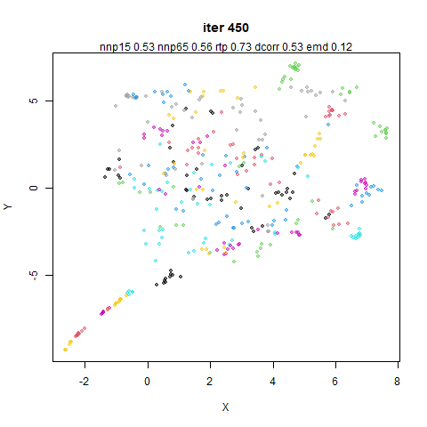||

| frey | frey (no mid) | 
|:--|:--|
||
||
||
||

This is one of the few results where there is a noticeable difference in the
visual output *and* one of the metrics, which favors retaining the mid-near weighting.

| coil20 | coil20 (no mid) | 
|:--|:--|
||
||
||
||

Again, the distance correlation indicates that turning off the mid-near weights
is a mistake.

| mnist | mnist (no mid) | 
|:--|:--|
||
||
|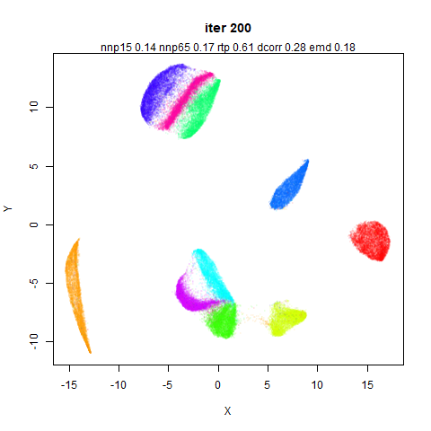|
||

| fashion | fashion (no mid) | 
|:--|:--|
||
||
||
||

| kuzushiji | kuzushiji (no mid) | 
|:--|:--|
||
||
||
||

| cifar10 | cifar10 (no mid) | 
|:--|:--|
||
||
||
||

The CIFAR-10 dataset does not embed in an interesting way in any method I have
ever used, but having it split off into three chunks is definitely not ideal.
Again the `dcorr` metric most strongly indicates that something has gone wrong.

As to why this happens, it must be because of the vary large variance in the
first two principal components, which lead to large inter point distances
which cannot be easily recovered from without the mid-near points: compare
the range of the axes at iteration 0 for this dataset vs other which are more
well-behaved.

| norb | norb (no mid) | 
|:--|:--|
||
||
||
||

Another dataset where there is a lot of variance in the initial principal
components. It's clear here that if the initialization is too diffuse, the
different parts of the dataset optimize in isolation from each other. The
global structure metrics indicate that this is a better embedding than the one
that uses mid-near pairs though. Probably global metrics that stay too close
to the PCA results are an indicator of this sort of thing happening.

| ng20 | ng20 (no mid) | 
|:--|:--|
||
||
||
||

| mammoth | mammoth (no mid) | 
|:--|:--|
||
||
||
||

In both cases, the mammoth's leg has detached from the main body.

| swissroll | swissroll (no mid) | 
|:--|:--|
||
||
||
||

| s-curve with a hole | s-curve with hole (no mid) | 
|:--|:--|
||
||
||
||

| macosko2015 | macosko2015 (no mid) | 
|:--|:--|
||
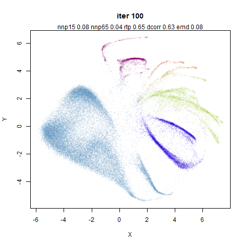||
||
||

| tasic2018 | tasic2018 (no mid) | 
|:--|:--|
||
||
||
||

`dcorr` favors keeping the mid-near pairs here.

| lamanno2020 | lamanno2020 (no mid) | 
|:--|:--|
||
||
||
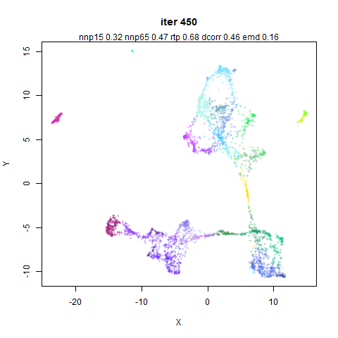||

So for a lot of these datasets, removing the mid-near pairs doesn't do much with
a PCA-based initialization. This is not surprising. But for some datasets the
metrics (usually `dcorr`) seems to indicate that keeping the mid-near pairs
around is a good idea, even with a PCA-based initialization. I think a lot of
that could be explained by the fact that PaCMAP doesn't try very hard with its
initialization. By fixing the variance of the input to `~1.0`, I suspect
datasets like `norb` and `cifar10` would behave similarly with or without the
mid-near pairs.

Also of note: the neighborhood preservation metrics are utterly insensible to
the sometimes large global changes in the datasets here. Invariably, the PCA
results always show a fairly low neighborhood preservation and a high global
preservation, and over the course of the embedding, the neighborhood
preservation increases at the cost of the global distances.

### Random Mid-Near Distances

When looking at the distribution of the mid-near distances and random distances
I thought they looked quite close to each other. So can we just use some
random distances instead? Maybe the role of the mid-near pairs is to keep the
overall distribution of distances in a range where the near pairs can actually
be effective?

Below on the left hand column is the same results that you just saw. Believe
me you will not want to be scrolling up and down looking for these for comparative
purposes. On the right hand column is the result of using random distances
instead of the mid-near pairs. Weights were kept the same as with the "real"
mid-near pairs.

| iris (near mid) | iris (random mid) | 
|:--|:--|
||
|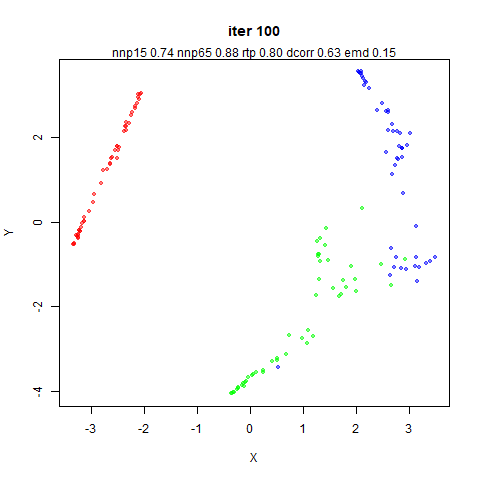|
||
||

| s1k (near mid) | s1k (random mid) | 
|:--|:--|
||
||
||
||

| oli (near mid) | oli (random mid) | 
|:--|:--|
||
||
|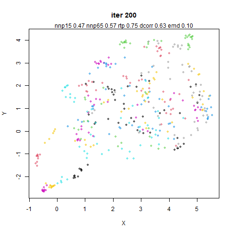|
||

| frey (near mid) | frey (random mid) | 
|:--|:--|
||
||
||
||

The Frey faces dataset seems to be reliably sensitive, perhaps because it is
more like a manifold than some of the other (non-synthetic) datasets. Again,
mid-near pairs seem to be improve the global structure.

| coil20 (near mid) | coil20 (random mid) | 
|:--|:--|
||
||
||
||

Ok, so this is actually quite a big effect according to `dcorr` and even
`rtp` agrees. The random distances definitely reduce the global structure here.
Visually, I would have a hard time deciding that the right hand structure was
"worse" than the left hand one in any way.

| mnist (near mid) | mnist (random mid) | 
|:--|:--|
||
|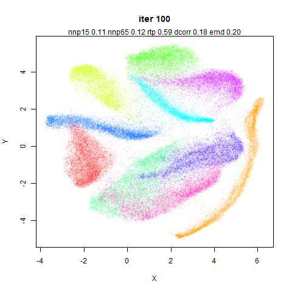|
||
||

| fashion (near mid) | fashion (random mid) | 
|:--|:--|
||
|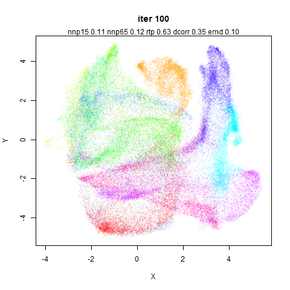|
||
||

| kuzushiji (near mid) | kuzushiji (random mid) | 
|:--|:--|
||
||
||
|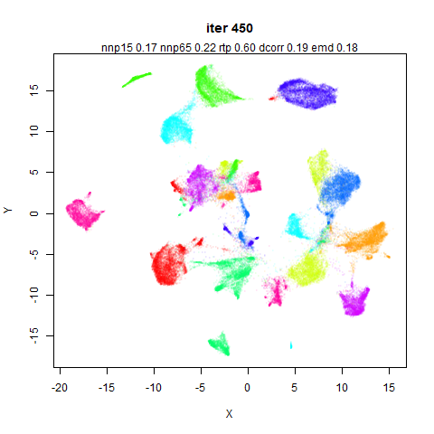|

| cifar10 (near mid) | cifar10 (random mid) | 
|:--|:--|
||
||
|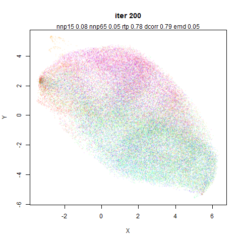|
||

| norb (near mid) | norb (random mid) | 
|:--|:--|
||
||
|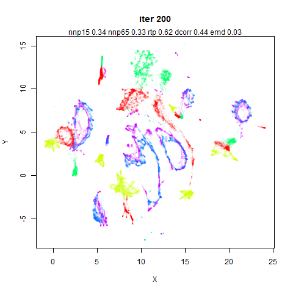|
||

| ng20 (near mid) | ng20 (random mid) | 
|:--|:--|
||
||
||
|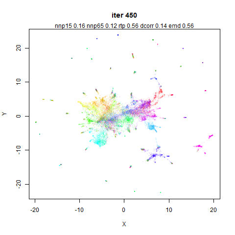|

| mammoth (near mid) | mammoth (random mid) | 
|:--|:--|
||
||
||
||

A tusk has been unfortunately snapped off the random distance mammoth here.

| swissroll (near mid) | swissroll (random mid) | 
|:--|:--|
||
||
||
||

Personally, I think the result from using random distance for the mid-near pairs
is better here. This shows the limitations of the global measures of structure:
you want the manifold to unfold here, which means the straight-line Euclidean
distances should *not* be preserved.

| s-curve with a hole (near mid) | s-curve with hole (random mid) | 
|:--|:--|
||
||
||
||

| macosko2015 (near mid) | macosko2015 (random mid) | 
|:--|:--|
||
||
||
||

| tasic2018 (near mid) | tasic2018 (random mid) | 
|:--|:--|
||
||
||
||

| lamanno2020 (near mid) | lamanno2020 (random mid) | 
|:--|:--|
||
||
||
||

Lots of results here where the `dcorr` metric was very clearly showing a difference
in these results, and invariably it says that using uniformly-sampled random
distances is a bad idea.

### Turning Off Early Near Pairs

I was curious if mid-near pairs could be used exclusively during the first 200
iterations, without also using the near pairs. Maybe something like this could
be used to initialize other embedding methods like t-SNE and UMAP if so?

This doesn't work out too great. Below are two illustrative examples of what
happens using `mnist` and `frey`, where I just set the near pair weights to `0`
for the first 200 iterations.

| mnist (no near) | frey (no near) | 
|:--|:--|
||
||
||
||

When the near pairs are turned on it looks like they aren't capable of pulling
neighboring points back together.

### Splitting Mid and Near Pairs

The above results give a clue as to why the near pair weight is set to 2 or 3
during the period of the embedding when the mid-near pairs are active: they are
acting to break up local structure in favor of global structure so you need
a countervailing attractive force to keep the local structure together.

For the following plots, I turned off the mid-near pair weights for the first
200 iterations, then for the next 200 iterations turned off the mid-near weights
and set the near-pair weights to `5`, and then had the final 250 iterations as
before (with the near-pair weights set to `1`). This effectively splits the
first 200 iterations where the mid-near and near pairs are both on, into two
separate 200 iteration sequences, where only one or the other is present. I
found I couldn't get away with setting the near pair weights to `3` in this case.
As you will see below, without the near pair attractions acting to compress the
embedding initially, the effect of the mid-near weights is to cause the initial
coordinates to be much more spread out. Hence you need a stronger attractive
force to pull them back in once the mid-near pair forces are turned off.

Also bear in mind that the comparisons between methods here aren't for the same
number of iterations, the right hand side gets an extra 200 iterations. Although
the same number of attractive updates occur in both cases, the repulsive
interactions are always on, so there are 200 extra iterations worth of repulsive
coordinate updates for the images on the right hand side.

| iris (near mid) | iris (split mid) | 
|:--|:--|
||
||
||
||

| s1k (near mid) | s1k (split mid) | 
|:--|:--|
||
||
||
||

| oli (near mid) | oli (split mid) | 
|:--|:--|
||
||
||
||

| frey (near mid) | frey (split mid) | 
|:--|:--|
||
||
|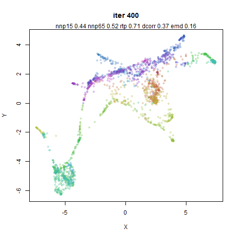|
||

| coil20 (near mid) | coil20 (split mid) | 
|:--|:--|
||
|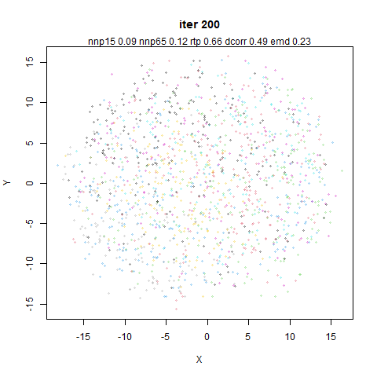|
||
||

| mnist (near mid) | mnist (split mid) | 
|:--|:--|
||
||
||
||

| fashion (near mid) | fashion (split mid) | 
|:--|:--|
||
||
||
||

| kuzushiji (near mid) | kuzushiji (split mid) | 
|:--|:--|
||
||
||
||

| cifar10 (near mid) | cifar10 (split mid) | 
|:--|:--|
||
||
||
||

| norb (near mid) | norb (split mid) | 
|:--|:--|
||
||
||
||

| ng20 (near mid) | ng20 (split mid) | 
|:--|:--|
||
||
|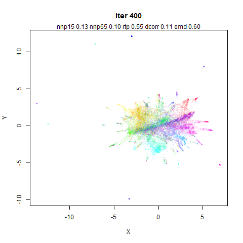|
|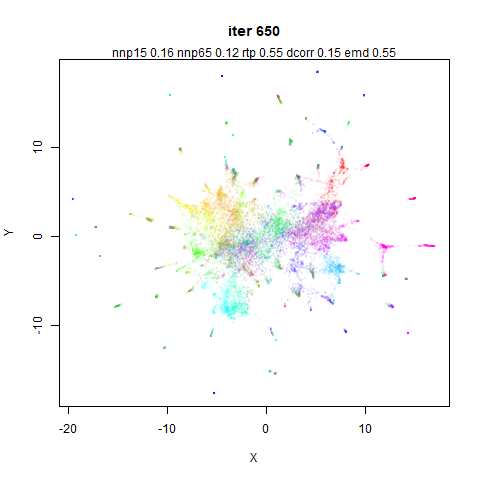|

| mammoth (near mid) | mammoth (split mid) | 
|:--|:--|
||
||
||
||

| swissroll (near mid) | swissroll (split mid) | 
|:--|:--|
||
|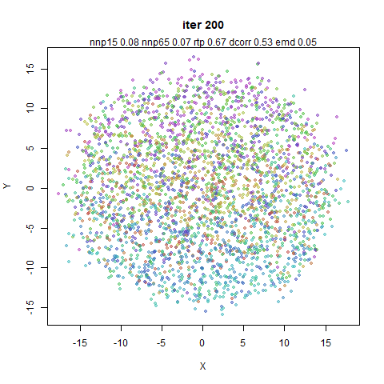|
||
||

| s-curve with a hole (near mid) | s-curve with hole (split mid) | 
|:--|:--|
||
||
||
||

| macosko2015 (near mid) | macosko2015 (split mid) | 
|:--|:--|
||
||
||
||

| tasic2018 (near mid) | tasic2018 (split mid) | 
|:--|:--|
||
||
||
||

One of the few examples where the `dcorr` indicates a difference (in favor of
not splitting the different weightings).

| lamanno2020 (near mid) | lamanno2020 (split mid) | 
|:--|:--|
||
||
||
||

In most cases there isn't much difference between the two methods. So maybe
splitting the mid-pair from the near-pair interactions is a possible way to get
some of the benefits of PaCMAP's apparent robustness to different initialization
strategies in non-PaCMAP methods. Some tweaking of the weights seems like it
might be needed if you didn't want to do some kind of early exaggeration-style
over-attraction, but you might well be doing that with t-SNE anyway.

### Using Unscaled Neighbors

I spent a lot of time looking at the effect of local scaling on the hubness in
these datasets. My expectation is that PCA seems to reduce any hubness such
that the effect of local scaling is less likely to have a noticeable effect.

For this experiment, the right hand column uses the raw 15-nearest neighbors.

| iris (near mid) | iris (unscaled neighbors) | 
|:--|:--|
||
|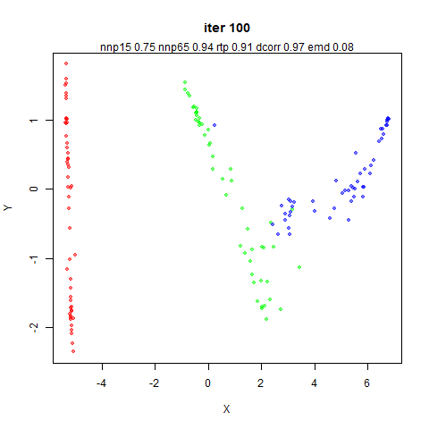|
||
||

| s1k (near mid) | s1k (unscaled neighbors) | 
|:--|:--|
||
||
||
||

| oli (near mid) | oli (unscaled neighbors) | 
|:--|:--|
||
||
||
||

The olivetti faces have a high level of hubness, but I've never really noticed
any issues around embedding it with t-SNE, UMAP and now PaCMAP. So despite the
local scaling being very effective at reducing hubness, I am not very surprised
that visually I don't see a huge difference.

| frey (near mid) | frey (unscaled neighbors) | 
|:--|:--|
||
||
||
||

| coil20 (near mid) | coil20 (unscaled neighbors) | 
|:--|:--|
||
||
||
||

| mnist (near mid) | mnist (unscaled neighbors) | 
|:--|:--|
||
||
||
||

| fashion (near mid) | fashion (unscaled neighbors) | 
|:--|:--|
||
||
||
||

| kuzushiji (near mid) | kuzushiji (unscaled neighbors) | 
|:--|:--|
||
||
||
||

| cifar10 (near mid) | cifar10 (unscaled neighbors) | 
|:--|:--|
||
||
||
||

CIFAR-10 is one of the datasets where local scaling substantially reduces hubs
but I was not holding out much hope for a big change. And basically nothing
happens.

| norb (near mid) | norb (unscaled neighbors) | 
|:--|:--|
||
||
||
||

| ng20 (near mid) | ng20 (unscaled neighbors) | 
|:--|:--|
||
||
||
||

In terms of the effect of local scaling, 20NG is affected a lot like CIFAR-10.
And it shows the same disappointing lack of much going on.

| mammoth (near mid) | mammoth (unscaled neighbors) | 
|:--|:--|
||
||
||
||

| swissroll (near mid) | swissroll (unscaled neighbors) | 
|:--|:--|
||
||
||
||

There is at least a slightly different tearing of the manifold than we see for
the other changes carried out in this document. Again the state of the embedding
is not as bad the disparity in `dcorr` suggests (if anything the opposite).

| s-curve with a hole (near mid) | s-curve with hole (unscaled neighbors) | 
|:--|:--|
||
||
||
||

| macosko2015 (near mid) | macosko2015 (unscaled neighbors) | 
|:--|:--|
||
||
||
||

This is the final dataset that I thought I might see some changes with local
scaling. The `dcorr` does go up but not by much. Given the `emd` shows an
increase (that's a bad thing) I would be hard pressed to say my expectations
were met.

| tasic2018 (near mid) | tasic2018 (unscaled neighbors) | 
|:--|:--|
||
||
||
|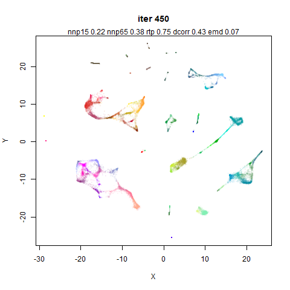|

| lamanno2020 (near mid) | lamanno2020 (unscaled neighbors) | 
|:--|:--|
||
||
||
||

I wasn't expecting much to happen and it didn't. At least with `n_neighbors=15`,
and all the other settings as defaults, I am not sure that local scaling is
actually worth the effort here. Maybe it's helpful with a different 
initialization?

### PCA/Scaled Neighbors

Ok, so local scaling doesn't seem to do much to the datasets above, but we've
seen that carrying out PCA can have a big effect on the input distances. What if
local scaling proves its worth when PCA isn't carried out (with
`apply_pca=False`)?

I focus here on the two datasets where local scaling has a big effect on the
neighborhoods: `macosko2015` and `ng20`. `cifar10` might also have an effect but
we have already established that it just sits there like a big useless lump so
let's not waste time on that.

Below are four images for each dataset, the final coordinates after 450
iterations. The top row uses the approximate 15 nearest neighbors without local
scaling. Top left doesn't use PCA (so is like the sort of nearest neighbors UMAP
would use). Top right applies PCA (so is the same figure as used in the final
row of the previous section's tables). The bottom row is for the scaled neighbor
results: bottom left does not apply PCA. Bottom right does apply PCA, so is the
standard PaCMAP results we have been comparing all along.

Also: I also turned off the scaling for the non-PCA case, where the data is
scaled between 0 and 1 before centering. The data is still centered, so it's
more comparable to the PCA case, where the data is also centered, but not scaled
before applying PCA.

|     | macosko2015 (full rank) | macosko2015 (PCA) | 
|:----|:--|:--|
| kNN |||
| sNN |||

|     | ng20 (full rank) | ng20 (PCA) | 
|:----|:--|:--|
| kNN |||
| sNN |||

The non-PCA results definitely look different to the PCA results, thus
vindicating my strong recommendation not to blindly apply PCA to your data for
pre-processing. And the local scaling might be having more of an effect than
in the PCA case. It would be fair to say that it doesn't seem to do much,
though. The metrics don't seem to be hugely affected either.

