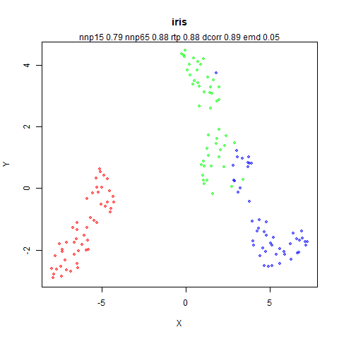
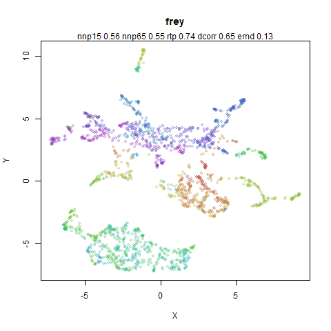
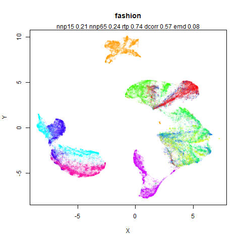
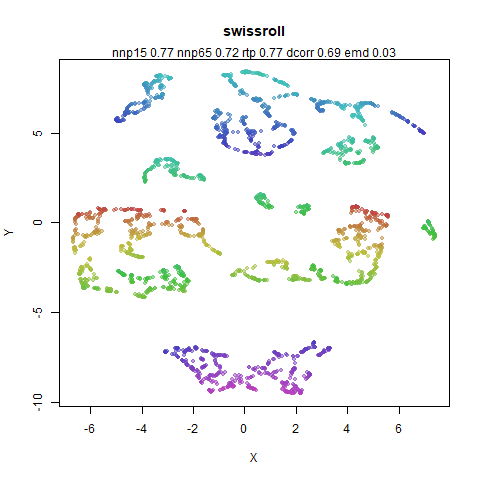
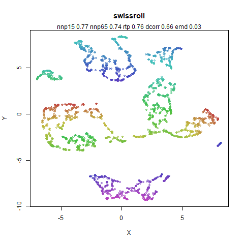

Part 2 of many example images of PaCMAP. A continuation of [Notes on
PaCMAP](https://jlmelville.github.io/smallvis/pacmap.html) and [PaCMAP
Examples](https://jlmelville.github.io/smallvis/pacmap-examples.html).

Here I have tried to make as direct a comparison with UMAP as I can. I again
fiddled with the PaCMAP code to turn off some things: non-PCA data is centered
but not range-scaled and I changed the PCA initialization in PaCMAP to scale the
standard deviation to 1 for all columns. Back in [PaCMAP
Examples](https://jlmelville.github.io/smallvis/pacmap-examples.html) I
speculated that an initialization like this would avoid the poor results I saw
when I turned off mid-pair weights.

For UMAP, I used [uwot](https://cran.r-project.org/package=uwot) which I have
easy control over to mess about with for my needs. I used the exact nearest
neighbors for the UMAP case because I have pregenerated them for these datasets
which removes a large source of computational time. For initialization, I used
the coordinates from PaCMAP at iteration 0.

In the table below, the first row is PaCMAP. The first column uses mid-near
weights as usual, the second doesn't use them *and* sets the near-pairs to 1 for
all iterations. This is to test my theory that scaling the PCA initialization
should be good enough for PaCMAP. It also removes the influence of the mid-near
pairs vs UMAP. Additionally, if it works well enough without mid-near
interactions, that would suggest you could implement something PaCMAP-like
fairly easily in existing UMAP-style code bases (like `uwot`).

The second row is UMAP results. The left column is UMAP with default settings.
The right column is t-UMAP, which should be "gentler" in terms of its forces
(although not as gentle as PaCMAP).

The third row is UMAP results but I use the 100D PCA input like PaCMAP would (if
the input dimensionality > 100), and also the near pairs are the scaled nearest
neighbors. Previous results suggest that this won't have a noticeable effect
except on `macosko2015` and `ng20`. Again UMAP is on the left and t-UMAP is
on the right.

As we don't have enough images as it is, I have added two other datasets:
`coil100`, which is like `coil20` but has more images; and `isofaces`, a more
manifold-like dataset, beloved of many a spectral-based embedding paper.

Finally, sorry for not having useful titles on the images.

| iris |  | 
|:--|:--|
||
||
||

| s1k |  | 
|:--|:--|
||
||
||

| oli |  | 
|:--|:--|
||
||
||

| frey | | 
|:--|:--|
||
||
||

| coil20 |  | 
|:--|:--|
||
||
||

This the one dataset where the `dcorr` is noticeably worse for the PaCMAP result
without the mid-pair forces vs with it.

| coil100 |  | 
|:--|:--|
||
||
||

| mnist |  | 
|:--|:--|
||
||
||

| fashion | | 
|:--|:--|
||
||
||

| kuzushiji |  | 
|:--|:--|
||
||
||

| cifar10 |  | 
|:--|:--|
||
||
||

| norb |  | 
|:--|:--|
||
||
||

| ng20 |  | 
|:--|:--|
||
||
||

This dataset shows the biggest difference between PaCMAP and UMAP according to
both global and local metrics. This might really be saying that it's a bad idea
to use the Euclidean metric on this dataset no matter what you use. Hard to
see that any of the visualizations are incredibly insightful at a global level.

| mammoth |  | 
|:--|:--|
||
||
||

| swissroll |  | 
|:--|:--|
||
||
||

| s-curve with a hole | | 
|:--|:--|
||
||
||

| isofaces |  | 
|:--|:--|
||
||
||

PaCMAP reliably splits the isofaces dataset into two from a PCA initialization.
The `dcorr` and `rtp` metrics indicate that the UMAP results are to be preferred
but they are not a feast for the eyes that's for sure. The `emd` metric
marginally prefers the PaCMAP results though.

| macosko2015 | | 
|:--|:--|
||
||
||

This the only dataset where the `rtp` metric suggests that UMAP and t-UMAP 
results on PCA-processed data do a noticeably better job of preserving the
global structure than not applying PCA.

| tasic2018 |  | 
|:--|:--|
||
||
||

| lamanno2020 |  | 
|:--|:--|
||
|
|

Overall, the global structure according the to `rtp` metric is pretty much the
same for all the methods. According to `dcorr`, UMAP might do a better job.
For PaCMAP, where there is a difference when not including the mid-pair forces,
once again the evidence suggests that even with a PCA initialization, having
the mid-pair forces helps.

For local preservation, UMAP seems better at retaining the 15 nearest neighbors,
but the difference disappears at 65 nearest neighbors. This would be in line
with the idea that UMAP's attractive forces are stronger than those of PaCMAP
and the consistently more torn and distorted manifolds for the
S-curve-with-a-hole, swiss roll and mammoth also show that. t-UMAP definitely
seems to tear manifolds less strongly than UMAP (but definitely more than
PaCMAP).

The effect of using the local scaling + PCA for finding nearest
neighbors seems slight for all methods, whether we look at global or local
measures of preservation. I couldn't see any particular visual trend either,
apart from the expected difference for `macosko2015` and `ng20` and it's the
effect of applying PCA that has the big effect there.

Without considering clusters or other more supervised methods of global
structure preservation, the global preservation metrics indicate that if you
have access to a sensibly-scaled PCA initialization for UMAP I am not convinced
that PaCMAP is a huge win over UMAP. However, first, the PaCMAP paper doesn't
say that, it is focused on being able to get good results from more random
initializations. Second, the Python UMAP implementation *doesn't* currently have
such a PCA implementation option. But `uwot` *does*, and that's what I use so this
is less of a concern for me. 

PaCMAP definitely seems to do a better job or ripping manifolds less (although
it certainly can't work miracles with `swiss roll` and will detach a leg on the
`mammoth`) so it would have a big advantage there. Unfortunately, apart from the
more synthetic simulation sets used here, it's not clear to me that for the
other datasets, if there is some hidden manifold structure within the
cluster-like blobs, that PaCMAP is any better at revealing that than UMAP.

Finally, I still have some qualms about whether the global preservation metrics
are helpful. In particular, I am suspicious of the `emd` metric which regularly
gives the opposite conclusion to `rtp` and `dcorr`. This may be down to the
stochastic sampling nature of my implementation, but I think there are deeper
issues about the normalization that is required. In particular, global metrics
could give entirely the opposite conclusion if there *is* the manifold structure
that PaCMAP is better at handling: successfully unrolling the `swiss roll` will
lead to very poor correlations with the original input distances. The spectral
initialization that UMAP does by default is usually much more successful with
these kinds of structures visually (`mammoth` is not a huge success, but
`isofaces` and `swiss roll` do well) but you wouldn't know it if you just looked
at the global preservation metrics (as usual the local preservation is
unchanged). Also, I think these metrics may reward large separations of roughly
clustered data. Arguably very best `norb` results are from when the mid-pair
weights are turned off and the initial PCA result caused large distances. The
different parts of the dataset merrily rearranged locally without shifting from
their locations due to PCA so both global and local results were pretty good.
But I don't know if that really represents the best possible visualization that
PaCMAP or UMAP could come up with for that dataset. However, the idea of
optimizing each neighborhood in isolation in a series of mini-UMAPs, then trying
to find a good alignment for them in the style of LTSA might be an interesting
way to leverage this observation.
