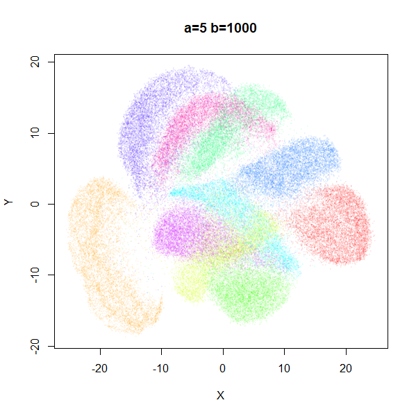
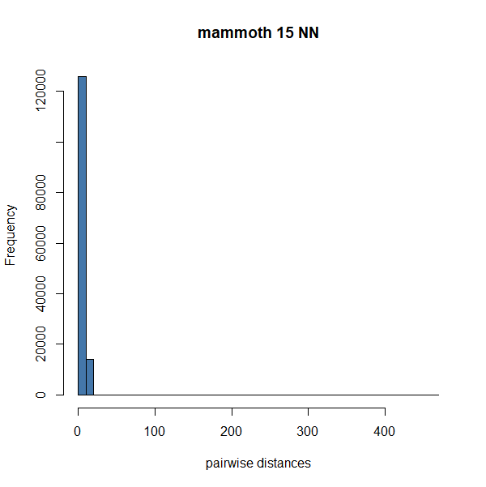
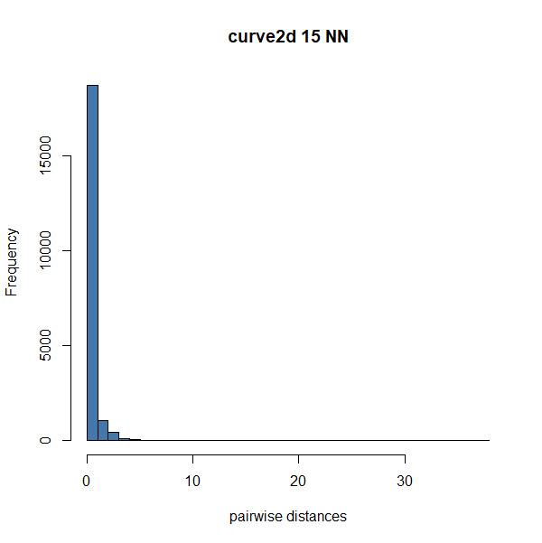
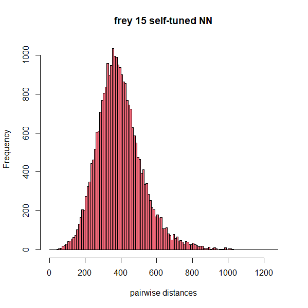
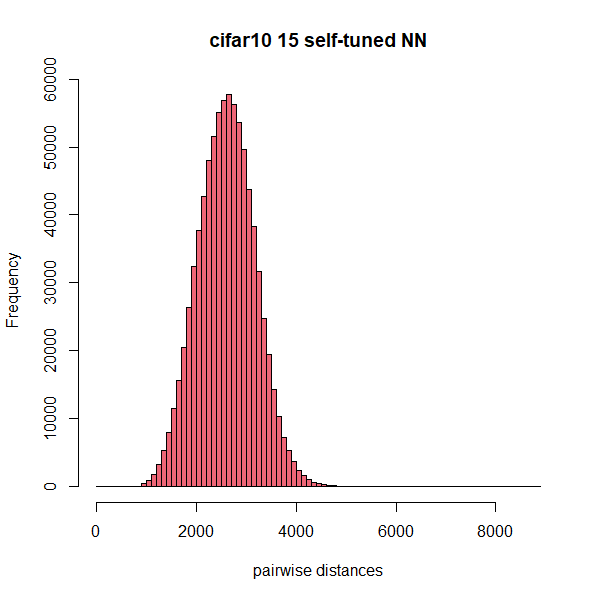
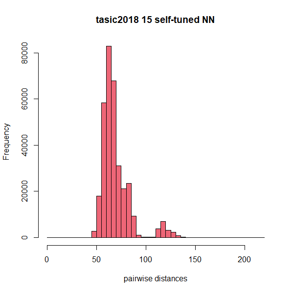
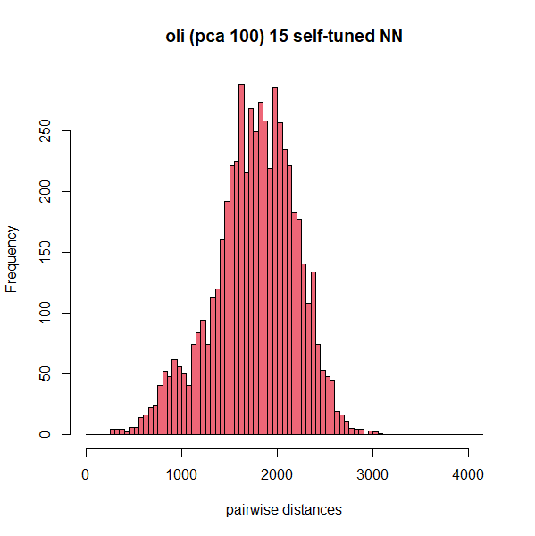
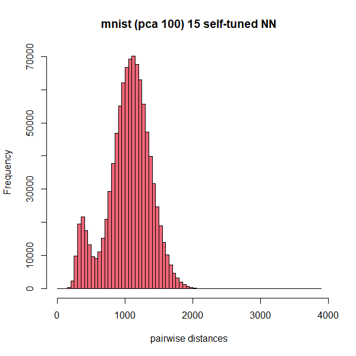
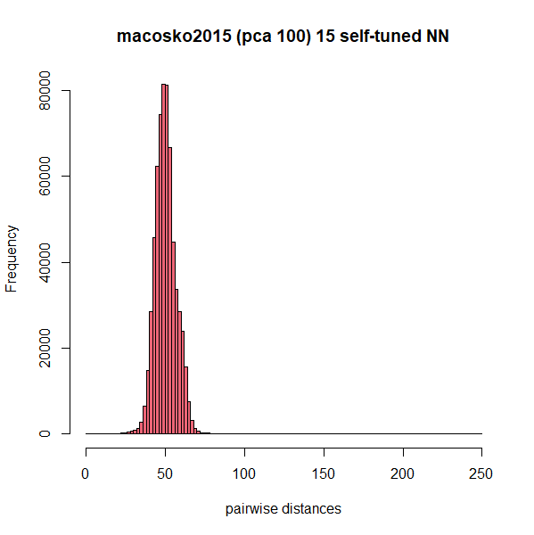

PaCMAP (Pairwise Controlled Manifold Approximation:
[github](https://github.com/YingfanWang/PaCMAP),
[arXiv](https://arxiv.org/abs/2012.04456),
[JMLR](https://www.jmlr.org/papers/v22/20-1061.html)) is a UMAP/LargeVis-like
method with a focus on maintaining global as well as local structure. In my
opinion, its main innovation is advocating for the inclusion of "mid-near"
pairs in the optimization. These are formed from finding points which aren't 
the nearest neighbors but are closer on average than a random point from the
dataset. The cost function in PaCMAP is also fairly simple, while maintaining
some properties that the authors identify as important to avoid distorting local
manifold structure while maintaining the good clustering behavior of UMAP.

## The Usual Preliminaries

The output coordinates of points $i$ is the vector $\mathbf{y_i}$. The distance
between two output points $i$ and $j$ is the Euclidean distance given as 
$d_{ij}$. But we usually work with the squared distances:


$$
d_{ij}^2 = \| \mathbf{y_i} - \mathbf{y_j} \|_2^2
$$

Output similarities/weights are like those used in t-SNE, using a Cauchy-like
function:

$$
w_{ij} = \frac{1}{1 + d_{ij}^2} 
$$


Some derivatives:

$$
\begin{aligned}
&\frac{\partial{d_{ij}}}{\partial{\mathbf{y_i}}} = \frac{1}{d_{ij}} \left( \mathbf{y_i} - \mathbf{y_j} \right)
\\
&\frac{\partial{w_{ij}}}{\partial{d_{ij}}} = -2 d_{ij} w_{ij}^2
\\
&\frac{\partial{w_{ij}}}{\partial{\mathbf{y_i}}} = -2 w_{ij}^2 \left( \mathbf{y_i} - \mathbf{y_j} \right)
\end{aligned}
$$

and the gradient of the cost function is:

$$
\frac{\partial{C}}{\partial{\mathbf{y_i}}} = -2 \frac{\partial{C}}{\partial{w_{ij}}} w_{ij}^2 \left(\mathbf{y_i} - \mathbf{y_j}\right)
$$

As the cost function for this kind of dimensionality reduction method is usually
given in terms of $w_{ij}$, we can concentrate on the form of
$\partial{C}/\partial{w_{ij}}$ and plug it into the full gradient above if we
want to write an actual implementation.

## Cost Function

In the PaCMAP paper, the cost function is defined in terms of $\tilde{d_{ij}}$,
which is defined as:

$$
\tilde{d_{ij}} = 1 + d_{ij}^2
$$

I will be working with $w_{ij}$ rather than $\tilde{d_{ij}}$ where possible.

Near neighbor and mid-near attractive interactions are of the form:

$$
C^{+}_{PaCMAP} = \frac{a\tilde{d_{ij}}}{b + \tilde{d_{ij}}} = \frac{a}{1 + bw_{ij}}
$$

where $a$ is a positive scalar weight that changes over the course of the
optimization to put different emphasis on local vs global pairs, and $b$ is a
fixed positive value.

For non-neighbors (also referred to as "further" or "far" pairs), the repulsive
interactions are:

$$
C^{-}_{PaCMAP} = \frac{1}{1 + \tilde{d_{ij}}} = \frac{w_{ij}}{1 + w_{ij}}
$$

In the paper, the repulsive interaction does have a weight associated it (i.e.
the numerator can be > 1) but in practice the optimization procedure always
fixes the numerator as 1, so for simplicity's sake I have omitted it.

PaCMAP never gives a "full" cost function that we might expect: i.e. one that
is defined over all possible pairs of points.

## Gradient

The derivative of the attractive interaction is:

$$
\frac{\partial C_{PaCMAP}^+}{\partial{w_{ij}}} =
-\frac{ab}{\left(1 + bw_{ij}\right)^2}
$$

and therefore the gradient is:

$$
\frac{\partial C_{PaCMAP}^+}{\partial{\mathbf{y_i}}} =
2\frac{abw_{ij}^2}{\left(1 + bw_{ij}\right)^2} \left(\mathbf{y_i} - \mathbf{y_j}\right)
$$

The derivative of the repulsive interaction is:

$$
\frac{\partial C_{PaCMAP}^-}{\partial{w_{ij}}} = 
\frac{1}{\left(1 + w_{ij}\right)^2}
$$

hence the gradient is:

$$
\frac{\partial C_{PaCMAP}^-}{\partial{\mathbf{y_i}}} =
-2\frac{w_{ij}^2}{\left(1 + w_{ij}\right)^2} \left(\mathbf{y_i} - \mathbf{y_j}\right)
$$

(if you wanted to include an $a$ and $b$ in the repulsive contribution, the form
of the gradient would look identical to the attractive interaction, but with a
difference in sign).

### Comparison with UMAP

The equivalent gradients for UMAP are:

$$
\begin{aligned}
& \frac{\partial C_{UMAP}^+}{\partial{\mathbf{y_i}}} = 2 w_{ij} \left(\mathbf{y_i} - \mathbf{y_j}\right) \\
& \frac{\partial C_{UMAP}^-}{\partial{\mathbf{y_i}}} =
-2\frac{w_{ij}^2}{1 - w_{ij}} \left(\mathbf{y_i} - \mathbf{y_j}\right)
\end{aligned}
$$

I have made a simplifying assumption in the case of UMAP that the sampling of
positive edges is uniform and the output weight function parameters are set so
they match that of PaCMAP.

### Paper/Code form

Here is the gradient in terms of the expression in the paper and how it looks
in the PaCMAP code.

This requires the following derivatives:

$$
\begin{aligned}
&\frac{\partial{d_{ij}}}{\partial{\mathbf{y_i}}} = \frac{1}{d_{ij}} \left( \mathbf{y_i} - \mathbf{y_j} \right)
\\
&\frac{\partial{\tilde{d_{ij}}}}{\partial{d_{ij}}} = 2 d_{ij}
\\
&\frac{\partial{\tilde{d_{ij}}}}{\partial{\mathbf{y_i}}} = 2 \left( \mathbf{y_i} - \mathbf{y_j} \right)
\\
&\frac{\partial{C}}{\partial{\mathbf{y_i}}} = 2 \frac{\partial{C}}{\partial{\tilde{d_{ij}}}} \left(\mathbf{y_i} - \mathbf{y_j}\right)
\end{aligned}
$$

The attractive derivative is:

$$
\frac{\partial C_{PaCMAP}^+}{\partial{\tilde{d_{ij}}}} =
\frac{ab}{\left(b + \tilde{d_{ij}}\right)^2}
$$

leading to the gradient:

$$
\frac{\partial C_{PaCMAP}^+}{\partial{\mathbf{y_i}}} =
2\frac{ab}{\left(b + \tilde{d_{ij}}\right)^2} \left(\mathbf{y_i} - \mathbf{y_j}\right)
$$

The repulsive derivative is:

$$
\frac{\partial C_{PaCMAP}^-}{\partial{\tilde{d_{ij}}}} =
-\frac{1}{\left(1 + \tilde{d_{ij}}\right)^2}
$$

giving:

$$
\frac{\partial C_{PaCMAP}^-}{\partial{\mathbf{y_i}}} =
-2\frac{1}{\left(1 + \tilde{d_{ij}}\right)^2} \left(\mathbf{y_i} - \mathbf{y_j}\right)
$$

### Some R functions

To convince myself that have correctly expressed these gradients are equivalent,
here are two R functions that calculate the "force constant" part of the
gradients (i.e. everything that isn't the $\mathbf{y_i} - \mathbf{y_j}$ part):

```R
pacmap_kw <- function(dij, a = 1, b = 1) {
  dij2 <- dij * dij
  wij <- 1 / (1 + dij2)
  bw1 <- 1 + b * wij
  w1 <- 1 + wij
  list(
    attr = 2 * (a * b * wij * wij) / (bw1 * bw1),
    rep = -2 * wij * wij / (w1 * w1)
  )
}

pacmap_kd <- function(dij, a = 1, b = 1) {
  dij2 <- dij * dij
  dsquig <- 1 + dij2
  bd <- b + dsquig
  d1 <- 1 + dsquig
  list(
    attr = 2 * (a * b)  / (bd * bd),
    rep = -2 / (d1 * d1)
  )
}
```

## Weight Schedule

For neighbors, $b = 10$. For mid-near pairs, $b = 10000$. The $a$ weights
(referred to as $w_{NB}$, $w_{MN}$ and $w_{FP}$ for "near pairs", "mid-near
pairs" and "further pairs" respectively in the paper) have different values at
different points in the optimization schedule:

Iteration  | near | mid       | further
:----------|:-----|:----------|:-------
1 -> 100   | 2    | 1000 -> 3 | 1
101 -> 200 | 3    | 3         | 1
201 -> 450 | 1    | 0         | 1

I have kept the `further` weight column for consistency with the paper even
though as you can see, far pair weights are always 1. For the mid-near pairs
during the first 100 iterations, `1000 -> 3` means the weight is linearly
decayed from 1000 to 3 (to be completely precise, it starts at 1000 and drops by
~10 at each iteration so at iteration 100, $w_MN \approx 13$).

Neither the $a$ or $b$ parameters of the cost function can be modified by the
user in the PaCMAP implementation. The number of iterations can be changed, but
the first 200 iterations always use the same weights and schedule, so if you set
`num_iters = 900`, this means the third stage of the optimization schedule will
last for 700 iterations, rather than doubling the duration of all three stages
proportionally.

## Effect of Weight Parameters

What do the different values of $a$ and $b$ used in the cost function actually
do? Below are the MNIST digits after 100 iterations, with the near neighbor
parameters set to different values, the further pairs left to their default and
the mid pair values set to 0 so they don't interfere with the effect on the near
pairs. I manually edited the PaCMAP source code to do this.

In the table below, the top row has $b=10$, the second row $b=100$, third row
$b=1000$ and the bottom row $b=1000$. The left column is $a=1$, the right column
is $a=5$ and the right column is $a=10$. Over the course of the optimization,
near pairs will tend to feel an effect like the top left image. For mid-near
pairs the effect is closer to the bottom right.

|  |  |  |
|:----:|:----:|:-----:
||
||
||
||


If you look at the range on the axes (you may have to squint a bit), you'll see
that increasing $a$ shrinks the overall area the points are in while increasing
$b$ spreads the clusters out within a given area. So in general we would expect
the near pairs to feel strong attractive forces promoting clustering, while the
mid near pairs are more diffusely attracted.


## Force Constant Plots

To help compare with UMAP, I have plotted the attractive and repulsive "force
constants", $k_{attr}$ and $k_{rep}$, over the range of $w_{ij}$. The force
constant is the bit of the gradient that isn't the 
$\left(\mathbf{y_i} - \mathbf{y_j}\right)$ part, i.e. if you consider the
layout to be about finding an equilibrium of points attached to springs, this is
the stiffness of the spring between two points. Alternatively, consider this a
gradient plot, given a fixed displacement of 
$\left(\mathbf{y_i} - \mathbf{y_j}\right) = 1$.

First, the attractive interactions of near neighbors:


The blue line is UMAP with default settings. The red line is UMAP with the
output function chosen to give the same $w_{ij}$ values as PaCMAP. This version
of UMAP I will refer to as t-UMAP as it shares the same output weights as t-SNE
as well as PaCMAP. The green line is PaCMAP with $a = w_{NB} = 1$, which occurs
during the final part of the optimization, and the yellow is with 
$a = w_{NB} = 3$, which occurs during the middle part of the optimization. The 
UMAP forces are not only much higher, at least for the default settings, the
attractive forces rapidly accelerate in magnitude for high $w$ (i.e. neighboring
points in the embedding which are supposed to be close). For t-UMAP, the
relationship between $w_{ij}$ and $k_{attr}$ is linear. For PaCMAP, there is a
much more gentle increase in force as $w_{ij}$ increases, and the rate of change
decreases rather than increases. For PaCMAP, a $w_{ij} >= 0.62$ feels at least
90% of the maximum attractive force whereas for UMAP, $w_{ij} >= 0.96$. To be
pedantic, if we take into account UMAP's gradient clipping, it's actually
$w_{ij} >= 0.92$, but the overall message stays the same.

We'll come back to the mid-pairs after we have looked at the repulsive forces:


The colors are the same as in the previous plot: blue for UMAP, red for t-UMAP
and green for PaCMAP (there is only ever one weighting for the repulsive force).
It's hard to put the full range of forces for these methods in one plot, so I
have zoomed in on the top portion of the plot. There is a very similar pattern
as with the attractive forces: UMAP repulsions steeply increase as non-similar
items get close together in the embedding. Nothing very interesting happens
in the rest of the UMAP curves that aren't shown here. Note that the repulsive
gradient in UMAP requires a small positive value to prevent division by zero
at very high $w_{ij}$, so repulsions can get very large and negative. The UMAP
implementation clips the gradient so it doesn't exceed `4`: this is the total
gradient, not just the force constant, but that also puts an upper bound on the
effective force constant as `4`. PaCMAP on the other hand has no singularities
in its repulsion, (the maximum repulsion is `0.5`) and so no need need for
gradient clipping. It also doesn't show an acceleration in repulsion at high
$w_{ij}$.

Finally, let's look at the mid pair attractions, a PaCMAP-only feature:


This plot doesn't have any contributions from UMAP. The yellow, green and grey
lines are the attractive interactions from the "near" pairs with 
$a = w_{NB} = 3$, $a = w_{NB} = 2$ and $a = w_{NB} = 1$ respectively. The green
and yellow lines are the same as those from the first plot. The mid near forces
are the cyan line with $w_{MN} = 1000$, which is the value at which the
optimization starts, and purple with $w_{MN} = 3$, the value at the end of the
first part of the optimization, the force constant being linear scaled in
between. The grey line is the force constant that applies to the near pairs over
the same part of the optimization. The force constant is effectively uniform
over the entire range of $w_{ij}$ and by the end of the first part of the
optimization, $k_{attr} \approx 0.0006$ and never increases thereafter, so it
doesn't seem like it plays a major organizing role after the first 100
iterations.

Overall, this seems to point to why UMAP can "tear" manifolds or promote
clustering vs PaCMAP: forces (attractive or repulsive) which are much higher
at high $w_{ij}$. Based on my experiments with the weighting parameters of
the UMAP output weight function, I don't think it's possible to generate curves
which look like that of PaCMAP (the t-UMAP curve is the best you can do).

## No Gradient Clipping

I discussed this in the section above, but it's worth calling out as another
point of difference with UMAP: the PaCMAP gradients don't require clipping.

## Uniform Near Pair Weights

Note that for a given type of pair (e.g. near pairs), they all get the same
weight. This is different to UMAP and LargeVis (and t-SNE), where there is an
input weight calibration stage that puts a higher weight on pairs which have a
higher similarity. In UMAP and LargeVis this manifests as certain edges being
sampled more regularly during optimization. This is not the case for PaCMAP,
which effectively assigns all pairs the same weight and samples every pair
during each epoch

Alternatively, you could lump the near and mid-near pairs together as the
"positive" edges, and consider PaCMAP as applying only 1 or 2 different possible
weight values to the positive edges during any given epoch.

## Input Preprocessing

By default, if the input dimensionality $d > 100$ then the data is centered (but
not scaled) and PCA is applied via the scikit-learn
[TruncatedSVD](https://scikit-learn.org/stable/modules/generated/sklearn.decomposition.TruncatedSVD.html)
to reduce the input dimensionality to 100. If PCA is not asked for (or the data
is already low-dimensional), the data is range-scaled and then centered.

The Truncated SVD used in scikit-learn seems to use the same method by 
[Halko and co-workers](https://arxiv.org/abs/0909.4061) as used in
[irlba](https://cran.r-project.org/package=irlba)'s `svdr` function and cited by
the [rsvd package](https://cran.r-project.org/package=rsvd) (see also the 
[github](https://github.com/erichson/rSVD) and
[JSS publication](https://arxiv.org/abs/1608.02148)), but the scikit-learn
version is noticeably faster than either (even after installing OpenBLAS for 
faster linear algebra routines on Linux). Results for the later dimensions are
not the same between TruncatedSVD in Python and irlba, rsvd or even the unrelated
[bigstatsr](https://cran.r-project.org/package=bigstatsr) package so there may
be an accuracy/speed trade off to be investigated on the R side.

*16 November 2021* I have confirmed something along these lines for the 
`macosko2015` dataset (of dimensions `44808 x 3000`). For centered but unscaled
data, extracting 100 components explains around 37% of the variance, so
differences in results aren't due to numerical issues that arise when all the
variance in a dataset has been extracted and the last few columns are just
creative ways of expressing a vector that should be full of zeros. The
`TruncatedSVD` (in version 1.0 of scikit-learn) with default parameters produces
columns which are substantially less orthogonal than those produced by the R
packages mentioned above. After normalizing the columns, the dot products of
successive columns are fairly uniform across all 100 columns for all the R
methods, in the region of $10^{-14}$ to $10^{-16}$. For `TruncatedSVD`, the
columns start at a comparable level of orthogonality but quickly become less
orthogonal. The dot product of the tenth and eleventh column is around $10^{-7}$
and for the last ten columns the dot products are in the region of $10^{-4}$ to
$10^{-5}$. This suggests that for the purposes of approximate nearest neighbor
search, initial dimensionality reduction via SVD may be able to use
substantially looser tolerances than the defaults used in many R packages.

## Nearest Neighbors

The number of nearest neighbors is scaled according to dataset size. For 
$N < 10000$, the number of neighbors = 10. For $N > 10000$ the following formula 
is used:

$$
n_{nbrs} = \left \lfloor 10 + 15 \left(\log_{10}n - 4\right) \right \rceil
$$

where $\left \lfloor \cdot \right \rceil$ indicates my cumbersome attempt to
communicate "round to the nearest integer".

Perhaps some examples would help:

$N$       | $n_{nbrs}$
:---------|:--------
10 000    | 10
20 000    | 15
50 000    | 20
60 000    | 22
70 000    | 23
100 000   | 25
1 000 000 | 40

If you didn't want to think about it, it seems like setting `n_neighbors = 20`
would be fine.

### The Approximate Nearest Neighbor Calculation

[Annoy](https://github.com/spotify/annoy) is used for nearest neighbor
calculations. `n_trees = 20`. Instead of finding the `n_neighbors` nearest
neighbors however, actually `n_neighbors + 50` are searched for. This is to
allow finding the neighbors with the smallest scaled distances (see below).

PaCMAP supports all the distance metrics that Annoy does (i.e. Cosine, Manhattan
and Hamming in addition to Euclidean). There is one odd wrinkle to this (see
the mid-near section below).

### Scaled Distances

The closest `n_neighbors` of each point are not actually used. Instead the
`n_neighbors` closest points in terms of a "generalized" squared distance,
originally proposed by
[Zelnik-Manor and Perona](https://papers.nips.cc/paper/2004/hash/40173ea48d9567f1f393b20c855bb40b-Abstract.html),
is used:

$$
d_{ij}^{2,select} = \frac{r_{ij}^2}{\sigma_i \sigma_j}
$$

where $r_{ij}^2$ represents the distance in the input space. The local scaling
factor $\sigma_i$ is the mean average (unscaled) distance of the 4th-6th nearest
neighbors of $i$. This choice for $\sigma_i$ is the same as that used in the
Trimap method ([github](https://github.com/eamid/trimap), 
[arXiv](https://arxiv.org/abs/1910.00204)).

The closest scaled distance neighbors are searched from within the 
`n_neighbors + 50` with the smallest unscaled nearest neighbors. Scaled 
distances are not used in any other part of the method.

*11th January 2022*: note that the $i$th observation will always find itself
as its own nearest neighbor (or tied in the case with duplicates). PaCMAP 
accounts for this by actually looking at `n_neighbors + 51` and ignoring the
actual closest neighbor.

Roughly then we can expect to be looking for `60-75` nearest neighbors for
datasets up to $N = 100 000$.

## Mid Near Neighbors

The default number of mid-near neighbors is half that of the near neighbors
(rounded to the nearest integer). Each mid-near neighbor is chosen by picking
six items at random and keeping the one with the second-smallest distance. Note
that scaled distances are *not* used here.

Oddly, Euclidean distance is always used for measuring the distances at this
point no matter what distance metric was chosen for the near neighbors.

If we consider the near and mid-near neighbors together as making up the
"positive" edges that feel an attractive interaction during optimization, we
are using around `15-38` neighbors up to $N = 100 000$.

## Far Pairs

The default number of far pairs is twice that of the near neighbors. This is
slightly fewer negative examples than the UMAP default of `5` per point.
However the UMAP implementation does not apply the gradient descent update
to the negative points, which effectively halves its negative sampling rate,
so in practice these values are actually quite comparable.

As in UMAP, these are picked with at (uniform) random.

## Neighbors are Sampled Once and Re-used

In UMAP and LargeVis, the "negative" sampling (same as "far pairs" here) is
repeated during each epoch, so a given point $i$ always gets an entirely new
set of far pairs. PaCMAP samples both the mid-near and far pairs once before
the optimization begins and re-uses them at each epoch. This saves on repeated
random number generation, at the cost of increased memory usage for storing
the indices of the pairs. With default settings we can expect an extra storage
cost of $2.5 * N * n_{nbrs}$, which technically would make PaCMAP's memory costs
scale as $O(N \log N)$.

## Output Initialization

The default initialization uses PCA. The resulting coordinates are all shrunk
by a factor of `0.01`. Alternatively a random initialization is available using
the standard t-SNE initialization of random normal variables with a standard
deviation of `1e-4`. If a user-supplied matrix is provided, the coordinates
are centered and then shrunk by a factor of `1e-4`.

## Optimization

Unlike UMAP and LargeVis, PaCMAP updates the embedding using a full batch
gradient, i.e. coordinates are updated all at once at the end of each epoch.
The gradient is still stochastic however.

Optimization is carried out using [Adam](https://arxiv.org/abs/1412.6980),
popular in deep learning (or at least popular among people who write papers
about deep learning). The momentum parameters $\beta_1$ and $\beta_2$ are kept
at their default values ($0.9$ and $0.999$ respectively). The learning rate
$\alpha = 1$ and $\epsilon = 10^{-7}$. The latter was intended only to prevent
division by zero (although different values
[may also affect performance](https://papers.nips.cc/paper/2018/hash/90365351ccc7437a1309dc64e4db32a3-Abstract.html)).

## PaCMAP reports its Stochastic Cost

As can be seen in the consideration of the gradients, the per-point PaCMAP loss
can be easily calculated using values needed for the gradient. PaCMAP stores the
loss at the end of the gradient vector and can report it at different stages
during the optimization. Because the negative pairs are constant for the entire
optimization, we might expect there to be less variance than if a UMAP-style
approach to negative sampling was used. On the other hand, presumably this cost
function has a higher bias. And the variance issue may still bite you if you
try to compare different costs between different runs with different random
number seeds.

## Pairwise Distance Comparison

To get a feel for the effect of the different neighbor calculations, here are
some histograms of pairwise distances for different sets of exact nearest
neighbors across a variety of datasets. Neither UMAP nor PaCMAP use exact
nearest neighbors, but it's one less variable to worry about. The different sets
of neighbors are labelled as:

* `15`: The 15 nearest neighbors. Actually it's only the 14 nearest neighbors
because I omit the first nearest neighbor of each item which is always itself.
These are the exact nearest neighbors, not the result of an approximate nearest
neighbor calculation. This is the UMAP default value.
* `15s`: The 15 nearest neighbors using the scaled distances. These are selected
from the exact nearest 65 neighbors, as would be done in PaCMAP (i.e.
`n_neighbors + 50`).
* `150`: The 150 exact nearest neighbors. This is an order of magnitude higher
than the UMAP default, and would be the upper limit to the usual nearest
neighbor calculation in t-SNE, where often 3 * perplexity is used, and
perplexity is rarely set higher than 50.
* `mid near`: The mid near pairs, calculated as described above. Default in
PaCMAP is to calculate as many mid near pairs as `0.5 * n_neighbors`, but I have
calculated it using 15 mid near pairs for consistency (there is no effect on the
shape of the distribution of distances).
* `random`: 15 random neighbors.

For each of these set of neighbors, a histogram was generated of the distances.
I used the Euclidean distance in all cases. Overlaying all these histograms on
top of each other is way too confusing, so I have generated them using the same
break points on separate plots. Each column in the table below is one dataset,
so by looking down a column you can see how the pair-wise distance distribution
changes. I would expect the distances to increase as you look down the column.

The datasets are mostly discussed on the [uwot
examples](https://jlmelville.github.io/uwot/umap-examples.html) except for the
first three which are discussed in the PaCMAP paper. is less relevant here than
looking for overall trends.

The first three are low-dimensional (2 or 3 dimensions) quite highly structured
datasets. The `mammoth` dataset has 10,000 points and 3 features (X, Y, Z
coordinates: it's a 3D model of a mammoth). `sch10k` is the s-curve with a hole
also with 10,000 points and X, Y, Z coordinates. This is an S-shaped curve which
has a circular hole right in the middle (in the middle of the 'S'). The
`curve2d` is a 2D polynomial (1,450 points).

| mammoth | sch10k | curve2d |
|:----:|:----:|:-----:
||
||
||
||
||

The next three datasets are all image datasets. They are fairly small in terms
of number of objects, but are quite high dimensional (features are pixels).
`coil20` is a set of 20 objects in 72 poses each (so 1440 items altogether) and
16384 features. `frey` is a set of 1965 video stills of Brendan Frey's face with
560 features. `oli` is the Olivetti faces (40 faces, 10 images each) with 4096
features.

| coil20 | frey | oli |
|:----:|:----:|:-----:
||
||
||
||
||

The next three datasets are of identical dimensions: 70000 images, with 784
features (pixels). `mnist` are handwritten digits, `fashion` are images of items
of clothing, `kuzushiji` is handwritten Japanese characters.

| mnist | fashion | kuzushiji |
|:----:|:----:|:-----:
||
||
||
||
||

The last three datasets are: `cifar10`, which contains 60000 images
and 1024 features. `macosko2015` is an RNA-seq dataset with 44808 items and
3000 features. This dataset has a very high hubness (i.e. there is one item
which is the near neighbor of a large proportion of the dataset). `tasic2018`
is another RNA-seq dataset with 23822 items and 3000 features. `cifar10` 
and `tasic2018` have a lower hubness `macosko2015`, but still higher than 
`mnist`, `fashion`, and `kuzushiji`.

| cifar10 | macosko2015 | tasic2018 |
|:----:|:----:|:-----:
||
||
||
||
||

My observations on this are:

* You have to look quite hard at the `15` and `15s` distributions to see any
effect of using scaled neighbors, but that's not hugely surprising: at the most
extreme, the procedure would select neighbors 51-65, and for `mammoth` data,
that distribution is over quite a small range of the possible distances so you
wouldn't be able to see much detail there anyway. But this is not the case for
most of the datasets though: distance concentration quickly kicks in (i.e. in
high dimensions, the difference between a close and a far distance shrinks). 
* Going from 15 nearest neighbors to 150 nearest neighbors makes little
difference in terms of the distribution.
* The mid-near distributions are noticeably different from the nearest neighbor
distributions. I think it would be reasonable to ask the question "instead of
this mid-near business, can't we just use more nearest neighbors?". I think the
answer here says no.
* The mid-near distributions are quite similar to the random distributions. This
is hardly surprising given how they are constructed. For most datasets, the
difference in distribution is pretty subtle though, due to distance
concentration. I would be interested to see whether you could get away with a
uniform random sample of distances and get the same effect as the mid-near
pairs. This might make it easier to introduce PaCMAP ideas into existing UMAP
code bases because you could use the random negative sampling phase as a source
of pairs to use with the mid-near attractive forces. *December 25 2021*: on
reflection that would mean that you were really just picking points at random
and deciding some should be brought together and some should be pushed apart,
which wouldn't necessarily be good for global structure. So it might be that the
effect of mid-near pairs is more to bring the points into an area where the near
pair attractive forces can be effective, and this is the source of PaCMAP's
better robustness to initialization. The balance of the mid-near attractive
force versus the far pair repulsion would be an additional factor on top of the
relative balance introduced by the ratio of the different types of pairs. The
latter is tested in the PaCMAP paper and too many mid-near pairs does seem
to be deleterious.

The `macosko2015` dataset, which I said was most affected by hubness shows the
least difference between the `15` distances and the `rand`. It's quite striking
how little the distribution changes. Unlike every other dataset I've worked with
this is the one that shows the biggest effect of a PCA pre-processing step. In
most cases, it's assumed that running PCA is a way to speed up nearest neighbor
distance calculations by reducing the input dimensionality, but with
`macosko2015`, the UMAP output is affected substantially. The PCA step produces
a much better separation of clusters. Personally, while it works out well for
that dataset, I also find it a bit worrying that a pre-processing step can do
that.

As applying PCA is the default action in PaCMAP, below I regenerated some of the
distributions where PCA was applied to reduce the data to 100 dimensions before
doing the nearest neighbor search or random distance calculations. The table
contains four rows: The non-PCA results for the `15s` results and then PCA
results below. Then I show the `mid near` distributions without PCA and then
after applying PCA. The non-PCA results are repeated from the tables above. The
trends are the same for `15`, `150` and `rand` so there's no point showing
those. Also, the first three datasets above aren't included, because they
already only had 2 or 3 features in them.

### Effect of PCA

| coil20 | frey | oli |
|:----:|:----:|:-----:
||
||
||
||

| mnist | fashion | kuzushiji |
|:----:|:----:|:-----:
||
||
||
||

| cifar10 | macosko2015 | tasic2018 |
|:----:|:----:|:-----:
||
||
||
||

`macosko2015` does indeed show a pretty dramatic change in its distribution,
particularly its nearest neighbors. `tasic2018` also seems to show this. Could
just be coincidence that those are both RNA-seq datasets, but probably a look at
how such datasets are normalized or otherwise pre-processed might be in order.
For the other datasets, PCA doesn't seem to distort the distributions as much.
However, as they are all image datasets, that doesn't necessarily mean that
there aren't problems lurking. Memo to self: find some non-image datasets, e.g.
the 20 Newsgroup dataset (available in the PaCMAP repo) for text categorization.

### 20NG

*December 25 2021*: I followed up on my memo to myself and have now looked at
the [20 Newsgroups](http://qwone.com/~jason/20Newsgroups/) dataset aka `20NG`,
but I will refer to it as `ng20` because variables which begin with a digit are
difficult or impossible to work with in most programming languages.

Currently, the PaCMAP repo has [20NG data](https://github.com/YingfanWang/PaCMAP/blob/f309fb8faef55a80e819ab91c8f81ac7d3937d9a/data/20NG.npy)
available, but this is a dense numpy matrix with 100 features, so presumably it
has already been reduced down by the Truncated SVD. As I want to compare this
with a higher rank decomposition, I processed the 20NG data from scratch.
The 20NG dataset is sparse, and PaCMAP does not support sparse input data (Annoy
does not support sparse distance calculations), so some kind of pre-processing
of the data to produce a dense matrix is required.

I took the dataset preparation from this [UMAP
example](https://umap-learn.readthedocs.io/en/latest/sparse.html#a-text-analysis-example)
(note that UMAP can work on sparse inputs directly because it uses
[pynndescent](https://github.com/lmcinnes/pynndescent/) to find nearest neighbors).
The simple procedure I followed was:

```python
import sklearn.datasets
import sklearn.feature_extraction.text
from sklearn.decomposition import TruncatedSVD

ng20v =  sklearn.datasets.fetch_20newsgroups_vectorized(subset="all")
ng20tfidf = sklearn.feature_extraction.text.TfidfTransformer(norm="l2").fit_transform(ng20v.data)

svd = TruncatedSVD(3000)
ng20tfidf_svd3000 = svd.fit_transform(ng20tfidf)
```

For the data here, I used L2 normalization because L1 (as used in the UMAP
example) results in some documents having very few near neighbors, which leads
to most of the histograms being squashed to the left side of the plots due to a
small number of large distances. The L2 normalization also gives distance
distributions and UMAP and PaCMAP embeddings which are closer to the results I
get when using the PaCMAP data. So I am sticking with L2 normalization for
consistency and legibility (but I have no opinion on whether the L1 or L2
normalization is "better" for this dataset).

As noted above in the "Input Preprocessing" section, I have some doubts that the
default settings for Truncated SVD in sklearn always produces the truncated SVD.
However, for this data it did a fine job: the dot products of each column with
the next column was always below $10^{-14}$, which is good enough for me. I also
tried with [irlba](http://bwlewis.github.io/irlba/) in R, but on this occasion
it was irlba that had trouble converging with its default parameters (increasing
the `work` parameter fixed this issue). In terms of the distributions for the
100 and 3000 dimension distances, results seemed very comparable, so I am
sticking with the Python TruncatedSVD results below.

The above procedure isn't completely ideal because PaCMAP centers its input
before performing PCA via SVD. The above is just a low-rank approximation via
SVD. I don't actually know how to safely combine centering with SVD on a sparse
matrix with TruncatedSVD (irlba is able to implicitly center sparse data).
Fortunately, for calculating Euclidean distances, the difference doesn't matter.

Below is a comparison of the distance distributions using 3000 columns vs 100.

| ng20 15s | ng20 mid |
|:----:|:---:
|
|

Again, there is a noticeable shift in the distributions. The point here isn't
whether keeping 3000 columns vs 100 columns results in better embeddings (the
100D result actually seems better and you would probably use the cosine metric
instead of Euclidean for this dataset), but that the distributions of distances
is noticeably shifted for some datasets, which is something to be aware of. If
you only look at the MNIST digits for example, you *won't* see this shift which
might lull you into believing that reducing dimensionality to 100 PCs gives you
a speed increase for the nearest neighbor search with no other downstream
effects.

## Quantifying the effect of PCA and scaled distances

*January 13 2022*: A previous version of this section has an error in the scaled
distance calculation. It doesn't really affect any conclusions or trends. I
also added a few extra comparisons.

Here is an attempt to quantify how PCA and the scaled distances affects the
nearest neighbors, using overlap of different nearest neighbors lists and the
hubness of the dataset.

### Overlap with exact nearest neighbors

In the table below I list the mean overlap for each dataset between different
neighbor lists, i.e. for each item in a dataset, I calculate the overlap of
two different neighbor lists, and then scale by the length of the list, so
that an overlap of 0 means there no neighbors in common, and 1 means the neighbor
lists are identical. In the table below, the average over all items in each
dataset is reported.

I look at using PCA with 100 dimensions, and when generating the scaled 15
nearest neighbors, select the 15 from the 65 nearest neighbors based on the
unscaled distances. These are the PaCMAP defaults.

There are a *lot* of numbers reported here. I'll try and explain why I am 
interested in each column:

* `15 vs PCA15`: the overlap of the 15 nearest neighbors in the original space
vs after doing PCA. The 15 nearest neighbors without PCA applied to them is what
UMAP would use by default. If PCA is mainly acting as a way to reduce the
initial dimensionality without having an effect on the local neighborhoods, I
would expect the overlap to be large in this case.
* `150 vs PCA150`: same as the above, but looking at 150 nearest neighbors: if
the overlap for 15 neighbors is low, but larger for 150 nearest neighbors, then
the local neighborhood is getting distorted a bit by PCA, but the same points
are still "nearby". This assumes you believe that 150 nearest neighbors still
represents a "local" neighborhood vs 15 neighbors. In my experience, UMAP local
structure is rarely strongly affected by using 150 nearest neighbors vs 15, so I
think it's an ok assumption for our purposes here. The more nearest neighbors
you look at, the larger the overlap will be: in the limit of choosing the size
of the dataset as the nearest neighbors, the overlap will always be 1, but for
most datasets, the proportion of the dataset that we return with 15 vs 150
neighbors isn't a big change, except maybe for for the `oli` dataset, but it's
never been a dataset that has provided any particular issues for embedding with
UMAP or t-SNE, so I am unconcerned.
* `15 vs 15s`: the overlap between the 15 nearest neighbors in the original
space vs after local scaling. No PCA is applied in either case. Here we would
hope that the overlap would be reduced, or there would be no point in carrying
out the re-scaling. On the other hand, too little overlap might be also a bit
worrying as we would hope some of the local neighborhood would be retained.
* `PCA15 vs 15s`: if PCA has an effect and local scaling (without PCA) has an 
effect on the local neighborhoods, how similar are they? Do they tend to choose
the same neighborhoods?
* `15 vs PCA15s`: this compares the 15 nearest neighbors without any PCA or
local scaling, with those after carrying out PCA *and* local scaling. This
is a direct comparison of how UMAP and PaCMAP decide on the local neighborhood.
* `PCA15 vs PCA15s`: for this column I am curious to know how much of an effect
local scaling has after applying PCA. In particular, seeing what the numbers are
like compared to the equivalent comparison without PCA involved in the 
`15 vs 15s` column. Is the overlap the same or are there some trends?

After writing all that out, I feel like I definitely might not be a lot of fun
at parties, but here we are. Also `mammoth`, `sch10k` and `curve2d` don't have
enough columns to be reduced to 100D, they are excluded from any PCA-based
comparison.


| dataset     | 15 vs PCA15 | 150 vs PCA150 | 15 vs 15s | PCA15 vs 15s | 15 vs PCA15s | PCA15 vs PCA15s |
|:------------|:------------|:--------------|:----------|:-------------|:-------------|-----------------|
| mammoth     |             |               | 0.8952    |              |              |                 |
| sch10k      |             |               | 0.9185    |              |              |                 |
| curve2d     |             |               | 0.9808    |              |              |                 |
| oli         | 0.9555      | 0.9862        | 0.7488    | 0.7662       | 0.7347       | 0.7538          |
| frey        | 0.9661      | 0.9806        | 0.7943    | 0.8086       | 0.7883       | 0.8042          |
| coil20      | 0.944       | 0.9491        | 0.8538    | 0.8733       | 0.8343       | 0.8623          |
| mnist       | 0.8694      | 0.9077        | 0.765     | 0.7624       | 0.7312       | 0.7798          |
| fashion     | 0.7496      | 0.8219        | 0.6946    | 0.6936       | 0.6073       | 0.7432          |
| kuzushiji   | 0.8059      | 0.8341        | 0.7238    | 0.704        | 0.6709       | 0.7334          |
| cifar10     | 0.749       | 0.8064        | 0.4718    | 0.5845       | 0.3953       | 0.5286          |
| macosko2015 | 0.1201      | 0.1321        | 0.4071    | 0.1575       | 0.1045       | 0.6609          |
| tasic2018   | 0.4805      | 0.715         | 0.7155    | 0.5281       | 0.4419       | 0.8124          |
| ng20        | 0.2705      | 0.1608        | 0.5883    | 0.3052       | 0.278        | 0.6974          |

Looking at the first two columns it does seem that PCA doesn't have a big effect
on the overlap of nearest neighbors for a lot of datasets. The three obvious
exceptions are `macosko2015`, `tasic2018` and `ng20`. Going to 150 nearest
neighbors helps for `tasic2018`, but does very little for `macosko2015`. For
`ng20` the overlap with 150 nearest neighbors is actually worse than for 15
nearest neighbors.

This confirms my fears about the cavalier use of PCA for preprocessing: it might
be a good idea to do it, but it does have an effect on the results of the
nearest neighbors so you should have a good reason for doing it (and in the
case of PaCMAP why 100 dimensions is the magic number). *January 14 2022*: see
[Cooley and co-workers](https://doi.org/10.1101/689851) for a similar argument
about the effect of PCA (and UMAP and t-SNE) on preserving neighborhoods. They
use the Jaccard distance (sometimes referred to as Tanimoto) with 20-nearest
neighbors on a variety of single cell RNAseq datasets. 

Looking at the scaled nearest neighbors, this has a more consistent effect
on neighborhoods than PCA. For datasets like `oli` and `frey` where PCA retained
more than 90% of the neighborhoods, local scaling retains 75% and 79%. At the
other end of the scale, where applying PCA to `macosko2015` resulted in a 12%
neighborhood preservation, local scaling retains 41%.

The `PCA15 vs 15s` results shows that there isn't a consistent overlap between
applying PCA vs local scaling, i.e. PCA and local scaling could return different
neighborhoods, so whatever effect PCA has in the cases like `macosko2015`, it's
not that a similar effect to local scaling (even though a smaller dimensionality
should result in the reduction of hubs).

The `15 vs PCA15s` column shows how many neighbors we would expect PaCMAP to
have in common with UMAP with default-ish settings. The answer is: not that
much, depending on the dataset. Only `coil20` has more than 80% overlap on
average.

Finally `PCA15 vs PCA15s` should be looked at along side `15 vs 15s`. The trends
are very similar, although the overlap is always higher for the PCA case. In
cases like `macosko2015` and `ng20` local scaling has a 10-20% smaller effect.

To summarize: you can expect that local scaling *does* change the neighbors that
are considered to be close. The degree of change that occurs after local scaling
is quite similar whether you apply PCA or not (I would expect 25-50% change in
the neighbors on average with the setting here), but applying PCA *could* have a
very big effect on the neighbors. Or it might do very little.

### Hubness

The preceding section indicates that both PCA and local scaling can affect
the local neighborhoods that are used in dimensionality reduction. A possible
good outcome for either approach might be to reduce hubness in the dataset.

Hubness of a dataset measures if there are some items which are
disproportionately "popular" with other items in the dataset. This can reduce
the usefulness of a nearest neighbor graph in a variety of settings. So in most
cases you will want to trade exact accuracy over the nearest neighbors of a
nodes for something that makes reaching arbitrary nodes in other parts of the
graph easier: for example if you are searching a graph by hopping from node to
node via edges, having hubs mean that some nodes will be reached
disproportionately often which could be a waste of time depending on your needs.
In dimensionality reduction methods involving sampling edges like UMAP and
PaCMAP, a node that shows up as part of a very large number of edges may end up
distorting the optimization in a way that makes the visualization unhelpful.

For hubness, I measure the number of times an item appears in the $k$-nearest
neighbor list of the items in the dataset (the
[k-occurrence](https://www.jmlr.org/papers/v11/radovanovic10a.html)): this can
take a value from 0 to $N$ (where $N$ is the number of items in the dataset), so
I scale the values by $N$, so the range is 0-1. The maximum k-occurrence across
the dataset is then the hubness. You can interpret the resulting value as the
proportion of the dataset that the most "hubby" point in the data is connected
to. In the case where there are no hubs, we would expect every point to be on
$k$ other neighbor lists, so the hubness would be $k/N$.

In the table below, I first report the hub-free hubness value as `k/N`. Then the
rest of the columns are the calculated hubness using the following definitions
of nearest neighbors: the 15 nearest neighbors, the 15 nearest neighbors after
PCA, the 15 scaled nearest neighbors, and the 15 scaled nearest neighbors after
PCA. I would hope that the scaled nearest neighbors result in reduced hubness:
[Schnitzler and co-workers](https://jmlr.org/papers/v13/schnitzer12a.html)
explicitly recommend it as a way to reduce hubness.

| dataset     | k/N       | 15 nn    | PCA 15 nn | 15 snn    | PCA 15 snn |
|:------------|:----------|:---------|:----------|:----------|:-----------|
| mammoth     | 0.0015    | 0.003    |           | 0.0028    |            |
| sch10k      | 0.001579  | 0.002736 |           | 0.002631  |            |
| curve2d     | 0.01034   | 0.01517  |           | 0.01517   |            |
| oli         | 0.0375    | 0.2175   | 0.2025    | 0.0825    | 0.08       |
| frey        | 0.007634  | 0.02239  | 0.02087   | 0.01527   | 0.01476    |
| coil20      | 0.01042   | 0.03194  | 0.02847   | 0.02083   | 0.02153    |
| mnist       | 0.0002143 | 0.001129 | 0.0009857 | 0.0005    | 0.0004714  |
| fashion     | 0.0002143 | 0.0036   | 0.001514  | 0.001357  | 0.0006286  |
| kuzushiji   | 0.0002143 | 0.002786 | 0.0015    | 0.0006714 | 0.0005571  |
| cifar10     | 0.00025   | 0.03202  | 0.01208   | 0.00285   | 0.00165    |
| macosko2015 | 0.0003348 | 0.2262   | 0.01192   | 0.02071   | 0.00154    |
| tasic2018   | 0.0006297 | 0.01696  | 0.00701   | 0.004114  | 0.002225   |
| ng20        | 0.0007959 | 0.7064   | 0.01894   | 0.09063   | 0.003184   |

`oli` has a surprisingly high hubness: there is one point that is a neighbor
of 20% of the dataset. Meanwhile, most other datasets don't have a high hubness,
i.e. they are all below 0.05 (no point is a neighbor of more than 5% of the rest
of the dataset). At this point it should be no surprise that the exceptions are
`macosko2015` and `ng20`.

The table shows there are also two effective measures for reducing hubness:
local scaling, as recommended by Schnitzler and co-workers does seem to help a
lot. For datasets which didn't have any problem with hubness, the hubness can
go up a tiny bit, but not in a way that seems very concerning. This is an effect
that was also noted by Schnitzler and co-workers.

PCA is also effective and for `macosko2015` and `ng20` reduces the hubness more
than scaling the original raw distances, and in general combining PCA and
scaling results in the lowest hubness.

Although the histograms of the distances showed only a minor effect of scaling
the distances, these numbers suggest that testing the effect of using the scaled
nearest neighbors would be a useful thing to try with UMAP.

For some examples of PaCMAP output, take a look at [PaCMAP
Examples](https://jlmelville.github.io/smallvis/pacmap-examples.html) and
[PaCMAP compared to
UMAP](https://jlmelville.github.io/smallvis/pacmap-umap.html).

## See Also

* Cynthia Rudin's [dimensionality reduction course notes
(PDF)](https://users.cs.duke.edu/~cynthia/CourseNotes/DataVizLectureNotes.pdf).
* Some notes on the related method
[NCVis](https://jlmelville.github.io/smallvis/ncvis.html).

## R Code for histograms and force constants

```R
# generate force constants over a range of w
pacmap_k <- function(a = 1, b = 10, n = 100, max_w = 0.99) {
  w <- (1:n) / n
  w <- w[w < max_w]
  ka <- (2 * a * b * w * w) / ((1 + b * w) ^ 2)
  kr <- (-2 * w * w) / ((1 + w) ^ 2)
  list(attr = ka, rep = kr, w = w)
}

umap_k <- function(a = 1.577, b = 0.895, n = 100, eps = 1e-3, max_w = 0.99) {
  w <- (1:n) / n
  w <- w[w < max_w]
  d2 <- ((1 - w) / (a * w)) ^ (1 / b)
  d2b1 <- d2 ^ (b - 1)

  ka <- 2 * a * b * d2b1 * w
  kr <- (-2 * b * w) / (eps + d2)
  list(attr = ka, rep = kr, w = w)
}

uk <- umap_k()
tk <- umap_k(a = 1, b = 1)
pk <- pacmap_k()
pk3 <- pacmap_k(a = 3)

# Colors from:
# inlmisc::GetColors(7, scheme = "bright")

lwd <- 2
plot(
  uk$w,
  uk$attr,
  type = "l",
  xlab = "w",
  ylab = "k-attr",
  main = "Near Pairs Attractive Force",
  sub = "blue: UMAP, red: t-UMAP, green: PaCMAP wNB=1, yellow: PaCMAP wNB=3",
  cex.sub = 0.75,
  lwd = lwd,
  col = "#4477AA"
)
lines(uk$w, tk$attr, col = "#EE6677", lwd = lwd)
lines(uk$w, pk$attr, col = "#228833", lwd = lwd)
lines(uk$w, pk3$attr, col = "#CCBB44", lwd = lwd)

plot(
  uk$w,
  uk$rep,
  type = "l",
  xlab = "w",
  ylab = "k-rep",
  main = "Far Pairs Repulsive Force",
  sub = "blue: UMAP, red: t-UMAP, green: PaCMAP",
  cex.sub = 0.75,
  lwd = lwd,
  col = "#4477AA",
  ylim = c(-2, 0)
)
lines(uk$w, tk$rep, col = "#EE6677", lwd = lwd)
lines(uk$w, pk$rep, col = "#228833", lwd = lwd)

pk2 <- pacmap_k(a = 2)
pkm0 <- pacmap_k(a = 1000, b = 10000)
pkm100 <- pacmap_k(a = 3, b = 10000)
plot(
  uk$w,
  pk3$attr,
  type = "l",
  xlab = "w",
  ylab = "k-attr",
  main = "PaCMAP Attractive Force",
  sub = "yellow: wNB = 3, grey: wNB = 2, green: wNB = 1, cyan: wMN = 1000, purple: wMN = 3",
  cex.sub = 0.75,
  lwd = lwd,
  col = "#CCBB44"
)
lines(uk$w, pk$attr, col = "#228833", lwd = lwd)
lines(uk$w, pk2$attr, col = "#BBBBBB", lwd = lwd)
lines(uk$w, pkm0$attr, col = "#66CCEE", lwd = lwd)
lines(uk$w, pkm100$attr, col = "#AA3377", lwd = lwd)
```

## Changelog

* January 21 2022
  * Moved the enormous number of images to two separate pages to avoid exceeding
  50 MB HTML file size.
* January 19 2022
  * Add an enormous number of images of PaCMAP at work.
* January 17 2022
  * Correct sign of paper gradient expressions.
* January 15 2022
  * Add link to Cynthia Rudin's course notes.
* January 14 2022
  * Hubness and neighbor overlap measures needed recalculating because of three
  mistakes I made calculating the local scaling:
  * I included the "self" neighbor when counting neighbors. PaCMAP ignores it,
  so when it says to average over the 4th-6th nearest neighbors, if an
  observation is considered a neighbor of itself (e.g. the UMAP Python
  implementation does this), then you actually want the 5th-7th neighbors.
  * For consistency with PaCMAP, I decided to only look in the 65 nearest
  neighbors for the scaled neighbors, even though I had calculated 150.
  * The scaled distances weren't squared.
  * Mention the Cooley and co-workers paper on neighborhood distortion from PCA.
* January 11 2022 
  * Add a note to mention that counts of near neighbors exclude the "self" 
  neighbor.
* December 25 2021
  * Add the 20NG dataset to the analysis of the effect of PCA.
  * Regenerate the scaled nearest neighbor histograms due to a bug in my scaled
  distance code (although you can't tell the difference visually).
  * Add tables on neighbor overlap and hubness to test the effect of PCA and
  scaled neighbors.
* December 24 2021
  * Add some more datasets for the nearest neighbor histograms.
* December 23 2021
  * Add nearest neighbor histograms.
* December 19 2021
  * Add equations for UMAP gradient.
  * Add plots of sample attractive and negative force constants.
* November 16 2021
  * Added some comments on the Truncated SVD implementation.
* November 14 2021
    * Created document.
