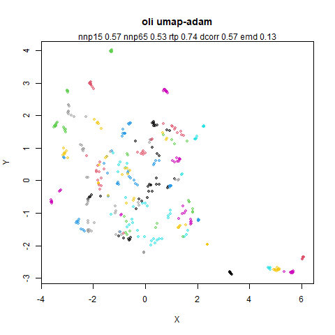
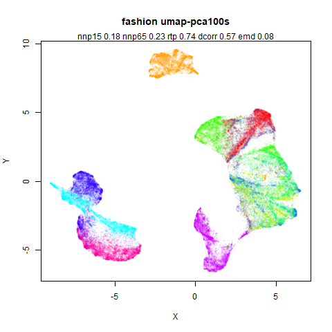
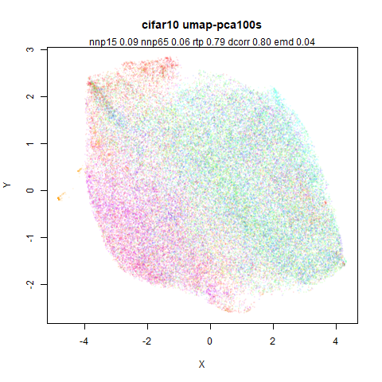
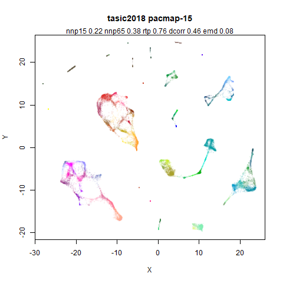
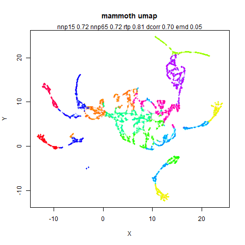
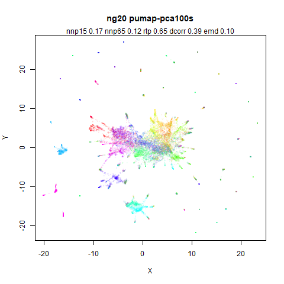
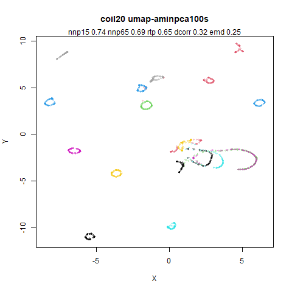
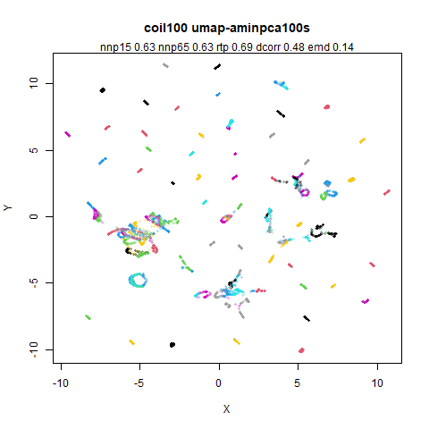

## Introduction

Here are some comparisons between PaCMAP and UMAP. None of this will make sense
without reading [Notes on
PaCMAP](https://jlmelville.github.io/smallvis/pacmap.html) and maybe [PaCMAP
Examples](https://jlmelville.github.io/smallvis/pacmap-examples.html).

Images are generated by starting with UMAP and then using `uwot` to attempt to
get progressively closer to PaCMAP's behavior.

## Validation

Numerical validation is by:

* `nnp15`. Mean 15 nearest neighbor preservation. This is always the exact 15
nearest neighbors in the input space before any PCA, so potentially methods that
use PCA and the local scaling of nearest neighbors are at a slight disadvantage.
* `nnp65`. Mean 65 nearest neighbor preservation. For local scaled neighbors,
this is the number of neighbors the 15 neighbors are chosen from.
* `rtp`. Random triplet preservation with 20 triplets per observation. The
favored global structure preservation method of the PaCMAP paper. Random
initialization gives a value of `0.5`.
* `dcorr`. The Pearson correlation between 100,000 pairwise distances sampled at
random. Random initialization gives a value of `0`. Related to a measure of
global structure used by [Becht and
co-workers](https://doi.org/10.1038/nbt.4314).
* `emd`. Earth mover's distance based on 100,000 pairwise distances sampled
randomly. Based on work by [Heiser and
Lau](https://doi.org/10.1016/j.celrep.2020.107576) I am a bit skeptical of the
use of this method due to the form of normalization. The problem manifests
particularly with random initialization not giving consistent results. It
depends on the initial standard deviation, whether a normal or uniform random
distribution is used and the identity of the dataset itself. Worse, for a large
number of datasets here, the plain PCA initialization gives a *larger* EMD than
the UMAP-style random initialization. For `mnist`, the PCA result has a larger
EMD than even a t-SNE style random initialization (normal distribution with a
standard deviation of `0.0001`).

These numbers are usually fairly stable between runs of the embedding algorithms
with different random number seeds (and sampling variance for `rtp`, `dcorr` and
`emd`) to 0.01 or 0.02. Differences larger than that may therefore indicate a
proper difference between methods (whether you consider it practically
significant or not is another matter). `coil20` seems to be the "twitchiest"
of the datasets for this and can show larger changes in `dcorr` (0.05-0.1) even
between runs of PaCMAP (which is a shame as PaCMAP tries to reduce such 
variability). I suspect this is because the number of neighbors is too low for
a good global layout: the high dimensional graph is not fully connected. 
You'd hope the mid-near pair business would help here, but the clusters do
re-arrange themselves from run to run.

Other datasets which aren't fully connected with `n_neighbors = 15` (with
exact nearest neighbors) are: `iris`, `coil100`, `tasic2018` and `norb`.

## Results

* Top left: PaCMAP using 15 nearest neighbors for all datasets. Defaults otherwise.
* Top right: UMAP (via the Python `umap-learn`) with defaults.
* Middle left: UMAP (via `uwot`) with a PCA initialization and the standard deviation
scaled to 1 for both dimensions. We expect initialization to be important for the
results, so replacing UMAP's spectral initialization with a PCA initialization
should be informative. Also the PaCMAP's paper observes the scale invariance of 
initialization in methods like UMAP to motivate the use of mid-near pairs. What
if we control the initial scale of the PCA, in this case with `init_sdev = 1`?
* Middle right: UMAP (again via `uwot`) with the same PCA initialization but also
switching from the stochastic gradient descent optimization to the batched Adam 
optimization method used by PaCMAP. Also the same number of iterations are used
for all datasets (`n_epochs = 450`) to match that done by PaCMAP.
* Bottom left: UMAP (via `uwot`), PCA initialization, Adam optimization *and*
use binary edge weights like PaCMAP, and use PaCMAP's scaled nearest neighbors
approach for near pairs. Also for datasets that have an input dimensionality of
100, reduce to 100 via PCA, the PaCMAP default. For some datasets the PCA
reduction has no effect other than speeding up the nearest neighbor search,
but for others it can have a bigger effect.
* Bottom right: UMAP (via `uwot`), PCA initialization, Adam optimization,
locally scaled nearest neighbor selection, PCA reduction to 100 dimensions,
binary edge weights *and* using the PaCMAP near pair and far-pair forces rather
than UMAP's attractive and repulsive interactions. This is as close as `uwot`
can get to PaCMAP behavior without adding the mid-near pairs.

### iris

|                             |                           |
:----------------------------:|:--------------------------:
|
|
|

In my experience `iris` rarely behaves like other datasets, but there's no
reason to not try it out. PaCMAP's `nnp15` is the lowest, but its `nnp65` is
the highest. The `rtp` is also highest for PaCMAP. Adding more and more
PaCMAP-like behavior to UMAP doesn't help until the PaCMAP attractive force
replaces UMAP. But also bear in mind that visually there is hardly a huge
difference.

### s1k

|                             |                           |
:----------------------------:|:--------------------------:
|
|
|

UMAP has a superior `nnp15` compared to PaCMAP (it's telling that adding the
PaCMAP attractive force in going from the bottom left to bottom right image
causes the `nnp15` to drop), but the `nnp65` is very stable. `rtp` is also
stable for every method.

### oli

|                             |                           |
:----------------------------:|:--------------------------:
|
|
|

Very little to choose from any method here. The bottom row indicates that the
difference between the UMAP and PaCMAP attractive forces is very minor for
this dataset.

### frey

|                             |                           |
:----------------------------:|:--------------------------:
|
|
|

I have come to expect that the `frey` faces results are often all over the place
and so it is here. `nnp65` holds up across all methods, but visually there is
quite a bit of variation. UMAP `dcorr` results are much lower than for PaCMAP
and just initializing from PCA only closes around half the gap. But then 
optimizing with Adam produces the best `dcorr` and `rtp`. Visually don't know
if I like it though: it seems to have split some of the manifold into larger
pieces.

### coil20

|                             |                           |
:----------------------------:|:--------------------------:
|
|
|

`coil20` behaves rather like `frey`: UMAP does badly in terms of `dcorr` until 
Adam is added as the optimizer, and then adding the binarized
edge weights seems to negatively affect the `dcorr`. `rtp` seems less affected
though.

### mnist

|                             |                           |
:----------------------------:|:--------------------------:
|
|
|

Clusters move about a bit quite a lot across the different runs. Notably where
the 3 (green), 5 (cyan) and 8 (magenta) clusters are usually together, when Adam
is the optimizer, the 2 cluster (yellow) has got between the 3 cluster (green)
and the 5+8 cluster. When the PaCMAP attractive forces are used in `uwot`, the
8 cluster is on its own, but a small part of it can be seen still with the 3+5
clusters. None of the metrics really help with detecting any of this, though.

### fashion

|                             |                           |
:----------------------------:|:--------------------------:
|
|
|

UMAP seems to do better at the `nnp65` local preservation. UMAP with the PCA
initialization sees a mild drop in `dcorr`, but not for `rtp` and then it jumps
back up with the Adam optimization.

### kuzushiji

|                             |                           |
:----------------------------:|:--------------------------:
|
|
|

This is another case where visually the clusters seem to settle into different
arrangements but the metrics don't reflect large changes.

### cifar10

|                             |                           |
:----------------------------:|:--------------------------:
|
|
|

This is not a dataset that seems amenable to good separation of clusters, at 
least by using Euclidean distance on the raw pixel values.

### macosko2015

|                             |                           |
:----------------------------:|:--------------------------:
|
|
|

It is immediately obvious that PCA has a huge effect on the display of this
data. And yet local preservation is unchanged (and pretty crummy) either way.
But the `rtp` actually goes up and UMAP outperforms PaCMAP.

### tasic2018

|                             |                           |
:----------------------------:|:--------------------------:
|
|
|

`rtp` and `dcorr` seems to favor PaCMAP here. Some combination of the PaCMAP
attractive forces and PCA initialization seems to be key.

### mammoth

|                             |                           |
:----------------------------:|:--------------------------:
|
|
|

UMAP definitely breaks up the mammoth structure into false clusters here, and
PCA initialization seems definitely superior to spectral initialization in
terms of `rtp` and `dcorr`. Binarizing the edge weights (going from the image 
middle right to bottom left) has a visually striking effect, and crossing
tusks aside, the `pumap` result is nearly as good as the PaCMAP one.

### ng20

|                             |                           |
:----------------------------:|:--------------------------:
|
|
|

PaCMAP `dcorr` is poor here. This is another example where there is a noticeable
visual change when the preprocessing with PCA to 100D is used. But that doesn't
seem to be the cause of the lowered `dcorr`, as UMAP (bottom left) has the best
`dcorr` (and `rtp`) using it. `dcorr` drops when PaCMAP forces replace UMAP.

### norb

|                             |                           |
:----------------------------:|:--------------------------:
|
|
|

PaCMAP settings do well for this dataset in terms of `rtp` and `dcorr`.
UMAP (bottom left) is competitive with it if it adopts PaCMAP settings and may
also do a bit better with local preservation.

### coil100

|                             |                           |
:----------------------------:|:--------------------------:
|
|
|

Spectral initialization (perhaps due to lack of a fully connected graph) seems
to affect UMAP's global metrics, but not the local preservation. Initializing
by PCA makes the `rtp` and `dcorr` metrics similar to PaCMAP.

### isofaces

|                             |                           |
:----------------------------:|:--------------------------:
|
|
|

This is not easy to make much sense of. PaCMAP splits the manifold in two
but it still has the best `nnp65`. `dcorr` jumps around a lot, but it doesn't
give a huge amount of guidance to which of the results is the most visually
appealing.

### swissroll

|                             |                           |
:----------------------------:|:--------------------------:
|
|
|

I've run PaCMAP a few times and the pictured result is one of its better results
but it always does better than UMAP, which rips the manifold into lots of little
pieces. Adding a PCA-based initialization cannot be said to help. But you
wouldn't know that from the `dcorr` metrics which thinks the PaCMAP result is
one of the worst and the UMAP with Adam (middle right) the best. Interestingly,
while using the PaCMAP forces (bottom right) improves matters greatly, the basic
shape of that result is already in place with UMAP (bottom left). The difference
compared to the middle row results is binarized edge weights.

At least the local preservation metrics seem to provide a guide here.

### scurvehole

|                             |                           |
:----------------------------:|:--------------------------:
|
|
|

A similar story to `swissroll` in that the PaCMAP forces are clearly gentler on
the manifold, but binarized edge weights help UMAP a bit. Local preservation
metrics also differ here.

### lamanno2020

|                             |                           |
:----------------------------:|:--------------------------:
|
|
|

`dcorr` goes down a bit with UMAP and things aren't hugely helped by PCA. But
adding Adam an optimizer makes things competitive with PaCMAP. Adding the
binarized edge weights again seems to boost `dcorr`.

## Conclusions

## Effect of PCA Scaling on Global Metrics

Maybe the problem is that my choice of a "reasonable" PCA scaling actually isn't
reasonable? Something I noticed when checking what global metrics looks like for
random and PCA-based initializations is that for some datasets whether the
aspect ratio is maintained makes a big difference with PCA, i.e. scaling the principal
components to equal variance reduces the `dcorr` and `rtp` values, whereas
scaling, but keeping the relative ratio of the variance of the two axes maintains
performance. This leads to the question of whether the axis with the minium
or maximum variance should be scaled to the specified value.

The images below use:

* Top left: Scale the maximum standard deviation dimension to 1.
* Top right: Scale the minimum standard deviation dimension to 1.
* Top left: Scale the maximum standard deviation dimension to 10.
* Top right: Scale the minimum standard deviation dimension to 10.

In all cases, the other dimension is then scaled to keep the standard deviation
proportional to the ratio before scaling. Based on the results with PCA, I
suspect `iris` and `norb` to show the most visual difference in how the
initialization is scaled. `dcorr` should be more affected than `rtp`.

### iris

|                             |                           |
:----------------------------:|:--------------------------:
|
|

### s1k

|                             |                           |
:----------------------------:|:--------------------------:
|
|

### oli

|                             |                           |
:----------------------------:|:--------------------------:
|
|

### frey

|                             |                           |
:----------------------------:|:--------------------------:
|
|

### coil20

|                             |                           |
:----------------------------:|:--------------------------:
|
|

### mnist

|                             |                           |
:----------------------------:|:--------------------------:
|
|

### fashion

|                             |                           |
:----------------------------:|:--------------------------:
|
|

### kuzushiji

|                             |                           |
:----------------------------:|:--------------------------:
|
|

### cifar10

|                             |                           |
:----------------------------:|:--------------------------:
|
|

### macosko2015

|                             |                           |
:----------------------------:|:--------------------------:
|
|

### tasic2018

|                             |                           |
:----------------------------:|:--------------------------:
|
|

### mammoth

|                             |                           |
:----------------------------:|:--------------------------:
|
|

### ng20

|                             |                           |
:----------------------------:|:--------------------------:
|
|

### norb

|                             |                           |
:----------------------------:|:--------------------------:
|
|

### coil100

|                             |                           |
:----------------------------:|:--------------------------:
|
|

### isofaces

|                             |                           |
:----------------------------:|:--------------------------:
|
|

### swissroll

|                             |                           |
:----------------------------:|:--------------------------:
|
|

### scurvehole

|                             |                           |
:----------------------------:|:--------------------------:
|
|

### lamanno2020

|                             |                           |
:----------------------------:|:--------------------------:
|
|

My predictions played out pretty well. Scaling to a standard deviation of 1,
`iris` and `norb` aren't that different visually, but the `dcorr` and `rtp`
are affected.

But it's with a standard deviation of 10 that things start getting weird.
Visually the output definitely leaves something to be desired. But the `rtp`
and `dcorr` values are all really great. The average `rtp` and `dcorr` values
all handily outperform PaCMAP. And in most cases, the local preservation values
are the same. `frey`, `swissroll` and `scurvehole` do show slightly lowered
`nnp65` values with a standard deviation of 10, but the fall off isn't 
as significant as you might expect given the very different visuals.

## Conclusions

Local preservation doesn't distinguish well between PaCMAP and UMAP. And it does
not distinguish well between the very different outputs seen here with UMAP.

For global preservation I still lack a good metric. `emd` is cryptic to
interpret (at least the way I used it). `dcorr` and `rtp` are also less useful
than I had hoped for preserving global structure, as they can be boosted by
increasing the standard deviation of the initialization leading to some
not-very-nice looking visualizations. `rtp` seems less sensitive than `dcorr`
for that at least.

So we are left with the situation that PaCMAP and UMAP produce very simlar
looking output. UMAP definitely performs worse for the manifold-like datasets,
but these are all quite artificial datasets and their relevance for real-world
data is still a question mark for me. On other datasets, the tendency is for
UMAP to be a tiny bit better at local preservation, while PaCMAP is better at
global preservation. However, what global preservation means here may be a proxy
for something like "perturbs the layout that PCA provides as little as
possible". I am not prepared to concede that that is the gold standard measure
of global structure at this point (e.g. consider the geodesic distances along
the swiss roll vs the ambient distances). However, this may be a worthy and
useful goal for large numbers of datasets. And the mid-near pairs may well
help with that in PaCMAP, i.e. they are useful even with a well-structure
initialization like PCA.

It might also mean that there is a way to sample mid-near pairs in a way that
could be easier to integrate into other software: sample them from the PCA
*output* or in fact any other non-random output (e.g. a spectral layout). This
could retain more of that initial structure while only requiring calculating
Euclidean distances from the output data, which is already something that UMAP
and related codebases do. This is a much easier task than having to replicate
the different distance metrics available in nearest neighbor libraries. Also,
the actual input data may not be present: you could provide a pre-computed
nearest neighbor graph as input. PCA can't be carried out on that, but a
spectral initialization on the input graph is still possible.
