Some basic preprocessing options were covered in the discussion of 
[scaling](https://jlmelville.github.io/smallvis/scale.html). In addition,
`smallvis`, like various t-SNE packages, offers the option of reducing the
dimensionality of the input data before the perplexity calibration. This can
help speed up the perplexity search, because the Eucliden input distance
calculation should scale roughly linearly with the dimensionality of the data.
On the other hand, it takes time to do the PCA, and the input distances only
need to be calculated once, so I'm not sure it saves a lot of time. Also the
perplexity search takes up progressively less and less time compared to the
optimization as data set sizes get bigger. Probably the sort of datasets that
`smallvis` can handle can't get large enough for this to be very important. But
maybe there's something we can learn from trying it out that might be useful
when applied to larger datasets that can be dealt with using Barnes Hut t-SNE or
LargeVis.

A related preprocessing technique is whitening, which simply scales the
principal components by the equivalent eigenvalues so that the variances are all
one. This is sometimes used in image analysis to enhance the edges in an image
relative to other features. In terms of Euclidean distance we would hope that
whitening would make images in the same class (and hence sharing a similar set
of edges) closer to each other, due to ignoring differences in brightness and so
on. This 
[Cross-Validated Stack Exchange question](https://stats.stackexchange.com/questions/117427/what-is-the-difference-between-zca-whitening-and-pca-whitening) 
is a good place to start to find out more about whitening. And like the 
[CRAN t-SNE package](https://cran.r-project.org/package=tsne), whitening is 
also available in `smallvis`.

Although I don't expect PCA to do anything very interesting to the data, 
whitening might produce larger changes. 

## Datasets

See the [Datasets](https://jlmelville.github.io/smallvis/datasets.html) page.
For these tests, we need to use sufficiently high dimensional data, so that it's
possible to reduce the dimensionality to the target values, so we won't be
looking at `iris` or `s1k` this time, just the image datasets `oli`, `frey`, `coil20`,
`mnist` and `fashion`. Whitening is usually applied to image data anyway.

## Settings

The t-SNE paper settings will be used here, except for using the first two PCA
scores as initialization. This makes even more sense than usual given we are
carrying out PCA anyway.

PCA can be applied to the input data by setting `pca = TRUE` and then the
number of components to keep is set to e.g. 50 by `initial_dims = 50`.
To also carry out whitening, set `pca = "whiten"`.

I've looked at three values for the number of components to extract: the default
of 50, and also 25 and 100. That should cover a decent range. We will compare
to the results of not doing any initial PCA on the data.

```
coil20_pca50 <- smallvis(coil20, scale = "absmax", perplexity = 40, Y_init = "spca", eta  = 100, exaggeration_factor = 4, stop_lying_iter = 50, ret_extra = TRUE, max_iter = 1000, pca = TRUE, initial_dims = 50)

coil20_whiten50 <- smallvis(coil20, scale = "absmax", perplexity = 40, Y_init = "spca", eta  = 100, exaggeration_factor = 4, stop_lying_iter = 50, ret_extra = TRUE, max_iter = 1000, pca = "whiten", initial_dims = 100)
```

## PCA Results

### oli

|                             |                           |
:----------------------------:|:--------------------------:
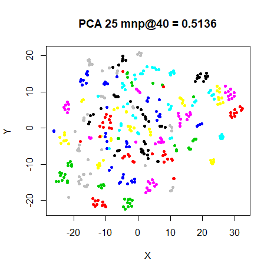|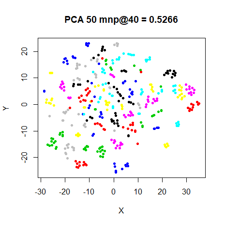
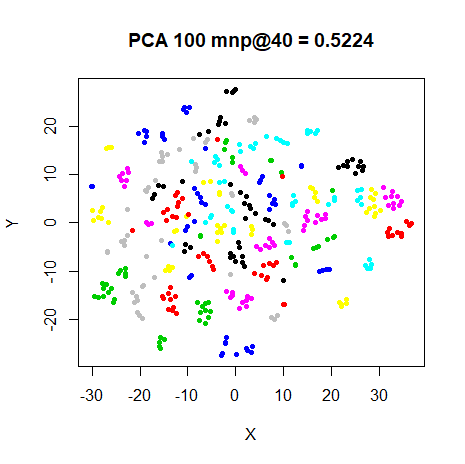|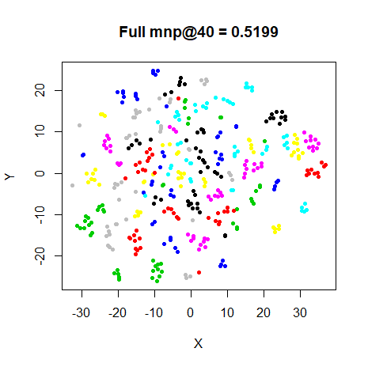

### frey

|                             |                           |
:----------------------------:|:--------------------------:
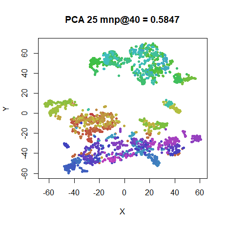|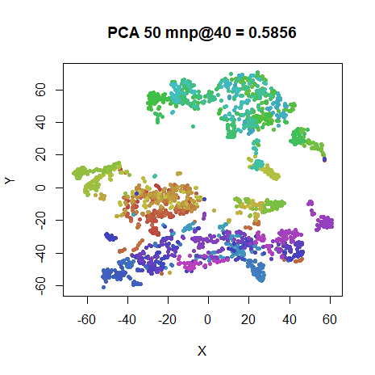
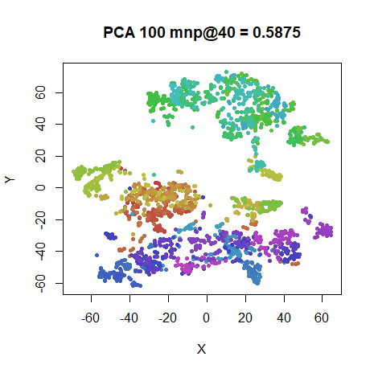|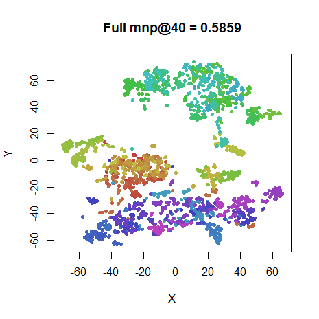

### coil20

|                             |                           |
:----------------------------:|:--------------------------:
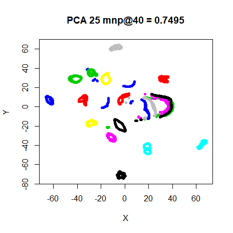|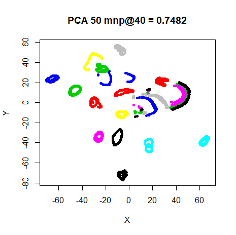
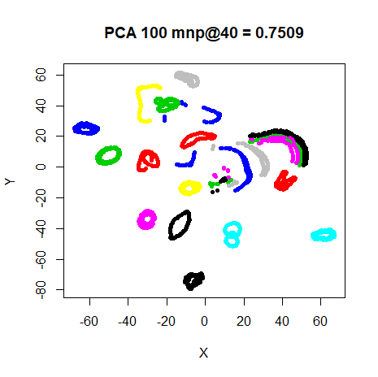|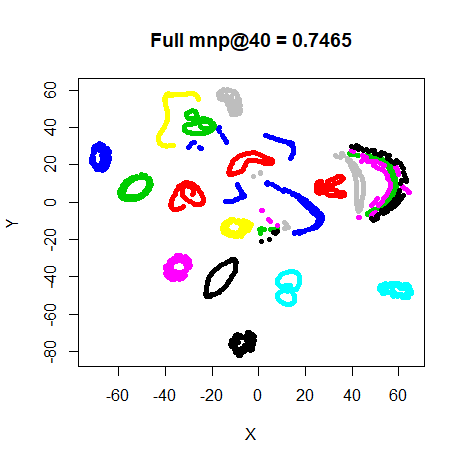

### mnist

|                             |                           |
:----------------------------:|:--------------------------:
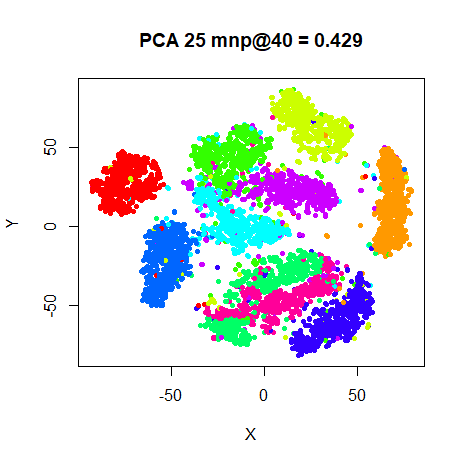|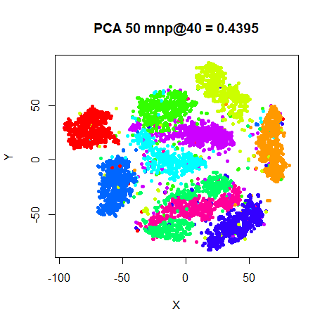
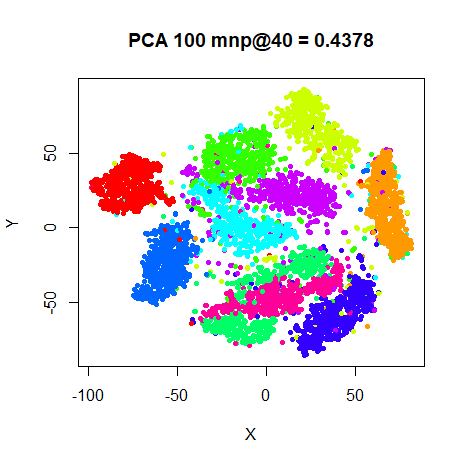|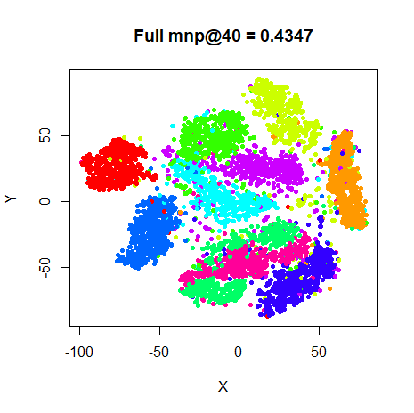

### fashion

|                             |                           |
:----------------------------:|:--------------------------:
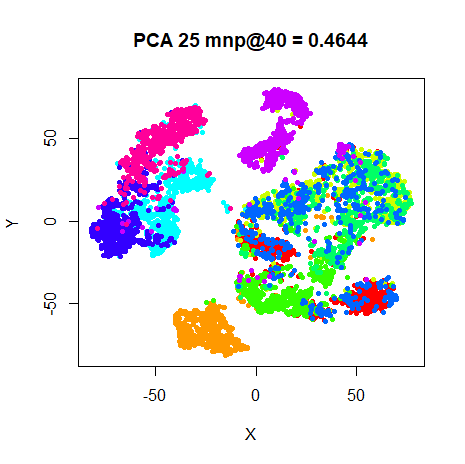|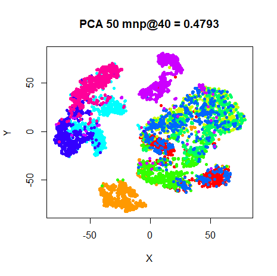
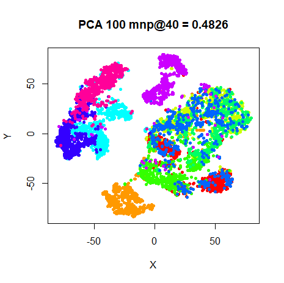|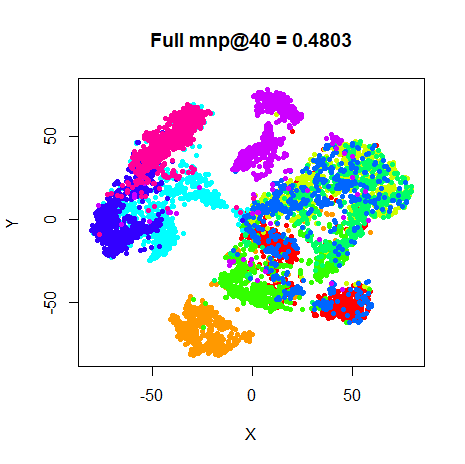

## Whitening Results

### oli

|                             |                           |
:----------------------------:|:--------------------------:
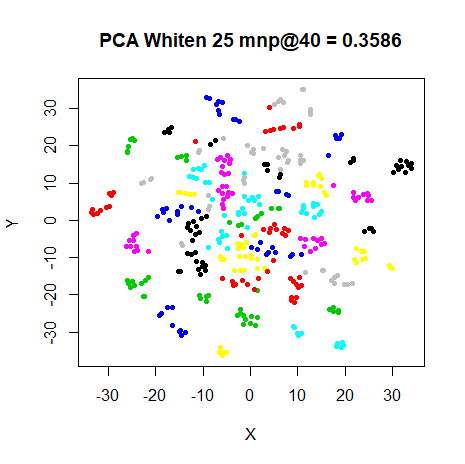|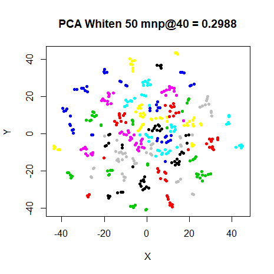
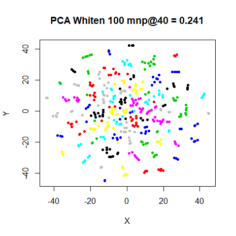|

### frey

|                             |                           |
:----------------------------:|:--------------------------:
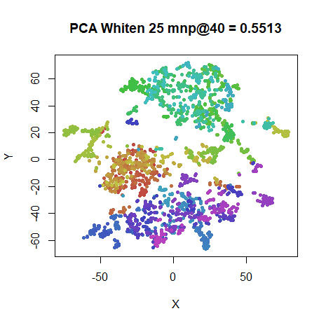|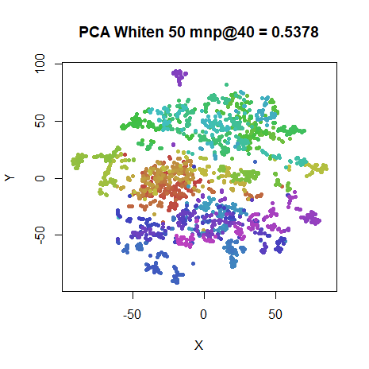
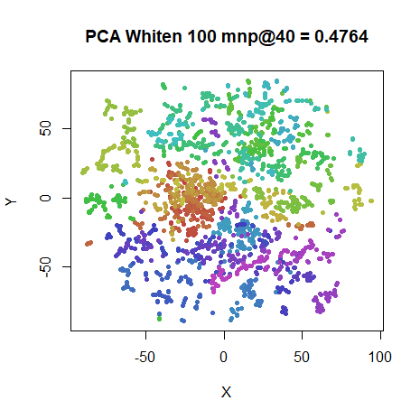|

### coil20

|                             |                           |
:----------------------------:|:--------------------------:
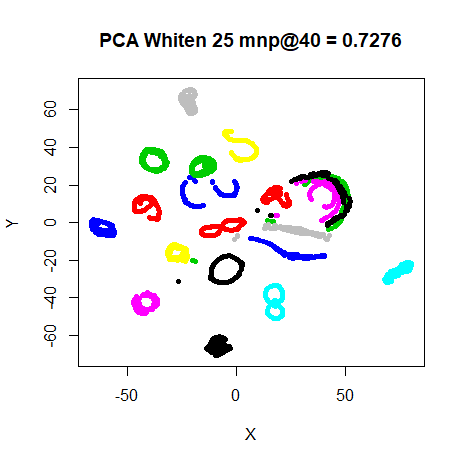|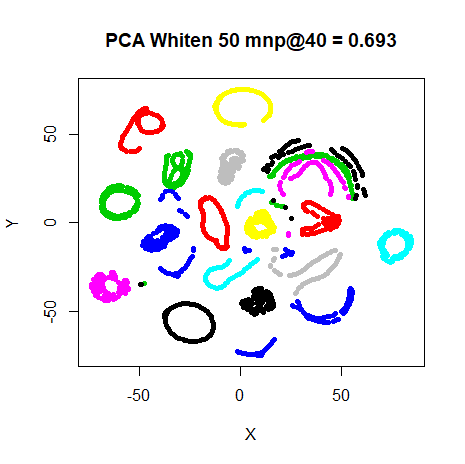
|

### mnist

|                             |                           |
:----------------------------:|:--------------------------:
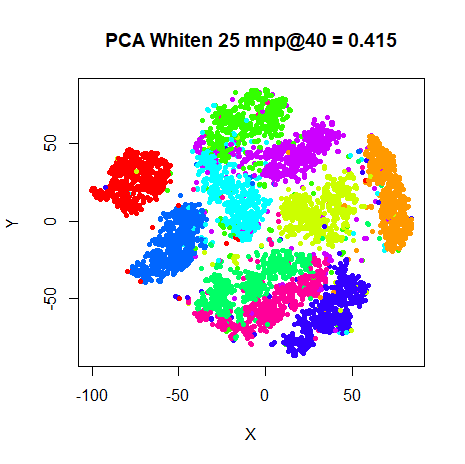|
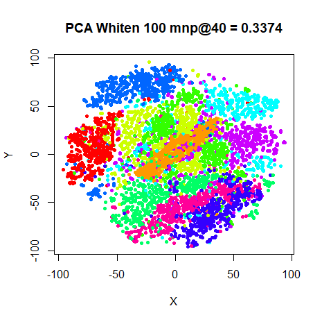|

### fashion

|                             |                           |
:----------------------------:|:--------------------------:
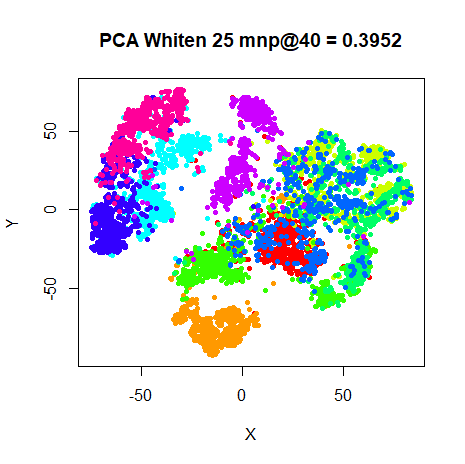|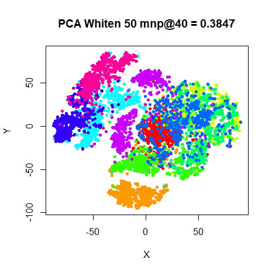
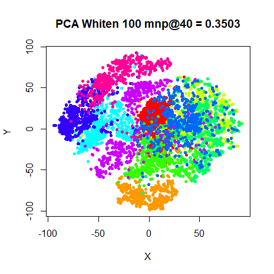|

## Conclusions

PCA doesn't do very much to the results, but you can get away with quite
aggressive pruning of the dimensionality without affecting the overall results
if for some reason you really want to. Visually, `coil20` sees the biggest 
change, but it's still quite minor, and may be an artifact of changes to the
structure and position of several small loops being easier to see than the big
blobs in the likes of `mnist` and `fashion`.

Despite my scepticism, reducing the dimensionality does help speed up the total
CPU time of the algorithm in all cases except for `mnist`. In terms of numbers,
bear in mind I made no effort to ensure these results were repeatable or nothing
else was happening on my computer at the time (although I was asleep for most of
the time these were running), but here goes.

For `mnist` the slowdown was about 2 minutes (over a total run time of around 45
minutes). The biggest speed up was for `fashion`, which was faster by 2 minutes
(on an approximate 45 minute runtime) and `coil20`, which shaved about 90
seconds off the usual 5 minute runtime. The difference for `oli` and `frey` was
only a few seconds. `coil20` is the "widest" dataset we look at by a large
margin (16,384 columns, the next widest being `oli` with 4096 columns), so even
for the comparatively small datasets (in terms of observations) which `smallvis`
can handle, it may be worth it if your dataset contains more than 10,000
features.

To some extent, relying on a fixed number of components for any dataset may not
be all that wise, as you may want to look at the % of variance explained (which
will be reported if `verbose = TRUE`). For the datasets used here, with 25
components retained the amount of variance explained from 69% (for `mnist`) to
84% (for `frey`), and at 50 components, those numbers improved to 83% and 92%,
respectively. At 100 components, the amount of variance explained was > 90% for
all datasets.

Whitening, on the other hand, seems to make the visualizations worse the more
components that are extracted, perhaps because less useful noise from the later
components have been boosted in influence by the re-scaling. I have briefly
looked at the effect of much lower number of components, e.g. 5 or 10, but that
doesn't seem very promising either. I therefore don't have any useful
suggestions about what number of components to use when whitening, or if in fact
whitening is all that helpful with t-SNE. Signs point to "no" on the basis of
these results.

An obvious possibility is that I have messed up the whitening code, but I have
compared the output of my PCA and whitening code with that of the
[scikit-learn](http://scikit-learn.org/stable/modules/generated/sklearn.decomposition.PCA.html)
implementation and they give quite similar results, so I don't think that's it.
