## Theory Time

Much of the following discussion is lifted verbatim from the documentation to
the fore-runner to `smallvis`,
[sneer](http://jlmelville.github.io/sneer/dimensionality.html).

Choosing the correct perplexity value for an embedding is an open research
problem. The usual approach is to plump for a value around 30. The
[How to Use t-SNE Effectively](http://distill.pub/2016/misread-tsne/) web site
demonstrates that multiple perplexity values can give quite different results
even for simple synthetic datasets.

Lee and co-workers' work on
[multi-scale neighbor embedding](https://dx.doi.org/10.1016/j.neucom.2014.12.095)
attempts to get around this problem by considering multiple perplexities during
optimization. Part of their discussion involves making use of the concept of 
intrinsic dimensionality of the input data and relating that to perplexity.

For estimating the intrinsic dimensionality of the input data, they provide an 
expression based on one-sided finite differences, which is convenient for 
multi-scaled neighbor embedding because you calculate the input probabilities 
for multiple perplexities. 

Here I'm going to derive an analytical expression for the dimensionality with
the use of the exponential kernel (exponential with regard to the squared
distances, or gaussian in the raw distances, if you prefer) that only requires
one perplexity calculation.

First, some definitions. This discussion of dimensionality involves the input
probabilities, so we will assume the use of gaussian similarities, not anything
exotic like the t-distribution or other heavy-tailed functions:

$$
w_{ij} = \exp(-\beta_i d_{ij}^{2})
$$
where $d_{ij}^{2}$ is the squared distance between point $i$ and $j$ in the 
input space and $\beta_i$ is the precision (inverse of the bandwidth) 
associated with point $i$. We use a point-wise normalization to define a 
probability, $p_{j|i}$:

$$
p_{j|i} = \frac{w_{ij}}{\sum_{k} w_{ik}}
$$
The Shannon Entropy, $H$, of the probability distribution is:
$$
H = -\sum_{j} p_{j|i} \log p_{j|i}
$$
and the perplexity, $U$, in units of nats is:

$$
U = \exp(H)
$$

Lee and co-workers show that, assuming the data is uniformly distributed, the 
relationship between the precision, perplexity and intrinsic dimensionality 
around point $i$, $D_i$, is:

$$
U \propto \beta_i^{-\left({D_i}/{2}\right)}
$$
This suggests that if you did a log-log plot of the perplexity against
the precision for multiple perplexities, the graph should be linear and the
gradient would be $-D_{i}/2$.

With a multiscaling approach, a finite difference expression using base 2 
logarithms is given as:
$$
D_i = \frac{2}{\log_2\left(\beta_{U,i}\right)-\log_2\left(\beta_{V,i}\right)}
$$

where $\beta_{U,i}$ is the precision parameter for the gaussian function which
generates the $i$th similarity/weight for some perplexity, $U$.

### An Analytical Expression for Intrinsic Dimensionality

The following is something I just came up with myself. It's *not* in the paper 
by Lee and co-workers, so take it for what it's worth (probably not much). 

The gradient of the log-log plot of the perplexity against the precision is:

$$
\frac{\partial \log U}{\partial \log \beta_i} = 
\beta_i \frac{\partial H}{\partial \beta_i} = 
-\frac{D_{i}}{2} 
$$
so

$$
D_i = -2 \beta_i \frac{\partial H}{\partial \beta_i} 
$$

We therefore need to find an expression for $\partial H / \partial \beta_{i}$.
Fortunately, we can use similar chain rule expressions and nomenclature that I 
went into in great and tedious detail in the discussion of deriving the
[SNE gradient](gradients.html).

To start, we can write the derivative as:

$$
 \frac{\partial H}{\partial \beta_i} = 
 \sum_{jklm} 
 \frac{\partial H}{\partial p_{k|j}}
 \frac{\partial p_{k|j}}{\partial w_{lm}}
 \frac{\partial w_{lm}}{\partial \beta_{i}}
$$

$\partial w_{lm} / \partial \beta_{i} = 0$ unless $l = i$. Additionally, due to 
the point-wise normalization, $\partial p_{k|j} / \partial w_{lm} = 0$ unless 
$j = l$, allowing us to simplify the summation to:

$$
 \frac{\partial H}{\partial \beta_i} = 
 \sum_{km} 
 \frac{\partial H}{\partial p_{k|i}}
 \frac{\partial p_{k|i}}{\partial w_{im}}
 \frac{\partial w_{im}}{\partial \beta_{i}}
$$
Now let us regroup that double summation into two single summations, and also
rename $m$ to $j$:

$$
 \frac{\partial H}{\partial \beta_i} = 
 \sum_{j}
 \left[
   \sum_{k} 
   \frac{\partial H}{\partial p_{k|i}}
   \frac{\partial p_{k|i}}{\partial w_{ij}}
 \right]
 \frac{\partial w_{ij}}{\partial \beta_{i}}
$$
We are now in very familiar territory if you have read the 
[SNE gradient](gradients.html) page. The full details of how to derive the
expression of the gradient of the weight normalization is on that page, but we 
shall jump straight to inserting the result for 
$\partial p_{k|i} / \partial w_{ij}$
to get:

$$
 \frac{\partial H}{\partial \beta_i} = 
 \sum_{j}
 \frac{1}{S_{i}}
 \left[
   \frac{\partial H}{\partial p_{j|i}}
   -\sum_{k} 
   \frac{\partial H}{\partial p_{k|i}}
   p_{k|i}
 \right]
 \frac{\partial w_{ij}}{\partial \beta_{i}}
$$
where $S_{i}$ is:

$$
S_{i} = \sum_{j} w_{ij}
$$

The gradient of the Shannon Entropy with respect to the probability is:

$$
\frac{\partial H}{\partial p_{j|i}} =
- \log \left( p_{j|i} \right) - 1
$$
substituting into the expression in square brackets:

$$
 \left[
   \frac{\partial H}{\partial p_{j|i}}
   -\sum_{k} 
   \frac{\partial H}{\partial p_{k|i}}
   p_{k|i}
 \right]
 = 
 \left[
- \log \left( p_{j|i} \right) - 1
   -\sum_{k} 
   \left\{
   - \log \left( p_{k|i} \right) - 1
   \right\} 
   p_{k|i}
 \right]
  = 
 \left[
   - \log \left( p_{j|i} \right) - 1
   +\sum_{k} 
   p_{k|i} \log \left( p_{k|i} \right)
   +\sum_{k} 
   p_{k|i}
 \right]
$$
and because $\sum_k p_{k|i} = 1$, we eventually get to:
$$
 \left[
   \frac{\partial H}{\partial p_{j|i}}
   -\sum_{k} 
   \frac{\partial H}{\partial p_{k|i}}
   p_{k|i}
 \right]
 = 
 \left[
- \log \left( p_{j|i} \right) - H
 \right]
 =
 -\left[
  \log \left( p_{j|i} \right) + H
 \right]
$$
At this point:

$$
 \frac{\partial H}{\partial \beta_i} = 
 \sum_{j}
 -\frac{1}{S_{i}}
 \frac{\partial w_{ij}}{\partial \beta_{i}}
  \left[
  \log \left( p_{j|i} \right) + H
 \right]
$$

which leads to:

$$
D_{i} = \frac{2 \beta_i}{S_i}
 \sum_{j}
 \frac{\partial w_{ij}}{\partial \beta_{i}}
  \left[
  \log \left( p_{j|i} \right) + H
 \right]
$$

The gradient of the exponential weight with respect to the precision parameter, $\beta_i$,
is:

$$
\frac{\partial w_{ij}}{\partial \beta_{i}}
=
-d_{ij}^2 w_{ij}
$$

Substituting these two sub expressions into the total gradient, we are left with:
$$
 \frac{\partial H}{\partial \beta_i} = 
 \sum_{j}
 \frac{d_{ij}^2 w_{ij}}{S_{i}}
 \left[
 \log \left( p_{j|i} \right) + H
 \right]
$$

Additionally, $p_{j|i} = w_{ij} / S_{i}$, so the final expression for the 
gradient is:

$$
 \frac{\partial H}{\partial \beta_i} = 
 \sum_{j}
 d_{ij}^2 p_{j|i}
 \left[
 \log \left( p_{j|i} \right) + H
 \right]
$$

The only thing to left to do is to multiply this expression by $-2 \beta_{i}$
to get this expression for the intrinsic dimensionality:

$$
D_i = -2 \beta_i \sum_j d^2_{ij} p_{j|i} \left[\log\left(p_{j|i}\right) + H\right]
$$

which is useful if you've carried out the perplexity-based calibration
on the input weights, as you have already calculated $p_{j|i}$, $H$ and 
$\beta_i$. 


### Un-normalized weights

If you'd rather think in terms of the un-normalized weights and the distances 
only, the usual expression for Shannon entropy can be rewritten in terms of
weights as:

$$
H = \log S_{i} -\frac{1}{S_i} \left( \sum_j w_{ij} \log w_{ij} \right) 
$$

and that can be combined with:

$$
\log \left( p_{j|i} \right) = \log \left( w_{ij} \right) + \log \left(S_i \right) 
$$

to give:

$$
D_{i} = \frac{2 \beta_i}{S_i^2}
 \sum_{j}
 \frac{\partial w_{ij}}{\partial \beta_{i}}
  \left(
   S_i \log w_{ij} - \sum_k w_{ik} \log w_{ik}
 \right)
$$

We can also express the relation between the weight and the squared distance as:

$$
\log \left( w_{ij} \right) = -\beta_i d_{ij}^2
$$
and the gradient with respect to the precision as:

$$
\frac{\partial w_{ij}}{\partial \beta_{i}}
=
-d_{ij}^2 w_{ij} = -\frac{w_{ij} \log w_{ij}}{\beta_i}
$$

and the Shannon entropy expression as:

$$
H = \log S_i + \frac{\beta_i}{S_i} \sum_j d_{ij}^2 w_{ij}
$$

With all that, you can eventually get to two equivalent expressions for $D_i$:

$$
D_{i} = \frac{2}{S_i}
\left\{
\sum_j w_{ij} \left[ \log \left( w_{ij} \right) \right] ^ 2
-\frac{1}{S_i} \left[ \sum_j w_{ij} \log \left( w_{ij} \right) \right]^2
\right\}
$$
$$
D_{i} = \frac{2 \beta_i^2}{S_i}
\left[
\sum_j d_{ij}^4 w_{ij}
-\frac{1}{S_i} \left( \sum_j d_{ij}^2 w_{ij} \right)^2
\right]
$$
The first one only requires the $W$ matrix, although as you've been carrying out
lots of exponential operations to generate the weights, it seems a pity to have
to then carry out lots of expensive log calculations, in which case the second
expression might be better, but which requires the squared distance matrix and
$\beta_i$ also.

## The Maximum Mean Intrinsic Dimensionality Method

Based on the above discussion, it should be possible to calculate the
intrinsic dimensionality associated with each point in a dataset, for a given
perplexity. To characterize the intrinsic dimensionality of a dataset we can
then average the individual values. This can be repeated for multiple 
perplexities and the maximum mean value of the intrinsic dimensionalities can
be taken as the intrisic dimensionality of the dataset. The perplexity 
associated with the maximum mean intrinsic dimensionality seems like it would
be a good choice in t-SNE.

Some datasets have different dimensionalities depending on the length scale (
corresponding to different perplexities), e.g. the Swiss Roll dataset, while
three-dimensional, can be considered two-dimensional over short distances. 

Or, imagine a dataset containing a 50D Gaussian and 100D Gaussian. Does one 
intrinsic dimensionality make sense in that case? If not, then that also implies
that maybe one perplexity value isn't always the optimal choice. Perhaps the
50D Gaussian needs a substantially different perplexity to a 100D Gaussian. In
that case, we might want to take the point-wise dimensionality estimates, 
and consider the mean of the points taken from the 50D Gaussian separately
from the 100D Gaussian. 

[How to Use t-SNE Effectively](https://distill.pub/2016/misread-tsne/) notes 
that there "may not be one perplexity value that will capture distances across
all clusters — and sadly perplexity is a global parameter. Fixing this problem
might be an interesting area for future research." Perhaps intrinsic
dimensionality can help here.

## Method

In t-SNE and related methods, we carry out the perplexity calibration once for
a fixed perplexity before optimizing the output probabilities to match these
calibrated input probabilities.

For investigating intrinsic dimensionality, we will carry out the perplexity
calibration multiple times at different perplexity values. We'll start at a low
value (e.g. 3-5) and look at every integer perplexity up to around 300, which
should be a large enough value to capture any features of interest. For each
perplexity, we'll record the intrinsic dimensionality of each point and then 
average those values to get a single intrinsic dimensionality for that 
perplexity. Plotting the mean intrinsic dimensionality against perplexity should
hopefully reveal interesting structure or at least an obvious maximum.

Alternatively, rather than calculate a single dimensionality, we can take the
average over point associated with a particular cluster or category in a class.
For instance, for the `mnist` dataset, we can average the dimensionality for 
all the 1s, separately from the 2s, 3s, 4s and so on, to give both a whole
dataset intrinsic dimensionality and 10 separate dimensionalities, one for each
digit class. After all, we wouldn't necessarily expect each digit to be 
distributed across a digit-manifold in the same way.

Obviously, doing loads of perplexity calibrations is slow, and the time taken
increases with the square of the dataset, so carrying out hundreds of
calibrations on a large dataset (`mnist` or `fashion` for examples) is not
something you want to do more than once, and couldn't be integrated into
standard t-SNE. A simpler approach that isn't such a computational burden is
suggested in the section "A Practical Suggestion for Perplexity Selecton".

## Synthetic Data

Both "How to Use t-SNE Effectively" and the multiscale JSE paper used synthetic
data to explore perplexity and intrinsic dimensionality, respectively, so we 
shall also start with some simple synthetic data which will hopefuly provide 
some clear trends and patterns, before we look at real data, which inevitably
destroys all our hopes and dreams with its annoying messiness and real-ness.

### 2D, 5D, 10D Gaussian

An obvious place to start is with some simple Gaussians. We'll look at the
effect of increasing dimensionality, and also of the effect of increasing the
amount of data available to us, although even with these datasets, I don't look
at more than 3,000 points, due to the amount of time it takes to generate plots
for larger datasets.

```
g2d_1k <- snedata::gaussian_data(n = 1000, dim = 2)
g5d_1k <- snedata::gaussian_data(n = 1000, dim = 5)
g10d_1k <- snedata::gaussian_data(n = 1000, dim = 10)

g2d_3k <- snedata::gaussian_data(n = 3000, dim = 2)
g5d_3k <- snedata::gaussian_data(n = 3000, dim = 5)
g10d_3k <- snedata::gaussian_data(n = 3000, dim = 10)
```

The black curve is 2D, the red curve 5D and the blue curve 10D. The left plot
shows the results for 1000 points. The right hand plot is for 3000 points.

| |
:-------|:-------------------:|
||


All the curves have the same basic shape (the black curve has the same shape
although it's hard to see): a steep climb at low perplexity to a maximum, 
followed by a more shallow decrease.

For the 2D Gaussian, the maximum intrinsic dimensionality is `2.12`. For the 5D
Gaussian, the maximum intrinsic dimensionality is `4.30`. For the 10D 
Gaussian, the maximum intrinsic dimensionality is `5.69`, so the estimate of the
intrinsic dimensionality becomes an underestimate with increasing dimensionality
quite quickly.

With 3000 points, the estimates of the intrinsic dimensionality are `2.10`, 
`4.58` and `6.53`, respectively. These are all closer to the true 
dimensionality, but not that much closer.

So even for the simple case of a single Gaussian, the absolute value of the
intrinsic dimensionality needs a large number of points to be accurate. But the
perplexity that corresponds to the maximum intrinsic dimensionality may be
of use.

Does the suggested perplexity that accords to the maximum intrisic 
dimensionality lead to a useful embedding? Looking at plots of Gaussians is
not exactly informative, but 
[How to Use t-SNE Effectively](http://distill.pub/2016/misread-tsne/) does note
that a too-low perplexity can lead to the illusion of clusters in the data,
even with Gaussians. 

Using their example of a 100-dimension Gaussian with 500 points, the estimated
intrinsic dimensionality is 6.8 at a perplexity of 23. Running t-SNE on it:

```
g100d_500 <- snedata::gaussian_data(n = 500, dim = 100, color = "#003399")
g100d_500_pexp <- perp_explore(g100d_500, scale = FALSE)
g100d_500_tsne <- smallvis(g100d_500, Y_init = "spca", scale = FALSE, perplexity = 23)
```

The final result is:

| |
|-------|
||

This gives the smooth, fairly uniform distribution of points that the authors
identify as being ideal, but which they found by manually tuning the perplexity.
They use a perplexity of 30, which is close enough to our choice, seeing as 
they try perplexities between 5 and 100. A good start for intrinsic 
dimensionality.

### Ball, Sphere and Helix

The multiscale JSE paper presents data for some other simple synthetic data: 
a ball, a hollow sphere, and a circular helix:

```
ball <- snedata::ball(n = 1500)
sphere <- snedata::sphere(n = 3000)
helix <- snedata::helix(n = 1500, rmajor = 3, rminor = 1, nwinds = 30)
```

The ball and sphere have an obvious structure. Below on the left is a plot of PCA on the
circular helix, which gives a good indication of what it looks like and on the
right are the intrinsic dimensionality plots. The ball plot is in black, the
sphere plot is in red, and the helix plot is in blue:

| |
:-------|:-------------------:|
||

The sphere and ball plot show a similar structure to the Gaussians, with one
maximum on each plot. The helix plot shows a more interesting structure: two
maxima. Presumably the low perplexity maximum (at perplexity = 13) represents
the radius of the helix, and the maximum at the high perplexity (perplexity = 
104) is the overall circular structure created by joining the ends of the 
helices. 

Perhaps this can be illuminated by running t-SNE at the different perplexities:

```
smallvis(helix, Y_init = "pca", scale = FALSE, perplexity = 13)
smallvis(helix, Y_init = "pca", scale = FALSE, perplexity = 104)
```

Results are below, the low-perplexity result on the left and the high-perplexity
result on the right:


| |
:-------|:-------------------:|
||

As can be seen, at perplexity 13, the larger circular structure is sacrificed
to emphasise the loops of the helix. At higher perplexity, the overall circular
structure is maintained.

Here's a comparison of the intrinsic dimensionalities calculated in `smallvis`
and those given in the multiscale JSE paper via the finite difference method
(the perplexity at which the maximum occurs is in parentheses):

| Name    | msJSE      | smallvis              |
| --------| ---------- | --------------------- |
| ball    |  2.81      | 2.75 (17)             |
| sphere  |  2.02      | 2.03 (14)             |
| helix   |  2.47      | 2.66 (13), 2.38 (104) |

The `ball` and `sphere` results are pretty close. Only one `helix` maximum is
reported in the multiscale JSE paper, and it lies between the two values 
calculated here. I'm not that concerned because the exact values will be 
affected by the radius of the helix and that of the overall circle, which aren't
given in the paper, so I just estimated them from an image in the paper.

### Swiss Roll

Like `helix`, the Swiss Roll also has two different structures at two scales: 
the overall curled topology at a large scale and the unfolded two-dimensional 
sheet that results from small scales. 

```
sr3k <- snedata::swiss_roll(n = 3000, max_z = 30)
```

Here's the intrinsic dimensionality plot:

| |
|-------|
||

Pleasingly, there are indeed two maxima: a dimensionality of 1.99 at 
perplexity 11, and a dimensionality of 2.55 at perplexity 193. As it's pretty
fruitless to try and 
[unfold the Swiss Roll with t-SNE](https://jlmelville.github.io/smallvis/swisssne.html),
here are the ASNE results for the two perplexities. Both embeddings were
intialized with the Laplacian Eigenmap using the symmetrized ASNE 
matrix with perplexity = 11, which is already quite unfolded. The maximum
number of iterations was set to 5,000, `max_iter = 5000`, to allow the low
perplexity result to converge properly. The perplexity 11 result is the left
hand result below, and the perplexity 193 result is on the right hand side:

| |
:-------|:-------------------:|
||

The perplexity 11 result is definitely unfolded, and if it isn't that 
even-looking, that's just par for the course with SNE. The perplexity 193 
result, on the other hand, definitely represents the fully folded structure.

### Three Clusters

The three clusters in 
[How to Use t-SNE Effectively](http://distill.pub/2016/misread-tsne/) exerts
a strange fascination for me, as it usefully illustrates the limitations of 
t-SNE in reproducing the properties of what seems to be a trivial data set.
I have gone into [great detail](https://jlmelville.github.io/smallvis/three-clusters.html)
on this data previously, but to get started, we just need to know it involves
three 50D Gaussians with 50 points each, arranged in a line, with one of the
clusters a lot further away from the other two:

```
three_clusters_50 <- snedata::three_clusters_data(n = 50)
```

| |
|-------|
|

Here's the intrinsic dimensionality plot:

| |
|-------|
|

This shows three maxima: at perplexity 7, 62, and 110. These are clearly picking
out the existence of three clusters in the data. We're really going to stack the
deck in our favor by initializing from the scaled PCA, which at least starts off
with the clusters in a straight line, with the relative distances correct. But
do any of these perplexities give the desired result?

```
three_clusters_tsne7 <- smallvis(three_clusters_50, scale = FALSE, Y_init = "spca", perplexity = 7)
```

| | | |
|-------|------|------|
|||

No, they do not. At least the low-perplexity one does a good job of representing
the individual clusters: if you look at the axes, you'll see they are on
different scales, which is why the clusters look stretched in the Y-axis. But
this is preferable to see more details in the shapes of the clusters at the
higher perplexities.

In relation to the three clusters, 
[How to Use t-SNE Effectively](http://distill.pub/2016/misread-tsne/) notes
that there "may not be one perplexity value that will capture distances across 
all clusters", but laments that "sadly perplexity is a global parameter". UNTIL
NOW. Surprise! Yes, while I haven't documented this fact (except here), instead
of using a single value, you can provide a vector of perplexities to 
`smallvis`, one per point in the dataset. I added the feature entirely for this
work on intrinsic dimensionality, and it may be entirely useless.

I don't know if that's really the problem with the three clusters, but we could
look to see if the intrinsic dimensionality is very different when we consider
the clusters individually. Rather than plot the mean dimensionality across the
whole dataset, we can do so for each cluster separately. Note that the
perplexity calculation still uses all 150 points here, but instead of averaging
the intrinsic dimensionality at each perplexity for points `1:150`, we averge
for `1:50` (the blue cluster), `51:100` (yellow) and `101:150` (green). The
per-cluster average dimensionalities are plotted below, with the color of the
line matching the clusters. The original per-dataset result is retained, shown
in black again (I've thickened the per-cluster results to stand out more):

| |
|-------|
|

Not much changes at low perplexity. Even the blue and yellow cluster aren't
close enough to perturb each other very much. The yellow cluster values suggest
that the optimal perplexity for that cluster is 8, while the other two still
suggest a value of 7. So the only change that splitting the intrinsic
dimensionality into per-cluster contributions achieves is that for one-third of
the dataset only, the perplexity is one higher than it would be otherwise. I
won't show these results, because, as you may be unsurprised to discover, it
makes no visible difference to the results.

At least if we take a look at the curves over the entire perplexity range
plotted, we can see that the blue and yellow clusters are in a much more
similar environment than the green one. This at least roughly accords with what 
we would expect, although no curve shows unambigious evidence of three clusters.
The blue and yellow clusters have a "shoulder" at around perplexity 60 that
is the other cluster, with the green cluster providing another maximum at 
perplexity 120. The green cluster is sufficiently distant from the blue and 
yellow clusters that they appear as a single broad distribution with a 
maximum at perplexity of around 80.

Does some combination of these other perplexities, corresponding to other
maxima (or even the minima) yield the magical combination of perplexities that
produces the "correct" layout? Sadly, the answer is no, but in a way that's
a relief. In more realistic datasets, with overlapping clusters of different
sizes, dimensionality and spread, we aren't likely to see useful structure
at higher perplexity anyway.

At this point, I am about ready to throw the towel in on the three clusters and
t-SNE, at least from the point of view of reproducing the global structure.
I don't think the problem is due to a global perplexity, anyway. On the bright
side, at least the perplexity chosen by the intrinsic dimensionality still
shows the Gaussians with nice uniform shapes, even if the relative distances
aren't correct.

### Subset Clusters

Here's one more example from 
[How to Use t-SNE Effectively](http://distill.pub/2016/misread-tsne/): two
Gaussians, each of 50 dimensions and 75 points each, but one (colored blue) has
a standard deviation of 1, and the other (yellow) has a standard deviation of
50. They are both centered at the same point, so the blue cluster is contained
entirely within the yellow one. Here's a PCA plot which shows the situation:

| |
|-------|
|

```
subset_clusters <- snedata::subset_clusters_data(n = 75, dim = 50)
```

and here's the dimensionality plot:

| |
|-------|
|

Note that for this dataset, because of the distribution of distances, numerical
issues prevent the perplexity calibration succeeding for a small number of 
points at low perplexities (perplexity 14 and below). When this happens, 
the k-nearest neighbors get a weight of 1 each, and the intrinsic dimensionality
is set to 0. As a result, for this dataset, the dimensionalities in the 
interesting region may be subject to a small amount of uncertainty.

With that in mind, despite the difference in spread of the clusters, the
perplexities for the two clusters are very similar: 8 for the blue cluster and 9
for the yellow cluster. So once again we could just stick with a global
perplexity based on the mean of the entire dataset, which would be 8.

Here's the result for t-SNE using 8 for the blue cluster and 9 for the yellow
cluster:

| |
|-------|
|

As noted in [How to Use t-SNE Effectively](http://distill.pub/2016/misread-tsne/),
the smaller blue cluster has its size hugely expanded. But the chosen perplexity
at least avoids the ring shape that forms at large perplexities, so once again
we intrinsic dimensionality chooses a "sensible" value.

Overall, using the perplexity that corresponds to first maximum in mean
intrinsic dimensionality does a good job with the simple synthetic data used
here. There doesn't seem to be any pressing reason to consider different
perplexities with any of these datasets. Perhaps we will find a reason to do
so with real datasets?

## Real Datasets

We'll now look at how perplexity and intrinsic dimensionality are related with
the usual [datasets](https://jlmelville.github.io/smallvis/datasets.html). We
shall also look at splitting the contributions into clusters. For nearly all 
the datasets, we are already coloring the plots by a suitable categorical value
so we'll use that to separate out the contributions. The one exception is the
`frey` faces, which aren't categorized, so we won't use that approach on that 
dataset. 

Separating out the contributions using a pre-existing class label feels like
"cheating" anyway, so I'm not suggesting this as a practical approach. Given how
time-consuming it is to generate so many perplexity results, it's already not a
practical, so we won't worry too mych. This is just to see if there's any
evidence that these datasets have any indication of different dimensionalities
in different subsets of the data and if so, whether using multiple perplexity
values has any obvious effect on the plots.

Where we are splitting the dimensionality plots into different curves based
on category, the color of the curve will be the same as that used in the
t-SNE plot (`rainbow` colors). The plot of the overall dataset will be in black
(and a slightly thinner line). For plots with a large number of classes (e.g.
`oli` and `coil20`), the whole-dataset curve will be shown on its own plot.

The [multi-scale JSE paper](https://dx.doi.org/10.1016/j.neucom.2014.12.095) 
also looked at the `coil20` and `frey` datasets and a subset of `mnist`, in 
their case a 3,000 item subset. We'll compare our intrinsic dimensionality 
estimates with theirs when we hit those datasets.

### Settings

For this section, using the data from the perplexity plot will give us a 
global perplexity and a per-category perplexity (except in the case of 
`frey` which doesn't partition its data into categories).
This will lead to two t-SNE plots: one using the global perplexity and one with one
perplexity for each point, where the point gets the perplexity associated with
its category. Apart from that, we'll use standard settings for most of the 
t-SNE experiments in these pages, and in particular those from our previous
investigation into 
[perplexity](https://jlmelville.github.io/smallvis/perplexity.html), except
we'll only use the standard 1,000 iterations. The plots on that page provide a
good set of references for what we should expect, where perplexities between
25-50 seem fine for every dataset. Low perplexity (e.g. 5) seemed too low, and
required larger number of iterations, without creating any exciting new features
in the visualizations.

```
# An example

iris_tsne <- smallvis(iris, scale = "absmax", perplexity = 5, Y_init = "spca", 
eta = 100, exaggeration_factor = 4, stop_lying_iter = 50, max_iter = 1000, epoch = 100) 
```

### iris

Here's the dimensionality plot for `iris`:

| | |
|-------|-------|
|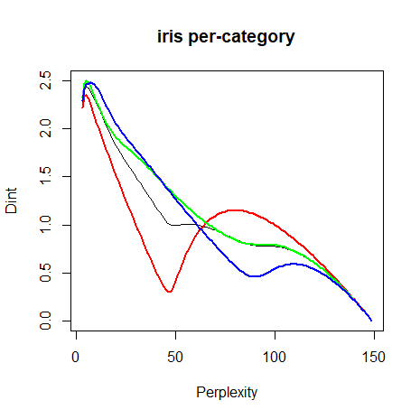|

The overall shape of the curves is *very* reminiscent of the synthetic 
three-clusters dataset we looked at above. The suggested perplexity is 5 for
the dataset as a whole, and when broken out by `Species`, the perplexity is
still suggested to be 5 for `setosa` and `versicolor`, but a whopping 7 for
`virginica`. We already know that we're not going to love the results, but
here they are:

| | |
|-------|-------|
|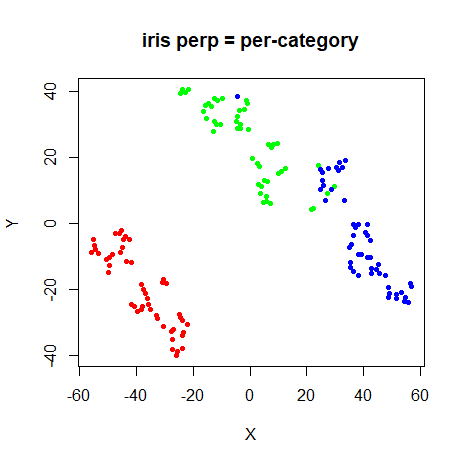|

Perhaps this indicates that for small datasets, the perplexity tends to be
under-estimated? We could just give up now. But we won't. Still so many other
ways for us to be disappointed! Also, in my hands, the 
[pBIC](https://arxiv.org/abs/1708.03229) was awfully fond of suggesting a 
perplexity of 5 as the optimal result for these datasets (see the 
[perplexity](https://jlmelville.github.io/smallvis/perplexity.html) page for 
more details), so I'm in good company.

### s1k

| | |
|-------|-------|
|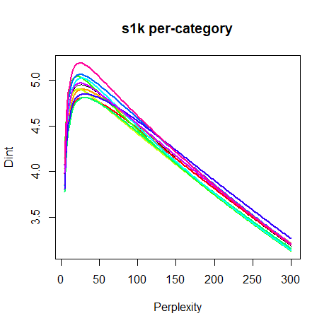|

I didn't expect to see much difference between the 10 clusters in `s1k`: they
are pretty much identical in terms of composition, spread and relative distance.
So it's not to suprising that their dimensionality curves are quite similar. The
recommended global perplexity for this dataset is `26`, while the per-cluster
perplexities range from `22` to `31`.

| | |
|-------|-------|
|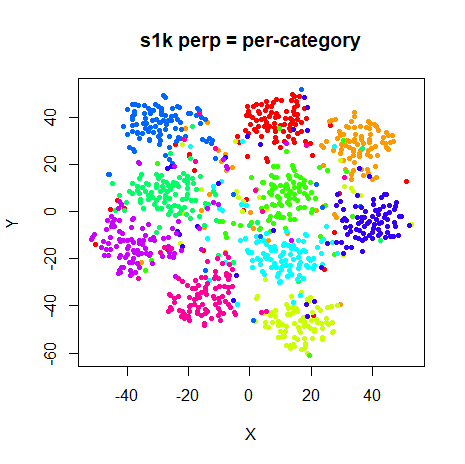|

Big improvement over the results for `iris`, I think. I can't see a big reason
to want to use the per-category visualization over the global perplexty and a
method that suggests a perplexity between 20-30 is not that Earth-shaking a
revelation, but at least it didn't suggest a perplexity of 5. My confidence has
returned somewhat.

### oli

The Olivetti faces contain 40 different classes. There's no good way to show
40 different curves, so let's just take a deep breath and get through this
together:

| | |
|-------|-------|
|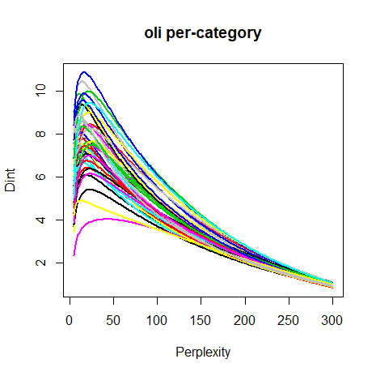|

I won't be getting a Christmas card from the Society for Intelligible Images
for this one. But there is a bit of an indication that the different sets of
faces show different dimensionalities: compare the bottom three curves (in 
purple, yellow and black) with the top blue curve for example. And intriguingly
there is an interesting spread of perplexities: between 11-22, except for face
number 22, where a perplexity of 42 is suggested. The average over the entire
dataset is 17. 

| | |
|-------|-------|
|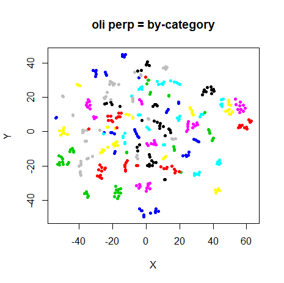|

The perplexity = 17 result gives a perfectly good visualization. And so does
the per-category result, to the extent that it's quite hard to spot any 
meaningful differences between the two.

### frey

The Frey faces dataset doesn't have any classes it can be easily split into.
The dimensionality plot for the dataset as a whole is:

| |
|-------|
|

No real hint of any extra structure there. The ms-JSE paper gave an intrinsic 
dimensionality of 6.43, while our value is 6.48. Pretty close! The t-SNE result
for the suggested perplexity, 55 (a little outside the usually suggested range)
is:

| |
|-------|


Comparing this to the plots at other 
[perplexities](https://jlmelville.github.io/smallvis/perplexity.html#frey) 
suggests this is perfectly reasonable result.

### coil20

`coil20` is another dataset with quite a lot of classes, so the dimensionality
plot could get messy.

| | |
|-------|-------|
|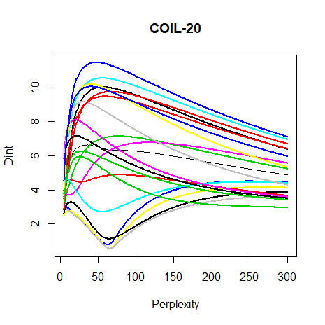|

The overall dataset on the left is actually quite interesting. There's an 
obvious "shoulder" on the plot compared to all the other datasets, which 
indicates that splitting the dimensionality plot into classes is worth while.
And even more so than `oli`, the different classes do seem to have quite a spread
of dimensionality: from 6 to 77. Surely, this would be one dataset where using
different perplexities would help?

| | |
|-------|-------|
|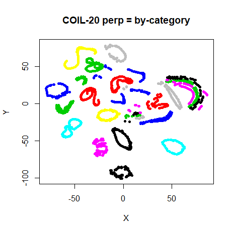|

Hmm. Well, compared to the global perplexity result on the left the per-category
results are different at least, but the differences don't exactly leap off the
page. And I'd be hard-pressed to say that the results are better in the 
per-category case. Comparing this to the plots at other 
[perplexities](https://jlmelville.github.io/smallvis/perplexity.html#coil20),
a much lower perplexity of 5 does a good job of separating the different loops
while maintaining their structure. There's not really any indication from 
intrinsic dimensionality that such a low perplexity is warranted though. We
may have to chalk this one up as a failure, although the interesting structure
of this dataset might make it work investigating in-depth.

For what it's worth, the ms-JSE paper states the overall intrinsic 
dimensionality as 6.50, which our method gives it as 6.63. Not quite as close 
as the `frey` result, but pretty good.

### mnist

| | |
|-------|-------|
|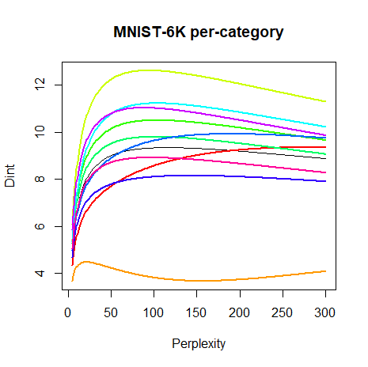|

The overall dimensionality plot has a similar structure to the other datasets
we've seen, but is much broader, and the suggested perplexity of 115 is well
outside the usual suggested range. Perhaps this is a feature of big datasets?
The per-category results show an interesting range of perplexities (and are
easier to see than the `coil20` and `oli` results) from 21 to
287.

| | |
|-------|-------|
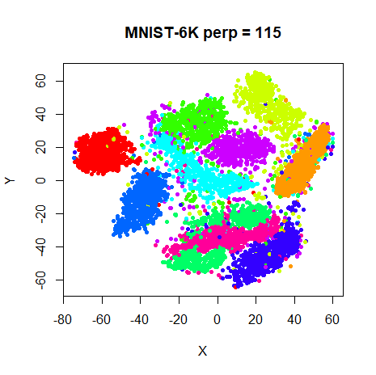|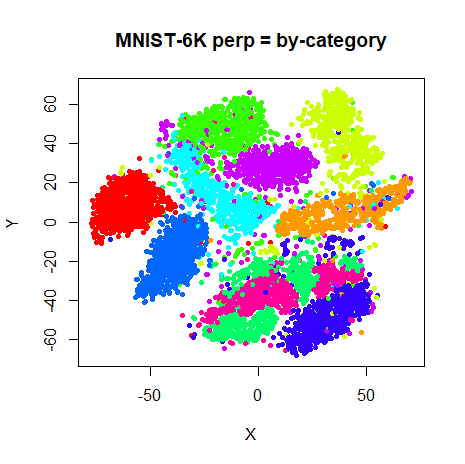|

Once again, the average perplexity t-SNE results seems to do just as good a
job as allowing the perplexity to vary per-category. The only noticeable 
difference is in the co-mingling of the '4' and '9' digits (the purple and 
lime-green clusters, respectively, at the bottom of the plot).

The dimensionality plot indicates that this 6,000 digit subset of MNIST has an
intrinsic dimensionality of 9.35. The multiscale JSE paper also used MNIST, but
only sampled 3,000 digits, so it's not a huge surprise, given what we observed
with the Gaussian data, that the intrinsic dimensionality for that subset was
lower, at 8.75. I repeated the intrinsic dimensionality calculations on a 3,000
digit subset of the 6,000 digit dataset and the estimate came out as 8.86. Given
the vagaries of sampling 3,000 digits from 60,000, I'd say that is pleasingly
close to the results given in the multiscale JSE paper.

### fashion

| | |
|-------|-------|
|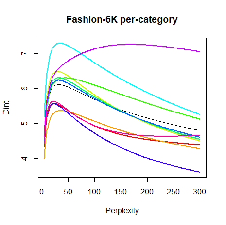|

The `fashion` dataset is interesting to compare to `mnist`, because it's 
designed to have the same format and same number of classes, features and observations,
but it's a lot harder to separate the classes in 2D. And the distribution of
intrinsic dimensionalities is also different. The intrinsic dimensionality of
the dataset is a lot smaller (6.10 vs 9.35) and the suggested perplexity is 32,
well within the usual 5-50 range and much smaller than the 115 for `mnist`. So
it doesn't seem like an increasingly large perplexity is inevitable for larger
datasets.

On a per-category basis, most of the categories also have typical perplexities
suggested, ranging from 22 to 44. Class 8 (the 'bag' class, the top purple
cluster in the plots below) is the one outlier, where the maximum dimensionality
corresponds with a perplexity of 168. It's normally well-separated from the
other classes, although class 1 ('trouser', the orange cluster at the bottom) is
also well separated, but it has a perplexity of 36.

| | |
|-------|-------|
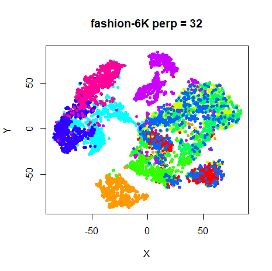|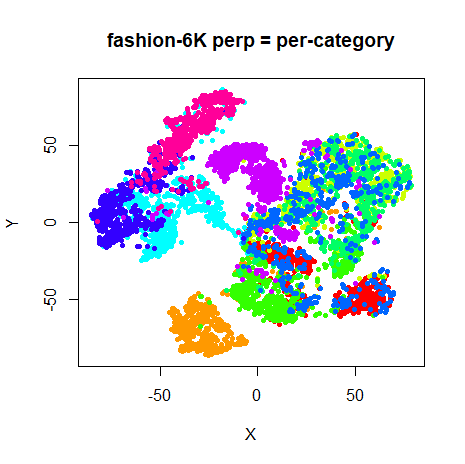|

Again, deviating from a global perplexity doesn't seem to achieve very much.

### Literature Comparison: Summary

To end the real dataset results, here's a table summarizing the estimates of
intrinsic dimensionality from the multiscale JSE paper (column `msJSE`) versus
the ones found in this work (columne `smallvis`). The `ball`, `sphere`, and
`helix` entries replicate those from the table given in the "Synthetic Data"
section, but we might as well put it all together for completeness. Numbers in
parentheses under `smallvis` indicate the perplexity at which the intrinsic
dimensionality was found.

| Name           | msJSE      | smallvis              |
| -------------- | ---------- | --------------------- |
| `ball`         | 2.81       | 2.75 (17)             |
| `sphere`       | 2.02       | 2.03 (14)             |
| `helix`        | 2.47       | 2.66 (13), 2.38 (104) |
| `frey`         | 6.43       | 6.48 (55)             |
| `coil20`       | 6.50       | 6.63 (35)             |
| `mnist` (3000) | 8.75       | 8.86 (81)             |

## A Practical Suggestion for Perplexity Selection

Calculate the mean intrinsic dimensionality across the entire dataset at the
following perplexities: 8, 16, 32, 64, 128. Then use the perplexity which
corresponds to the first maximum in intrinsic dimensionality. This captures the
meaningful range of perplexities without requiring a huge number of extra
calculations. For the datasets looked at here, the table below shows the 
perplexities used above, based on calculating the mean intrinsic dimensionality
at every perplexity between 5 and 300 (`perp`) and from just using the five
trial powers-of-two values (`approx perp`):

| dataset   | perp | approx perp |
|-----------|------|-------------|
| `iris`    | 5    | 8           |
| `s1k`     | 26   | 32          |
| `oli`     | 17   | 16          |
| `frey`    | 55   | 64          |
| `coil20`  | 35   | 32          |
| `mnist`   | 115  | 128         |
| `fashion` | 32   | 32          |

These are sufficiently close to the real results in all cases. Admittedly, this 
scheme *would* miss the first maximum in the Swiss Roll example, and therefore
fail to unroll the 2D topology, but we just don't see that sort of structure
in any of these other datasets, so this is a sacrifice worth making in the name
of simplicity.

## Conclusions

I found quite close agreement between the finite difference results reported in
the multiscale JSE paper and the analytical formula used here, so there's
probably no major bug or anything systematically wrong with the intrinsic
dimensionality and suggest perplexity values given here. But are any of them
useful?

The previous investigation into 
[perplexity](https://jlmelville.github.io/smallvis/perplexity.html) suggested
that t-SNE results aren't very sensitive to perplexity choice, as long as you
have a decent starting point. But if you wanted a more principled way of choosing
a perplexity, picking the perplexity which maximizes the average intrinsic
dimensionality of the dataset seems like quite a solid choice, at the cost of
spending more time doing multiple perplexity calibrations. However, at least 
in `smallvis`, the optimization takes up more time than the calibration, and
by restricting the search to powers of 2 between 8 and 128 it might be worth 
doing. 

Across a series of synthetic data and real data sets, this method seemed
to give a reasonable choice of perplexity. The selected perplexity seemed a
little low for `iris`, which might be due to the small size of the dataset, and
results for `coil20` might indicate the perplexity was too high in that case. 
That dataset probably bears further investigation.

Apart from that, the main downside is that this is something that would have
to be built into a t-SNE program directly, because the data needed (the
un-normalized input weight matrix) isn't usually something that is output.

The question of whether a non-global perplexity is useful remains unanswered.
There was no evidence in any of the t-SNE plots used here that it was worth
using, even though I made life really easy for myself by partitioning data
into pre-known classes that in some cases showed a surprising spread of 
suggested perplexities.

When `smallvis` has implemented the mean intrinsic dimensionality perplexity 
selection, this document will be updated.
