Perplexity is the only free parameter in t-SNE that may need some tweaking. The
best way to think of it is as controlling the size of the neighborhood around
each point that the embedding attempts to preserve. The 
[t-SNE paper](http://www.jmlr.org/papers/v9/vandermaaten08a.html) 
notes that SNE "is fairly robust to changes in the perplexity, and typical 
values are between 5 and 50".
[How to Use t-SNE Effectively](https://distill.pub/2016/misread-tsne/) goes into
a bit more detail about the effect of perplexity. Too low a value will lead to
small disconnected clusters, while too large values lead to circular plots with
points approximately equally spaced.

There isn't much literate on how to choose a perplexity value. 
[Cao and Wang](https://arxiv.org/abs/1708.03229) suggest an empirical method, 
which due to its resemblance to the expression for the Bayesian Information
Criterion in model selection, they call the pseudo-BIC (pBIC). This adds
an extra term penalizing larger perplexities to the final error:

$$
pBIC = 2KL(P||Q) + \frac{Perp}{N} \log N
$$
Here $KL(P||Q)$ is the final error (Kullback-Leibler divergence) from the 
embedding, $Perp$ is the perplexity, and $N$ is the number of observations in 
the dataset you're embedding.

Otherwise, the general advice is to try different perplexities over the usual
5-50 range and see if there's one embedding that looks more visually pleasing
than the others. We'll look at the following values: 5, 25, 50 and 100, which
cover the usual range, with 100 representing a value that is larger than what
is usually recommended.

## Datasets

See the [Datasets](https://jlmelville.github.io/smallvis/datasets.html) page.

## Evaluation

Apart from visualizing the results, we'll also put the pBIC value for each
embedding in the title. The result with the lowest pBIC should be the "best"
result. The `oli` and `coil20` datasets are also used in the pBIC paper, 
although the method outlined there used a larger number of perplexities.

## Settings

For settings, we'll use the ones given in the 
[original t-SNE paper](http://www.jmlr.org/papers/v9/vandermaaten08a.html), 
except with scaled PCA initialization rather than random initialization and
obviously we'll be trying different perplexities. Also in my experience, lower
perplexities require more iterations, so I am going to allow for ten times the
number of iterations than usual to avoid any issues with the visualizations not
having settled down after the usual 1000, although if large changes do occur,
that is an obvious downside to choosing a low perplexity!

Example command for embedding `iris` with perplexity = `5`:
```
# iris perplexity 5
# set ret_extra to TRUE so we can get back the final error for use in the pBIC.
iris_p5 <- smallvis(iris, scale = "absmax", perplexity = 5, Y_init = "spca", eta  = 100, exaggeration_factor = 4, stop_lying_iter = 50,
ret_extra = TRUE, max_iter = 10000, epoch = 100) 
```

## Results

Below are the final embeddings for each dataset, with the perplexities marked
on the title.

### iris

|                             |                           |
:----------------------------:|:--------------------------:
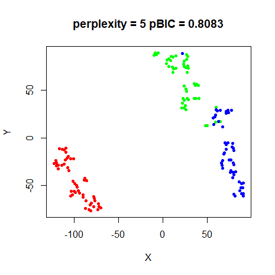|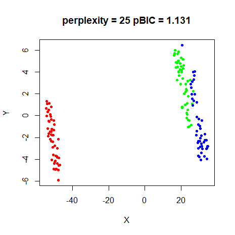
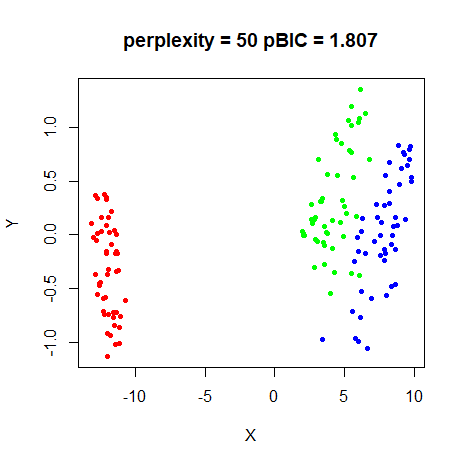|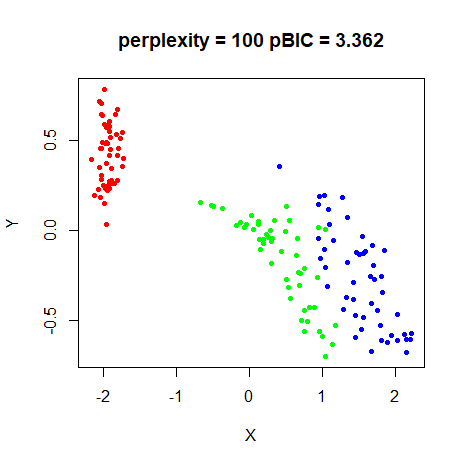

As will become a pattern, pBIC suggests the `perplexity = 5` is the best model. 

### s1k

|                             |                           |
:----------------------------:|:--------------------------:
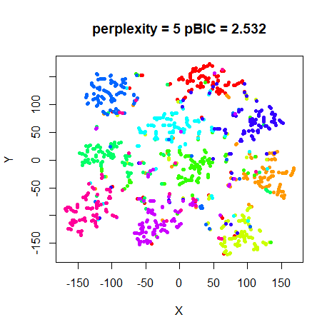|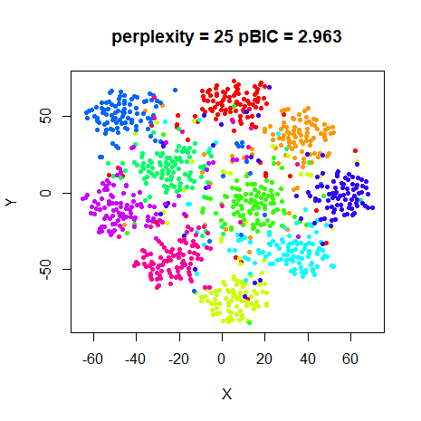
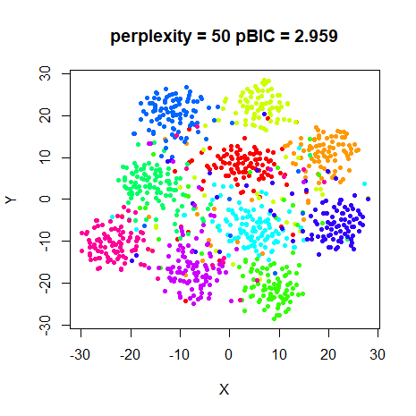|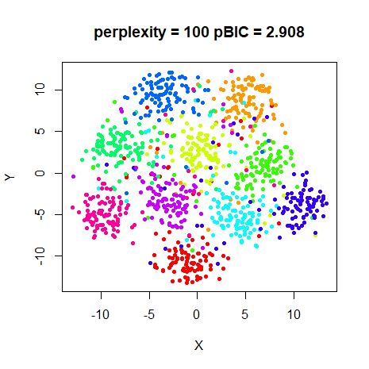

Again pBIC suggests the `perplexity = 5` results as the best.

### oli

|                             |                           |
:----------------------------:|:--------------------------:
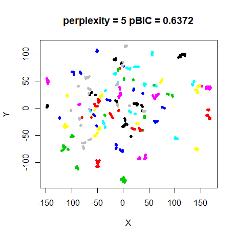|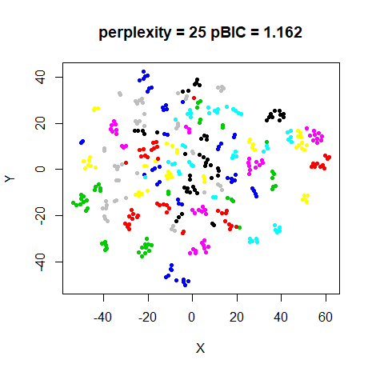
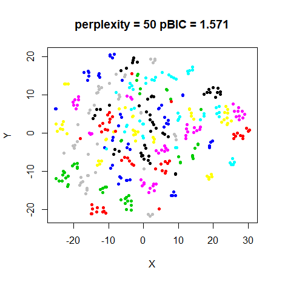|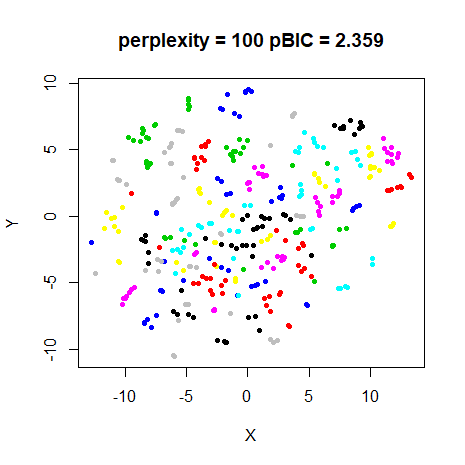

Yet again, pBIC says that the `perplexity = 5` result should be favoured. For
this dataset, it does create tighter clusters, so it's not a terrible choice.

The pBIC paper suggests a perplexity of 12 for this dataset. I tried this, but
the pBIC was higher than for the `perplexity = 5` result. Perhaps I don't know
how to calculate pBIC correctly?
 
### frey

|                             |                           |
:----------------------------:|:--------------------------:
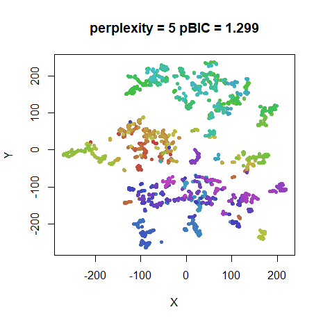|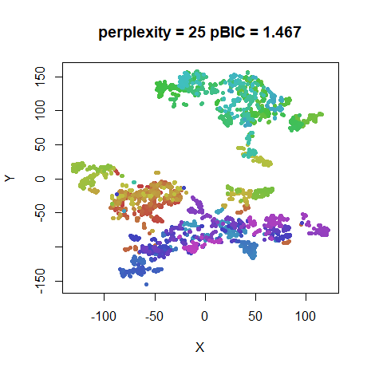
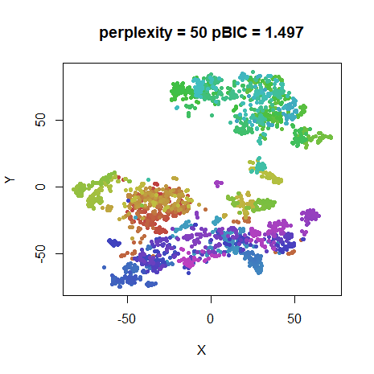|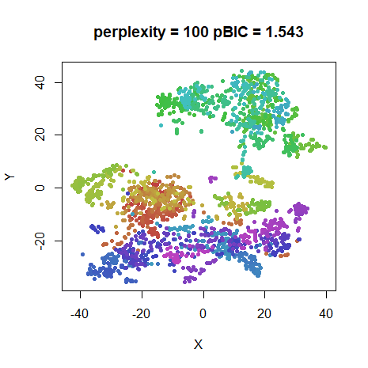

pBIC says... `perplexity = 5`. As usual.

### coil20

|                             |                           |
:----------------------------:|:--------------------------:
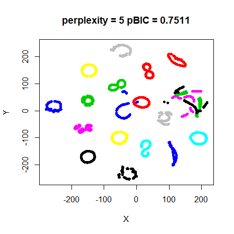|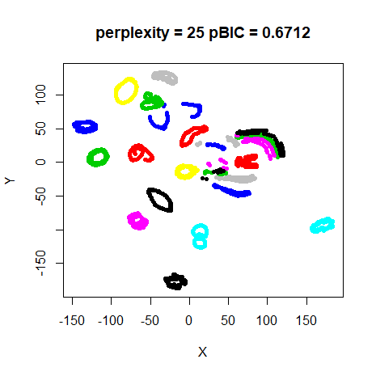
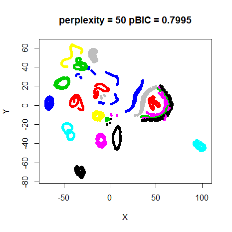|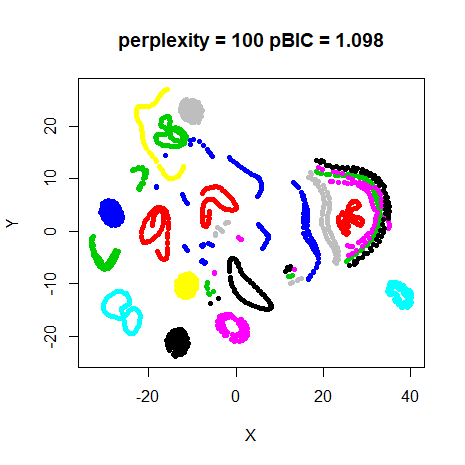

At last some variety. pBIC indicates that `perplexity = 25` is the correct
choice. This is a bit ironic, as for once I think that the `perplexity = 5`
results might be slightly better in terms of displaying the loops. The pBIC
paper says that `perplexity = 64` was best for this dataset. But like `oli`, 
when I tried that perplexity with the settings used here, it wasn't an optimal
value according to pBIC.

### mnist

|                             |                           |
:----------------------------:|:--------------------------:
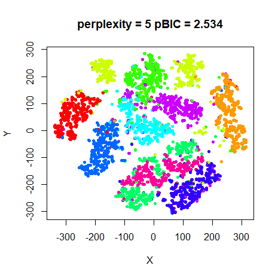|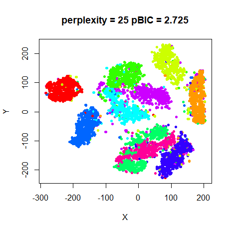
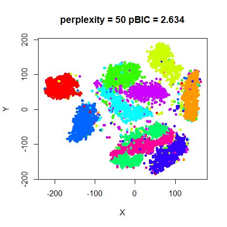|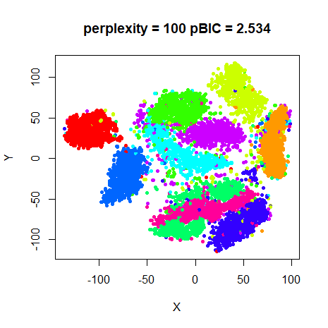

Back to business as usual with pBIC recommending `perplexity = 5`. Although it
also thinks `perplexity = 100` is just as good.

### fashion

|                             |                           |
:----------------------------:|:--------------------------:
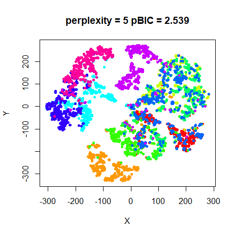|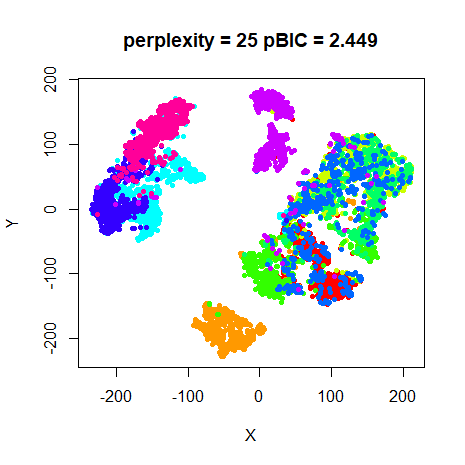
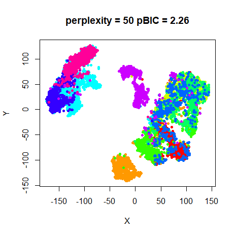|

A bit of a surprise here. pBIC picks the `perplexity = 100` model.

## Convergence

Results presented so far used 10,000 iterations, which is ten times larger than
the t-SNE defaults. For smaller datasets (e.g. `iris`, `s1k`, `oli`), this is 
more than enough to attain convergence when using a large perplexity. However,
particularly at `perplexity = 5`, the KL divergence drops noticeably between
1000 and 10,000 iterations. This is particularly obvious with `coil20`, where
the error is reduced by a further 26%, `mnist` (19%) and `fashion` (18%). The
effect is much less pronounced at `perplexity = 25`, where the largest change in
error going from 1000 to 10,000 iterations is for `coil20`, where the error only
reduces by 8%.

While there is a definite quantitative effect on the final KL divergence by
going to 10,000 iterations at a low perplexity, what sort of visual effect does
it have? Below are the results for `perplexity = 5` with the left hand image
being the embedding after the default `max_iter = 1000`, and the right hand
image that of `max_iter = 10000` (and which are repeated from the results
above).

|                             |                           |
:----------------------------:|:--------------------------:
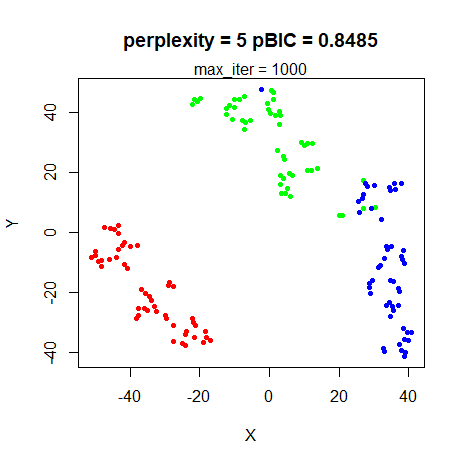|
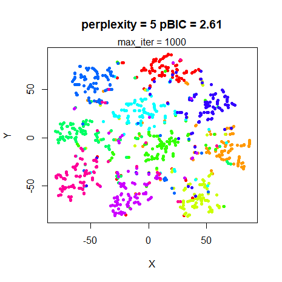|
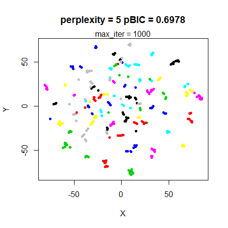|
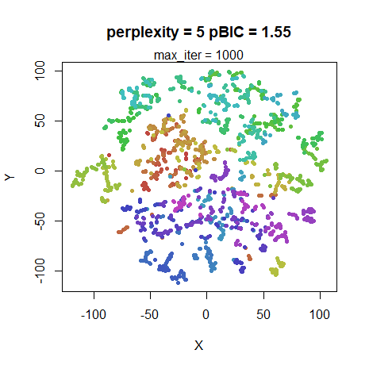|
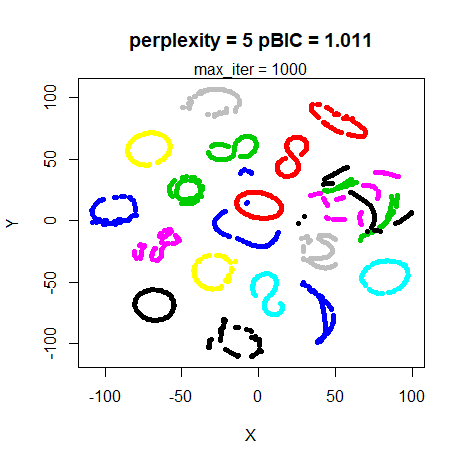|
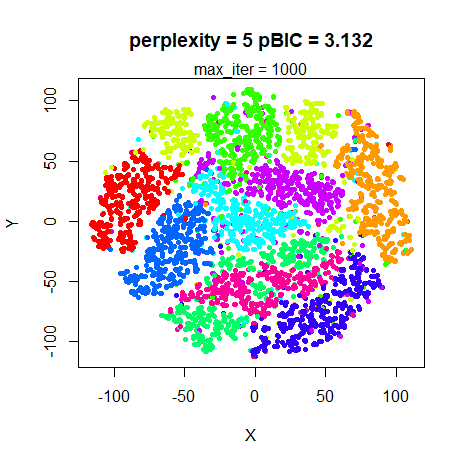|
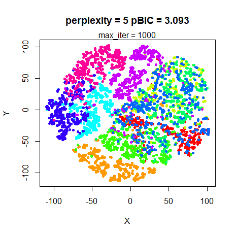|

For the datasets where the final KL divergence was most affected by optimizing
for longer (`coil20`, `mnist`, `fashion`), the results at 1000 iterations are
clearly still a work in progress. The overall shape is definitely there (even
the various loops for `coil20`), but the clusters haven't yet compressed and
separated, so the visualization is less clear.

Note also that the pBIC values are noticeably inflated at 1000 iterations. As
this is an effect that only occurs at low perplexity, it's possible that this 
could cause the pBIC results to be biased, but probably not in a way that makes
much difference.

## Conclusions

The results shown here demonstrate that, as the t-SNE paper suggests, the
perplexity doesn't enormously affect the results between values of 5-50,
although I would suggest that a value between 20-50 is a better range for
initial experimentation. Of the four values tried here, the `perplexity = 25`
results seem the most visually useful across all datasets. `coil20` seems to
retain more of the loop structure with `perplexity = 5`, but is a bit of an
outlier compared to other datasets used here.

At larger perplexities, clustering starts to be affected for smaller datasets
(e.g. `s1k`, `iris`), although even `perplexity = 100` works fine for `mnist`
and `fashion` and has the advantage of converging more quickly.

`perplexity = 5` results, while consistent with the other results, does give a
less smooth visualization, and takes a lot longer to get there. Unless you have
a reason to believe that such a low value is necessary, there doesn't seem to be
a lot to be gained from it. I would recommend doubling the number of iterations
to `max_iter = 2000` in this case too. Going all the way to 10,000 iterations is
overkill for all the datasets tried here. The KL error doesn't need to be
particularly tightly converged in order to get a usable visualization. Using
a good starting point for initialization (e.g. the PCA-based initialization I
used here) also really helps for low perplexity, particularly compared to 
the usual random initialization which is the default for t-SNE.

Using only the 4 perplexities I tried in these experiments, pBIC didn't seem
that helpful. For all but two datasets, it chooses the `perplexity = 5` result,
which seem less visually pleasing than the `perplexity = 25` results to my eyes.
Probably using more perplexities between `5` and `40` would provide better
granularity. I was unable to confirm the results from the pBIC paper. Perhaps
the difference was down to the difference in initialization. Or I am unable to
calculate the pBIC correctly.

Finally, bear in mind that perplexity is only valid between $1$ and $N - 1$,
where $N$ is the number of observations in the dataset. Setting 
`perplexity = 50` for the `iris` dataset implies something very different than 
doing it for `mnist` (even the 6,000 subset I use here). It's better to think of
perplexity in terms of the fraction of the size of the dataset. Results are
definitely and try and take into account the clustering that might be inherent
in the dataset and the degree of overlap. Of course, that's often unknown, data
is normally full of differently sized clusters and the point of running t-SNE is
to get a grasp on the structure of the data in the first place, so that's not
very helpful advice.
[How to Use t-SNE Effectively](https://distill.pub/2016/misread-tsne/) notes 
that the problem of choosing a single global perplexity "is something that might
be an interesting area for future research", but there's not been much progress
in the department. For one potential solution, take a look at 
[multiscale JSE](https://dx.doi.org/10.1016/j.neucom.2014.12.095), although I 
am unlikely to implement it in `smallvis` any time soon. For now, I suggest
starting with a perplexity around 30 and taking things from there.
