Up: [Documentation Home](https://jlmelville.github.io/smallvis/).

The `scale` parameter provides some common scaling options which will be
carried out on the input data before further processing (such as perplexity
calibration). The options are:

* `"none"` (or `FALSE` or `NULL`). Do no scaling. This is the most flexible 
option because it lets you do your own scaling to the input data outside of
`smallvis` and it won't be further modified. Or maybe you don't want or need
to scale your input data further.
* `"scale"` (or `TRUE`). Scales each column of the input data to zero mean and
variance = 1.
* `"range"`. Range scales the entire matrix, so the maximum value is 1 and the 
minimum is 0.
* `"absmax"`. Columns are centered to zero mean, and then divided by the 
maximum absolute value. This is the scaling used in t-SNE (at least in the
original Matlab and Barnes-Hut implementations by Van Der Maaten).

This page gives some results for the effect of t-SNE with different scaling
options.

## Datasets

See the [Datasets](https://jlmelville.github.io/smallvis/datasets.html) page.

Most of the datasets used here are image datasets, where each feature is a pixel
value. In these cases, you may not want to mess with the relative scales of the
different columns of the data, or at least not in the way that `scale = TRUE`
does, which will "blow up" pixel regions with little variance to have the same
weight in the distance calculation as a pixel with more variation, and which is
therefore more likely to meaningfully separate different classes. The `"range"`
and `"absmax"` settings are therefore likely to be most appropriate for these
sorts of datasets.

## Evaluation

Apart from visualizing the results, the mean neighbor preservation of the
40 closest neighbors is used to provide a rough quantification of the quality
of the result, labelled as `mnp@40` in the plots.

## Settings

For settings, apart from changing the scaling option (which would have been
`scale = "absmax"`), we'll use those given in the [original t-SNE
paper](http://www.jmlr.org/papers/v9/vandermaaten08a.html), except with scaled
PCA initialization rather than random initialization.

```
res_scale <- svbench(scale = TRUE, perplexity = 40, Y_init = "spca", eta  = 100, exaggeration_factor = 4, stop_lying_iter = 50) 
res_scale_range <- svbench(scale = "range", perplexity = 40, Y_init = "spca", eta  = 100, exaggeration_factor = 4, stop_lying_iter = 50)
res_scale_absmax <- svbench(scale = "absmax", perplexity = 40, Y_init = "spca", eta  = 100, exaggeration_factor = 4, stop_lying_iter = 50)
res_scale_none <- svbench(scale = FALSE, perplexity = 40, Y_init = "spca", eta  = 100, exaggeration_factor = 4, stop_lying_iter = 50)
```

### iris

|                             |                           |
:----------------------------:|:--------------------------:
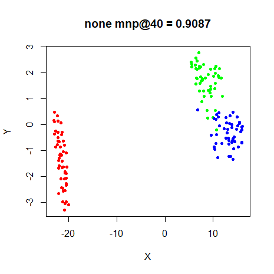|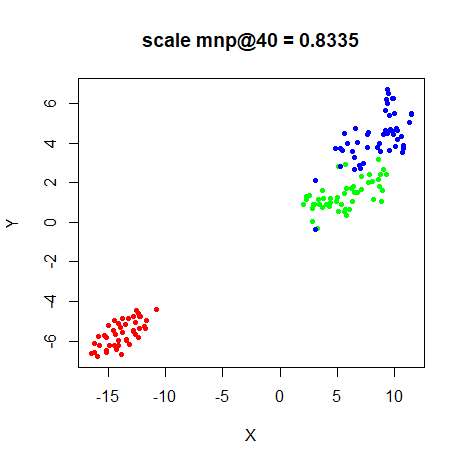
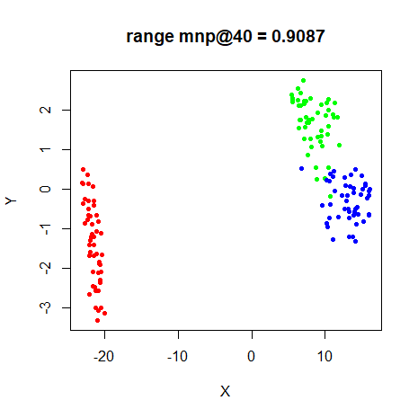|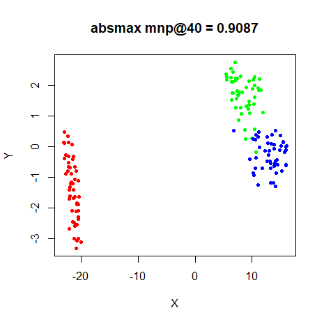

### s1k

|                             |                           |
:----------------------------:|:--------------------------:
|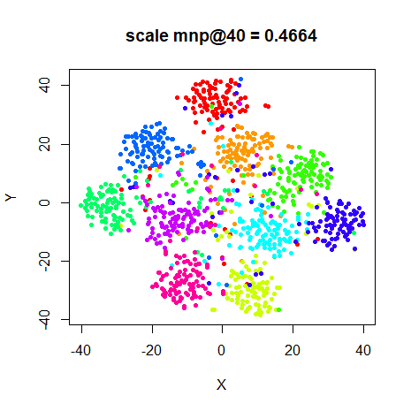
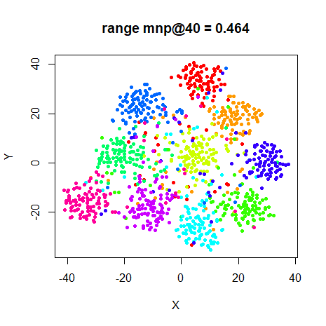|

### oli

|                             |                           |
:----------------------------:|:--------------------------:
|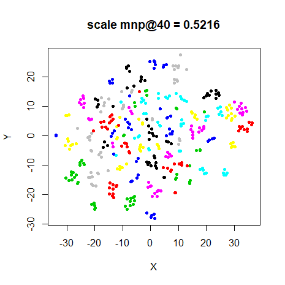
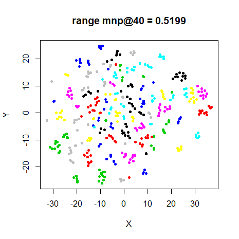|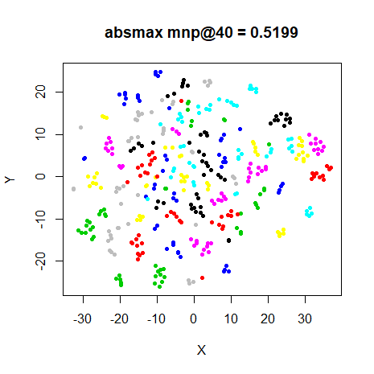

### frey

|                             |                           |
:----------------------------:|:--------------------------:
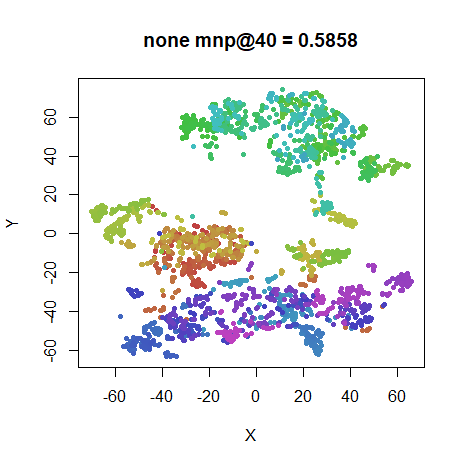|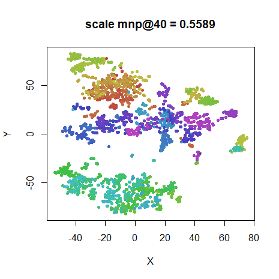
|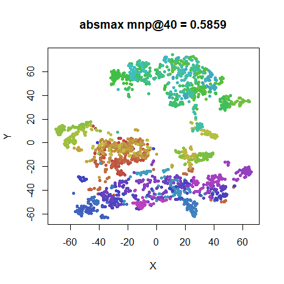

### coil20

|                             |                           |
:----------------------------:|:--------------------------:
|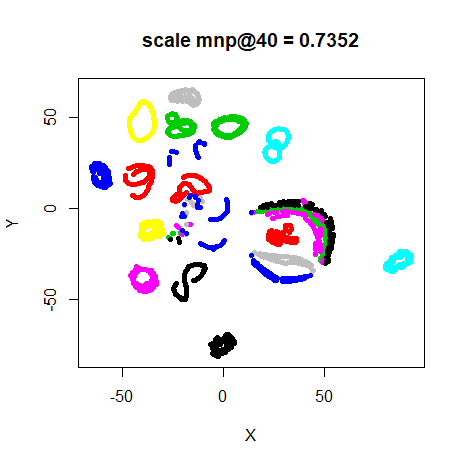
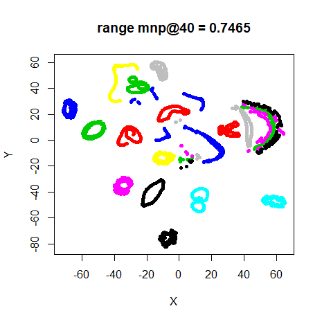|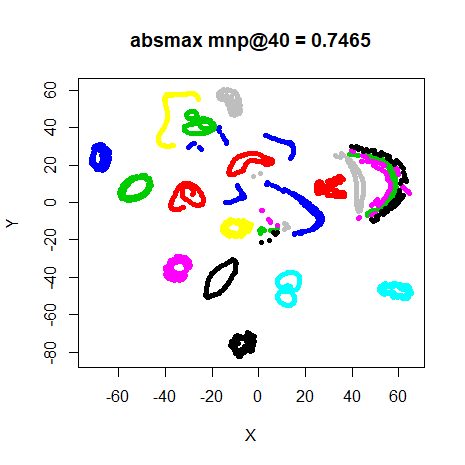

### mnist

|                             |                           |
:----------------------------:|:--------------------------:
|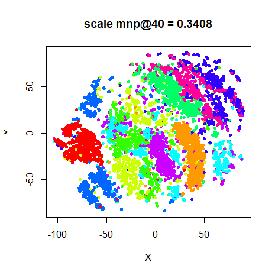
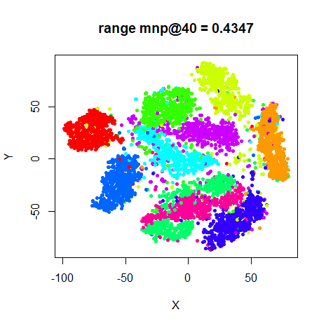|

### fashion

|                             |                           |
:----------------------------:|:--------------------------:
|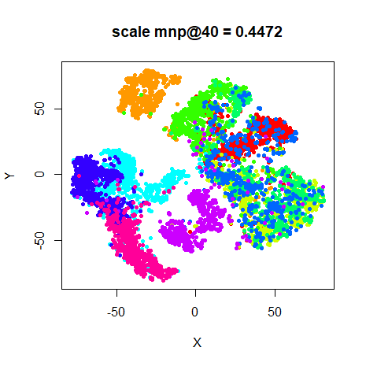
|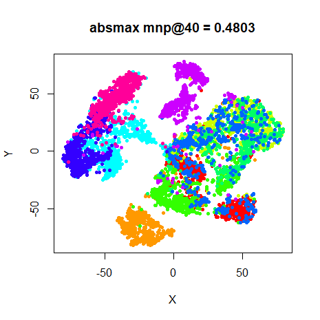

## Conclusions

The results for `"none"`, `"range"` and `"absmax"` seem identical but are in fact
slightly different. This doesn't necessarily mean that these will all do the same
thing for any dataset, but at least we don't have to worry about the effect of
the typical scaling options for the test datasets we will usually be looking at.

The `scale = TRUE` results clearly give different results, and as predicted,
it's not necessarily a great idea to do it to the image data (`mnist`
particularly suffers). To see the sort of effect it has on the underlying data,
here's the first `frey` face image, unscaled on the left, and after `scale =
TRUE` has been applied to the entire dataset on the right:

|                             |                           |
:----------------------------:|:--------------------------:
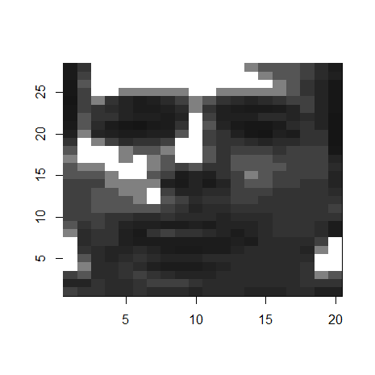|

My apologies to Brendan Frey. Nonetheless, `scale = TRUE` is a good idea for
some datasets, specifically those where each column is a different measurement
using very different scales. `iris` is a candidate for this, although as it 
turns out, the different columns all have very similar scales, because they are
all length or width measurements of the flower features, and in this case
scaling makes the separation of classes slightly worse.

You may also want to consider the [PCA and whitening](https://jlmelville.github.io/smallvis/pcaw.html) 
preprocessing options.

Up: [Documentation Home](https://jlmelville.github.io/smallvis/).
