Up: [Documentation Home](https://jlmelville.github.io/smallvis/).

The [delta-bar-delta](https://dx.doi.org/10.1016/0893-6080%2888%2990003-2) method 
used for optimizing t-SNE is an adaptive learning rate technique that
was originally suggested for neural network training. It is mentioned in the same
set of lecture notes that described the 
[RMSprop (PDF)](https://www.cs.toronto.edu/~tijmen/csc321/slides/lecture_slides_lec6.pdf)
stochastic gradient method.

Unlike stochastic gradient methods, DBD is meant for batch learning and only 
uses the sign of the gradient, whereas SGD methods need to take into account
the magnitude of the gradient too. Given what I consider to be the surprisingly
good performance of DBD compared to methods like L-BFGS (see the [optimization]([L-BFGS experiments](https://jlmelville.github.io/smallvis/opt.html) for details), it
would be interesting (to me) to see how SGD methods perform. They certainly
have an advantage of traditional unconstrained optimization methods as being
much easier to implement.

But which optimizer? A good reference is 
[Sebastian Ruder's overview](http://ruder.io/optimizing-gradient-descent/index.html).
They all seem about equally straight-forward to implement, and compared to 
traditional unconstrained optimization methods, they are a breeze.

I have no expectation that any of these should work well, but then again, I defy
anyone to have predicted that delta-bar-delta would work well for t-SNE, so 
let's just try all of them:

* [Adagrad](http://jmlr.org/papers/v12/duchi11a.html)
* [Adadelta](http://arxiv.org/abs/1212.5701) modifies Adagrad to stop the 
learning rate decaying to zero.
* [RMSProp (PDF)](http://www.cs.toronto.edu/~tijmen/csc321/slides/lecture_slides_lec6.pdf)
is similar to Adadelta in that is also modifies Adagrad to prevent zero learning rates.
* [Adam](https://arxiv.org/abs/1412.6980) attempts to estimate mean and variance
of the gradient estimates, incorporating a bias correction.
* [Adamax](https://arxiv.org/abs/1412.6980) a variant on Adam using the infinity
norm.
* [Nadam (PDF)](http://cs229.stanford.edu/proj2015/054_report.pdf), Adam 
modified to use Nesterov momentum.
* [AMSGrad](https://openreview.net/forum?id=ryQu7f-RZ) is a variant that 
corrects a flaw in Adam's convergence under some circumstances.

## Datasets

See the [Datasets](https://jlmelville.github.io/smallvis/datasets.html) page.

## Evaluation

Apart from visualizing the results, the mean neighbor preservation of the
40 closest neighbors is used to provide a rough quantification of the quality
of the result, labelled as `mnp@40` in the plots.

## Settings

Here's an example of generating the t-SNE results with Adam.

The Adam results differ from the recommended defaults given by the authors for
deep learning. I settled on these values by experimenting with the `iris`
dataset results.

```
# Adagrad
iris_adagrad <- smallvis(iris, scale = FALSE, perplexity = 40, Y_init = "spca", opt = list("adagrad", eta = 5))

# Adadelta
iris_adadelta <- smallvis(iris, scale = FALSE, perplexity = 40, Y_init = "spca", opt = list("adadelta"), tol = 0)

# RMSProp
iris_rmsprop <- smallvis(iris, scale = FALSE, perplexity = 40, Y_init = "spca", opt = list("rmsprop", eta = 0.25, rho = 0.8))

# Adam
iris_adam <- smallvis(iris, method = "tsne", perplexity = 40, max_iter = 1000, verbose = TRUE, Y_init = "spca", scale = FALSE, ret_extra = c("dx", "dy"), opt = list("adam", eta = 0.25, beta1 = 0.8))

# Nadam
iris_nadam <- smallvis(iris, scale = FALSE, perplexity = 40, Y_init = "spca", opt = list("nadam", eta = 0.25, beta1 = 0.8))

# Adamax
iris_adamax <- smallvis(iris, scale = FALSE, perplexity = 40, Y_init = "spca", opt = list("adamax", eta = 1, beta1 = 0.9))

# AMSGrad
iris_amsgrad <- smallvis(iris, scale = FALSE, perplexity = 40, Y_init = "spca", opt = list("amsgrad", eta = 0.25, beta1 = 0.8))
```

## Evaluation

For each initialization, the mean neighbor preservation of the
40 nearest neighbors, calculated using the 
[quadra](https://github.com/jlmelville/quadra) package: for each point the 40
nearest neighbors are calculated in the input and output space, and the fraction
of neighbors in common is recorded (0 means no neighbors are in common, 1 means
all the neighbors were preserved). The number reported is the mean average over
all results and is labelled as `mnp@40` in the plots. 40 was chosen for these
results to match the `perplexity`.

## Results

The DBD results are on the left, the Adam results are on the right.

### iris

|                             |                           |
:----------------------------:|:--------------------------:
|
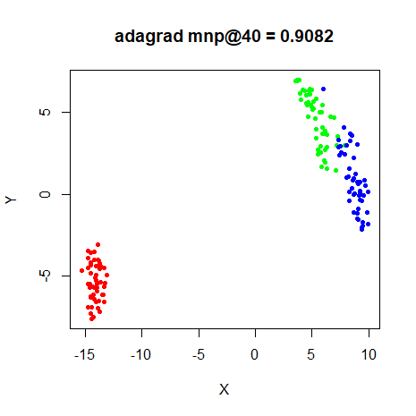|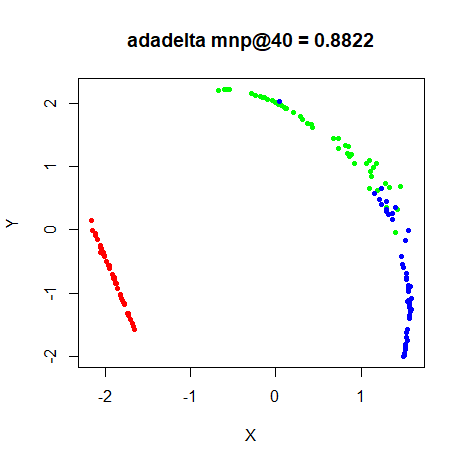
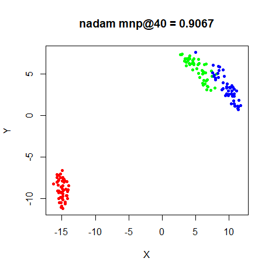|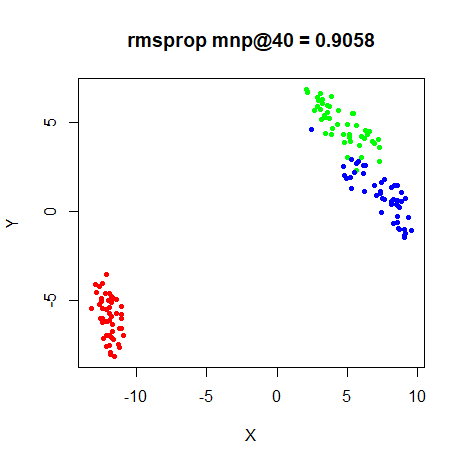
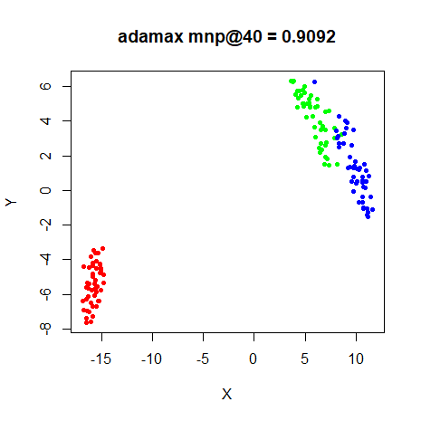|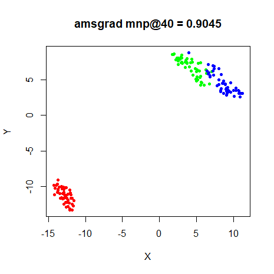


### s1k

|                             |                           |
:----------------------------:|:--------------------------:
|
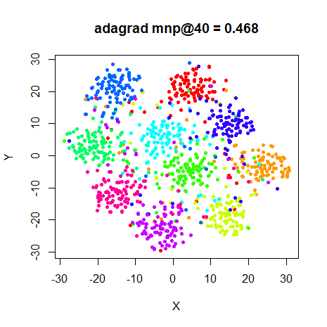|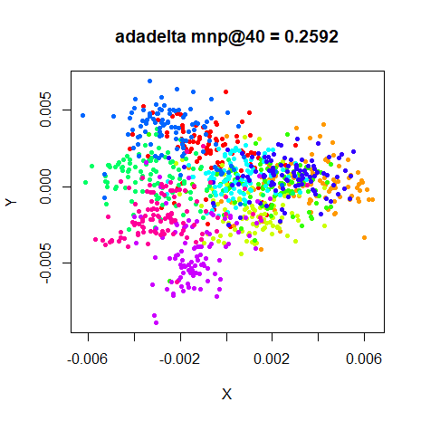
|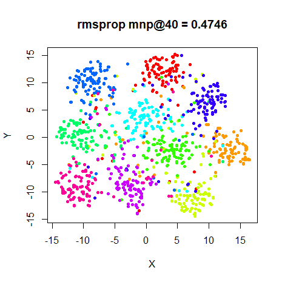
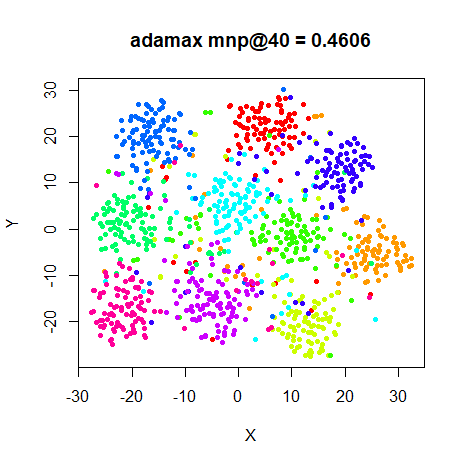|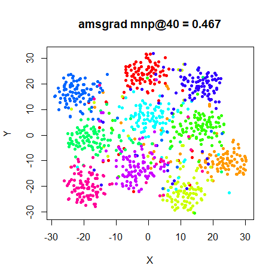


### Olivetti Faces

|                             |                           |
:----------------------------:|:--------------------------:
|
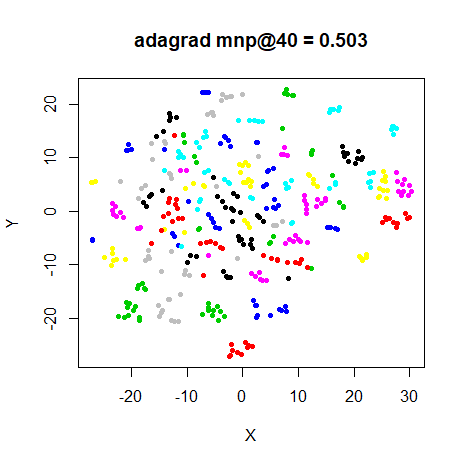|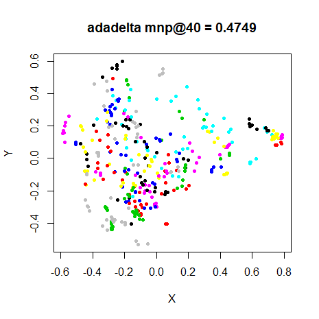
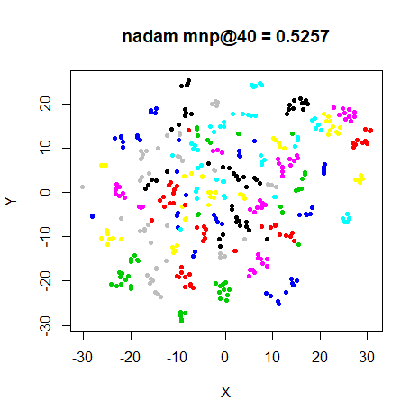|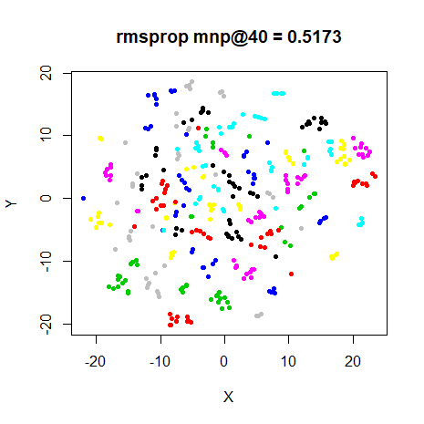
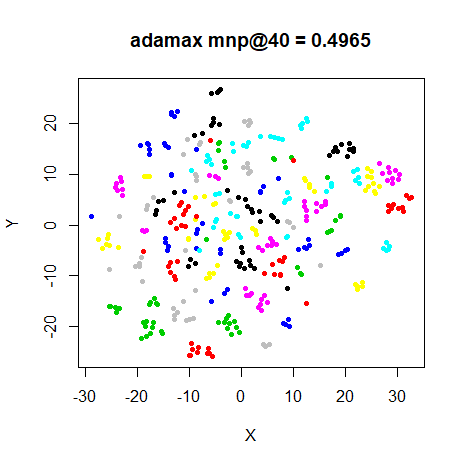|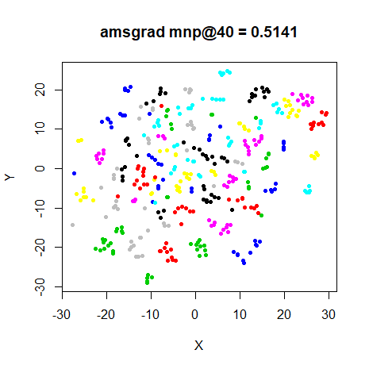

### Frey Faces

|                             |                           |
:----------------------------:|:--------------------------:
|
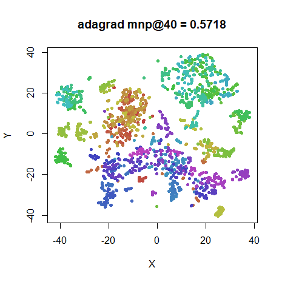|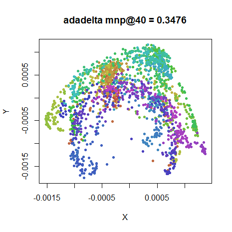
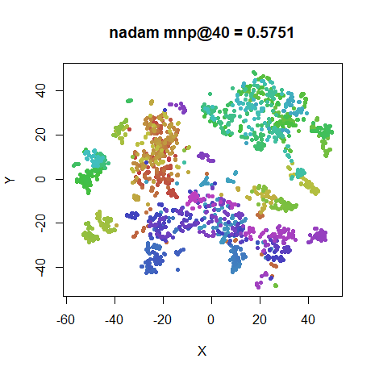|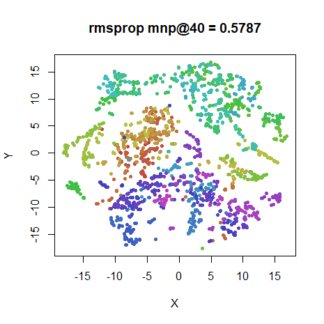
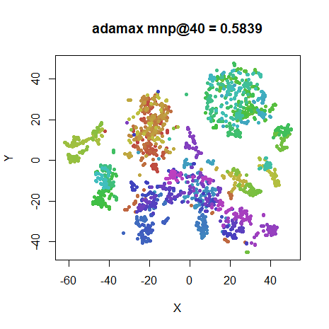|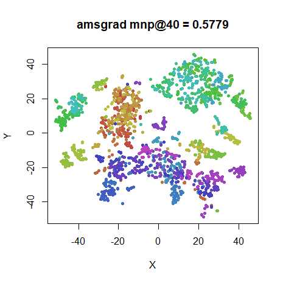

### COIL-20

|                             |                           |
:----------------------------:|:--------------------------:
|
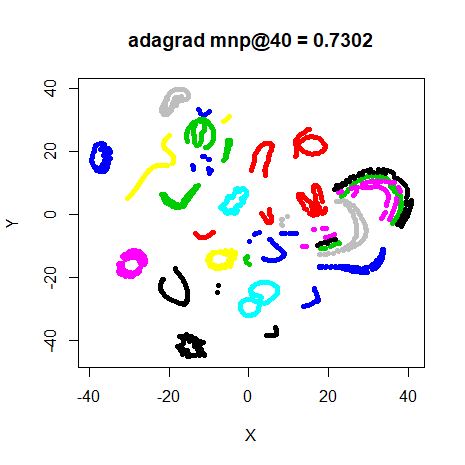|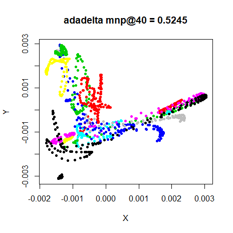
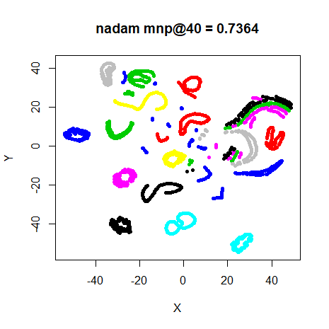|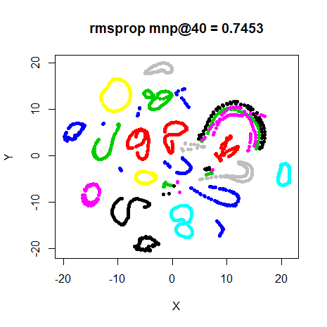
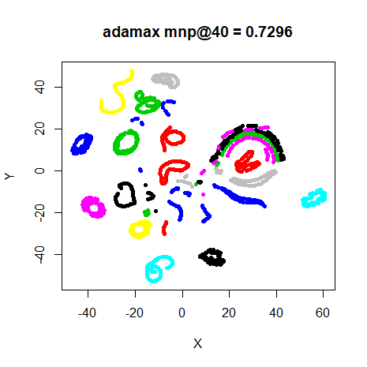|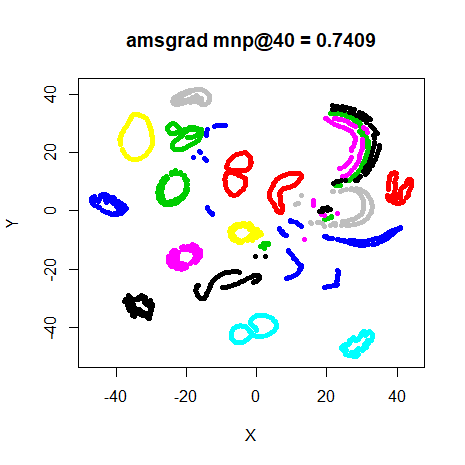


### MNIST (6,000)

|                             |                           |
:----------------------------:|:--------------------------:
|
|
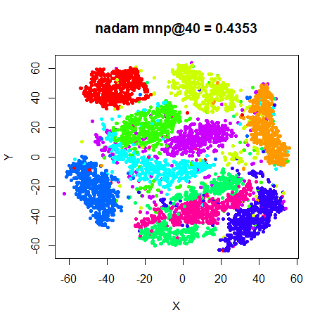|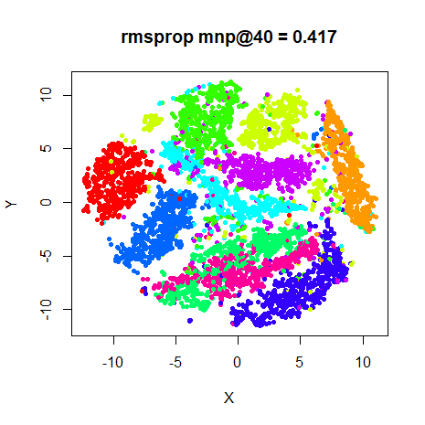
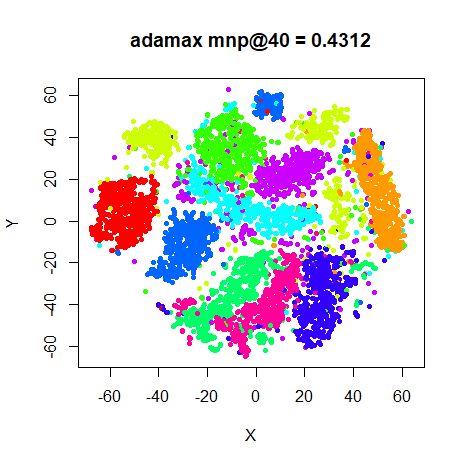|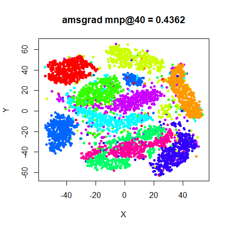


### Fashion (6,000)

|                             |                           |
:----------------------------:|:--------------------------:
|
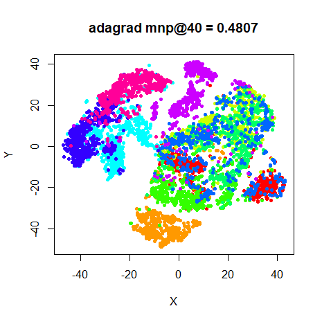|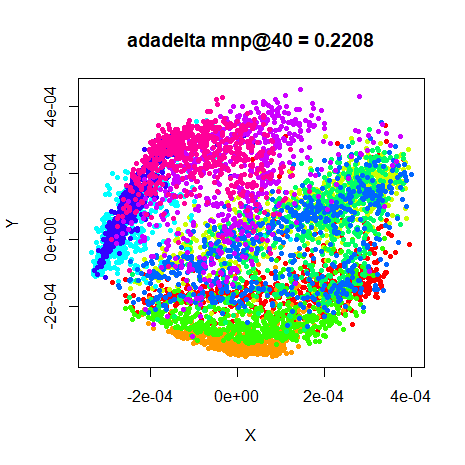
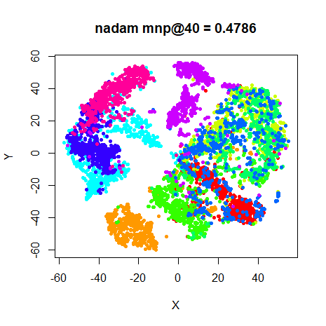|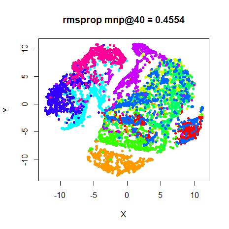
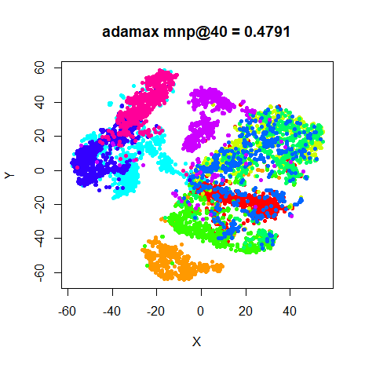|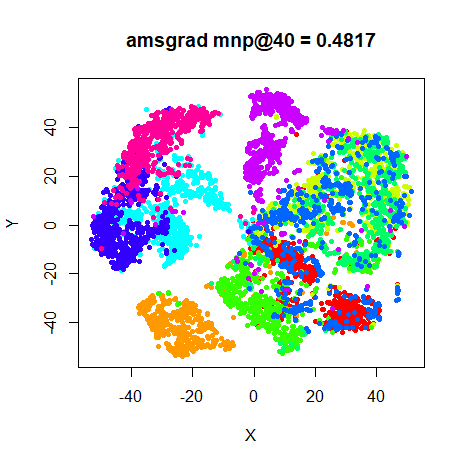

## Conclusions

Everything except Adadelta works amazingly well. Adadelta, which has no 
controllable learning rate parameter, makes extremely small updates, so it gets
nowhere close to converging, or in fact reducing the initial error by even the
third decimal place for the larger datasets.

Everything else does very well, although not as well as Delta-Bar-Delta. On
the other hand, these methods only require one gradient evaluation per iteration
so are much faster than something like spectral directions. 

For smaller datasets, the usual story is apparent: pretty much any method gets
the job done (apart from Adadelta). For MNIST, there's a bit more difference
apparent, with more of the clusters being split up compared to the DBD results.
Nadam and Adagrad do the best job here. Looking at MNIST and Fashion, RMSProp
also seems to be lagging behind in terms of convergence. In general, the degree
of convergence wasn't as far along after 1000 iterations with any of these
alternative algorithms compared to DBD, probably because the learning rate might
be on the conservative side. On the other hand, having to tune the parameters
for each dataset and algorithm would remove much of its appeal anyway.

Up: [Documentation Home](https://jlmelville.github.io/smallvis/).
