A brief run-through of t-SNE and its variants. Although t-SNE is the most 
well-known, there were actually two less successful versions of SNE before it.

## Methods

All the methods here follow the following basic procedure for both the input
and output distances.

1. Square the Euclidean distances between all points.
2. Weight the distances to produce weights (or affinities or similarities), 
ranging from 0 to 1, with a larger weight meaning the points are more similar
(closer together).
3. Normalize the weights into "probabilities".
4. Optimize the Kullback-Leibler divergence between the input and output
probabilities.

Input similarities always use a Gaussian kernel, with a bandwidth calibrated
by fixing the perplexity for each probability distribution associated with a
point. Normally this is a number between 5-50 (and usually in the 30-50 range).

Differences between the methods arise from:

1. How the affinities are normalized into probabilities.
2. What output kernel is used.

### Asymmetric Stochastic Neighbor Embedding

The original 
[SNE](https://papers.nips.cc/paper/2276-stochastic-neighbor-embedding), 
re-dubbed ASNE in the t-SNE paper. This uses the gaussian kernel for the output
distances, but unlike the input kernel, no calibration of bandwidths is carried
out: the bandwidth is 1 for all points. Normalization is carried out point-wise,
i.e. the normalized output weight associated with point $q_{ij}$ is generated
from the output weight $w_{ij}$ by $q_{ij} = w_{ij} / \sum_k^N w_{ik}$. This
creates $N$ separate probability distributions and the input probability matrix
$P$ is not symmetric. In fact it's better thought of $N$ probability
distribution arranged row-wise so that each row sums to 1.

### Symmetric Stochastic Neighbor Embedding

[SSNE (PDF)](https://www.cs.toronto.edu/~amnih/papers/sne_am.pdf) differs from
ASNE only in its normalization scheme. Now, the normalization is pair-wise:
$q_{ij}$ is generated from the output weight $w_{ij}$ by summing over *all* 
pairs of distances: $q_{ij} = w_{ij} / \sum_{kl}^N w_{kl}$. The output 
probability matrix $Q$ is therefore symmetric by construction.  For the input
probability matrix $P$, symmetry is enforced by averaging $p_{ij}$ and $p_{ji}$.

### t-Distributed Stochastic Neighbor Embedding

[t-SNE](http://www.jmlr.org/papers/v9/vandermaaten08a.html) modifies SSNE by
changing the output kernel from Gaussian to the t-distribution with one degree
of freedom.

### Weighted t-Distributed Stochastic Neighbor Embedding

[wt-SNE](http://jmlr.org/proceedings/papers/v32/yange14.html) is a variant on
t-SNE that weights the output affinities $w_{ij}$ by an "importance" measure
$m_{ij}$. In this paper $m_{ij}$ is defined as the product of the degree 
centrality of points $i$ and $j$ in the input space. The degree centrality is 
the sum of the weights of the edges incident to a node in a graph. This is
effectively the sum of the columns of $P$, although other interpretations are
possible. My interpretation is, I believe, perfectly in keeping with what's
written in the paper, but keep in mind that this may not be quite the same
as what the authors intended or what leads to the results presented in their
paper.

This isn't a terribly well-known method, and even the original authors don't
seem to have re-used this method in subsequent papers concerning themselves with
t-SNE and its variants. However, I was curious about it, and otherwise there
would only be three results per dataset, so we may as well look at it here.

## Datasets

See the [Datasets](https://jlmelville.github.io/smallvis/datasets.html) page.

## Evaluation

Apart from visualizing the results, the mean neighbor preservation of the
40 closest neighbors is used to provide a rough quantification of the quality
of the result, labelled as `mnp@40` in the plots.

## Settings

Here's an example of generating the results using the `iris` dataset. For
ASNE and SSNE, values of `eta` were chosen that showed decent behavior on the
`iris` dataset: convergence within 1000 iterations without a hint of divergence,
e.g. the error increasing during an "epoch". These settings were applied to
the other datasets without any further fiddling, so to be on the safe side,
I allowed for double the number of iterations (`max_iter = 2000`) than for
t-SNE.

```
fashion_wtsne <- smallvis(fashion, scale = FALSE, perplexity = 40, Y_init = "spca", 
method = "wtsne", ret_extra = c("dx", "dy"))
fashion_asne <- smallvis(fashion, scale = FALSE, perplexity = 40, Y_init = "spca", method = "asne", ret_extra = c("dx", "dy"), eta = 0.1, max_iter = 2000)
fashion_ssne <- smallvis(fashion, scale = FALSE, perplexity = 40, Y_init = "spca", method = "ssne", ret_extra = c("dx", "dy"), eta = 10, max_iter = 2000)
```

## Results

For each dataset, the first row shows t-SNE on the left and weighted t-SNE on
the right. The lower row shows ASNE on the left and SSNE on the right. The 
bottom row methods therefore all use the Gaussian output kernel rather than the
t-distribution, so we should expect to see more points concentrated in the
middle of those plots.

### iris

|                             |                           |
:----------------------------:|:--------------------------:
|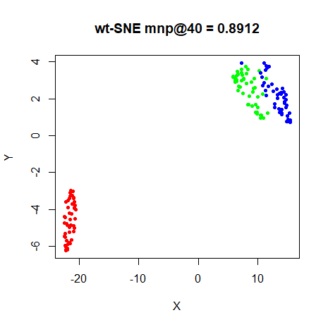
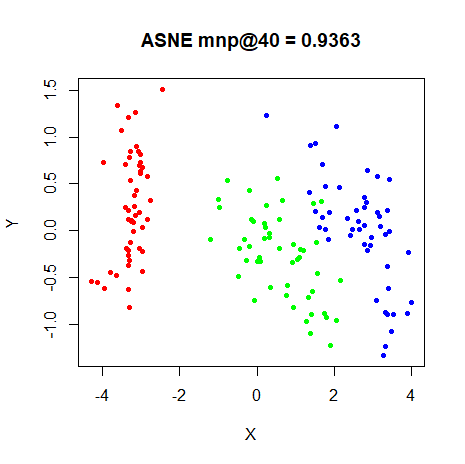|

### s1k

|                             |                           |
:----------------------------:|:--------------------------:
|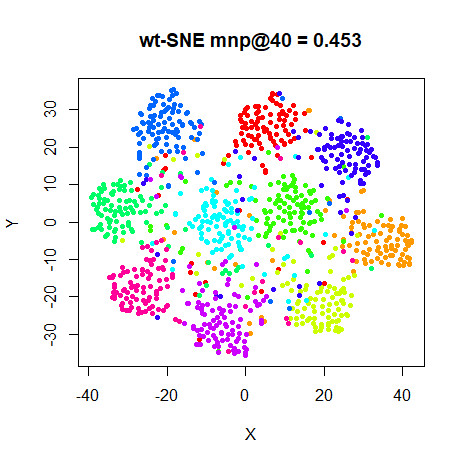
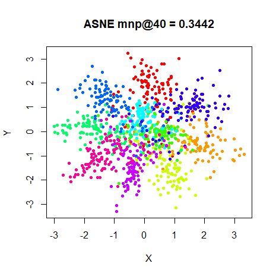|

### oli

|                             |                           |
:----------------------------:|:--------------------------:
|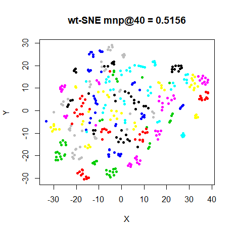
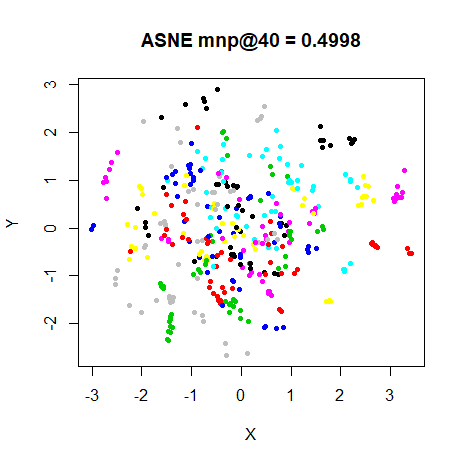|

### frey

|                             |                           |
:----------------------------:|:--------------------------:
|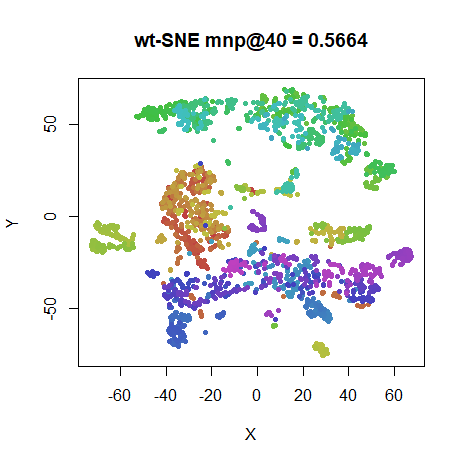
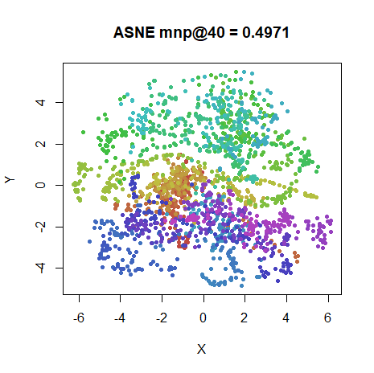|

### coil20

|                             |                           |
:----------------------------:|:--------------------------:
|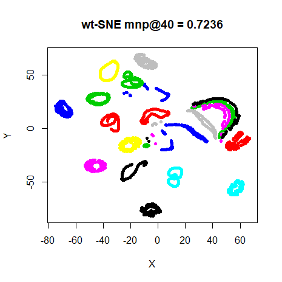
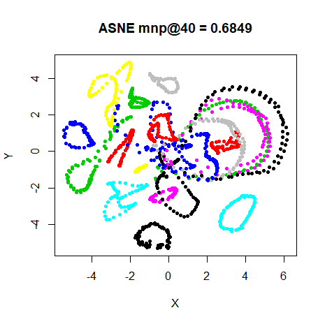|

### mnist

|                             |                           |
:----------------------------:|:--------------------------:
|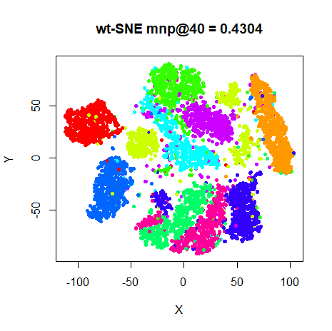
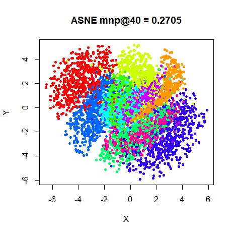|

### fashion

|                             |                           |
:----------------------------:|:--------------------------:
|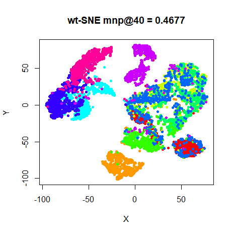
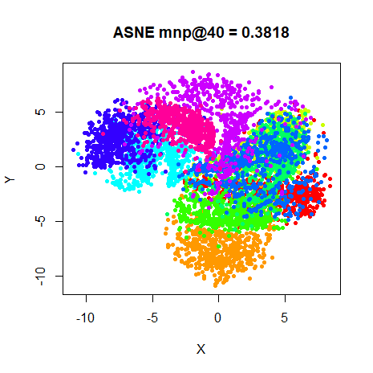|

## Conclusions

I feel like I must have misunderstood how wt-SNE works, because I just can't see
any meaningful difference between it and normal t-SNE. Oh well.

ASNE and SSNE give pretty similar results visually. You can see some differences
if you stare hard enough, e.g. the center of the `s1k` and `oli` plots seem a 
bit less crushed. But looking at the `fashion` and `mnist` results, it's hard to
argue that there's a meaningful difference. 

Both ASNE and SSNE results converged quicker than t-SNE. Despite the amount of
time spent describing the difficulty of optimizing ASNE, the delta-bar-delta
method used in the t-SNE paper worked on SSNE and ASNE just fine.

