Up: [Documentation Home](https://jlmelville.github.io/smallvis/).

The [Spectral Direction](https://arxiv.org/abs/1206.4646) describes an
approximation to the Hessian used in t-SNE and related methods, which can be
used in a Newton-like optimization. For methods which use symmetrized affinity
(or probabiity) matrices, a good approximation of the Hessian of the attractive
part of the cost function is just the graph Laplacian multiplied by 4, where the
graph Laplacian is formed from the input affinities/probabilities matrix.

Being a Newton-like method, this requires a Cholesky factorization, followed by
forward/back-solving to solve the usual $\mathbf{B}p = -g$ equation. The
Cholesky factorization is O(N^3), which the forward/back-solving part is "only"
O(N^2), so for this solution to be scalable, the Cholesky factorization is
carried out only once at the beginning of the optimization, and the graph
Laplacian is sparsified. This isn't a bad approximation for the attractive part
of the cost function because the elements are linearly proportional to the
probabilities, which are by construction extremely close to zero outside the
k-nearest neighbors of any observation, where k is the perplexity.

`smallvis` doesn't care for scalability, so its implementation of the above
doesn't enforce sparsity. A very similar approach to spectral directions was 
described by
[van der Maarten (PDF)](http://cseweb.ucsd.edu/~lvdmaaten/workshops/nips2010/papers/vandermaaten.pdf)
which also didn't attempt to enforce sparsity (it should also be noted that the 
van der Maaten approach also doesn't attempt to enforce positive definiteness, 
which could lead to the optimization failing). In this paper, the Cholesky 
factorization didn't dominate the computation time: the dataset used was a 
subset of MNIST with n = 5,000, so similar in size to the largest datasets 
considered here. Therefore we can probably get away with ignoring sparsity.
However, results in this paper were much less detailed than those presented in
the spectral directions paper though (sadly, no visualization of the
delta-bar-delta versus partial Hessian resulting coordinates are shown).

## Line Search

The line search in Spectral Direction uses a simple back-tracking search looking
to fulfil the Armijo/sufficient decrease criterion with $c_1 = 0.1$ (using the
notation in 
[Nocedal & Wright](http://users.iems.northwestern.edu/~nocedal/book/)), starting
with $\alpha = 1$ (the Newton step) on the first iteration and then initializing
subsequent values of $\alpha$ with the final result from the previous iteration.
This is, as the authors note, a conservative strategy because the line search
can never grow again, and if one iteration rejects the Newton step, it can
never be tried again. van der Maarten's experiments use a normal Wolfe line 
search, with $c1 = 0.02$ and $c2 = 0.9$. The 
[L-BFGS](https://jlmelville.github.io/smallvis/opt.html) results hardly shone
when using a full Wolfe line search (which is a requirement for the
quasi-Newton methods). So we will try two strategies: the first will be to use
Spectral Direction with a Wolfe line search, with the step size allowed to
vary freely (grow and shrink) at each iteration. We'll also look at a 
back-tracking line search, but initialize from the Newton step ($\alpha = 1$)
at each iteration.

## Datasets

As usual, see the [Datasets](https://jlmelville.github.io/smallvis/datasets.html) page.

## Settings

For the backtracking line search, the default armijo setting from `mize` of
`c1 = 1e-4` was used, rather than `c1 = 0.1`, which would be equivalent
to the spectral directions paper. That probably doesn't make much difference.

To try and keep the optimization within a reasonable resource usage compared to
the delta-bar-delta default, the convergence settings for `mize` were set to
`max_gr = 1000` (maximum number of gradient evaluations) and `step_tol = 1e-6`
(stop if the final $\alpha$ for any iteration is less than `1e-6`). This still
results in more resource usage than using DBD, because the line search uses
function evaluations as well as gradient evaluations, which DBD only carries out
when logging every 100 iterations.

Initialization was from a scaled PCA using the first two PCs, without any input
data scaling. The van der Maaten experiments also initialized from PCA,
presumably without any scaling. No early exaggeration was used: the spectral
directions and the van der Maaten experiments don't either. The target
perplexity was 40.

Example invocations are given below:

```
# Spectral Direction with default Wolfe line search
iris_specd <- smallvis(iris, Y_init = "spca", opt = list("specd", step_tol = 1e-6, max_gr = 1000), scale = FALSE, ret_extra = c("DX", "DY"), perplexity = 40)

# Spectral Direction with backtracking line search
iris_specd_bt <- smallvis(iris, Y_init = "spca", opt = list("specd", step_tol = 1e-6, max_gr = 1000, line_search = "backtracking", step_next_init = 1, step0 = 1), scale = FALSE, ret_extra = c("DX", "DY"), perplexity = 40)
```

## Evaluation

For each initialization, the mean neighbor preservation of the 40 nearest
neighbors, calculated using the
[quadra](https://github.com/jlmelville/quadra) package. The number reported is 
the mean average over all results and is labelled as `mnp@40` in the plots. 40
was chosen for these results to match the `perplexity`.

## Results

For each dataset, four results are shown below. On the first row, the left image
shows results using spectral direction with a Wolfe line search; the righthand
image is the results for using spectral direction with backtracking line search.
On the bottom row, the left and right hand images are those from using default
`mize` L-BFGS settings with Wolfe line search, and the default `smallvis` DBD
settings respectively. These used the same initialization, input scaling and
perplexity. The L-BFGS results were not restricted in the number of gradient
evaluations or step tolerance they were allowed, so have an unfair advantage
(although they still had to stop after 1000 iterations). Although perplexity
scaling via `smallvis_perpstep` gave better results for L-BFGS than using a
single perplexity, these results are not used for comparison here.

### Iris

| |
:-------|:-------------------:|
|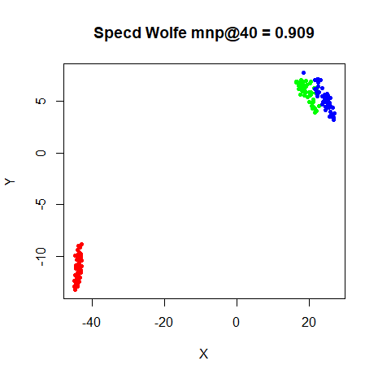|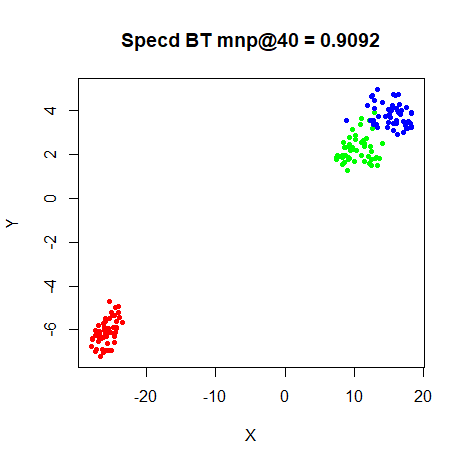
||

### s1k

| |
:-------|:-------------------:|
|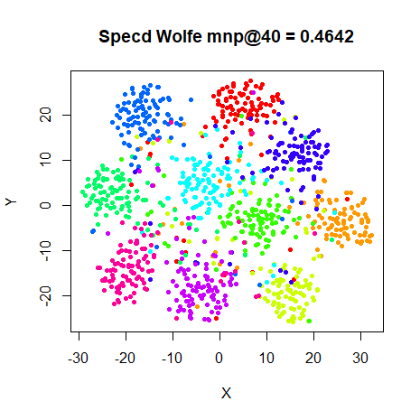|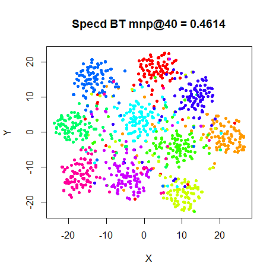
||


### Olivetti Faces

| |
:-------|:-------------------:|
|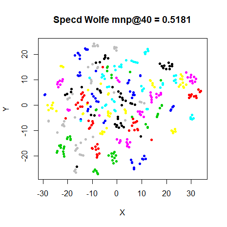|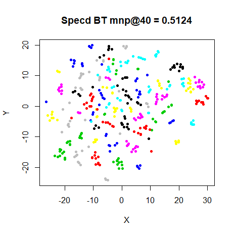
||

### Frey Faces

| |
:-------|:-------------------:|
|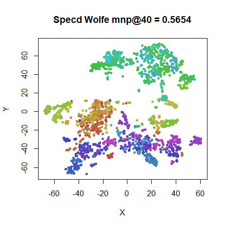|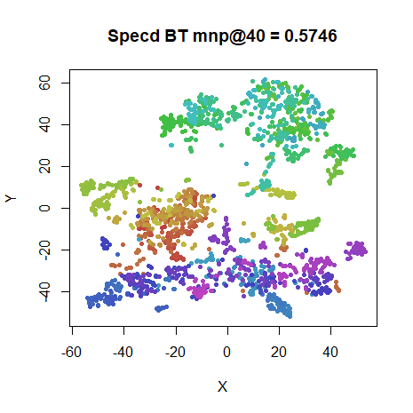
||

### COIL-20

| |
:-------|:-------------------:|
|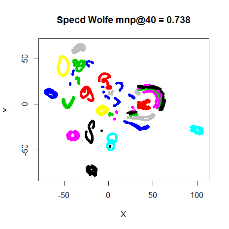|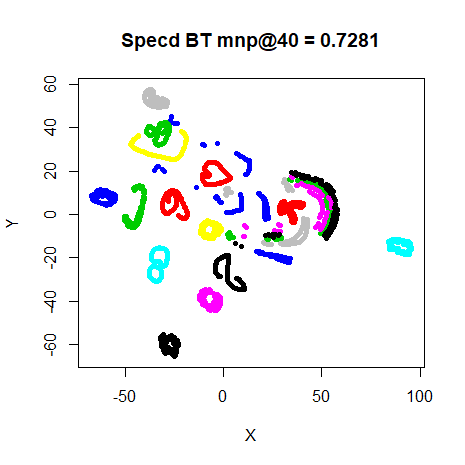
||

### MNIST (6,000)

| |
:-------|:-------------------:|
|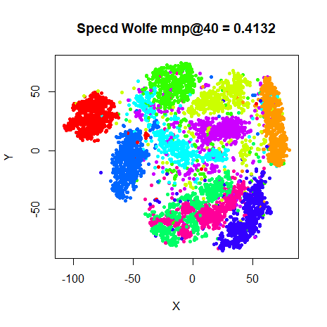|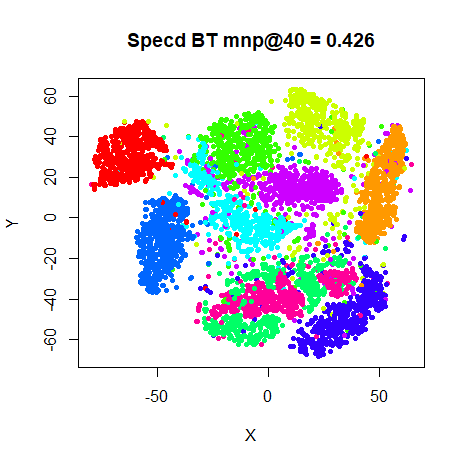
||

### Fashion (6,000)

| |
:-------|:-------------------:|
|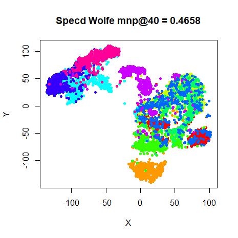|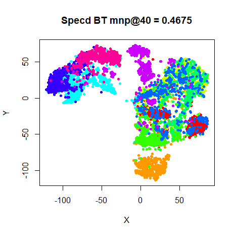
||


## Conclusions

As usual, for the smaller datasets, results are all pretty consistent. Also
the Fashion MNIST sample is reliably non-separable in 2D. Differences in the
MNIST digits are worth looking at, though. The spectral directions results look
better than the L-BFGS results, although not quite as good as the DBD results.

Restricting the line search to back-tracking seems to have basically no effect
on the results. Visually, the MNIST results are better with back-tracking in 
fact. Tentatively, I would recommend back-tracking line search with spectral
directions, which at least agrees with the original spectral directions paper.

These experiments didn't use early exaggeration. It's possible that early
exaggeration is more useful than spectral directions: the Barnes-Hut version
of t-SNE, despite also being written by van der Maaten, doesn't use the partial 
Hessian approach but *does* use early exaggeration. Indeed the importance of
making the exaggeration larger than for smaller datasets is stressed. Possibly 
for large datasets, the Cholesky decomposition starts to dominate the 
calculation time. Or, as noted by 
[Yang and co-workers](http://www.jmlr.org/proceedings/papers/v38/yang15a.html) 
in their experiments, the spectral direction method is unstable when used
with early exaggeration.

Up: [Documentation Home](https://jlmelville.github.io/smallvis/).

