Up: [Documentation Home](https://jlmelville.github.io/smallvis/).

[Elastic Embedding (PDF)](http://faculty.ucmerced.edu/mcarreira-perpinan/papers/icml10.pdf)
is a method like SNE, but doesn't use normalization of weights into
probabilities. I have
[looked at its behavior](https://jlmelville.github.io/smallvis/ee.html) elsewhere.
In this discussion, I would like to consider an obvious extension: EE uses
Gaussian output weights, like ASNE and SSNE, which we know don't work as well in
the normalized case compared to using the t-distribution with one degree of
freedom, as used in t-SNE. Can EE also be improved by using the t-distribution
as an output weight function? I was unable to find any example of anyone trying
this, which was slightly surprising to me. If someone has tried this, it's at
least not a very popular or well-known technique.

## Theory

### Cost function

The generic elastic embedding cost function is:

$$
C_{EE} = -\sum_{ij}^{N} v_{ij}^{+} \log w_{ij} + \lambda \sum_{ij}^{N} v_{ij}^{-} w_{ij}
$$

where $N$ is the number of observations in the dataset, $i$ and $j$ are indexes
to observations in the dataset, $v_{ij}^{+}$ is the input weight (similarity)
between $i$ and $j$ associated with the attractive part of the cost function,
$v_{ij}^{-}$ are input weights associated with the repulsive part of the cost
function, $w_{ij}$ are the output weights and $\lambda$ is a positive scalar
that weights the repulsive versus attractive interactions in the cost function.

For more details, see the introduction to the discussion of
[elastic embedding](https://jlmelville.github.io/smallvis/ee.html), but the
attractive input weights are the output weights are Gaussian-based, as in ASNE
and SSNE.

Here, I propose a simplified cost function for t-distributed Elastic Embedding
(t-EE)

$$
C_{t-EE} = -\frac{1}{N}\sum_{ij}^{N} v_{ij} \log w_{ij} + \frac{\lambda}{N} \sum_{ij}^{N} w_{ij}
$$

The t-EE cost function differs from EE by:

1. only having one set of input weights, $v_{ij}$, which are equivalent to the
unnormalized versions of the probabilities $p_{ij}$ used in SSNE and t-SNE and
determined by the same procedure of perplexity calibration, followed by
row-normalization and symmetrization.

2. $w_{ij}$ are the t-distributed output weights (same as in t-SNE).

3. Both parts of the cost function are weighted by $1 / N$, the reason for which
we will see below.

### EE as the Weighted I-Divergence

It would be nice if the cost function was zero when the output weights perfectly
reproduce the input weights, as with the Kullback-Leibler divergence used by
t-SNE. As long as we don't add any terms involving $w_{ij}$, we can make this
happen without affecting the EE gradient. We would like $C_{t-EE} = 0$ when
$v_{ij} = w_{ij}$. Let's add an extra constant, $C_{v}$, that only involves
$v_{ij}$ (and maybe $\lambda$), and we can write:

$$
C_{t-EE} = -\frac{1}{N}\sum_{ij}^{N} v_{ij} \log v_{ij} + \frac{\lambda}{N} \sum_{ij}^{N} v_{ij} + C_{v} = 0
$$
and then, knowing that $\sum_{ij}^{N} v_{ij} = N$, we have:

$$
C_{v} = \frac{1}{N}\sum_{ij}^{N} v_{ij} \log v_{ij} - \lambda
$$

so the cost function can be written as:

$$
C_{t-EE} = \frac{1}{N}\sum_{ij}^{N} v_{ij} \log v_{ij} -\frac{1}{N}\sum_{ij}^{N} v_{ij} \log w_{ij} + \frac{\lambda}{N}  \sum_{ij}^{N} w_{ij} - \lambda
$$
The first two terms can be combined to give a Kullback-Leibler-like expression,
and we can group the $\lambda$ expressions too (and I have also rewritten
$N$ as $\sum_{ij}^{N} v_{ij}$)

$$
C_{t-EE} = \frac{1}{N} \left[ \sum_{ij}^{N} v_{ij} \log \frac{v_{ij}}{w_{ij}} + \lambda \left(\sum_{ij}^{N} w_{ij} - \sum_{ij}^{N} v_{ij}\right) \right] 
$$

This expression is basically the same as the I-divergence (also called the
generalized Kullback-Leibler divergence), used in non-negative matrix
factorization, but with a weighting term introduced by $\lambda$. The
introduction of $\lambda$ does allow the cost to get negative, but empirically,
I've noticed that a negative cost indicates that $\lambda$ has been set too
small: visually the output shows over-compressed clusters compared to a t-SNE
result. So this version of the cost function may be superior for helping to
at least set a lower bound on $\lambda$.

### Gradient

Whichever version of the cost function you prefer the gradient of t-EE with
respect to the output coordinate of point $i$, $\mathbf{y_i}$, is:

$$
\frac{\partial C_{t-EE}}{\partial \mathbf{y_i}} = \frac{4}{N} \sum_{j}^N \left(v_{ij} - \lambda w_{ij} \right) w_{ij} \left(\mathbf{y_i - y_j}\right)
$$

If we were to define $\lambda$ at each iteration as $N / Z$ where 
$Z =\sum_{ij}^{N} w_{ij}$, and then set $p_{ij} = v_{ij} / N$ and
$q_{ij} = w_{ij} / Z$, we would get back the t-SNE gradient. For elastic
embedding, we fix $\lambda$ as constant. The connection between the t-EE and the
t-SNE gradient is the reason for making the weighting factor in the cost
function $\lambda / N$.

## Datasets

See the [Datasets](https://jlmelville.github.io/smallvis/datasets.html) page.
We shall be using these datasets not just to benchmark the results of t-EE, but
also to think about how t-SNE weight distributions change over time.

## Choosing $\lambda$

Like EE, t-EE requires choosing the value of an extra parameter, $\lambda$,
specified as `lambda` in the `smallvis` interface. This is certainly an irksome
requirement. At least with the way t-EE is formulated we can think about
$\lambda$ as an approximation to $N/Z$ in t-SNE, i.e. the ratio of the size of
the dataset to the sum of the output weights. Because the output weights range
from 0 to 1, we can try to get a handle on the sort of range $\lambda$ will
have.

If using the random initialization, at the start of t-SNE optimization, all
output distances are small, which means all the weights are large and close to
1. As there are $N$ observations, there are $N^2$ elements in $\mathbf{W}$ so
$Z \approx N^2$. Technically, it's actually more like $N^2 - N$ because self-weights are always
set to 0, but as $N$ grows the difference becomes less important. So we shall say
that at the start of a t-SNE optimization,
$\lambda = N / Z \approx N / N^2 = 1 / N$.

If the t-SNE optimization did a perfect job and the error was reduced to zero,
the sum of the input and output weights would be the same and $Z = N$, which
would mean that $\lambda = 1$. Over the course of t-SNE optimization, then,
we would expect $\lambda$ to start very small and increase, approaching 1
as the error got close to 0.

So we can at least expect $\lambda$ to very roughly take values between 0 and 1.
How good are these bounds in reality? Well, they're ok. I have looked at
how $N/Z$ evolves in t-SNE and $N / Z = 1 / N$ is a very good approximation
even if you are initializing from Laplacian Eigenmaps or scaled PCA. The value
quickly rise, but eventually levels off.

And of course, we never see an error of zero with t-SNE, so the final value of
$N / Z$ is not 1. For most datasets and perplexities, it's substantially smaller
than 1. The exact value depends on $N$ and the perplexity, with $N / Z$ showing
an inverse relationship to both: large N and large perplexity results in a lower
final value of $N / Z$. For low perplexities (e.g. 5), $N / Z$ can actually end
up being larger than 1, although I've not seen it larger than around 5, although
this might be because low perplexity requires more iterations for convergence to
occur, and I might just not have been patient.

## Evolution of $N/Z$ with iteration

Here's a little extra detail on how $N/Z$ changes during a t-SNE optimization.

### Swiss Roll

A synthetic dataset like the Swiss Roll let's use look at the effect of dataset
size in a controlled way. We'll look at $N = 1000$ and $N = 3000$ and several
perplexity values. Some relevant parameters used are:

```
scale = FALSE, Y_init = "lap", eta = 100, max_iter = 5000, epoch = 100, tol = 0
```

First, here are some lots for $N/Z$ evolves with iteration and different values of
perplexity for `sr1k` on the left and `sr3k` on the right. Black line is 
perplexity = 10, red is perplexity = 20, orange is perplexity = 30, blue is
perplexity = 40 and purple is perplexity = 50.

|                             |                           |
:----------------------------:|:--------------------------:
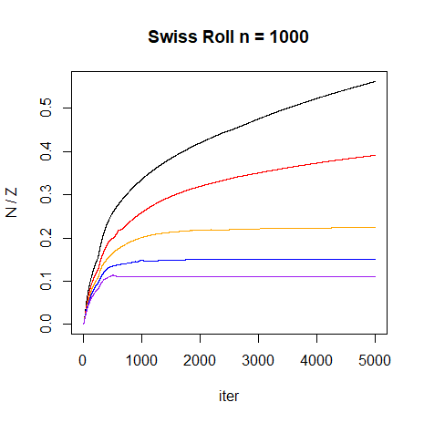|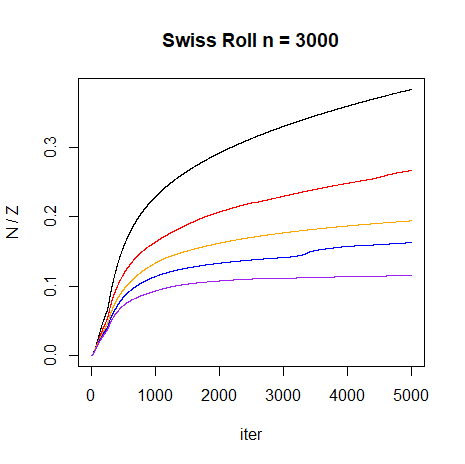

As perplexity increases, the final value of $N/Z$ decreases.

Next, some plots of how $N/Z$ evolves for perplexity 10 and perplexity 50 with 
different N. Black is for `sr1k`, red is `sr2k`, blue is `sr3k`.

|                             |                           |
:----------------------------:|:--------------------------:
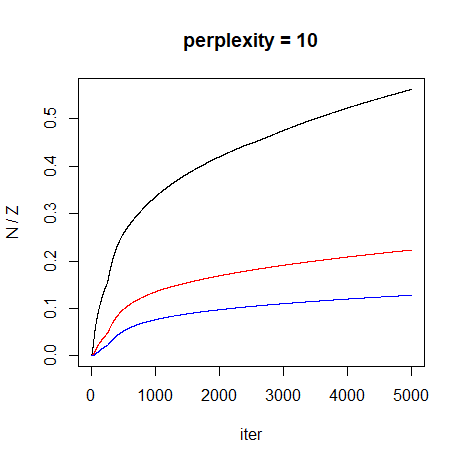|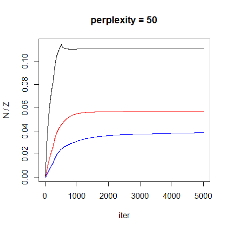

This plot shows that as $N$ increases, the final value of $N/Z$ decreases.

### Real Datasets

Here are some plots of how $1/Z$ evolves with iteration for each dataset. For
each dataset, the Laplacian Eigenmap initialization is shown in black, scaled
PCA is shown in red, random initialization is shown in blue and random
initialization with early exaggeration is in cyan.

|                              |                            |                            |
|:----------------------------:|:--------------------------:|:--------------------------:|
|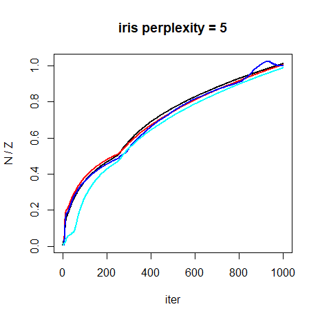|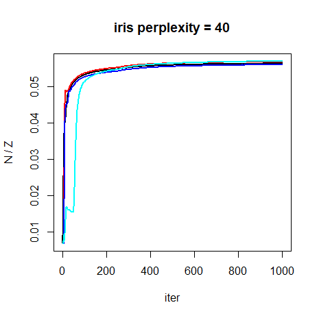|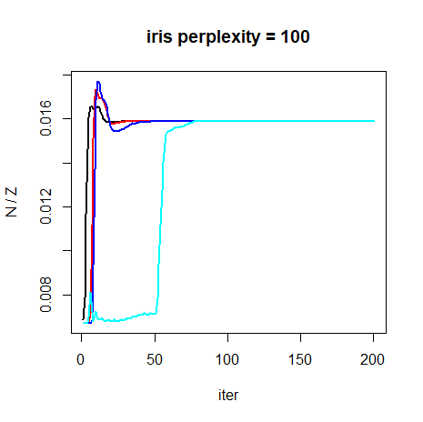|
|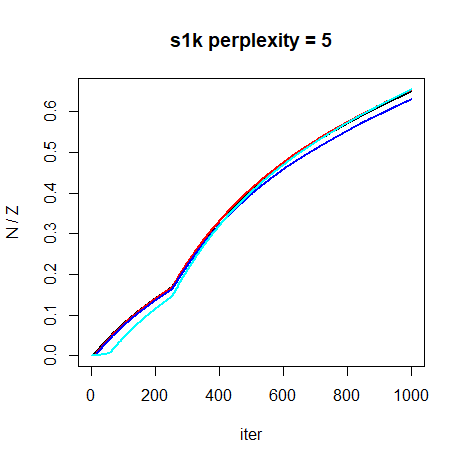|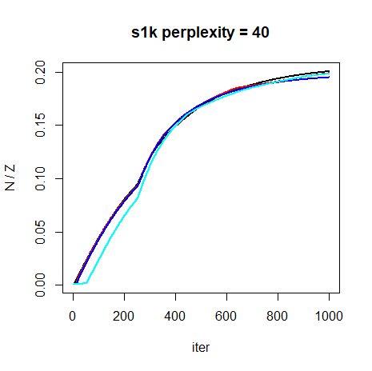|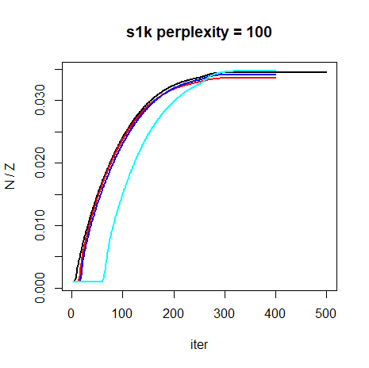|
|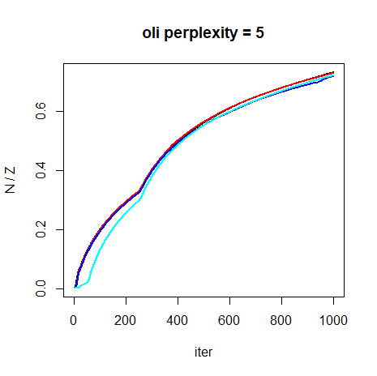|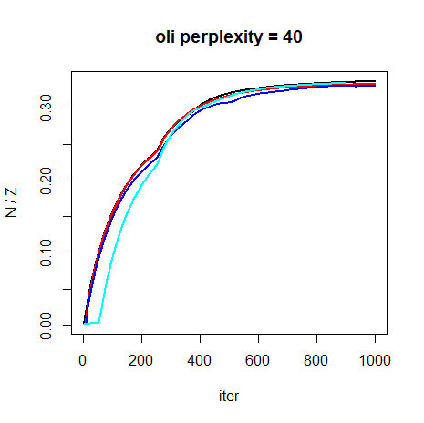|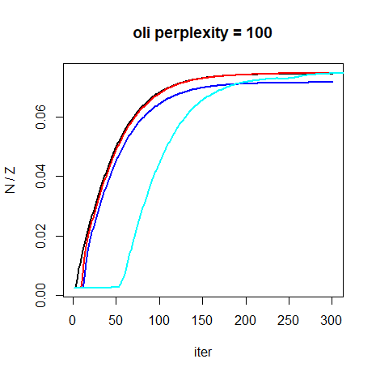|
|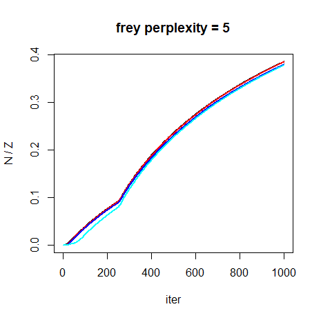|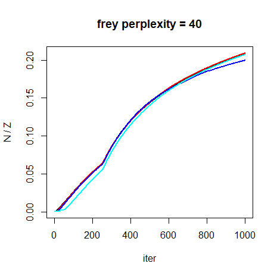|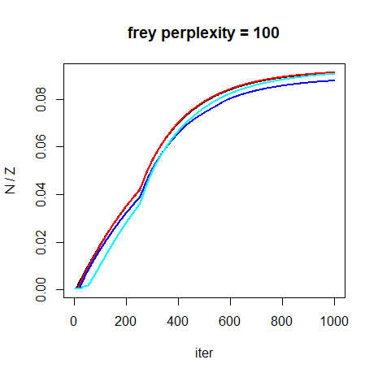|
|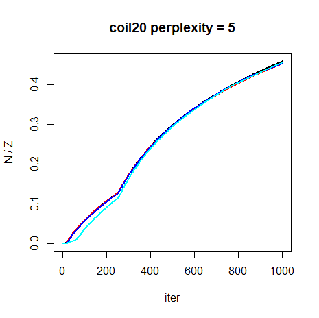|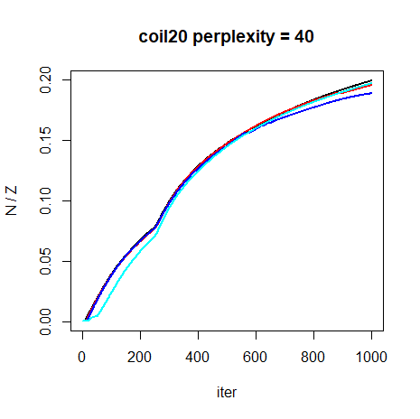|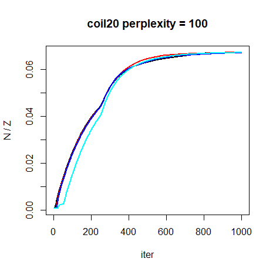|
|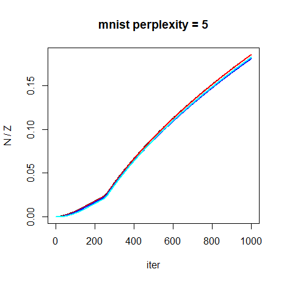|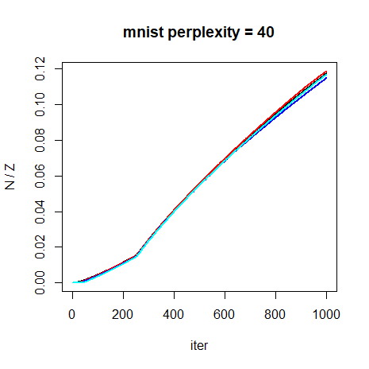|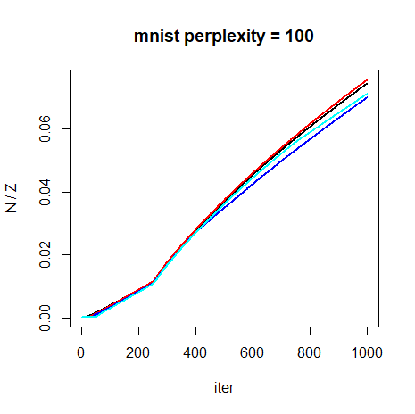|
|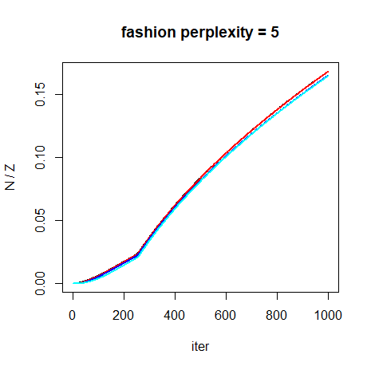|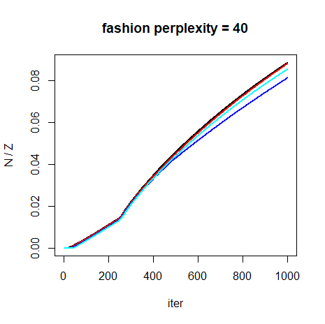|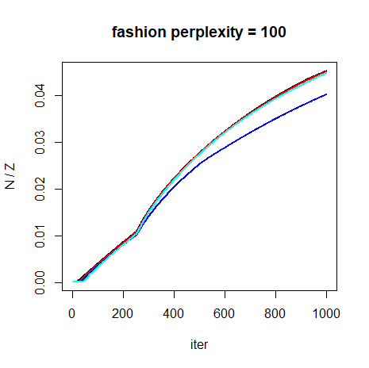|


Results seem to not depend on initialization very much. The most obvious 
difference occurs with `iris` at perplexity = 100, but the final value of $N/Z$
is still the same. In general, a steady increase in $N/Z$ is observed with
an elbow in every plot when during the transition of low to high
momentum at `mom_switch_iter = 250`.

As with the Swiss Roll results, higher perplexities lead to lower values of 
$N/Z$, and datasets with larger $N$ tend to end up with lower values of $N/Z$.
`iris` bucks this trend however.

With the standard settings (e.g. `perplexity = 40` and `max_iter = 1000`), 
here is a summary of the $N / Z$ values starting from scaled PCA results:

| dataset|N     | N / Z |
|--------|-----:|------:|
|iris    | 150  | 0.057 |
|s1k     | 1000 | 0.20  |
|oli     | 400  | 0.33  |
|frey    | 1965 | 0.21  |
|coil20  | 1440 | 0.20  |
|mnist   | 6000 | 0.12  |
|fashion | 6000 | 0.088 |

For typical t-SNE settings, we see that $N/Z$ attains values between 0.057 to
0.33. Ignoring `iris` for a moment,  the smallest dataset, `oli`, has the
largest $N/Z = 0.33$, while `mnist6k` and `fashion6k` have $N/Z = 0.12$ and $N/Z
= 0.09$, respectively. Intermediate-sized datasets `s1k`, `frey` and `coil20`
with $N$ between 1000 and 2000, have intermediate values of $N/Z$ at around 0.2.
Unfortunately, `iris` messes this all up, having the smallest $N/Z$ value
despite being the smallest dataset.

### Converged Results

*4 May 2020* From the plots above, it's clear that $N/Z$ values haven't 
leveled off by 1000 iterations for larger datasets like `mnist6k` and 
`fashion6k`, and no dataset has converged for the `perplexity = 5` results. 
I ran some very long runs with `max_iter = 100000`, `eta = 100`, `epoch = 100`,
`exaggeration_factor = 4`, `Y_init = "spca"` with `perplexity = 40` and
`perplexity = 100` to ensure that the final results were converged with the
expectation that this would be way more than enough iterations. For `perplexity
= 5`, even 100,000 iterations isn't enough to fully converge the results: the
layout doesn't really change, it just slowly expands with the cost slowly
ticking down every few thousand iterations. I assume that this is caused by the
low perplexity failing to capture any longer-range connected structure, so you
can always decrease the cost by pushing all the mini clusters away from each
other forever, so that non-neighbors get less and less probability assigned to
them.

As an alternative, for a low perplexity case I used `perplexity = 15` and only
`max_iter = 10000`. This still shows similar issues as `perplexity = 5`, and
doesn't converge with `tol = 1e-7`, but runs in a more reasonable time-frame. 


| dataset  |N     | N / Z (15) | N / Z (40) | N / Z (100) |
|----------|-----:|-----------:|-----------:|------------:|
|iris      | 150  | 2.40       | 0.057      | 0.016       |
|s1k       | 1000 | 2.14       | 0.20       | 0.035       |
|oli       | 400  | 1.69       | 0.33       | 0.075       |
|frey      | 1965 | 0.89       | 0.32       | 0.094       |
|coil20    | 1440 | 1.08       | 0.31       | 0.067       |
|mnist6k   | 6000 | 0.68       | 0.60       | 0.19        |
|fashion6k | 6000 | 0.63       | 0.29       | 0.065       |

Compared to the table above, `frey` and `coil20` were slightly under-converged,
but `mnist6k` and `fashion6k` change a lot and clearly had a lot more expansion
to do. Interestingly, `mnist6k` and `fashion6k` have quite similar values of 
$N/Z$ at low perplexity, but show very different behavior at higher perplexity.
While clearly $N/Z$ descreases with increased perplexity for all datasets, the
exact behavior seems to be very dataset dependent. For the t-EE plots below
we'll show results for multiple $\lambda$ values, with the results here used to
establish a sensible set of trial values.

## Settings

I was able to use the standard delta-bar-delta settings with t-EE, without
having to reduce `eta`, the learning rate. Therefore we will use the same
settings, I tend to use for t-SNE, based off those used in the
[original t-SNE paper](http://www.jmlr.org/papers/v9/vandermaaten08a.html),
except with scaled PCA initialization rather than random initialization and
without early exaggeration. As well as looking at `perplexity = 40`, we'll also
repeat results using `perplexity = 5` and `perplexity = 100` to look at how
t-EE performs across a practical range of perplexity values.

Example command for embedding `iris` with perplexity = `5`:

```
iris_tee_p5 <- smallvis(iris, scale = "absmax", perplexity = 5, Y_init = "spca", eta  = 100, method = list("tee", lambda = 0.05),
min_cost = -Inf)
```

Note that because the cost is not bounded by zero, you must set the `min_cost`
parameter. It's most convenient to set it to `-Inf`.

Values for `lambda` will be varied between `0.001` and `0.5`. On the plots
below, both `lambda` and the t-EE error (I-divergence style) will be shown. 
t-SNE results (with the corresponding KL divergence) with the same perplexity
and other settings are also shown for comparison.

## Results: Perplexity 5

### iris

|                             |                           |
:----------------------------:|:--------------------------:
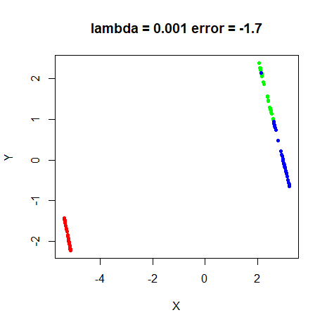|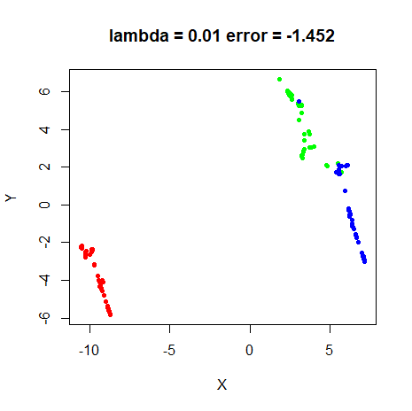
|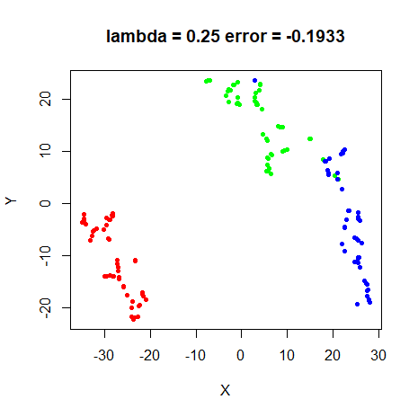
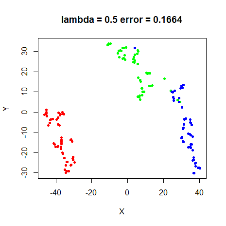|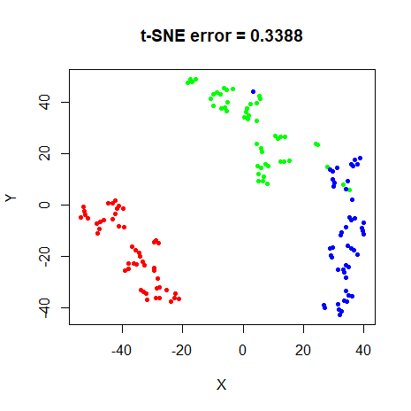

### s1k

|                             |                           |
:----------------------------:|:--------------------------:
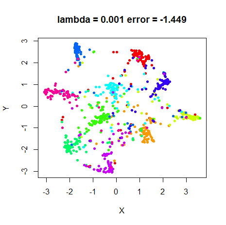|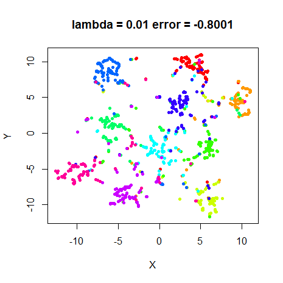
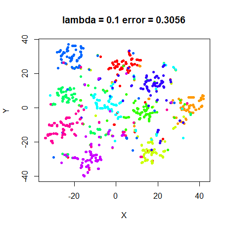|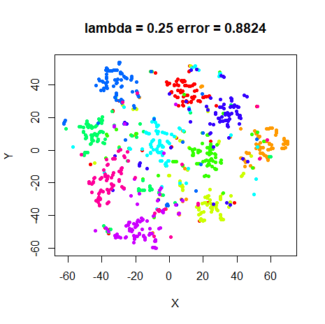
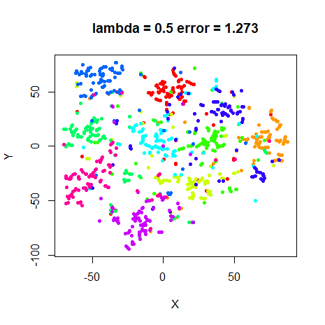|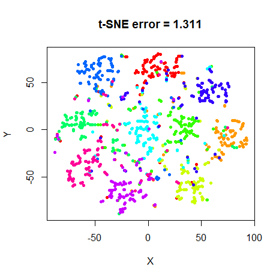

### oli

|                             |                           |
:----------------------------:|:--------------------------:
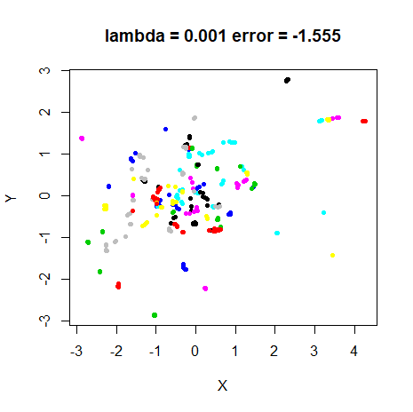|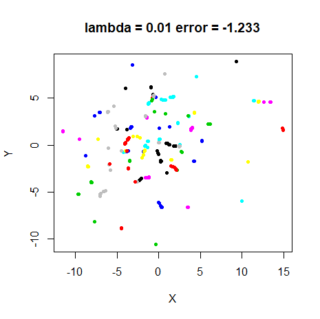
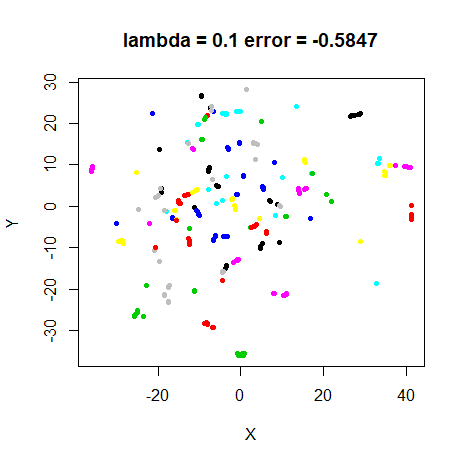|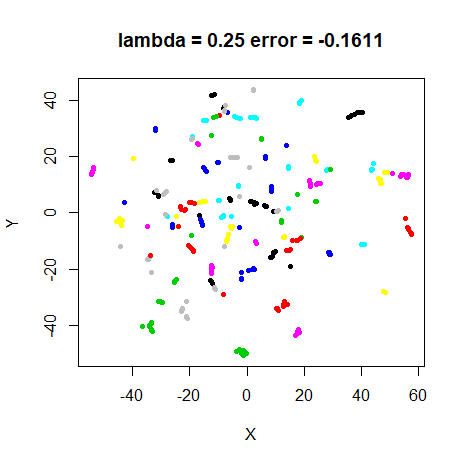
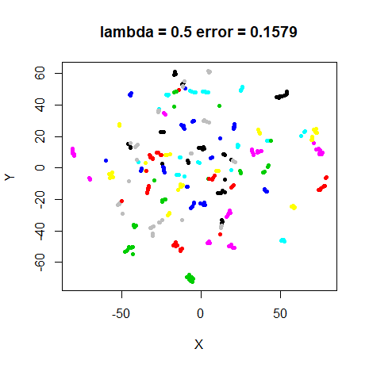|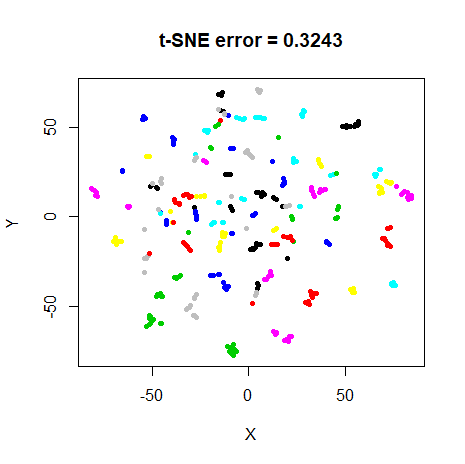

### frey

|                             |                           |
:----------------------------:|:--------------------------:
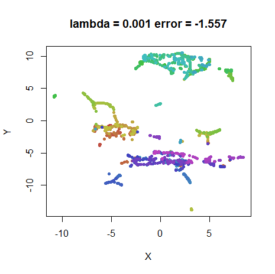|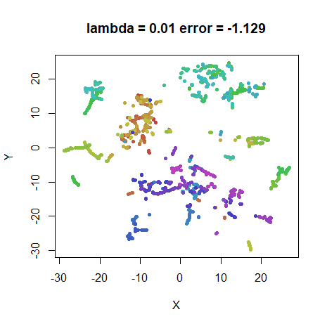
|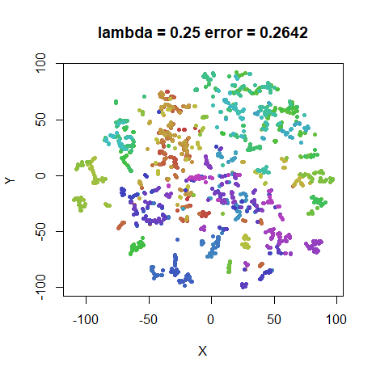
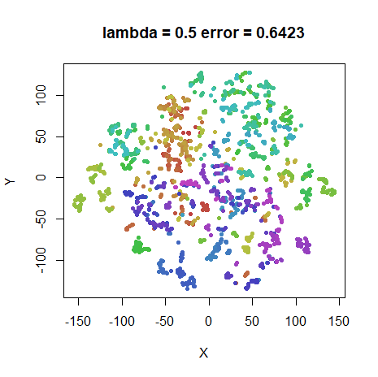|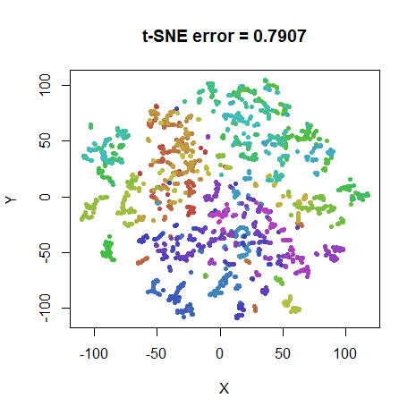


### coil20

|                             |                           |
:----------------------------:|:--------------------------:
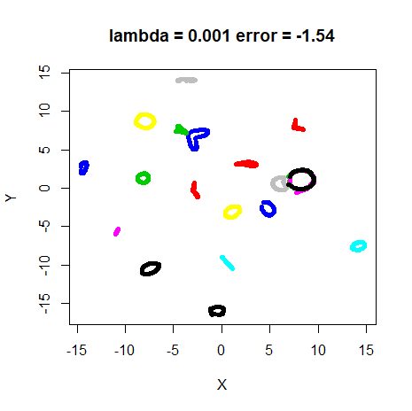|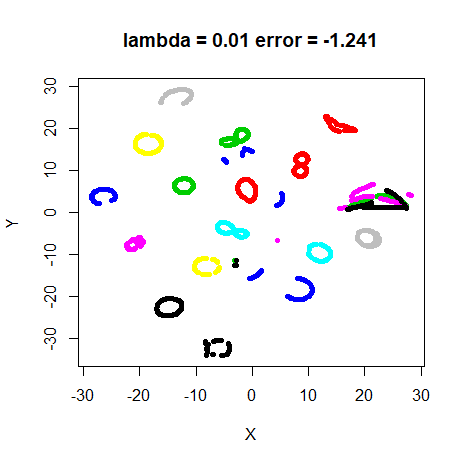
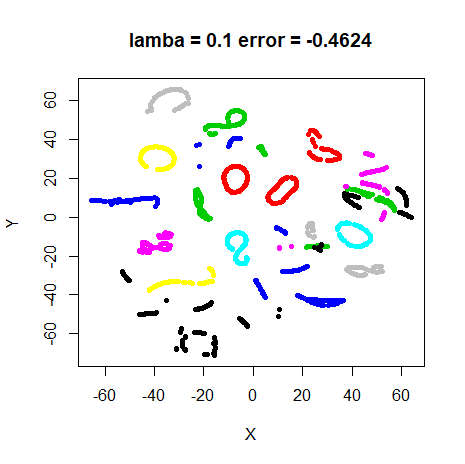|
|

### mnist

|                             |                           |
:----------------------------:|:--------------------------:
|
|
|

### fashion

|                             |                           |
:----------------------------:|:--------------------------:
|
|
|

## Results: Perplexity 40

### iris

|                             |                           |
:----------------------------:|:--------------------------:
|
|
|

### s1k

|                             |                           |
:----------------------------:|:--------------------------:
|
|
|

### oli

|                             |                           |
:----------------------------:|:--------------------------:
|
|
|

### frey

|                             |                           |
:----------------------------:|:--------------------------:
|
|
|

### coil20

|                             |                           |
:----------------------------:|:--------------------------:
|
|
|

### mnist

|                             |                           |
:----------------------------:|:--------------------------:
|
|
|

### fashion

|                             |                           |
:----------------------------:|:--------------------------:
|
|
|

## Results: Perplexity 100

### iris

|                             |                           |
:----------------------------:|:--------------------------:
|
|
|

### s1k

|                             |                           |
:----------------------------:|:--------------------------:
|
|
|

### oli

|                             |                           |
:----------------------------:|:--------------------------:
|
|
|

### frey

|                             |                           |
:----------------------------:|:--------------------------:
|
|
|

### coil20

|                             |                           |
:----------------------------:|:--------------------------:
|
|
|

### mnist

|                             |                           |
:----------------------------:|:--------------------------:
|
|
|

### fashion

|                             |                           |
:----------------------------:|:--------------------------:
|
|
|

## Conclusions

`lambda` obviously has a big effect on the result of t-EE. Too high a value and
repulsion between points dominates, with large over-expanded clusters. Low
`lambda` values have the opposite effect. For most datasets and perplexities,
there seems to be a `lambda` value such that t-EE can produce output that looks
a lot like t-SNE. For those cases, rescoring the t-EE results with the t-SNE
cost function shows that they are within a few percent (around 5%) of the t-SNE
cost.

`mnist`, and to a lesser extent, `fashion`, seem like exceptions. None of the
`lambda` values produce results that are that close to t-SNE, although results
at low values of `lambda` get a similar arrangement of clusters, but less spread
out. These visualizations might in fact be preferable to the t-SNE versions. And
in terms of mean neighbor preservation (results not shown), the best t-EE
results are comparable (within 0.02 units).

For perplexity 100, the `iris` results also don't show a layout that is very
close to the t-SNE results. It is possible to get a much better t-EE result,
by using `lambda = 0.015`. But the range of acceptable `lambda` values is quite
small. Below is the `lambda = 0.015` on the left, and next to it the result from
setting `lambda = 0.02`. The increase in `lambda` by 0.005 units has a 
noticeable effect:

|                             |                           |
:----------------------------:|:--------------------------:
|

Although in this case a finer-grained search of `lambda` found results that
looks close to the t-SNE results, I was unable to find such a value for `mnist`.
The best t-EE result, when rescored with the t-SNE cost function was still
around 20% higher than the equivalent t-SNE layout. This doesn't seem to be 
entirely a size effect, because the equivalent `fashion` dataset error is only
9%.

In terms of optimizing the neighbor preservation, the optimal `lambda` varies
with perplexity and dataset, but does show a similar inverse relationship with
perplexity as seen with the final value of $N/Z$ does in t-SNE. An optimal value
of `lambda` is around 0.1 at perplexity 5, 0.01 at perplexity 40, and around
0.05 at perplexity 100. Whether the weighted I-divergence is negative or
positive is unfortunately not a very good indicator of whether `lambda` has been
chosen correctly.

Finally, the $N/Z$ t-SNE plots suggest that, if there was a way to estimate
$Z$, you could create a version of t-EE that behaved like t-SNE, but which would
be amenable to stochastic gradient optimization. This would let it scale to
larger data sets better than Barnes-Hut t-SNE, and more like UMAP or LargeVis.

Unfortunately estimating $Z$ doesn't seem straightforward. Alternatives like
increasing $\lambda$ from $1 / N$ to some final value over the course of the
optimization might work better in practice, but as the final value would be
dataset and perplexity dependent, some efficient way of monitoring of the
current state of the solution is needed. If there was a way to do this that
could make use of the data already sampled by the approaches of UMAP and
LargeVis, even an approximate version of t-SNE would be attractive.

As it is, t-EE in its current state could be made much faster by applying the
same sampling and optimization used by LargeVis and UMAP, but requires a choice
of $\lambda$, just like the functionally equivalent $\gamma$ in LargeVis. As
UMAP doesn't even have such a free parameter and seems to perform as well as
LargeVis, there's probably not a great need for a stochastic gradient version of
t-EE, given that it is so similar to LargeVis and provides no advantages over it
or UMAP, unless a solid heuristic for choosing $\lambda$ emerges.

## Addendum: Homotopy Method

*April 14 2020*: Dmitry Kobak suggested to me that the horrible results we see
with large values of $\lambda$ are due to the lack of early exaggeration, and
that we can simulate that by running the optimization with a small value of
$\lambda$ initially. To test this, I have run a series of t-EE optimizations, 
starting at `lambda = 0.001` with sPCA initialization, then running at 
progressively higher values of `lambda` using the final configuration of the
previous run as the initial coordinates for the new run. The values of `lambda`
I used were `c(0.001, 0.005, 0.01, 0.05, 0.1, 0.5, 1)` and I gave each run 
1000 iterations to try and remove any convergence issues.

*May 1 2020*: It turns out that 1000 iterations per value of `lambda` isn't
enough, so I increased the total number of iterations available over all 7
runs to 50,000. Most datasets don't come close to needing that number, except
`mnist6k` and `fashion6k`. This is definitely not a practical approach I would
recommend.

Results with up to 7,000 iterations are on the left. Results with the 50,000
iterations are on the right.

### iris

|                             |                           |
:----------------------------:|:--------------------------:
|

### s1k

|                             |                           |
:----------------------------:|:--------------------------:
|

### oli

|                             |                           |
:----------------------------:|:--------------------------:
|

### frey

|                             |                           |
:----------------------------:|:--------------------------:
|

### coil20

|                             |                           |
:----------------------------:|:--------------------------:
|

### mnist6k

|                             |                           |
:----------------------------:|:--------------------------:
|

### fashion6k

|                             |                           |
:----------------------------:|:--------------------------:
|

Both of these are much nicer looking, although the left-hand images, which only
allow for 7,000 iterations are clearly over-expanded in the case of `mnist6k`
and `fashion6k`, which means they weren't given long enough to optimize. The
right hand images, which use up to 50,000 iterations, show results that don't
look very different from t-SNE (if anything, less expanded).

To prove that starting with a low value of `lambda` is important, here are the
`mnist6k` results starting from `lambda = 1` directly and using up to 7,000
iterations (left-hand image) and 50,000 iterations (right-hand image, this one
converged after 38,100 iterations):

|                             |                           |
:----------------------------:|:--------------------------:
||

Still visually bad and with a higher final cost compared to the annealed-lambda
results in both cases.

### mnist6k as $\lambda$ increases

And to get a sense of how changing `lambda` affects the visualization, here are
some images of `mnist6k` at the end of each optimization within the homotopy 
loop, for values of `lambda` between 0.001 and 1, and then with `lambda = 5`
(initialized from the results of `lambda = 1`) to fill out the space (and to
see if anything interesting happens when the repulsion is up-weighted).

|                             |                           |
:----------------------------:|:--------------------------:
|
|
|
|

In terms of the overall shape of the layout, there's not much happening once
$\lambda$ increases beyond about 0.01. What *does* happen is that the absolute
size of the distances between points increases as can be seen by the ranges of
the axes.

I initialized a t-SNE optimization from the `lambda = 0.05` result. It took a
very long time to converge (20,500 iterations) and looks exceptionally like the
t-EE result with `lambda = 0.5`. Its final value of $N/Z = 0.61$ means that it
effectively got to `lambda = 0.6`, so that's not too surprising. It's also very
close to the converged $N/Z$ t-SNE result starting from scaled PCA with early
exaggeration.

Perhaps there are other, more interesting layouts that are available with larger
`lambda` using a different initialization scheme, but for the results here, it
looks like you can get more compressed, more UMAP/LargeVis-like results with a
smaller `lambda`. Above a certain value, you are stuck with something very
t-SNE-like.

I have looked at increasing `lambda` further to 10, 50 and 100. At this point,
we start running into two problems: first, the choice of `eta = 100` which works
for low values of `lambda` is inappropriately small. `eta = 10000` or even 
`eta = 100000` becomes more useful. Having the learning rate too low doesn't 
just slow the optimization down, it also prematurely converges because changes
to the cost function become small even though the data layout is changing so the
typical `tol = 1e-7` which works for t-SNE needs to be lowered to around `1e-9`.
The size of the gradient drops by an order of magnitude even when the cost is
reduced by around only 0.1%, so the `g2tol` tolerance is more reliable here
(somewhere in the range of `g2tol = 1e-7`). This means that you need to be
careful about ensuring that layouts with high repulsion (compared to t-SNE) are
actually at a minimum.

If you do crank up the learning rate for these settings, the results end up
looking like the ones for lower values of `lambda`, so there doesn't seem to be
anything to be gained from looking at large values of `lambda` for t-EE.

Conclusion: Dmitry is correct. Early exaggeration-like settings seem to be
important for getting good results in t-EE. It should be pointed out here that
this is exactly the "homotopy method" that is advocated in the 
[elastic embedding (PDF)](http://faculty.ucmerced.edu/mcarreira-perpinan/papers/icml10.pdf)
paper, so I only have myself to blame for not following this established advice.
I don't know if the connection between early exaggeration in t-SNE and the 
homotopy method is established elsewhere.

As usual, un-normalized methods prove to be time-consuming to optimize using
the initialization and optimization methods that work well for t-SNE. If a
method has a way to balance attractive and repulsive interactions (as t-EE
does), difficulty optimizing may be a sign that some re-balancing would help.

Up: [Documentation Home](https://jlmelville.github.io/smallvis/).
