Up: [Documentation Home](https://jlmelville.github.io/smallvis/).

[How to Use t-SNE Effectively](https://distill.pub/2016/misread-tsne/) runs 
through a lot of considerations in interpreting a t-SNE plot. Section 3 is 
particularly interesting to me because it presents a deceptively simple 
synthetic dataset of three homogeneous 2D Gaussian clusters of equal size (50 
points each), arranged linearly, with the difference between cluster 2 and 3 
being 5 times larger away than that of cluster 1 and 2. 

Despite this simplicity, results at larger perplexities (50 and 100), which
reproducing the relative distances between clusters, show some distortions of
the clusters themselves. When the size of the clusters are increased from 50
to 200, none of the trial perplexities can reproduce the global structure
of the data.

This dataset seems perfect for messing about with in `smallvis`. What follows
attempts to replicate the results of the distill page and then tries some
other methods.

## Datasets

The [snedata](https://github.com/jlmelville/snedata) package can generate all
the data used on the distill page. For the three clusters:

```
threec_50 <- snedata::three_clusters_data(n = 50, dim = 2)
threec_200 <- snedata::three_clusters_data(n = 200, dim = 2)
```

## Settings

Settings are based on those used on the distill page. The only difference is
that initialization will use the option which is entirely deterministic and
seems to [work fine](https://jlmelville.github.io/smallvis/init.html). Some
results will end up looking a bit better than the distill results because the
scaled PCA result will be reasonably close to the PCA result, which perfectly
reproduce the distances in the dataset. This mainly affects the low perplexity
results, which focus on local distances over global ones, so starting from a
PCA-like initialization is very helpful here.

Here's an example:
```
threec_200_tsne_p2 <- smallvis(threec_200, scale = FALSE, perplexity = 2, Y_init = "spca", method = "tsne", eta = 10, max_iter = 5000, exaggeration_factor = 4, stop_lying_iter = 150)
```

## Results

### 50 points per cluster

|                             |                           |
:----------------------------:|:--------------------------:
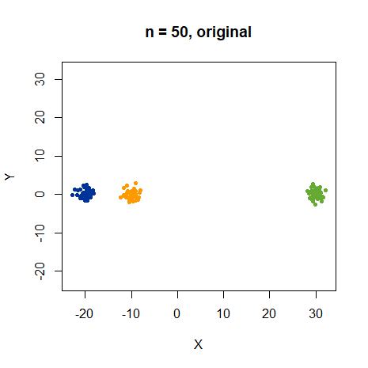|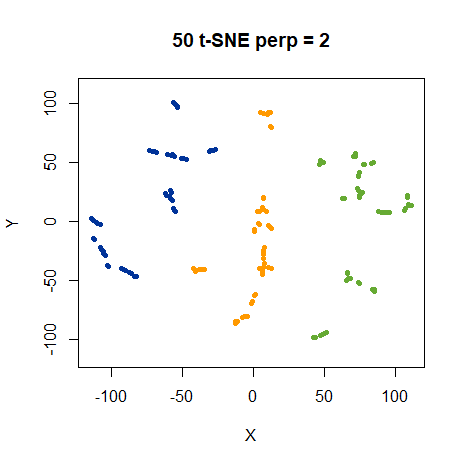
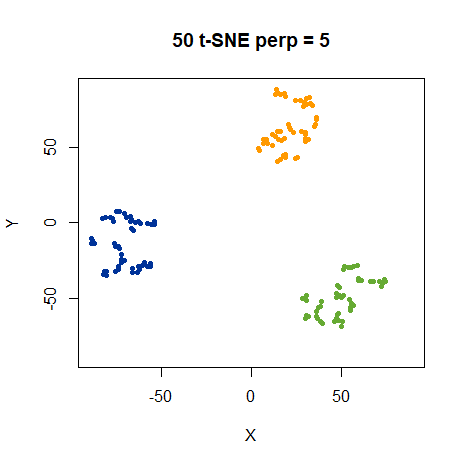|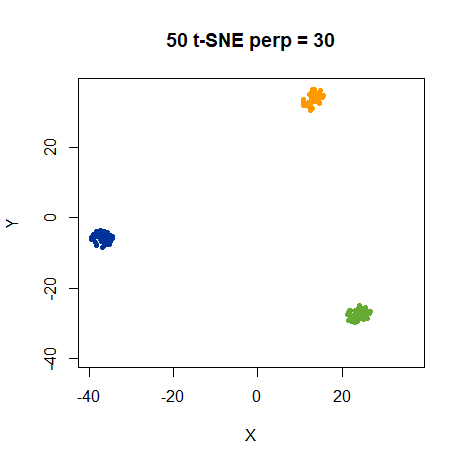
|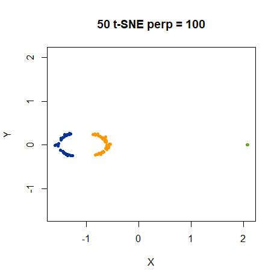

These results reproduce the distill results pretty well, which is a relief.
At low perplexities, the relative distances of the clusters are not reproduced,
which makes sense given that we are emphasizing local structure. At high
perplexities, the clustering is more obvious, but the green cluster is shown
as being smaller than the other two, which in turn take up odd cresent
shapes at a perplexity of 100. All this is present in the distill results too.

Next, let's look at the 200 points per cluster with the same perplexities.

### 200 points per cluster

|                             |                           |
:----------------------------:|:--------------------------:
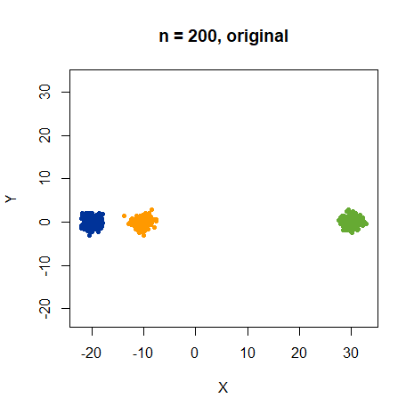|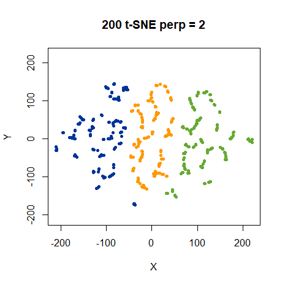
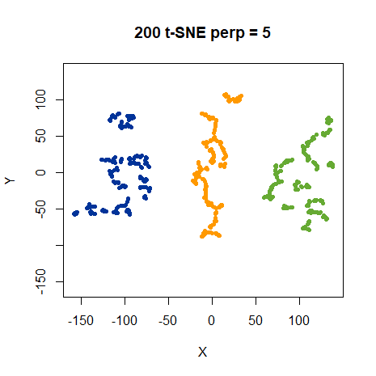|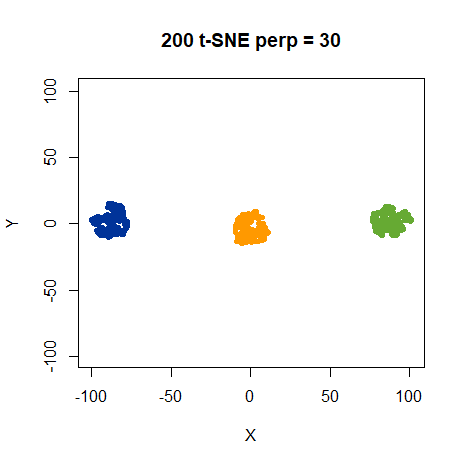
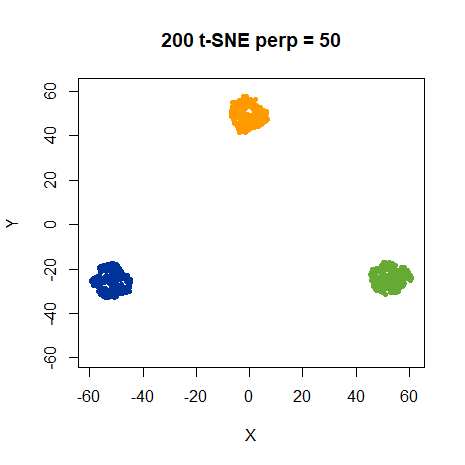|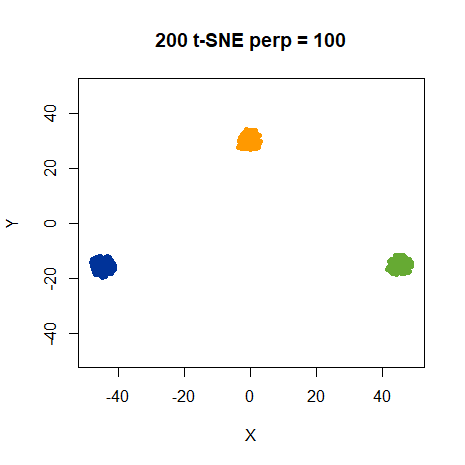

We do indeed get the same results. 

Let's also try and find a suitable perplexity for this dataset. To my mind the
obvious thing to do is look at perplexities of 200 and 400, which, if you
interpret perplexity as being akin to the number of nearest neighbors, should
give equivalent results for this larger dataset as using a perplexity of 50 and 
100, respectively with the smaller dataset.

|                             |                           |
:----------------------------:|:--------------------------:
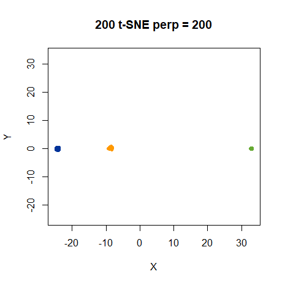|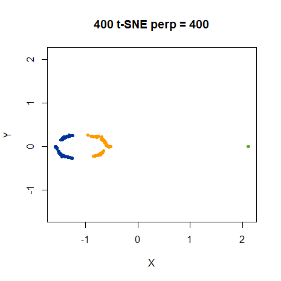

There we go. Increasing the perplexity beyond 100 in this case does allow for a
"good" result to be obtained. For this dataset, setting the perplexity to the
cluster size works. The point of this part of the distill article remains,
however, which is "It's bad news that seeing global geometry requires
fine-tuning perplexity".

As the results so far seem to be pretty much the same whether we use 50 or 200
points, we'll stick with 50 points for faster optimization for the rest of the
discussion.

What could be causing the distortions of the geometry at higher perplexity? I
came up with two possibilities. First, given the dataset is only two
dimensional, the distance-stretching used by the t-distribution in t-SNE is too
strong for this dataset. Second, each Gaussian in the input kernel has its own
bandwidth. But in the output space, we assume uniform "bandwidths" for the
t-distributions.

## ASNE and SSNE

For the first possibility, we can check wheter the t-distribution output kernel
is responsible by swapping from t-SNE to SSNE or ASNE, which use Gaussians (with
uniform bandwidths) in the output kernel. 

First, let's look at SSNE, which only differs from t-SNE in the output kernel
definition.

|                             |                           |
:----------------------------:|:--------------------------:
|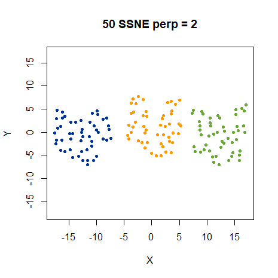
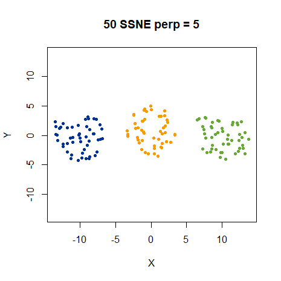|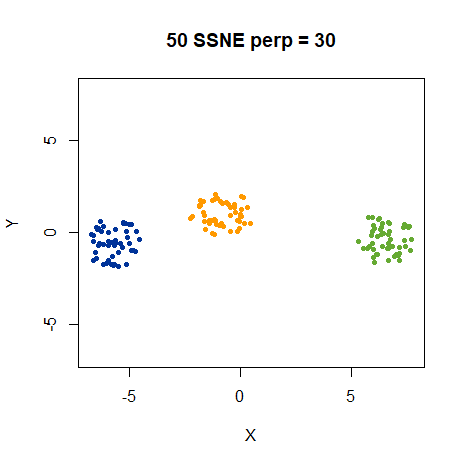
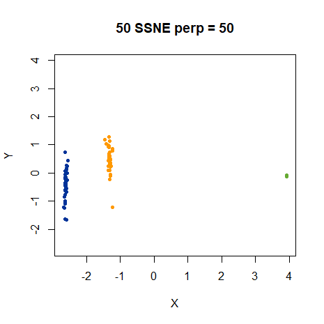|

SSNE certainly reproduces the local structure better at low perplexities, 
although the clusters are a little irregularly shaped. The
difference in relative distances between clusters is not present, but the 
overall globular shape of the clusters is much more obvious.

At perplexity 50, the apparent size difference between the green cluster and the
other is still present, and in fact magnified. The blue and yellow clusters are
now noticeably elongated, which wasn't the case with t-SNE. This pattern is
maintained at perplexity 100 with some minor changes.

SSNE and t-SNE both have a slightly more complicated normalization procedure
than ASNE. While 
[it doesn't seem to have any major effect on real datasets](https://jlmelville.github.io/smallvis/sne.html),
let's see if the extra symmetrization and normalization step is responsible for 
any distortion, by running ASNE on this data:

|                             |                           |
:----------------------------:|:--------------------------:
|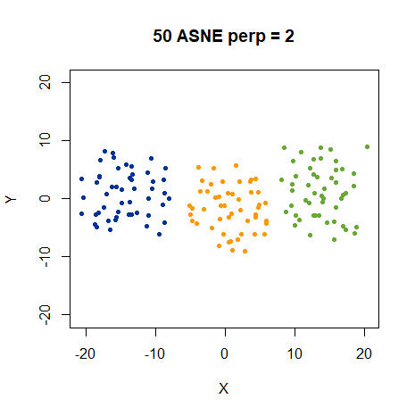
|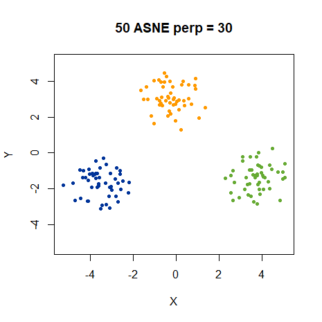
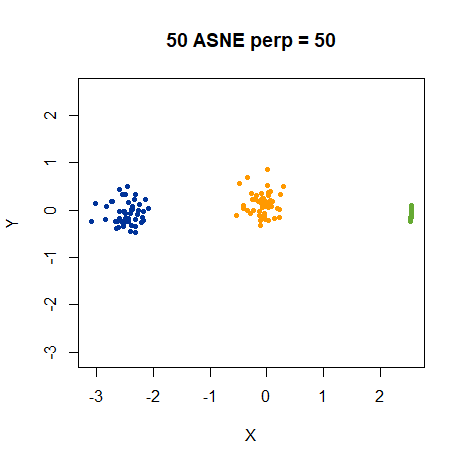|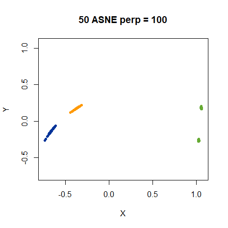

Low perplexity results seem less distorted than the SSNE, albeit marginally.
However, the weirdness sets in at perplexity 50 again. At least the blue and yellow
clusters are less distorted, although the green cluster still becomes tiny.
At perplexity 100, the relative distances are more apparent. The yellow and blue
cluster show the same elongation and relative orientation at SSNE, but seem 
slightly cleaner. Meanwhile, the green cluster has split into two!

So the t-distribution is certainly having an effect. At low perplexity, ASNE
represents the data better. But the high perplexity results certainly aren't
an improvement.

To complete the confusion, here are the t-ASNE results (i.e. using the 
t-distribution in the output kernel but using ASNE normalization):

|                             |                           |
:----------------------------:|:--------------------------:
|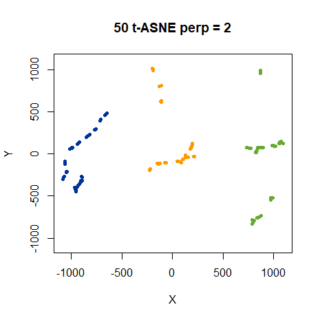
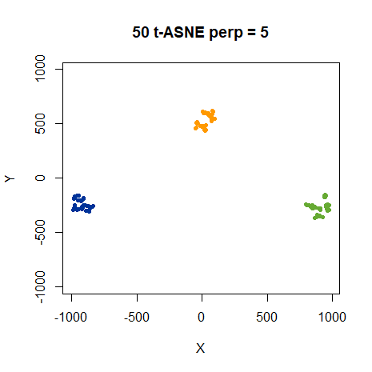|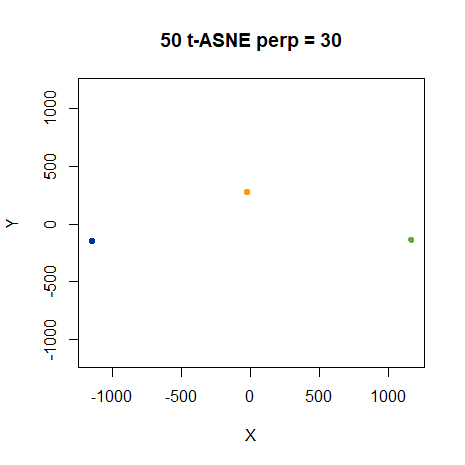
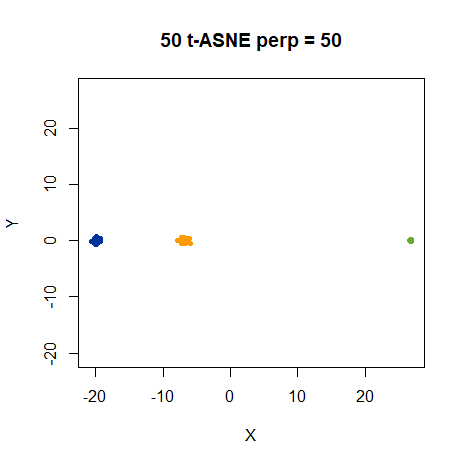|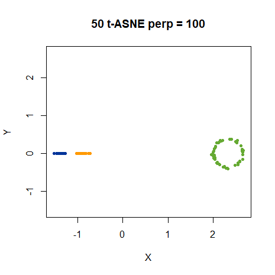

Up until perplexity 100, this was all going so expectedly, that I wouldn't have
included these results. The perplexity 100 results are quite suprising. I 
wouldn't have predicted the green cluster suddenly becoming huge and circular
from any of the previous results, that's for sure.

Let's agree that using gaussian functions improves the low perplexity results a
bit, but doesn't help us understand what's going on at high perplexity. Exactly
what's going on there has not been clarified at all with these new results.

## SNE with bandwidths

Onto the second avenue of our inquiries: would including bandwidths in the
output kernel function help? This is a good idea in principle, because it's 
widely recognized that the perplexity-based calibration is a vital part of
getting good input weights: see, for example, the 
[entropic affinities](http://jmlr.org/proceedings/papers/v28/vladymyrov13.html) paper.

In practice, transferring the bandwidths to the output kernel in a way that
makes sense is fraught with difficulty. Should we transfer the bandwidths as-is
from the high-dimension to the low-dimension? Part of the reason we need to go
to the trouble of t-SNE over simpler efforts like Sammon Mapping is because of
the differences in ways low- and high-dimensional data is distributed. Things
get even more muddy if we're using a t-distribution in the output kernel.
In this case, though, we're in luck because the input and the output spaces have
the same dimensionality, and therefore if we use ASNE with bandwidths we should
be able to reproduce the input probability perfectly.

We'll mark the SNE methods that use bandwidths in the output functions with a
leading 'B', e.g. ASNE with bandwidths is "BASNE". Using bandwidths in this way
means that the output weight matrix is no longer symmetric. This doesn't matter
for ASNE and t-ASNE, but for SSNE and t-SNE, so we'll look at them first.

It turns out ASNE with bandwidths is a pain to optimize with DBD at low perplexity, requiring a
very low learning rate (`eta = 1e-7`). I double-checked these results with some
L-BFGS optimizations. Despite my misgivings about
[using L-BFGS with t-SNE on typical datasets](https://jlmelville.github.io/smallvis/opt.html), 
for this fairly simple synthetic dataset it should work well. The DBD and
L-BFGS results are in decent agreement visually (given the very local nature of
the perplexity settings, there are plenty of equivalent configurations).

```
threeclust_basne_lbfgs <- smallvis(threec_50, scale = FALSE, perplexity = 2, Y_init = "spca", method = "basne", 
opt = list("L-BFGS", ls_max_alpha = 1), max_iter = 100000)
```

### BASNE

|                             |                           |
:----------------------------:|:--------------------------:
|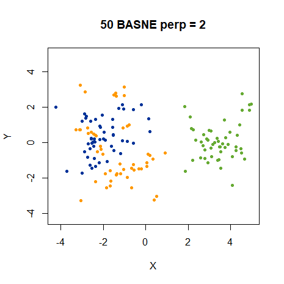
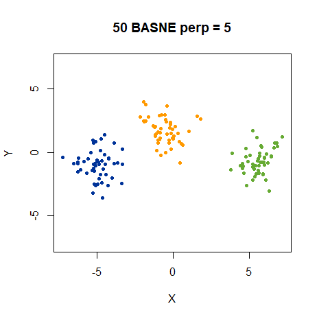|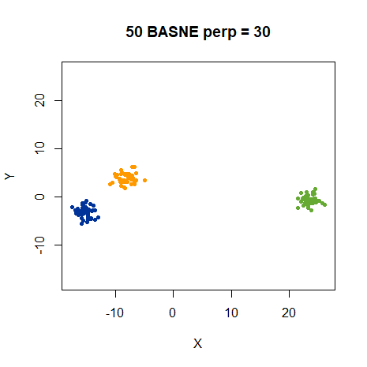
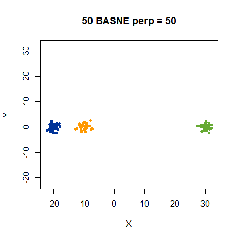|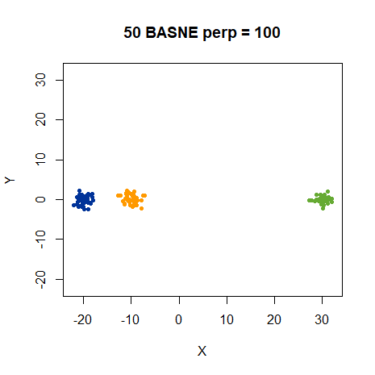

Amidst the sea of apparently identical results, here is the one combination 
that gives sensible results with a perplexity of 100. In fact, it gives the
right result for pretty much any perplexity.

### Bt-ASNE

|                             |                           |
:----------------------------:|:--------------------------:
|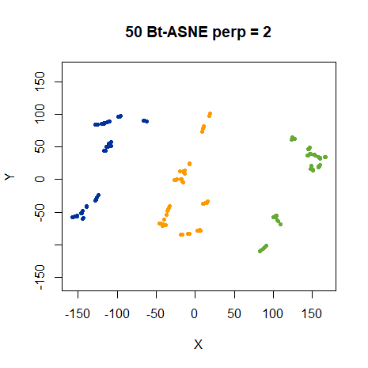
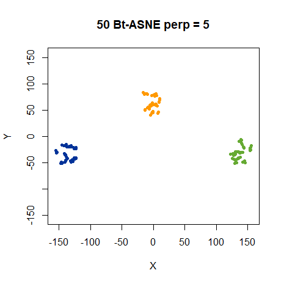|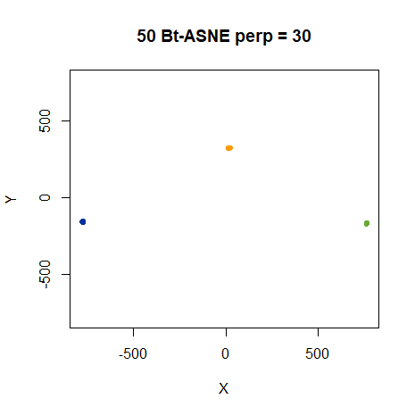
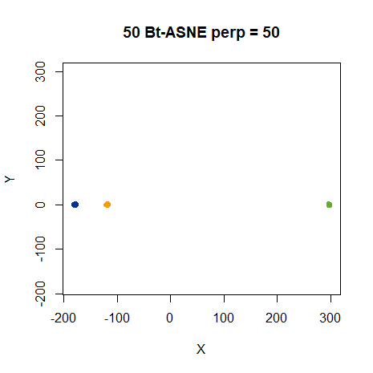|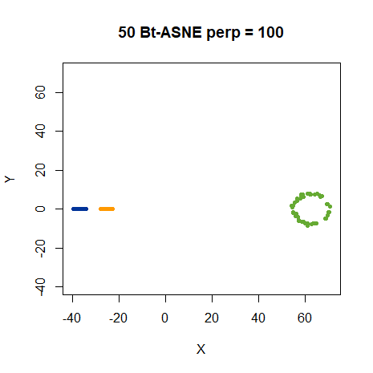

But no improvement to the t-ASNE results can be seen by using bandwidths.

Conceptually, adding bandwidths to t-SNE and SSNE is a bit messier than for ASNE.
The resulting output probability matrix, $Q$, is no longer symmetric. This requires
a slight change to the gradient calculation and means we're trying to match a
symmetrized input probability to an unsymmetrize output probability. 

Also, because we don't go through the same normalization procedure as we do in
the input space, the connection between the calibrated bandwidths and the final
probability we're trying to reproduce is more tenuous. On the other hand, the
process of creating symmetrized probability matrices is already different
between the input and output probabilities in t-SNE and SSNE, and under the
initialization conditions we look at here, the symmetrization procedure
[doesn't seem to have much effect on results](https://jlmelville.github.io/smallvis/norm.html).
So we might as well see what happens:

### BSSNE

|                             |                           |
:----------------------------:|:--------------------------:
|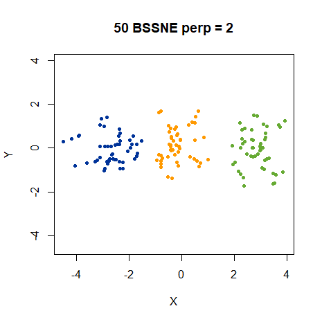
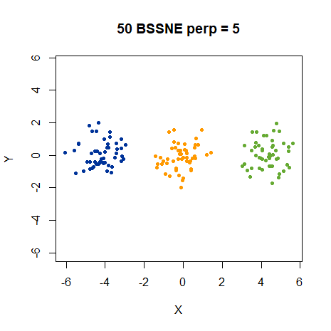|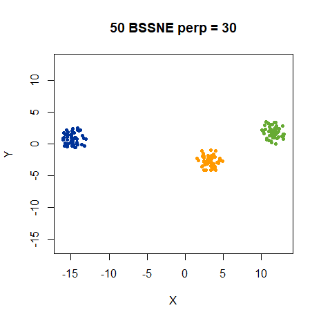
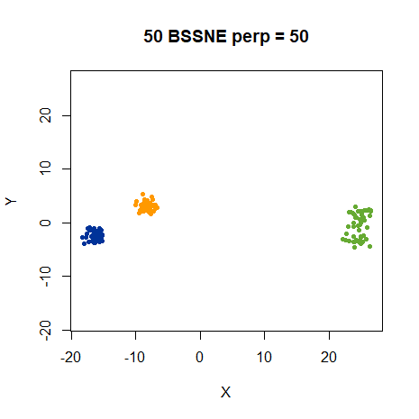|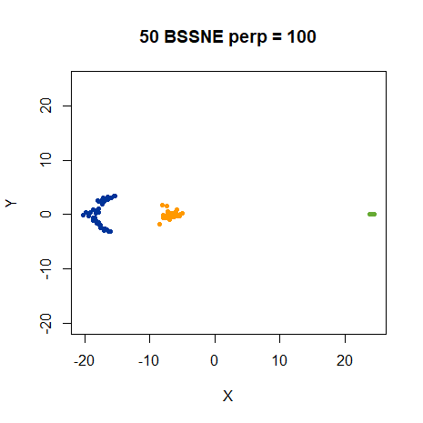

Not much of interest here...

### Bt-SNE

|                             |                           |
:----------------------------:|:--------------------------:
|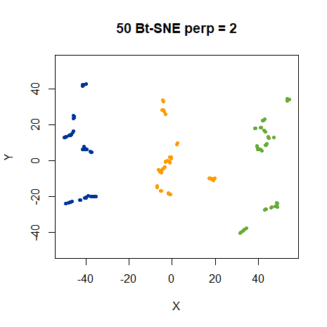
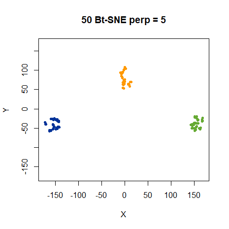|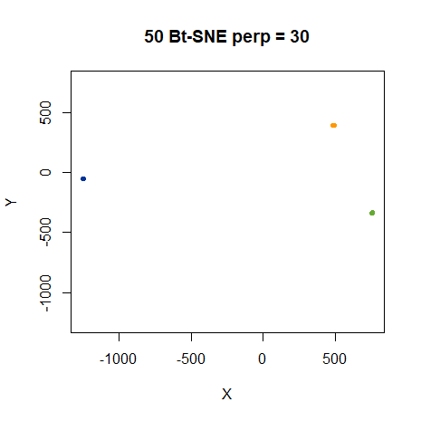
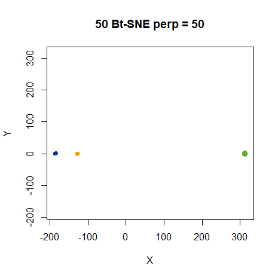|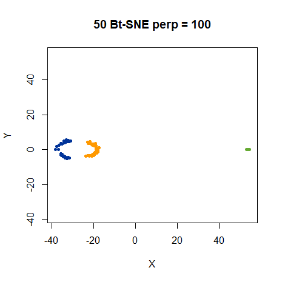

...or here.

## 10D Gaussians

The default results on the distill page show results for 2D Gaussians. Most
datasets are higher dimensional, so do the results hold up in that case?
Results can be generated *in situ* on the distill page up to 50 dimensions and
don't seem very different. Using 10D Gaussians, the first 2 PCA components
recovers 99% of the variance. This strongly suggests that the dataset is
effectively two dimensional due to the inter-cluster distances between the green
cluster and the other two. So we shouldn't expect to see much difference between
a 2D and 10D Gaussian result. And that's just what we see for all the other
methods as well as t-SNE, to the extent that there is no point even showing the
results. 

Most importantly, BASNE with 200 points per cluster with 10 dimensions, still
gives the desired results even at a "high" perplexity of 400 or 500: the three
clusters are of equal size, shapes are undistorted, and the relative distances
are correctly reproduced. This happens even starting from random
initializations, rather than the easier scaled PCA starting point.

## Conclusions

What did we learn here? We *can* get good results on the three clusters dataset
with a variety of perplexities if we choose the correct output distance kernel
and take into account the bandwidths from the input space, and this generalizes
to both the small and large dataset and to 2D and 10D Gaussians. If either the
bandwidths aren't accounted for or the kernel function doesn't stretch the
output space appropriately, you will see distortions for larger perplexities.
Unfortunately, these results aren't very generalizable to other datasets. If the
input data isn't two-dimensional, the bandwidths we obtain from the calibration
will need modifying in some way. It's not obvious how to go about doing that.

A different approach is to think about allowing the perplexity to change
for different parts of the dataset, an idea that is also floated in the distill
article, although without any suggestions as to how go about it. Even if that's
done, it's not totally clear to me what problem you are solving here: is the
problem that one perplexity doesn't suit all clusters in a dataset or is it
fundamentally about the wrong output function and bandwidth selection? As usual
I leave you with questions and no answers.

Up: [Documentation Home](https://jlmelville.github.io/smallvis/).
