[UMAP](https://github.com/lmcinnes/umap) 
(Uniform Manifold Approximation and Projection) is a dimensionality reduction
method based on reducing the cross-entropy between two fuzzy sets. There's no
official publication on it yet, but from the point of view of the nuts and bolts
of the computation, you can work out a fair amount from the source code. To take
a broad view, it's definitely in the t-SNE family of dimensionality reduction,
but with a different theoretical underpinning, and the implementation itself
is similar to LargeVis in how it scales to large datasets.

More details on the cost function and resulting gradient can be read on the
[theory](https://jlmelville.github.io/smallvis/theory.html) page. What makes
UMAP (and LargeVis) of specific interest is that, unlike t-SNE, it doesn't 
require a normalization step to convert affinities to probabilities. This is
in fact the key to its superior scaling to very large datasets, compared to
Barnes-Hut t-SNE. The reason that this lack of normalization is important is
because normalization has been suggested as being one of the properties that
leads to the superior performance of t-SNE over other methods (see, for example,
this 
[perspective by Lee and Verleysen](http://dx.doi.org/10.1109/CIDM.2014.7008663)).
If UMAP can do well without normalization, this suggests that normalization 
isn't quite as important as might be thought.

Initial experiments suggested that UMAP was noticeably more difficult to 
optimize with the delta-bar-delta optimization method that with t-SNE. However,
L-BFGS with perplexity stepping seemes like a robust alternative, based on
[a comparison with DBD for t-SNE optimization](https://jlmelville.github.io/smallvis/opt.html).

As there is much less information around on optimizing UMAP compared to t-SNE,
To make sure UMAP results shown are definitely converged, we're going to double
the number of iterations compared to the t-SNE example.

## Variations on UMAP

### t-UMAP

The UMAP gradient contains some extra terms compared to the t-SNE version that
make it more expensive to calculate. But we can simplify matters considerably by
adopting the t-SNE weighting function: the Cauchy distribution, which arises
naturally in UMAP by setting the `a` and `b` parameters of its weighting
function to `1`.

### Normalized t-UMAP

A further modification of t-UMAP, that normalizes both the input and output
affinities in the style of t-SNE. I have no theoretical justification for 
doing this, but I was curious to see the effect of normalization on both
the results and the ease of optimization was.

## Datasets

See the [Datasets](https://jlmelville.github.io/smallvis/datasets.html) page.

## Settings

An example invocation is given below for generating the t-UMAP results for 
`iris`:

```
iris_tumap <- smallvis_perpstep(step_iter = 500, X = iris, method = "tumap", scale = FALSE, verbose = TRUE, Y_init = "spca", ret_extra = c("DX", "DY"), perplexity = 40, max_iter = 2000, opt = list("l-bfgs", step_tol = 1e-6))
```

The `gr_eps` parameter was set to `0.1`, the value used in LargeVis, which gives
slightly better results than the UMAP default of `0.001`. When used with UMAP, 
the `perplexity` setting is interpreted as the value of `k` to use in the
smooth k-nearest-neighbor calibration.

## Evaluation

For each initializaion, the mean neighbor preservation of the
40 nearest neighbors, calculated using the 
[quadra](https://github.com/jlmelville/quadra) package: for each point the 40
nearest neighbors are calculated in the input and output space, and the fraction
of neighbors in common is recorded (0 means no neighbors are in common, 1 means
all the neighbors were preserved). The number reported is the mean average over
all results and is labelled as `mnp@40` in the plots. 40 was chosen for these
results to match the `perplexity`.

## Results

For each dataset, four results are shown. The first row shows UMAP and t-UMAP
on the left and right, repectively. On the second row is normalized t-UMAP
and t-SNE results.

### Iris

| |
:-------|:-------------------:|
|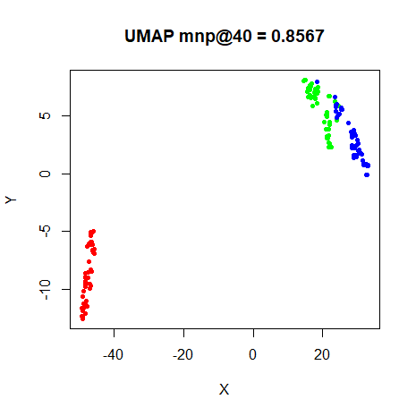|
|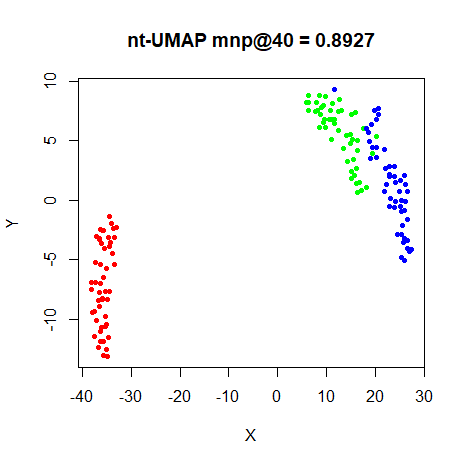|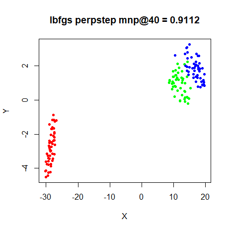

### s1k

| |
:-------|:-------------------:|
|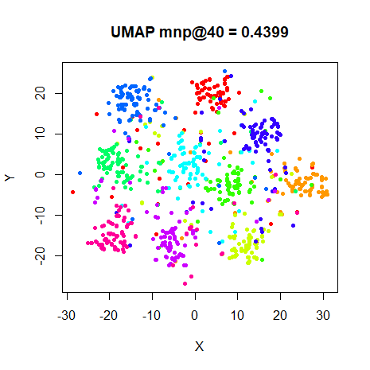|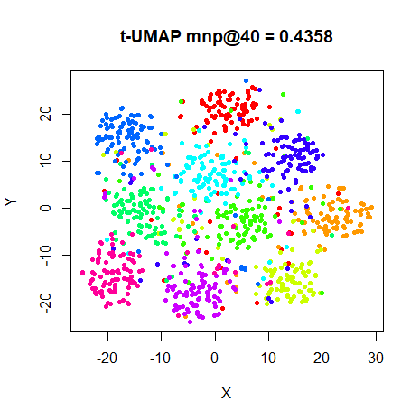
|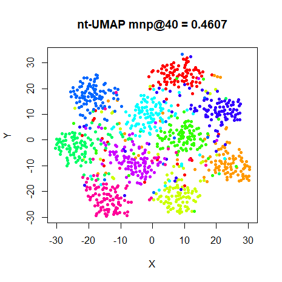|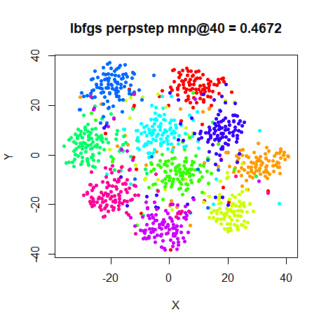


### Olivetti Faces

| |
:-------|:-------------------:|
|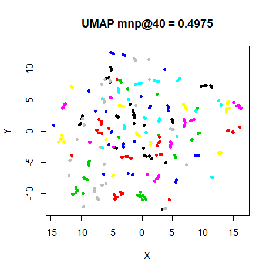|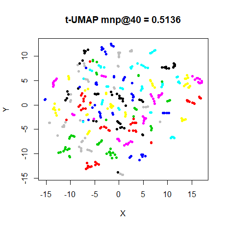
|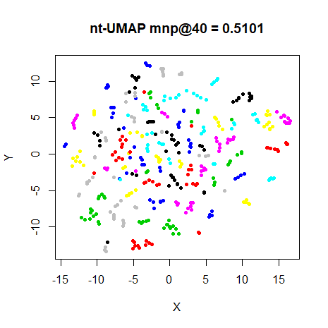|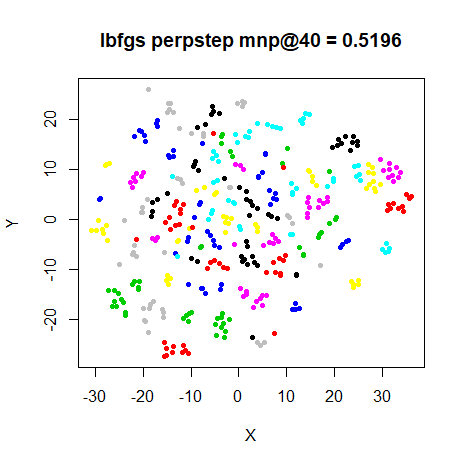


### Frey Faces

| |
:-------|:-------------------:|
|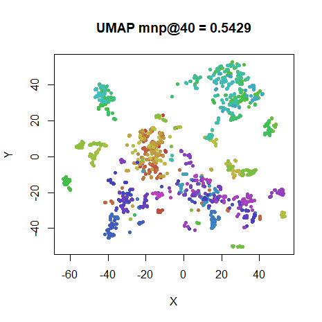|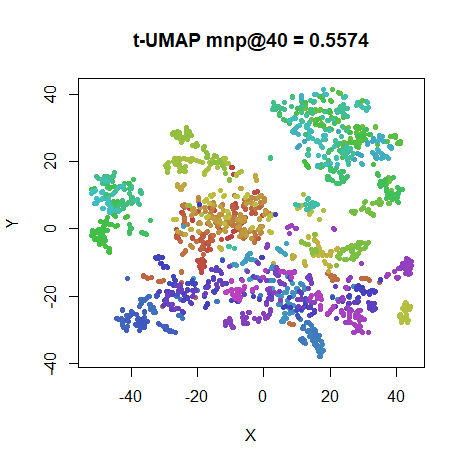
|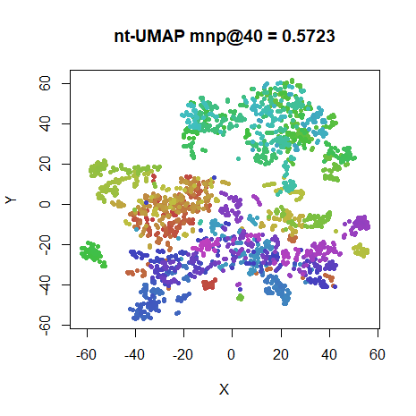|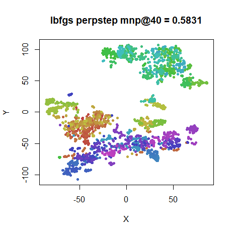

### COIL-20

| |
:-------|:-------------------:|
|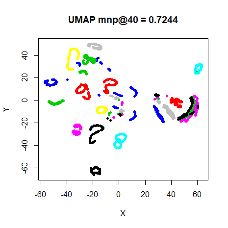|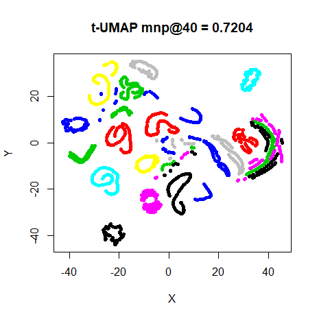
|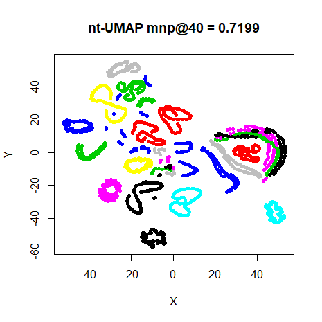|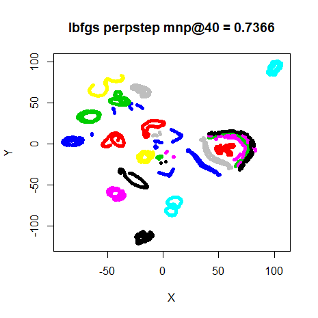

### MNIST (6,000)

| |
:-------|:-------------------:|
|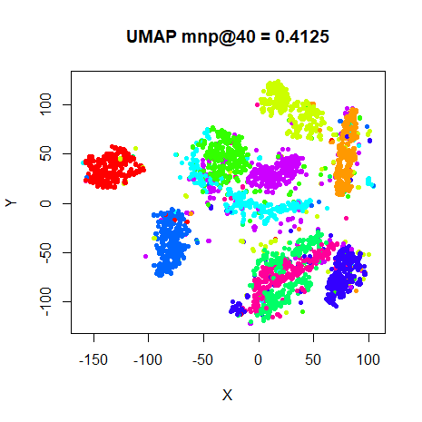|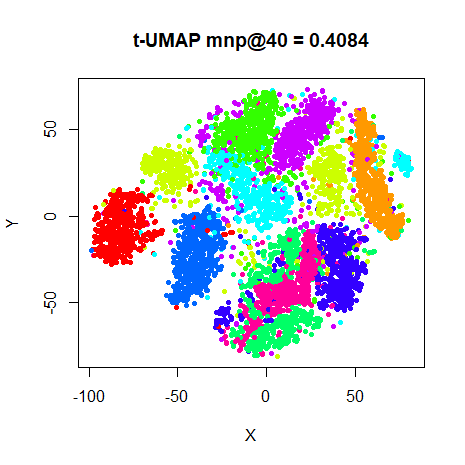
|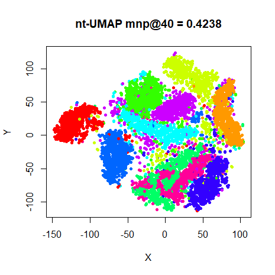|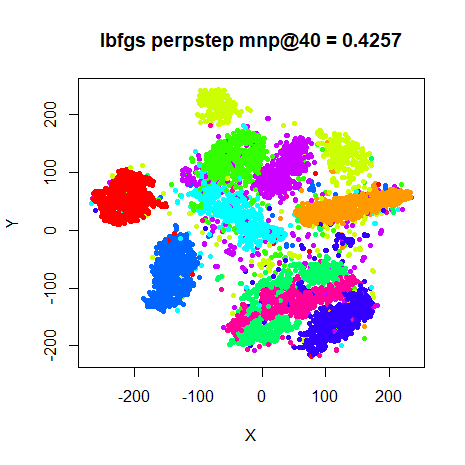

### Fashion (6,000)

| |
:-------|:-------------------:|
|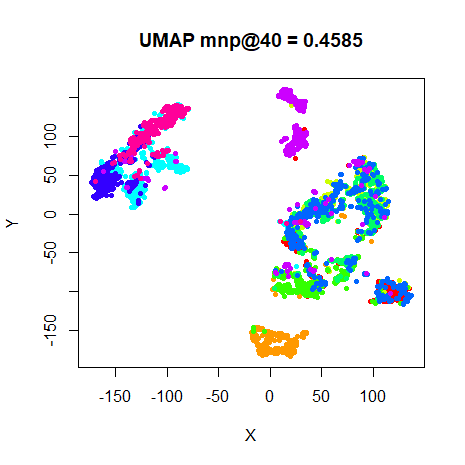|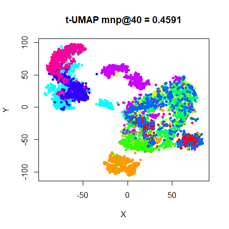
||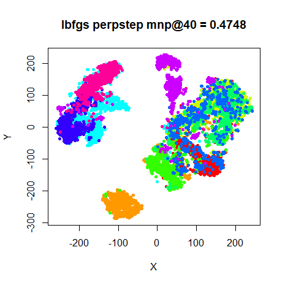

## Aside: Can nt-UMAP be optimized by DBD?

L-BFGS optimization with perplexity-stepping provides the best settings I've
found to get converged and decent looking results for arbitrary dimensionality
reduction cost functions, but it's not as straight forward or fast as using
the delta-bar-delta optimizer used in t-SNE. I tried applying it to t-UMAP, but
got typical results of requiring a per-dataset (and much reduced) learning rate
to avoid the optimizer diverging and slow convergence.

However, DBD with nt-UMAP works great. Results are not shown because they are
very similar to those given above, but they are achieved more quickly and if
anything look a tiny bit better. It may be that there is something about the
normalization that causes DBD to start working well. Or there may be a scheme to
balance the positive and negative parts of the gradient that makes DBD start
working with un-normalized (and hence separable) cost functions. This might be
worth looking into.

## Conclusions

The UMAP results are remarkable in that they thoroughly resemble the t-SNE
results in their broad shapes. This, despite the fact that no normalization of
the similarities are carried out (which in turn makes it amenable to scaling
up to much larger dataset sizes via stochastic gradient descent). The default
output similarity kernel tends to produce smaller, more well separated clusters,
but the t-UMAP results are closer to the t-SNE results. It also has the advantage
(in the context of `smallvis`) of being faster to optimize because the gradient
is simpler.

Finally, the normalized version of nt-UMAP is even closer to the t-SNE results.
