Up: [Documentation Home](https://jlmelville.github.io/smallvis/).

This a companion to the experiments I did with 
[UMAP](https://jlmelville.github.io/smallvis/umap.html). Here I'm going to see
if borrowing some of UMAP's way of doing things affects t-SNE performance
measurably. See the previous UMAP page and the 
[theory](https://jlmelville.github.io/smallvis/theory.html) for details on UMAP.
This work was inspired by the release of the 
[UMAP paper](https://arxiv.org/abs/1802.03426), which shows a very nice result
for the COIL-20 data with UMAP. As of this writing, the settings used for that
result were not available, so this is an attempt to see if there's something
specific to one of the differences of UMAP from t-SNE that causes that 
difference, e.g. the method of generating the input our output weights. If so,
perhaps t-SNE could produce a result nearly as good, just by borrowing that 
feature.

By borrowing individual changes from UMAP we can define some new versions of 
t-SNE:

* SKD t-SNE: Instead of a perplexity-based calibration to generate the input 
weights, it uses smooth knn distances.
* u-SNE: Instead of the t-distribution to define the output kernel, the UMAP
function is $w_{ij} = 1 / \left(1 + ad_{ij}^{2b}\right)$. When using a function
like this, both LargeVis and UMAP add a value between `0.001` to `0.1` to the 
denominator of the resulting gradient to both avoid division by zero 
and to avoid rather odd-looking results (at least in the way `smallvis` 
calculates the non-stochastic gradient). But when used with SNE (perhaps due
to normalization?) I could get away with a much smaller value, which here
is `1e-10`. The default UMAP weight function parameters $a = 1.929$ and 
$b = 0.7915$ were used.
* CE t-SNE: The fuzzy set cross-entropy is used instead of the KL divergence. 
In the way it's defined by UMAP, this adds an extra non-constant term to the 
cost function.
* UMAP also uses a normalized Laplacian for initialization, but as discussed
under [t-SNE initialization](https://jlmelville.github.io/smallvis/init.html),
this gives very similar results to using Laplacian Eigenmaps, which in turn
doesn't give very different results on most datasets to just using the scaled
PCA result, so we won't pursue that further here.

## Datasets

See the [Datasets](https://jlmelville.github.io/smallvis/datasets.html) page.

## Settings

For settings, we'll use two sets. First, the ones given in the 
[original t-SNE paper](http://www.jmlr.org/papers/v9/vandermaaten08a.html), 
except instead of random initialization, we'll use the scaled PCA approach. Also,
I've doubled the number of iterations allowed from 1000 to 2000 to avoid any
problems with convergence with these new methods. We'll also generate t-SNE 
results to compare with these variations.

For the second set of results, I'll set the perplexity to 15, which is closer
to the UMAP defaults.

```
iris_usne <- smallvis(iris, scale = FALSE, perplexity = 40, Y_init = "spca", method = list("usne", gr_eps = 1e-10), eta = 100, exaggeration_factor = 4, stop_lying_iter = 50, max_iter = 2000, epoch = 50, tol = 1e-5)

iris_skdtsne <- smallvis(iris, scale = FALSE, perplexity = 40, Y_init = "spca", method = "skdtsne", eta = 100, exaggeration_factor = 4, stop_lying_iter = 50, max_iter = 2000, epoch = 50, tol = 1e-5)

iris_cetsne <- smallvis(iris, scale = FALSE, perplexity = 40, Y_init = "spca", method = "cetsne", eta = 100, exaggeration_factor = 4, stop_lying_iter = 50, max_iter = 2000, epoch = 50, tol = 1e-5)

iris_tsne <- smallvis(iris, scale = FALSE, perplexity = 40, Y_init = "spca", method = "tsne", eta = 100, exaggeration_factor = 4, stop_lying_iter = 50, max_iter = 2000, epoch = 50, tol = 1e-5)
```

## Evaluation

Apart from visualizing the results, the mean neighbor preservation of the k
closest neighbors is used to provide a rough quantification of the quality of
the result. For the first set of results, with perplexity = 40, k = 40 and is 
labelled as `mnp@40`. The second set of results with perplexity = 15, k = 15
and is labelled as `mnp@15`.

## Results: Perplexity 40

### iris

|                             |                           |
:----------------------------:|:--------------------------:
|
|

### s1k

|                             |                           |
:----------------------------:|:--------------------------:
|
|

### oli

|                             |                           |
:----------------------------:|:--------------------------:
|
|


### frey

|                             |                           |
:----------------------------:|:--------------------------:
|
|

### coil20

|                             |                           |
:----------------------------:|:--------------------------:
|
|

### mnist

|                             |                           |
:----------------------------:|:--------------------------:
|
|

### fashion6k

|                             |                           |
:----------------------------:|:--------------------------:
|
|

## Results: Perplexity 15

### iris

|                             |                           |
:----------------------------:|:--------------------------:
|
|

### s1k

|                             |                           |
:----------------------------:|:--------------------------:
|
|

### oli

|                             |                           |
:----------------------------:|:--------------------------:
|
|


### frey

|                             |                           |
:----------------------------:|:--------------------------:
|
|

### coil20

|                             |                           |
:----------------------------:|:--------------------------:
|
|

### mnist

|                             |                           |
:----------------------------:|:--------------------------:
|
|

### fashion6k

|                             |                           |
:----------------------------:|:--------------------------:
|
|

## Fuzzy symmetrization vs smooth knn distances

*April 22 2020*: This is an expanded version of a discussion of smooth knn 
distances vs the knn kernel that originally appeared in the conclusions.

The smoothed k-nearest neighbor distances kernel is quite interesting as an
alternative to the gaussian kernel, producing slightly smaller, more
well-separated clusters (compare the `fashion6k` and `mnist` dataset with
"t-SNE" and "SKD t-SNE"). This might be due to the fact that the input weights
are set to zero outside the k-nearest neighbors. There's also the possibility
that the fuzzy set union approach to symmetrization used by UMAP is having some
effect.

I have updated `smallvis` to make the smooth knn distances calculation an option
for `inp_kernel` (`inp_kernel = "skd"`), and the fuzzy set union process a
symmetrization option `symmetrize = "fuzzy"`, so these two contributions can be
separated.

To get to the bottom of what (if any) effect this settings have on t-SNE, here
are some results, using all six combinations of `inp_kernel` set to `"gauss"`
(the t-SNE default), `"knn"`, or `"skd"` (smooth knn distances, as used by UMAP)
and `symmetrize` set to `"average"` (the default t-SNE approach that takes the
mean average of $v_{ij}$ and $v_{ji}$) and `"fuzzy"` (the fuzzy set union used
by UMAP).

Other settings are the typical t-SNE settings for smaller datasets: `eta = 100,
exaggeration_factor = 4` and my usual initialization default of scaled PCA. An
example of this for `iris`, showing how to use non-default `inp_kernel` and
`symmetrize` values with `perplexity = 40`:

```R
iris_skd_fuzzy <- smallvis(method = list("tsne", inp_kernel = "skd", symmetrize = "fuzzy"), perplexity = 40, exaggeration_factor = 4, Y_init = "spca", eta = 100)
```

In the results below, the first row shows results from using the standard t-SNE
Gaussian input kernel. The second row uses the smooth knn distances kernel. The
third row uses the knn kernel.

On the left are results with the standard symmetrization, on the right using
the fuzzy set union symmetrization.

The top left and middle right images should be comparable with the t-SNE and
skd t-SNE results, respectively.

Results are shown for perplexity 40 and then perplexity 15.

## Kernel + Symmetrization Results: Perplexity 40

### iris

|                             |                           |
:----------------------------:|:--------------------------:
|
|
|

### s1k

|                             |                           |
:----------------------------:|:--------------------------:
|
|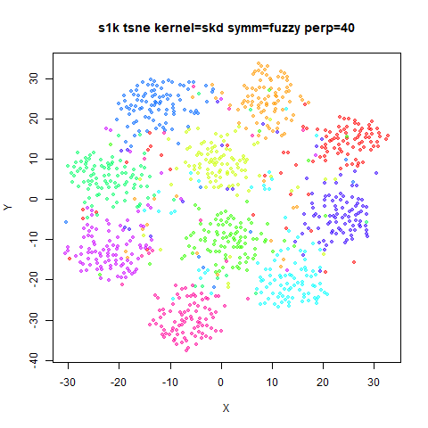
|

### oli

|                             |                           |
:----------------------------:|:--------------------------:
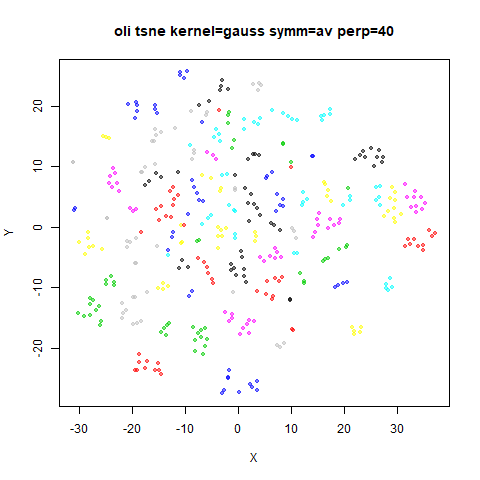|
|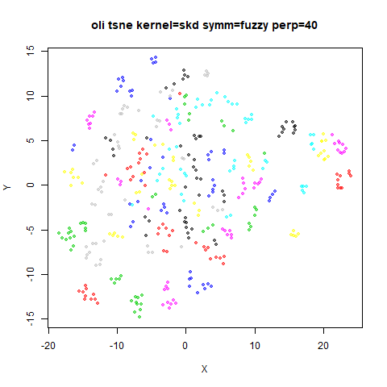
|

### frey

|                             |                           |
:----------------------------:|:--------------------------:
|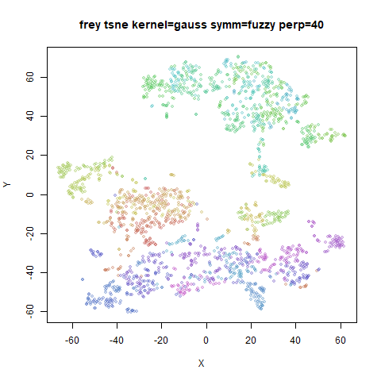
|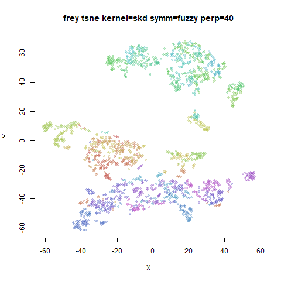
|

### coil20

|                             |                           |
:----------------------------:|:--------------------------:
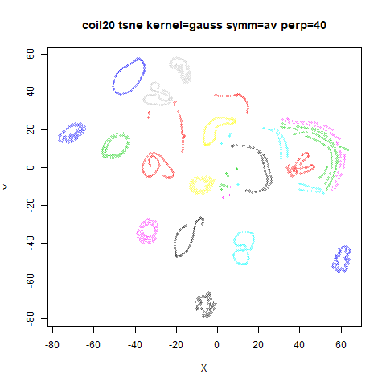|
|
|

### mnist6k

|                             |                           |
:----------------------------:|:--------------------------:
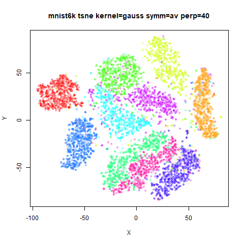|
|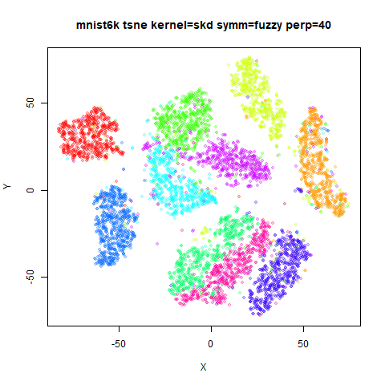
|

### fashion6k

|                             |                           |
:----------------------------:|:--------------------------:
|
|
|

## Kernel + Symmetrization Results: Perplexity 15

### iris

|                             |                           |
:----------------------------:|:--------------------------:
|
|
|

### s1k

|                             |                           |
:----------------------------:|:--------------------------:
|
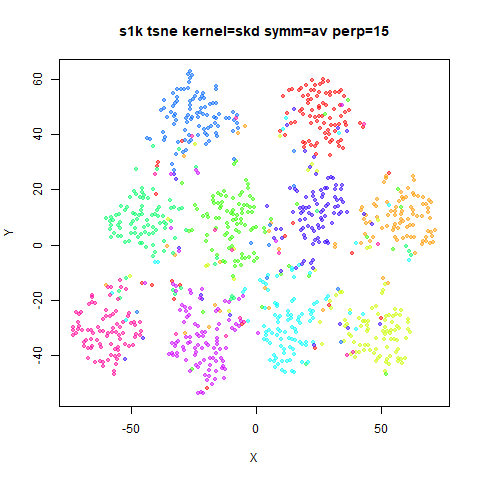|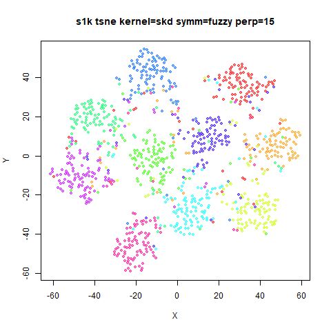
|


### oli

|                             |                           |
:----------------------------:|:--------------------------:
|
|
|

### frey

|                             |                           |
:----------------------------:|:--------------------------:
|
|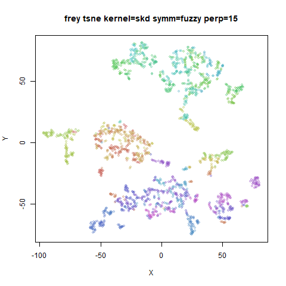
|

### coil20

|                             |                           |
:----------------------------:|:--------------------------:
|
|
|

### mnist6k

|                             |                           |
:----------------------------:|:--------------------------:
|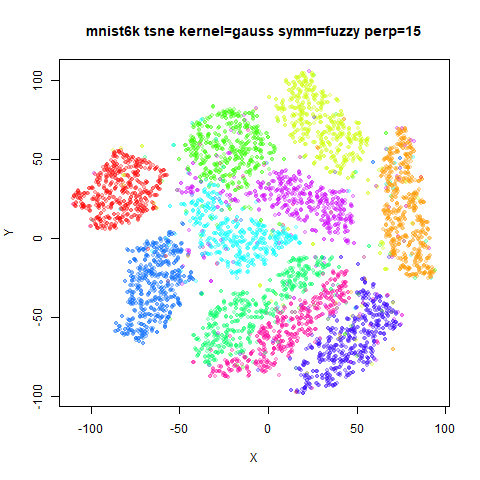
|
|

### fashion6k

|                             |                           |
:----------------------------:|:--------------------------:
|
|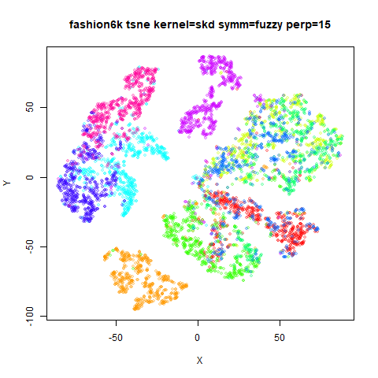
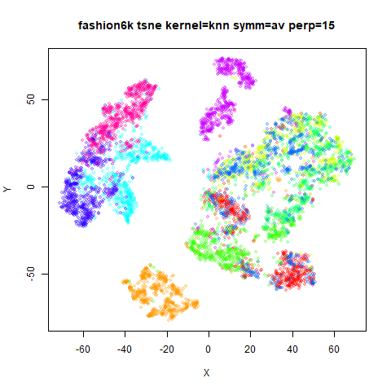|

These results show that the symmetrization has only a very minor effect on the
visualization. If you look very closely, you can see that the `skd` kernel shows
the biggest difference in combination with fuzzy set union: there is a slightly
larger separations of clusters (most easily seen with `frey`, `mnist6k` and
`fashion6k`). For the other settings the difference is exceptionally minor.

The bigger differences are down to the choice of the input kernel. The knn
kernel gives the smallest, most spread-out clusters, and the Gaussian kernel the
least. The smooth knn distances is in between the two. Having the affinities set
to zero outside a small number of close neighbors would seem to drive this
manifestation, presumably because the small attractive interactions that exist
for points outside the closest neighbors do add up to have an effect. The smooth
knn distances kernel also seems to retain more of the fine structure found with
the Gaussian kernel, presumably because the exponential weighting is closer to
the Gaussian than the step function used with the knn kernel.

## Conclusions

None of these changes have very much effect on t-SNE. The biggest effect is by
using the UMAP output kernel, but the overall shape of the embedding is 
unaffected with the default kernel settings. It also noticeably increases the
computational time due to the more complex gradient, so unless you really like
the more compressed clusters, t-SNE still wins out here.

In terms of input affinities, it's clear that the fuzzy set union symmetrization
does not make a big difference. The smooth knn distances kernel does have an
effect though: it creates slightly smaller more separated clusters, and this is
probably due to the sparsifying of the input affinities, because the effect is
even more pronounced for the knn kernel.

Obviously, these results don't provide any reason to believe that t-SNE 
implementations would benefit from calculating input affinities the UMAP way.
UMAP is able to construct a theoretical foundation for why input affinities
should be generated using smooth knn distances and symmetrized by fuzzy set
union, rooted in topology and fuzzy sets, whereas the t-SNE approach has never
had a of a theoeretical justification (that I am aware of). Practically, though,
it doesn't make much of a difference for t-SNE.

However, these results don't tell us if UMAP would be changed by adopting
t-SNE-style affinity calculations, because the lack of matrix normalization in
UMAP might allow for larger differences in perplexity-calibration versus smooth
knn distances to emerge. There's good reason to believe that there *could* in
principle be some differences, because although UMAP affinities are
row-normalized, they are normalized to $\log_2 k$ where k is the number of
nearest neighbors (analogous to perplexity), which is always going to be larger
than 1 for any sensible choice of $k$.

Up: [Documentation Home](https://jlmelville.github.io/smallvis/).
